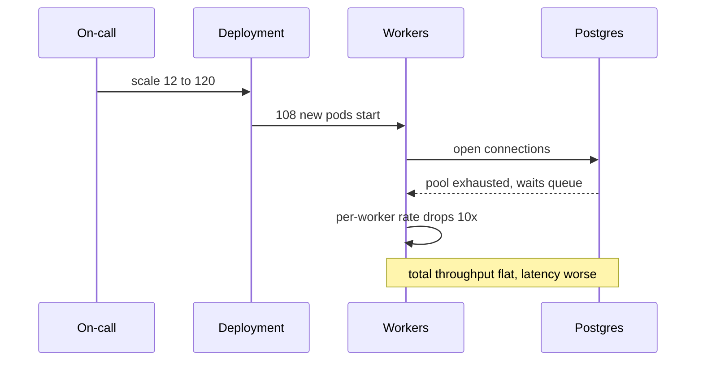
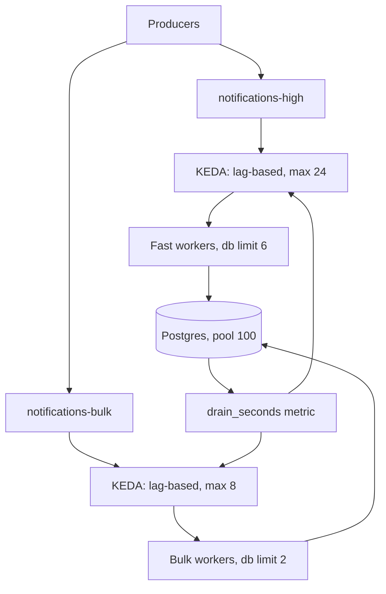

> **Scenario** - Black Friday promotion Redis-এ ১৪ লক্ষ notification job ঢেলে দেয়। Horizon দেখাচ্ছে ১২টা worker ১০০% CPU-তে আর queue depth chart সোজা ওপরের দিকে। কেউ worker deployment ১২ থেকে ১২০ pod-এ scale করে। Throughput প্রায় নড়ে না, database connection pool saturate হয়, checkout p99 তিনগুণ হয়, আর ০৩:৪০-এ backlog তখনও ৯ লক্ষ।

## Why it matters

- Message-এ মাপা backlog recovery time সম্পর্কে কিছুই বলে না। ৪০০/s-এ ৯ লক্ষ মানে ৩৭ মিনিট; ৪০/s-এ ৬ ঘণ্টা। শুধু drain rate-ই গুরুত্বপূর্ণ।
- parallelism limit (Kafka-তে partition count, অন্যত্র connection বা DB capacity) পেরিয়ে consumer বাড়ালে throughput নয়, contention বাড়ে।
- shared resource - database, upstream API, connection pool - আসল bottleneck হলে async backlog synchronous incident-এ পরিণত হয়।
- User-এর কাছে lag মানে "email আসেনি", যা support bug থেকে আলাদা করতে পারে না।
- Queue worker-এ CPU-ভিত্তিক autoscaling ভুল signal; I/O-তে blocked worker কম CPU দেখায় অথচ lag বাড়তে থাকে।

## Symptoms

| Signal | What you observe |
|---|---|
| Consumer lag | message ও সেকেন্ড দুটোতেই plateau ছাড়া একটানা বৃদ্ধি |
| Throughput after scaling | worker বাড়ানোর পর flat বা *কম* |
| Database | connection pool নিঃশেষ, lock wait বাড়ছে |
| Worker CPU | কম, অথচ lag বাড়ছে - worker I/O-তে blocked |
| Kafka partitions | group-এ idle consumer, কারণ member সংখ্যা partition-এর বেশি |
| Rebalance rate | scaling event-এ ঘন ঘন rebalance |

## How it breaks

দুটো আলাদা failure একই পোশাক পরে আসে। Kafka-তে consumer group-এ partition-এর চেয়ে বেশি *active* consumer কখনো থাকতে পারে না; ২৪-partition topic-এ ২৫ থেকে ১২০ নম্বর member বসে থাকে, আর প্রতিটি scaling event এমন rebalance ঘটায় যা সবাইকে থামিয়ে দেয়। Redis বা SQS-এ partition cap নেই, তাই ১২০টা worker একই Postgres primary-তে connect করে, ১০০-connection pool শেষ করে, এবং প্রতিটি worker-এর query database-এ queue করতে শুরু করে। worker সংখ্যা যত বাড়ে, per-worker throughput তার চেয়ে দ্রুত পড়ে।



## Root causes

1. backlog age ও drain rate-এর বদলে queue depth দেখে scaling সিদ্ধান্ত।
2. Consumer সংখ্যা topic-এর partition count ছাড়িয়ে যাওয়া, ফলে বাড়তি member idle।
3. আসল bottleneck একটা shared downstream (database, third-party API, mailer) যার নিজস্ব concurrency ceiling আছে।
4. per-worker rate limit নেই, তাই worker-রা একই দুর্লভ resource-এর জন্য লড়ে।
5. lag নয়, CPU-তে autoscaling - I/O-bound worker-কে idle বলে ভুল পড়া।
6. নতুন worker-এর cold-start খরচ (migration, cache warm-up, JIT) ছোট spike-এ তাদের অবদানের চেয়ে বেশি।

## How to solve it

### 1. Measure drain time, not depth

Alert করার মতো একমাত্র সংখ্যা drain time।

```
drain_seconds = backlog_messages / max(consumption_rate - production_rate, epsilon)
```

`production_rate >= consumption_rate` হলে drain time অসীম, ধৈর্য ধরে লাভ নেই।

```yaml
# prometheus rule
- record: queue:drain_seconds
  expr: |
    sum(queue_backlog_messages) by (queue)
    / clamp_min(
        sum(rate(queue_processed_total[5m])) by (queue)
        - sum(rate(queue_enqueued_total[5m])) by (queue),
        0.001)
- alert: QueueWillNotDrain
  expr: queue:drain_seconds > 1800
  for: 10m
```

### 2. Scale on lag, capped by real parallelism

KEDA যে metric গুরুত্বপূর্ণ সেটাতেই scale করে এবং একটা কঠিন সর্বোচ্চ মানে।

```yaml
apiVersion: keda.sh/v1alpha1
kind: ScaledObject
metadata:
  name: notifications-worker
spec:
  scaleTargetRef:
    name: notifications-worker
  minReplicaCount: 4
  maxReplicaCount: 24        # never exceed partition count
  cooldownPeriod: 300
  triggers:
    - type: kafka
      metadata:
        topic: notifications
        consumerGroup: notifications-v3
        lagThreshold: "5000"
```

Laravel Horizon-এ সমতুল্য হলো প্রতি supervisor-এ `maxProcesses` বেঁধে দেওয়া এবং `autoScalingStrategy`-কে queue জুড়ে বণ্টন করতে দেওয়া।

```php
'production' => [
    'supervisor-notifications' => [
        'connection'          => 'redis',
        'queue'               => ['notifications-high', 'notifications-bulk'],
        'balance'             => 'auto',
        'autoScalingStrategy' => 'time',
        'minProcesses'        => 2,
        'maxProcesses'        => 20,
        'maxTime'             => 3600,
        'tries'               => 3,
    ],
],
```

### 3. Find the real ceiling with Little's Law

`concurrency = throughput × latency`। প্রতিটি job ২৫০ms নিলে এবং database ৮০টা concurrent query সামলালে ceiling হলো `80 / 0.25 = 320 jobs/s`। ৩২০/s ceiling-এর বিপরীতে ১২০ worker চালালে শুধু queueing delay বাড়ে। scale করার আগেই এটা হিসাব করুন, পরে নয়।

### 4. Separate queues by cost and priority

৪০ms-এর job আর ২০ সেকেন্ডের PDF render একই queue-তে থাকলে দ্রুত job ধীর job-এর পেছনে অপেক্ষা করে। আলাদা করুন, প্রত্যেকের নিজস্ব worker pool ও scaling policy দিন।

### 5. Shed or defer load when drain time is unbounded

Production ১০ মিনিটের বেশি consumption ছাড়িয়ে গেলে সৎ সমাধান হলো production কমানো: bulk campaign থামান, low-priority enqueue reject করুন, বা off-peak-এ চালু হওয়া delayed queue-তে সরান।

### 6. Bound per-worker concurrency against shared resources

```ts
const dbLimit = pLimit(6)          // per worker
await Promise.all(batch.map((msg) => dbLimit(() => handle(msg))))
```

মোট database concurrency দাঁড়ায় `workers × 6` - এমন একটা সংখ্যা যা নিয়ে ভাবা ও cap করা যায়।

## Target design



## Tradeoffs

| Option | Pros | Cons | Choose when |
|---|---|---|---|
| Scale on CPU | HPA-তে বিল্ট-ইন, কাজ নেই | I/O-bound lag দেখতে পায় না | শুধু CPU-bound transform worker |
| Scale on lag (KEDA) | আসল SLO অনুসরণ করে | metric plumbing লাগে, flap করতে পারে | queue worker-এর default |
| Fixed worker count | resource ব্যবহার অনুমেয় | spike শুষতে ধীর | স্থির traffic, আঁটসাঁট DB budget |
| Priority queue split | দ্রুত job দ্রুতই থাকে | বেশি queue ও dashboard | মিশ্র job duration |
| Load shedding | shared resource রক্ষা করে | কিছু কাজ বাদ বা দেরি হয় | backlog unbounded বাড়ছে |

## Verification checklist

- [ ] `drain_seconds` export হচ্ছে এবং SLO ভাঙার আগেই alert দিচ্ছে কিনা যাচাই করুন, পরে নয়।
- [ ] staging-এ worker ৩× বাড়িয়ে দেখুন throughput প্রায় linear-ভাবে বাড়ে; না বাড়লে আসল bottleneck পেয়ে গেছেন।
- [ ] Kafka admin API-তে consumer group member count কখনো partition count ছাড়ায় না কিনা দেখুন।
- [ ] scale-up-এর সময় database `pg_stat_activity` দেখুন; active connection `max_connections`-এর ৭০%-এর নিচে থাকা উচিত।
- [ ] staging-এ ৫ লক্ষ message backlog replay করে প্রকৃত drain time পূর্বাভাসের সঙ্গে মেলান।
- [ ] bursty traffic-এ scale-down cooldown flapping আটকাচ্ছে কিনা যাচাই করুন।

## Anti-patterns

- Incident-এর সময় "cluster যত pod দেয়" তত scale করা।
- absolute queue depth-এ alert দেওয়া, যা প্রতিটি স্বাভাবিক batch job-এ page করে।
- "Redis fast" বলে bulk ও interactive job একই queue-তে চালানো।
- prefetch ১০০০ করে দেওয়া, ফলে এক worker message জমিয়ে রাখে আর বাকিরা অভুক্ত থাকে।
- production rate দ্বিগুণ হওয়ার পরও বাড়তে থাকা backlog-কে worker সমস্যা ভাবা।
- "scale হতে দাও" বলে `maxProcesses` cap তুলে দেওয়া, তারপর আবিষ্কার করা যে limit-টা আসলে database ছিল।

## Related

- [Backpressure in queue-heavy architectures](/systems/messaging-async/backpressure-queue-design)
- [Ordered processing with partition keys](/systems/messaging-async/ordered-processing-with-partitions)
- [Delayed and scheduled jobs without pile-ups](/systems/messaging-async/delayed-and-scheduled-jobs)
