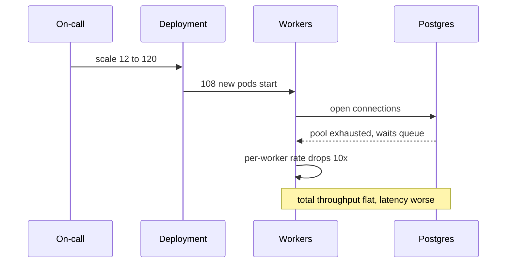
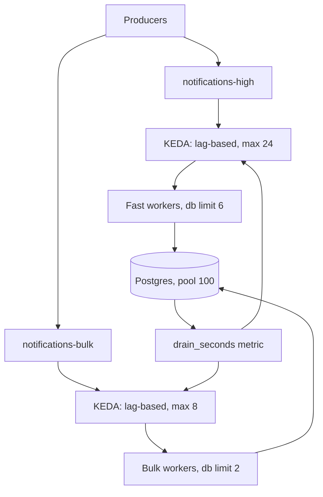

> **Scenario** - A Black Friday promotion pushes 1.4M notification jobs into Redis. Horizon shows 12 workers at 100% CPU and a queue depth chart that is a straight line upward. Someone scales the worker deployment from 12 to 120 pods. Throughput barely moves, the database connection pool saturates, p99 checkout latency triples, and the backlog is still 900k at 03:40.

## Why it matters

- Backlog measured in messages tells you nothing about recovery time. 900k messages at 400/s is 37 minutes; at 40/s it is 6 hours. Only the drain rate matters.
- Adding consumers past the parallelism limit (partition count in Kafka, connection or DB capacity elsewhere) adds contention, not throughput.
- Async backlogs become synchronous incidents when shared resources - the database, an upstream API, a connection pool - are the real bottleneck.
- Users experience lag as "the email never arrived", which support cannot distinguish from a bug.
- Autoscaling on CPU is the wrong signal for queue workers; a blocked worker waiting on I/O shows low CPU while lag grows.

## Symptoms

| Signal | What you observe |
|---|---|
| Consumer lag | Monotonic growth with no plateau, in messages and in seconds |
| Throughput after scaling | Flat or *lower* after adding workers |
| Database | Connection pool exhausted, lock waits climbing |
| Worker CPU | Low, while lag increases - workers are I/O blocked |
| Kafka partitions | Idle consumers in the group because members exceed partitions |
| Rebalance rate | Frequent rebalances triggered by scaling events |

## How it breaks

Two distinct failures wear the same costume. In Kafka, a consumer group can never have more *active* consumers than partitions; members 25 through 120 on a 24-partition topic sit idle while each scaling event triggers a rebalance that pauses everyone. In Redis or SQS there is no partition cap, so 120 workers all connect to the same Postgres primary, exhaust the 100-connection pool, and every worker's queries start queueing at the database. Per-worker throughput collapses faster than worker count rises.



## Root causes

1. Scaling decisions made on queue depth instead of backlog age and drain rate.
2. Consumer count exceeding the topic's partition count, so extra members idle.
3. The true bottleneck is a shared downstream (database, third-party API, mailer) with its own concurrency ceiling.
4. No per-worker rate limit, so workers compete for the same scarce resource.
5. Autoscaling on CPU rather than on lag, which misreads I/O-bound workers as idle.
6. Cold-start cost of new workers (migrations, cache warm-up, JIT) exceeding their useful contribution during a short spike.

## How to solve it

### 1. Measure drain time, not depth

Drain time is the only number worth alerting on.

```
drain_seconds = backlog_messages / max(consumption_rate - production_rate, epsilon)
```

If `production_rate >= consumption_rate`, drain time is infinite and no amount of patience helps.

```yaml
# prometheus rule
- record: queue:drain_seconds
  expr: |
    sum(queue_backlog_messages) by (queue)
    / clamp_min(
        sum(rate(queue_processed_total[5m])) by (queue)
        - sum(rate(queue_enqueued_total[5m])) by (queue),
        0.001)
- alert: QueueWillNotDrain
  expr: queue:drain_seconds > 1800
  for: 10m
```

### 2. Scale on lag, capped by real parallelism

KEDA scales on the metric that matters and respects a hard maximum.

```yaml
apiVersion: keda.sh/v1alpha1
kind: ScaledObject
metadata:
  name: notifications-worker
spec:
  scaleTargetRef:
    name: notifications-worker
  minReplicaCount: 4
  maxReplicaCount: 24        # never exceed partition count
  cooldownPeriod: 300
  triggers:
    - type: kafka
      metadata:
        topic: notifications
        consumerGroup: notifications-v3
        lagThreshold: "5000"
```

For Laravel Horizon, the equivalent is bounding `maxProcesses` per supervisor and letting `autoScalingStrategy` distribute across queues.

```php
'production' => [
    'supervisor-notifications' => [
        'connection'          => 'redis',
        'queue'               => ['notifications-high', 'notifications-bulk'],
        'balance'             => 'auto',
        'autoScalingStrategy' => 'time',
        'minProcesses'        => 2,
        'maxProcesses'        => 20,
        'maxTime'             => 3600,
        'tries'               => 3,
    ],
],
```

### 3. Find the real ceiling with Little's Law

`concurrency = throughput × latency`. If each job takes 250ms and the database supports 80 concurrent queries, the ceiling is `80 / 0.25 = 320 jobs/s`. Running 120 workers against a 320/s ceiling only adds queueing delay. Compute this before scaling, not after.

### 4. Separate queues by cost and priority

One queue for 40ms jobs and 20-second PDF renders means the fast jobs wait behind the slow ones. Split them, give each its own worker pool and its own scaling policy.

### 5. Shed or defer load when drain time is unbounded

If production exceeds consumption for more than 10 minutes, the honest fix is to stop or slow production: pause bulk campaigns, reject low-priority enqueues, or move them to a delayed queue that resumes off-peak.

### 6. Bound per-worker concurrency against shared resources

```ts
const dbLimit = pLimit(6)          // per worker
await Promise.all(batch.map((msg) => dbLimit(() => handle(msg))))
```

Total database concurrency becomes `workers × 6`, a number you can reason about and cap.

## Target design



## Tradeoffs

| Option | Pros | Cons | Choose when |
|---|---|---|---|
| Scale on CPU | Built into HPA, zero work | Blind to I/O-bound lag | CPU-bound transform workers only |
| Scale on lag (KEDA) | Tracks the actual SLO | Needs metric plumbing, can flap | Default for queue workers |
| Fixed worker count | Predictable resource use | Slow to absorb spikes | Steady traffic, tight DB budgets |
| Priority queue split | Fast jobs stay fast | More queues and dashboards | Mixed job durations |
| Load shedding | Protects shared resources | Some work is dropped or delayed | Backlog growth is unbounded |

## Verification checklist

- [ ] Confirm `drain_seconds` is exported and alerts before the SLO is breached, not after.
- [ ] Scale workers up by 3× in staging and verify throughput increases roughly linearly; if it does not, you found the real bottleneck.
- [ ] Check that consumer group member count never exceeds partition count in the Kafka admin API.
- [ ] Watch database `pg_stat_activity` during a scale-up; active connections should stay under 70% of `max_connections`.
- [ ] Replay a 500k-message backlog in staging and record actual drain time against the predicted value.
- [ ] Verify scale-down cooldown prevents flapping during bursty traffic.

## Anti-patterns

- Scaling to "however many pods the cluster allows" during an incident.
- Alerting on absolute queue depth, which pages during every normal batch job.
- Running bulk and interactive jobs on the same queue because "Redis is fast".
- Increasing prefetch to 1000 so one worker hoards messages and the rest starve.
- Treating a growing backlog as a worker problem when production rate doubled.
- Removing the `maxProcesses` cap to "let it scale", then discovering the database was the limit all along.

## Related

- [Backpressure in queue-heavy architectures](/systems/messaging-async/backpressure-queue-design)
- [Ordered processing with partition keys](/systems/messaging-async/ordered-processing-with-partitions)
- [Delayed and scheduled jobs without pile-ups](/systems/messaging-async/delayed-and-scheduled-jobs)
