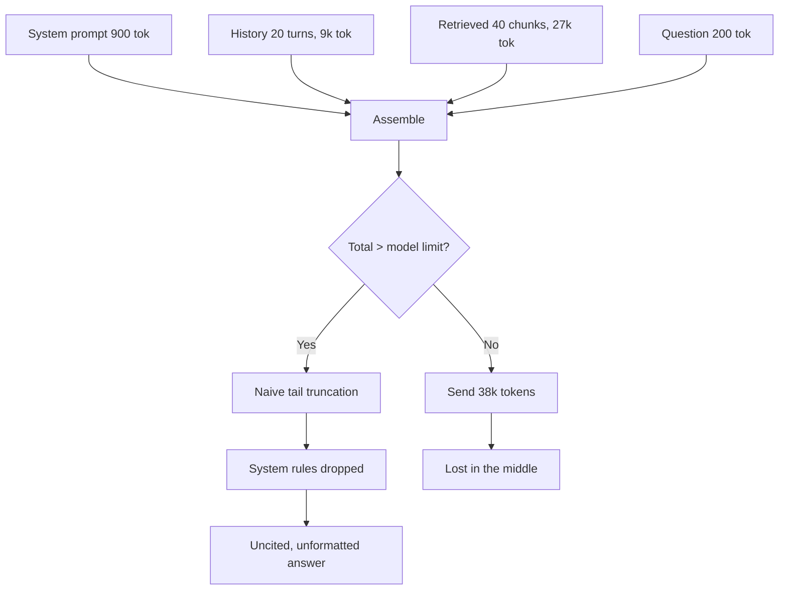
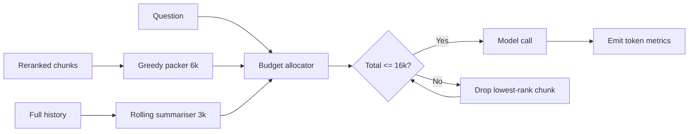

> **Scenario** — একটি document assistant প্রতিটি request-এ top 40 retrieved chunk আর শেষ ২০টি conversation turn পাঠায়। Prompt গড়ে ৩৮,০০০ token, প্রতি turn-এ খরচ প্রায় $0.11, আর answer accuracy ৬টি chunk-এর সময়ের চেয়েও *খারাপ*।

## Why it matters

- Token মানে linear খরচ আর মোটামুটি linear latency। ৬,০০০ থেকে ৩৮,০০০ input token-এ গেলে দুটোই ছয় গুণ হয়, ভালো উত্তরের কোনো নিশ্চয়তা ছাড়াই।
- লম্বা context quality কমায়। লম্বা prompt-এর মাঝখানে রাখা প্রাসঙ্গিক তথ্য শুরু বা শেষের তথ্যের তুলনায় কম নির্ভরযোগ্যভাবে attend হয়।
- Truncation-এই correctness মরে। Prompt উপচে গেলে বেশিরভাগ framework চুপচাপ সবচেয়ে পুরনো বা শেষের item ফেলে দেয় — প্রায়ই সেটা system rule বা citation instruction।
- Bengali ও অন্যান্য non-Latin script English-এর চেয়ে অনেক কম দক্ষভাবে tokenise হয়। একই বাক্যে ২–৩ গুণ token লাগতে পারে, তাই English-এ calibrate করা budget Bengali input-এ উপচে পড়ে।
- আড্ডাপ্রিয় user আর পাঁচ অঙ্কের মাসিক bill-এর মাঝখানে budget ছাড়া আর কিছুই দাঁড়িয়ে নেই।

## Symptoms

| Signal | What you observe |
|---|---|
| Cost | কোনো feature পরিবর্তন ছাড়াই প্রতি sprint-এ গড় token বাড়ে |
| Accuracy | মাঝারি `k`-তে quality শীর্ষে ওঠে, `k` বাড়লে নামে |
| Truncation | শুধু লম্বা Bengali conversation-এ provider context-length error দেয় |
| Latency | generation শুরুর আগেই prompt size-এর সাথে TTFT বাড়ে |
| Instruction loss | লম্বা thread-এ model source cite করা বন্ধ করে দেয় |

## How it breaks

বেশিরভাগ RAG prompt concatenation দিয়ে জোড়া হয়: system prompt, তারপর history, তারপর retrieved chunk, তারপর প্রশ্ন। মোট কত হবে তা কেউ বেঁধে দেয় না। প্রতিটি অংশ স্বাধীনভাবে বাড়ে — retrieval-এর `k` বড় হয়, history retention ৬ turn থেকে ২০ হয়, নতুন tool description যোগ হয় — আর যোগফল প্রথমে distribution-এর tail-এ সীমা ছাড়ায়, ফলে এটাকে design gap নয়, বিরল bug মনে হয়।



## Root causes

1. মোট token budget-এর মালিক কোনো একটি component নয়; প্রতিটি অংশ নিজের মতো বাড়ে।
2. Token সংখ্যা আসল tokenizer দিয়ে না মেপে character length থেকে আন্দাজ করা হয়।
3. Retrieved chunk budget শেষ হওয়া পর্যন্ত নয়, rank শেষ হওয়া পর্যন্ত যোগ করা হয়।
4. Conversation history summarise না করে হুবহু রাখা হয়।
5. Truncation strategy যা SDK default-এ করে তাই, আর কেউ সেটা পড়ে দেখেনি।

## How to solve it

### 1. স্পষ্ট budget ঘোষণা করুন এবং প্রয়োগ করুন

Window-কে memory allocator ভাবুন: নির্দিষ্ট reservation, spill policy, আর model limit-এর নিচে একটি hard ceiling।

```ts
type Budget = { system: number; tools: number; history: number; retrieved: number; answer: number }

const BUDGET: Budget = {
  system: 1_000,
  tools: 1_200,
  history: 3_000,
  retrieved: 6_000,
  answer: 1_500,
}
const CEILING = 16_000 // stay well under the 32k model limit
```

`answer` reserve করা জরুরি: বেশিরভাগ model-এ output token একই window থেকে আসে, আর ১,৫০০ token-এর reservation-ই মাঝবাক্যে কেটে যাওয়া ঠেকায়।

### 2. আসল tokenizer দিয়ে token গুনুন

```python
import tiktoken
enc = tiktoken.get_encoding("o200k_base")

def ntokens(text: str) -> int:
    return len(enc.encode(text))

en = "The refund window is fourteen days from delivery."
bn = "ডেলিভারির তারিখ থেকে চৌদ্দ দিনের মধ্যে রিফান্ড উইন্ডো।"
print(ntokens(en), ntokens(bn))   # roughly 10 vs 30 — a 3x multiplier
```

`len(text) / 4`-এর মতো heuristic English-এ calibrate করা এবং Bengali-কে অনেকটাই কম দেখায়। সবসময় token-এ budget করুন।

### 3. Retrieved অংশ rank ক্রমে greedily budget পর্যন্ত ভরুন

```python
def pack(chunks, budget: int):
    used, packed = 0, []
    for c in chunks:                     # already reranked, best first
        cost = ntokens(c.text) + 25      # header, separator, citation marker
        if used + cost > budget:
            continue                     # skip, do not stop — a later chunk may fit
        packed.append(c)
        used += cost
    return packed, used
```

### 4. History ফেলে না দিয়ে compress করুন

শেষ ৩টি turn হুবহু রাখুন, আর তার আগের সব কিছু প্রতি ৬ turn-এ নতুন করে তৈরি হওয়া rolling summary দিয়ে বদলান। ৯,০০০ token-এর history সাধারণত ৪০০–৬০০ token-এ নেমে আসে, user আসলে যে তথ্যগুলো ধরে কথা বলছিল তা না হারিয়েই।

```python
if ntokens(history_text) > BUDGET_HISTORY:
    summary = llm.summarise(older_turns, max_tokens=400)
    history_text = summary + "\n" + render(recent_turns[-3:])
```

### 5. গুরুত্বপূর্ণ জিনিস প্রান্তে রাখুন

System rule আর user-এর প্রশ্ন সবার শেষে, generation-এর ঠিক আগে রাখুন; retrieved evidence তার উপরে। Model context-এর শুরু ও শেষে সবচেয়ে নির্ভরযোগ্যভাবে attend করে।

### 6. Token খরচ observable করুন

প্রতিটি request-এ `prompt_tokens`, `completion_tokens` আর section-ভিত্তিক token count emit করুন। p95 prompt size সপ্তাহে ২০%-এর বেশি বাড়লে alert দিন।

মনে রাখার মতো খরচের হিসাব: প্রতি মিলিয়ন token $3.00 হলে ৩৮k input token মানে প্রতি turn $0.114। মাসে ৫০,০০০ turn হলে $5,700। একই কাজ ৮k token-এ করলে $1,200। দুটোর retrieval quality-র পার্থক্য সাধারণত শূন্য, নয়তো ছোট prompt-এর পক্ষে।

## Target design



## Tradeoffs

| Option | Pros | Cons | Choose when |
|---|---|---|---|
| সব ঢুকিয়ে দেওয়া | সরল, packing logic লাগে না | ব্যয়বহুল, ধীর, lost-in-the-middle ভুল | কেবল prototype |
| Section-ভিত্তিক fixed budget | পূর্বানুমেয় খরচ, overflow নেই | মাঝেমধ্যে কাজের chunk বাদ পড়ে | production default |
| Rerank করে top-6 pack | প্রতি token-এ সেরা accuracy | reranker latency ও খরচ যোগ হয় | ৬০ms-এর চেয়ে precision জরুরি |
| Summarised history | লম্বা thread সাশ্রয়ী থাকে | summariser একটি detail হারাতে পারে | conversation ~১০ turn ছাড়ায় |
| বড় context-এর model | packing-এর কাজ নেই | ৪–৮ গুণ খরচ, বেশি latency | সত্যিই লম্বা একক document |

## Verification checklist

- [ ] মোট prompt token production tokenizer দিয়ে মাপা হয়েছে, আন্দাজ নয়।
- [ ] ২০ turn-এর Bengali-ভারী conversation ceiling-এর বিপরীতে overflow ছাড়া পরীক্ষিত।
- [ ] Output token reservation মাঝবাক্যে কাটা ঠেকায় তা নিশ্চিত করা হয়েছে।
- [ ] `k` = ৩, ৬, ১২, ২৪-এ answer quality মেপে আসল accuracy শীর্ষ বের করা হয়েছে।
- [ ] Sample করা request-এর trace-এ section-ভিত্তিক token count দেখা যায়।
- [ ] সপ্তাহে ২০%-এর বেশি p95 prompt size বৃদ্ধিতে alert কনফিগার করা।

## Anti-patterns

- Token-কে `characters / 4` ধরে multilingual দর্শকের কাছে ship করা।
- Retrieval ranking ভালো করার বদলে `k` বাড়ানো।
- SDK-কে সামনের দিক থেকে truncate করতে দেওয়া, যা system prompt খেয়ে ফেলে।
- "user হয়তো ফিরে দেখবে" ভেবে পুরো conversation history চিরকাল রাখা।
- বাড়তি context আদৌ সাহায্য করে কিনা না মেপেই বড় context-এর model-এ যাওয়া।

## Related

- [Hybrid search and reranking that actually lifts recall](/systems/ai-rag-agents/hybrid-search-and-reranking)
- [LLM caching layers and cost control](/systems/ai-rag-agents/llm-caching-and-cost-control)
- [Hallucination detection and citations that verify](/systems/ai-rag-agents/hallucination-detection-and-citations)
