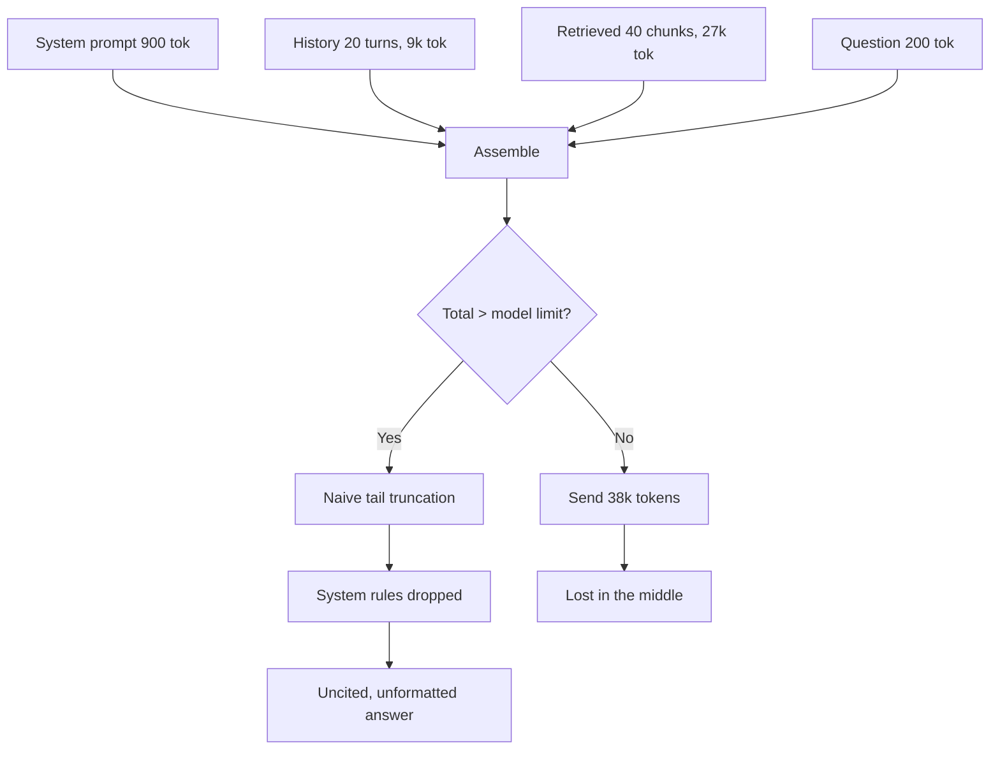
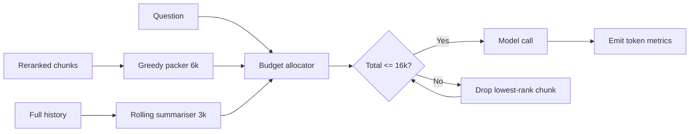

> **Scenario** — A document assistant sends the top 40 retrieved chunks plus the last 20 conversation turns into every request. Prompts average 38,000 tokens, each turn costs about $0.11, and answer accuracy is *worse* than when the prompt held 6 chunks.

## Why it matters

- Tokens are linear cost and roughly linear latency. Going from 6,000 to 38,000 input tokens multiplies both by six with no guarantee of better answers.
- Long contexts degrade quality. Relevant facts placed in the middle of a long prompt are attended to less reliably than facts near the start or end.
- Truncation is where correctness dies. When the prompt overflows, most frameworks silently drop the oldest or last items — often the system rules or the citation instructions.
- Bengali and other non-Latin scripts tokenise far less efficiently than English. The same sentence can cost 2–3x more tokens, so a budget calibrated on English overflows on Bengali input.
- Budgets are the only thing standing between a chatty user and a five-figure monthly bill.

## Symptoms

| Signal | What you observe |
|---|---|
| Cost | Average tokens per request drifts upward every sprint with no feature change |
| Accuracy | Answer quality peaks at a middling `k` and declines as `k` grows |
| Truncation | Provider returns a context-length error only for long Bengali conversations |
| Latency | Time-to-first-token grows with prompt size even before generation starts |
| Instruction loss | The model stops citing sources in long threads |

## How it breaks

Most RAG prompts are assembled by concatenation: system prompt, then history, then retrieved chunks, then the question. Nothing enforces a total. Each component grows independently — retrieval gets a bigger `k`, history retention gets bumped from 6 turns to 20, a new tool description gets added — and the sum crosses the limit on the tail of the distribution first, so it looks like a rare bug rather than a design gap.



## Root causes

1. No single component owns the total token budget; each section grows on its own.
2. Token counts are estimated from character length instead of measured with the real tokenizer.
3. Retrieved chunks are added by rank until they run out, not until the budget is spent.
4. Conversation history is retained verbatim rather than summarised.
5. Truncation strategy is whatever the SDK does by default, and nobody has read it.

## How to solve it

### 1. Declare an explicit budget and enforce it

Treat the window like a memory allocator: fixed reservations, a spill policy, and a hard ceiling below the model limit.

```ts
type Budget = { system: number; tools: number; history: number; retrieved: number; answer: number }

const BUDGET: Budget = {
  system: 1_000,
  tools: 1_200,
  history: 3_000,
  retrieved: 6_000,
  answer: 1_500,
}
const CEILING = 16_000 // stay well under the 32k model limit
```

Reserving `answer` matters: output tokens come out of the same window on most models, and a 1,500-token reservation is what stops a truncated final sentence.

### 2. Count tokens with the real tokenizer

```python
import tiktoken
enc = tiktoken.get_encoding("o200k_base")

def ntokens(text: str) -> int:
    return len(enc.encode(text))

en = "The refund window is fourteen days from delivery."
bn = "ডেলিভারির তারিখ থেকে চৌদ্দ দিনের মধ্যে রিফান্ড উইন্ডো।"
print(ntokens(en), ntokens(bn))   # roughly 10 vs 30 — a 3x multiplier
```

Character-count heuristics like `len(text) / 4` are calibrated on English and understate Bengali by a wide margin. Budget in tokens, always.

### 3. Fill the retrieved section greedily, in rank order, to the budget

```python
def pack(chunks, budget: int):
    used, packed = 0, []
    for c in chunks:                     # already reranked, best first
        cost = ntokens(c.text) + 25      # header, separator, citation marker
        if used + cost > budget:
            continue                     # skip, do not stop — a later chunk may fit
        packed.append(c)
        used += cost
    return packed, used
```

### 4. Compress history instead of dropping it

Keep the last 3 turns verbatim, and replace everything older with a rolling summary regenerated every 6 turns. A 9,000-token history typically compresses to 400–600 tokens with no loss of the facts the user actually referenced.

```python
if ntokens(history_text) > BUDGET_HISTORY:
    summary = llm.summarise(older_turns, max_tokens=400)
    history_text = summary + "\n" + render(recent_turns[-3:])
```

### 5. Place the important material at the edges

Put the system rules and the user's question last, immediately before generation, and the retrieved evidence above them. Models attend most reliably to the beginning and end of the context.

### 6. Make token spend observable

Emit `prompt_tokens`, `completion_tokens`, and per-section token counts on every request. Alert when the p95 prompt size grows more than 20% week over week.

Cost arithmetic worth internalising: 38k input tokens at $3.00 per million is $0.114 per turn. At 50,000 turns/month that is $5,700. The same workload at 8k tokens costs $1,200. The retrieval quality difference between the two is usually zero or in favour of the smaller prompt.

## Target design



## Tradeoffs

| Option | Pros | Cons | Choose when |
|---|---|---|---|
| Stuff everything | Simple, no packing logic | Expensive, slower, lost-in-the-middle errors | Prototype only |
| Fixed per-section budget | Predictable cost, no overflow | Occasionally drops a useful chunk | Production defaults |
| Rerank then pack top-6 | Best accuracy per token | Adds reranker latency and cost | Precision matters more than 60ms |
| Summarised history | Long threads stay affordable | Summariser can lose a detail | Conversations exceed ~10 turns |
| Larger context model | No packing work | 4–8x cost, higher latency | Genuinely long single documents |

## Verification checklist

- [ ] Total prompt tokens measured with the production tokenizer, not estimated.
- [ ] A Bengali-heavy conversation of 20 turns tested against the ceiling without overflow.
- [ ] Output token reservation confirmed to prevent mid-sentence truncation.
- [ ] Answer quality measured at `k` = 3, 6, 12, 24 to find the actual accuracy peak.
- [ ] Per-section token counts visible in traces for a sampled request.
- [ ] Alert configured for p95 prompt size growth above 20% week over week.

## Anti-patterns

- Estimating tokens as `characters / 4` and shipping it to a multilingual audience.
- Raising `k` as a substitute for improving retrieval ranking.
- Letting the SDK truncate from the front, which eats the system prompt.
- Keeping full conversation history forever "because the user might refer back".
- Moving to a larger-context model before measuring whether the extra context helps.

## Related

- [Hybrid search and reranking that actually lifts recall](/systems/ai-rag-agents/hybrid-search-and-reranking)
- [LLM caching layers and cost control](/systems/ai-rag-agents/llm-caching-and-cost-control)
- [Hallucination detection and citations that verify](/systems/ai-rag-agents/hallucination-detection-and-citations)
