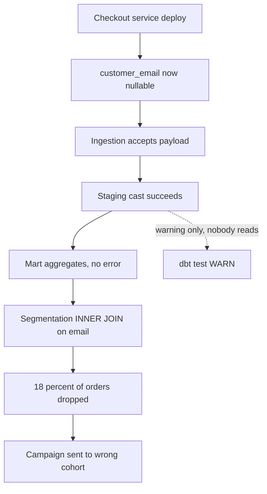
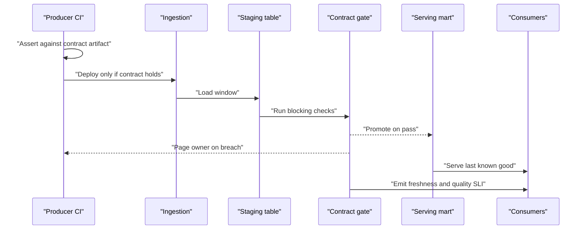

> **Scenario** - Checkout service একটি refactor ship করল যা guest order-এর জন্য `customer_email`-কে nullable বানায়। Data team-কে কেউ জানায়নি। তিন দিন পরে marketing segmentation job প্রতিটি cohort থেকে নীরবে ১৮% order বাদ দিয়েছে, আর একটি campaign ইতিমধ্যেই ভুল list-এ চলে গেছে।

## Why it matters

- Producer feature ship করার স্বাভাবিক অংশ হিসেবেই schema বদলায়। Contract না থাকলে প্রতিটি producer deploy আপনার pipeline-এর input-এ একটি অঘোষিত পরিবর্তন।
- Silent quality failure crash-এর চেয়ে খারাপ। Crash মিনিটেই কাউকে page করে; ৩% null-rate বৃদ্ধি সপ্তাহ ধরে জমা হয়, তারপর কেউ খেয়াল করে সংখ্যাটা অস্বাভাবিক।
- খরচ ভুল team-এর ঘাড়ে পড়ে। Data team এমন service-এর কারণে incident debug করে যা তারা owner নয় এবং revert করতে পারে না।
- Contract একটি unbounded surface ("এই table-এর যেকিছু বদলাতে পারে")-কে explicit ও testable করে - ছোট team-এর ডজন source সামলানোর একমাত্র উপায়।
- Downstream ML আরও খারাপ করে: খারাপ row শুধু dashboard বিকৃত করে না, training label হয়ে model version জুড়ে টিকে থাকে।

## Symptoms

| Signal | What you observe |
| --- | --- |
| Null-rate step change | নির্দিষ্ট deploy তারিখে `customer_email` null rate ০.১% থেকে ১৮% |
| Silent row loss | Downstream `INNER JOIN` row ফেলে দেয়; order-count alert ছাড়াই revenue পড়ে |
| সবুজ DAG-এ freshness breach | Table-এর `MAX(updated_at)` ১৪ ঘণ্টা পুরনো, তবু প্রতিটি task সফল |
| Cardinality explosion | Producer raw upstream code পাঠাতে শুরু করলে `status` enum-এ ৪০টি নতুন value |
| Referential break | ২% `order.customer_id`-র জন্য `customers`-এ কোনো row নেই |
| দেরিতে ধরা incident | Bug ধরে business user, কোনো check নয় - সাধারণত ৩–১০ দিন পরে |

## How it breaks

Pipeline-এর নিজের input সম্পর্কে কোনো মত নেই। Ingestion যা আসে গ্রহণ করে, staging cast করে, mart aggregate করে। `customer_email` null হলে cast সফল, aggregate সফল - শুধু segmentation job-এর `WHERE customer_email IS NOT NULL` filter উত্তর বদলে দেয়।

দ্বিতীয় failure mode: check আছে কিন্তু advisory। `dbt test` warning দেয়, CI job-এ `--warn-error` বন্ধ, প্রতি run-এ ৪০টি warning স্ক্রল করে যায়। যে warning সবসময় জ্বলে, সেটা noise থেকে আলাদা করা যায় না।



## Root causes

1. Downstream logic যে column-এর উপর নির্ভর করে, তার জন্য কোনো declared expectation নেই।
2. Check block না করে warn করে, তাই breach propagation থামায় না।
3. Producer-side ownership নেই: data contract থাকলেও সেটা wiki page, producer-এর CI-তে test নয়।
4. Serving table-এ load-এর পরে check চলে, তাই খারাপ row ইতিমধ্যেই consumer-এর কাছে দৃশ্যমান।
5. Freshness ও volume-কে quality dimension ধরা হয় না, শুধু column value দেখা হয়।
6. Alert data team-এ যায়, যে team পরিবর্তন ship করেছে তাদের কাছে নয়।

## How to solve it

### 1. Contract-কে model-এর পাশে data হিসেবে declare করুন

```yaml
# models/marts/schema.yml
version: 2
models:
  - name: fct_orders
    meta:
      owner: "@checkout-team"
      consumers: ["marketing_segmentation", "revenue_dashboard", "churn_model"]
      freshness_sla_minutes: 120
    columns:
      - name: order_id
        tests:
          - unique: { severity: error }
          - not_null: { severity: error }
      - name: customer_email
        tests:
          - not_null:
              severity: error
              config:
                where: "order_channel != 'guest'"
      - name: status
        tests:
          - accepted_values:
              severity: error
              values: ["pending", "paid", "shipped", "cancelled", "refunded"]
      - name: customer_id
        tests:
          - relationships:
              severity: error
              to: ref('dim_customers')
              field: customer_id
      - name: amount_cents
        tests:
          - dbt_utils.accepted_range:
              severity: error
              min_value: 0
              max_value: 100000000
```

দুটি বিষয় জরুরি। `severity: error` মানে build fail হয়; warning কোনো contract নয়। `customer_email`-এর `where` clause *আসল* নিয়মটি encode করে (guest-এর email নেই), blanket `not_null` নয় - যেটা কেউ একদিন warning-এ নামিয়ে দেবে।

### 2. Read নয়, write gate করুন

Staging table-এ check চালান, pass করলেই promote করুন।

```python
from datetime import datetime, timedelta

from airflow.decorators import dag, task
from airflow.exceptions import AirflowFailException
from airflow.providers.postgres.hooks.postgres import PostgresHook

CHECKS = {
    "order_id_unique": """
        SELECT COUNT(*) FROM (
          SELECT order_id FROM staging.fct_orders
          GROUP BY 1 HAVING COUNT(*) > 1) d
    """,
    "email_null_for_non_guest": """
        SELECT COUNT(*) FROM staging.fct_orders
         WHERE order_channel <> 'guest' AND customer_email IS NULL
    """,
    "status_in_enum": """
        SELECT COUNT(*) FROM staging.fct_orders
         WHERE status NOT IN ('pending','paid','shipped','cancelled','refunded')
    """,
    "orphan_customers": """
        SELECT COUNT(*) FROM staging.fct_orders o
          LEFT JOIN analytics.dim_customers c USING (customer_id)
         WHERE c.customer_id IS NULL
    """,
}


@dag(
    dag_id="fct_orders_contract_gate",
    schedule="0 * * * *",
    start_date=datetime(2026, 1, 1),
    catchup=False,
    default_args={"retries": 2, "retry_delay": timedelta(minutes=3)},
)
def fct_orders_contract_gate():
    @task
    def load_staging():
        PostgresHook(postgres_conn_id="warehouse").run(
            "CALL analytics.rebuild_staging_fct_orders();"
        )

    @task
    def run_contract_checks() -> dict[str, int]:
        hook = PostgresHook(postgres_conn_id="warehouse")
        failures = {}
        for name, sql in CHECKS.items():
            count = hook.get_first(sql)[0]
            if count:
                failures[name] = count
        if failures:
            raise AirflowFailException(f"contract breach: {failures}")
        return {"checks_passed": len(CHECKS)}

    @task
    def promote():
        PostgresHook(postgres_conn_id="warehouse").run(
            "BEGIN; "
            "TRUNCATE analytics.fct_orders; "
            "INSERT INTO analytics.fct_orders SELECT * FROM staging.fct_orders; "
            "COMMIT;"
        )

    load_staging() >> run_contract_checks() >> promote()


fct_orders_contract_gate()
```

Gate-এর পুরো উদ্দেশ্য: breach হলে আগের ভালো data জায়গায় থাকে। Consumer fresh-and-wrong নয়, stale-but-correct দেখে - আর এই choice SLA-তে স্পষ্ট থাকা উচিত।

### 3. Blocking ও warning সচেতনভাবে আলাদা করুন

| Dimension | Blocking | Warning |
| --- | --- | --- |
| Primary key uniqueness | হ্যাঁ | - |
| Dimension-এ referential integrity | হ্যাঁ | - |
| Enum membership | হ্যাঁ | - |
| Null rate ৩০-দিনের baseline-এর ২× এর মধ্যে | - | হ্যাঁ |
| Row volume ৭-দিনের median-এর ±৩০% | - | হ্যাঁ |
| SLA-র বাইরে freshness | হ্যাঁ | - |

Warning-এর গন্তব্য ও owner থাকতে হবে, নাহলে সেটা তুলে দিন।

### 4. Check-কে producer-এর CI-তে upstream ঠেলুন

Nullable column ধরার সবচেয়ে সস্তা জায়গা হলো যে pull request সেটাকে nullable করছে। Contract-কে machine-readable artifact হিসেবে publish করুন, producer-এর test suite তার বিরুদ্ধে assert করবে।

```python
import json

import pandas as pd

CONTRACT = json.load(open("contracts/fct_orders.json"))


def assert_contract(frame: pd.DataFrame) -> None:
    for column, rules in CONTRACT["columns"].items():
        assert column in frame.columns, f"contract column missing: {column}"
        series = frame[column]
        if rules.get("not_null"):
            nulls = int(series.isna().sum())
            assert nulls == 0, f"{column}: {nulls} nulls violate contract"
        if "accepted_values" in rules:
            unexpected = set(series.dropna().unique()) - set(rules["accepted_values"])
            assert not unexpected, f"{column}: unexpected values {sorted(unexpected)}"
        if "dtype" in rules:
            assert str(series.dtype) == rules["dtype"], (
                f"{column}: dtype {series.dtype} != {rules['dtype']}"
            )
```

### 5. Ownership অনুযায়ী alert route করুন

`meta.owner` field documentation নয়; সেটাকে alert-এ যুক্ত করুন। `fct_orders`-এ contract breach হলে failing check-এর নাম, count ও শেষ producer deploy-এর diff-এর link সহ checkout team-কে page করা উচিত।

## Target design



## Tradeoffs

| Option | Pros | Cons | Choose when |
| --- | --- | --- | --- |
| Promote-এর আগে blocking gate | Consumer কখনও খারাপ row দেখে না | breach-এর সময় freshness ক্ষতিগ্রস্ত; staging copy লাগে | correctness freshness-এর চেয়ে জরুরি (finance, billing, label) |
| Warn করে promote | সবসময় fresh; pipeline আটকায় না | খারাপ data dashboard ও model-এ পৌঁছায় | downstream automation নেই এমন exploratory dataset |
| খারাপ row quarantine, বাকি promote | আংশিক freshness; triage-এর জন্য খারাপ row থাকে | aggregate সূক্ষ্মভাবে অসম্পূর্ণ; reconciliation report লাগে | high-volume event data যেখানে ছোট খারাপ অংশ সহনীয় |
| Producer-side contract test | Deploy-এর আগেই break ধরা | producer buy-in ও shared tooling লাগে | service team-এর উপর organisational leverage আছে |

## Verification checklist

- [ ] প্রতিটি blocking check ভাঙে এমন row staging-এ ঢোকান; DAG fail করে ও serving table অপরিবর্তিত থাকে।
- [ ] Simulated breach-এর সময় serving table documented staleness সহ query-র উত্তর দেয় কি না দেখুন।
- [ ] Breach trigger করে দেখুন page data team-এর নয়, producer team-এর rotation-এ যায়।
- [ ] শেষ ৩০ দিনের alert count তুলনা করুন; কোনো একটি check কয়েকবারের বেশি জ্বললে সেটা miscalibrated।
- [ ] Freshness task success নয়, data (`MAX(updated_at)`) থেকে check হয় তা নিশ্চিত করুন।
- [ ] `not_null` column-এ null আছে এমন fixture-এ producer-এর test suite চালান; fail করতেই হবে।
- [ ] Downstream `JOIN` বা `WHERE`-এ ব্যবহৃত প্রতিটি column contract-এ আছে।

## Anti-patterns

- প্রতিটি column-এ `not_null` test যোগ করা, তারপর build noisy হলে অর্ধেক warning-এ নামিয়ে দেওয়া।
- শুধু mart test করা। তখন খারাপ row ইতিমধ্যেই aggregate হয়ে গেছে, raw evidence এক join দূরে।
- Row-count check-কে correctness-এর proxy ধরা; schema change count একই রেখে value ভুল করতে পারে।
- Contract শুধু data team-এর repo-তে রাখা, ফলে producer কখনও fail হতে দেখে না।
- "expectation violated" নয়, "table changed"-এ alert দেওয়া - যা সবাইকে channel উপেক্ষা করতে শেখায়।
- Consuming query-তে খারাপ row filter করা। এটা একটি dashboard ঠিক করে আর বাকিদের কাছে breach লুকায়।

## Related

- [Schema drift detection before it reaches the model](/systems/data-pipelines-ml/schema-drift-detection)
- [ETL vs ELT: choosing where transformation lives](/systems/data-pipelines-ml/etl-vs-elt-decisions)
- [Feature store consistency: offline vs online](/systems/data-pipelines-ml/feature-store-consistency)
- [Pipeline orchestration retries that do not amplify](/systems/data-pipelines-ml/pipeline-orchestration-retries)
