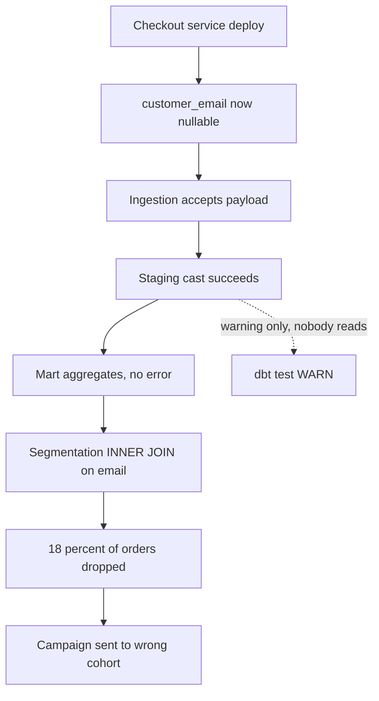
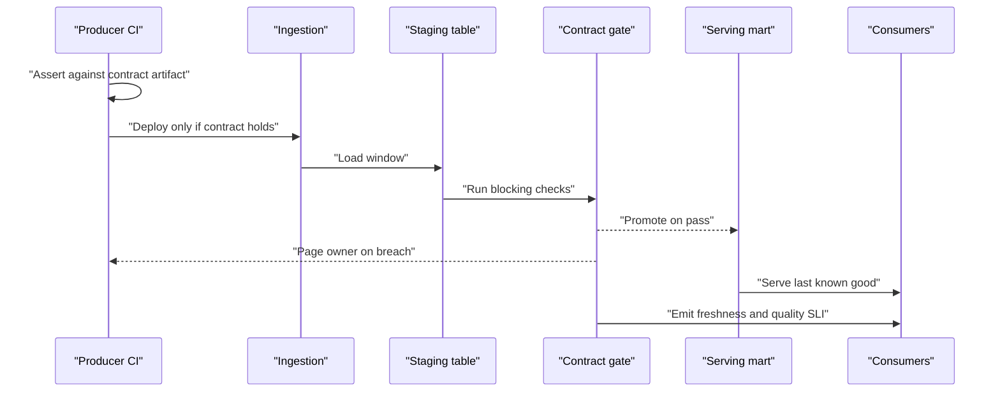

> **Scenario** — The checkout service ships a refactor that makes `customer_email` nullable for guest orders. Nobody told the data team. Three days later the marketing segmentation job has silently dropped 18% of orders from every cohort, and a campaign has already gone out to the wrong list.

## Why it matters

- Producers change schemas as a normal part of shipping features. Without a contract, every producer deploy is an unannounced change to your pipeline's inputs.
- Silent quality failures are worse than crashes. A crash pages someone in minutes; a 3% null-rate increase compounds for weeks before a human notices the number looks off.
- The cost lands on the wrong team. The data team debugs an incident caused by a service they do not own and cannot revert.
- Contracts convert an unbounded surface ("anything in this table might change") into an explicit, testable one, which is the only way a small team supports dozens of sources.
- Downstream ML makes it worse: bad rows do not just distort a dashboard, they become training labels that persist across model versions.

## Symptoms

| Signal | What you observe |
| --- | --- |
| Null-rate step change | `customer_email` null rate goes from 0.1% to 18% on a specific deploy date |
| Silent row loss | An `INNER JOIN` downstream drops rows; total revenue falls with no order-count alert |
| Freshness breach with green DAG | Table's `MAX(updated_at)` is 14 hours old but every task succeeded |
| Cardinality explosion | A `status` enum gains 40 new values because a producer started passing raw upstream codes |
| Referential breaks | 2% of `order.customer_id` values have no matching row in `customers` |
| Late-discovered incidents | The bug is found by a business user, not by a check, on average 3–10 days later |

## How it breaks

The pipeline has no opinion about its inputs. Ingestion accepts whatever arrives, staging casts it, and the mart aggregates it. When `customer_email` becomes null, the cast succeeds, the aggregate succeeds, and only the segmentation job's `WHERE customer_email IS NOT NULL` filter changes the answer.

The second failure mode is that checks exist but are advisory. `dbt test` emits warnings, the CI job is configured with `--warn-error` off, and 40 warnings scroll past in every run. A warning that always fires is indistinguishable from noise.



## Root causes

1. No declared expectations for the columns downstream logic depends on.
2. Checks that warn instead of block, so a breach does not stop propagation.
3. No producer-side ownership: the data contract, if it exists, is a wiki page rather than a test in the producer's CI.
4. Checks run after the load into the serving table, so bad rows are already visible to consumers.
5. Freshness and volume are not treated as quality dimensions, only column values are.
6. Alerts route to the data team rather than the team that shipped the change.

## How to solve it

### 1. Declare the contract as data, next to the model

```yaml
# models/marts/schema.yml
version: 2
models:
  - name: fct_orders
    meta:
      owner: "@checkout-team"
      consumers: ["marketing_segmentation", "revenue_dashboard", "churn_model"]
      freshness_sla_minutes: 120
    columns:
      - name: order_id
        tests:
          - unique: { severity: error }
          - not_null: { severity: error }
      - name: customer_email
        tests:
          - not_null:
              severity: error
              config:
                where: "order_channel != 'guest'"
      - name: status
        tests:
          - accepted_values:
              severity: error
              values: ["pending", "paid", "shipped", "cancelled", "refunded"]
      - name: customer_id
        tests:
          - relationships:
              severity: error
              to: ref('dim_customers')
              field: customer_id
      - name: amount_cents
        tests:
          - dbt_utils.accepted_range:
              severity: error
              min_value: 0
              max_value: 100000000
```

Two details matter. `severity: error` means the build fails; a warning is not a contract. The `where` clause on `customer_email` encodes the *actual* rule (guests have no email) instead of a blanket `not_null` that someone will eventually downgrade to a warning.

### 2. Gate the write, not the read

Run checks against a staging table and promote only if they pass.

```python
from datetime import datetime, timedelta

from airflow.decorators import dag, task
from airflow.exceptions import AirflowFailException
from airflow.providers.postgres.hooks.postgres import PostgresHook

CHECKS = {
    "order_id_unique": """
        SELECT COUNT(*) FROM (
          SELECT order_id FROM staging.fct_orders
          GROUP BY 1 HAVING COUNT(*) > 1) d
    """,
    "email_null_for_non_guest": """
        SELECT COUNT(*) FROM staging.fct_orders
         WHERE order_channel <> 'guest' AND customer_email IS NULL
    """,
    "status_in_enum": """
        SELECT COUNT(*) FROM staging.fct_orders
         WHERE status NOT IN ('pending','paid','shipped','cancelled','refunded')
    """,
    "orphan_customers": """
        SELECT COUNT(*) FROM staging.fct_orders o
          LEFT JOIN analytics.dim_customers c USING (customer_id)
         WHERE c.customer_id IS NULL
    """,
}


@dag(
    dag_id="fct_orders_contract_gate",
    schedule="0 * * * *",
    start_date=datetime(2026, 1, 1),
    catchup=False,
    default_args={"retries": 2, "retry_delay": timedelta(minutes=3)},
)
def fct_orders_contract_gate():
    @task
    def load_staging():
        PostgresHook(postgres_conn_id="warehouse").run(
            "CALL analytics.rebuild_staging_fct_orders();"
        )

    @task
    def run_contract_checks() -> dict[str, int]:
        hook = PostgresHook(postgres_conn_id="warehouse")
        failures = {}
        for name, sql in CHECKS.items():
            count = hook.get_first(sql)[0]
            if count:
                failures[name] = count
        if failures:
            raise AirflowFailException(f"contract breach: {failures}")
        return {"checks_passed": len(CHECKS)}

    @task
    def promote():
        PostgresHook(postgres_conn_id="warehouse").run(
            "BEGIN; "
            "TRUNCATE analytics.fct_orders; "
            "INSERT INTO analytics.fct_orders SELECT * FROM staging.fct_orders; "
            "COMMIT;"
        )

    load_staging() >> run_contract_checks() >> promote()


fct_orders_contract_gate()
```

The whole point of the gate is that a breach leaves the previous good data in place. Consumers see stale-but-correct rather than fresh-and-wrong, and that choice should be explicit in the SLA.

### 3. Distinguish blocking from warning deliberately

| Dimension | Blocking | Warning |
| --- | --- | --- |
| Uniqueness of the primary key | yes | — |
| Referential integrity to a dimension | yes | — |
| Enum membership | yes | — |
| Null rate within 2× the 30-day baseline | — | yes |
| Row volume within ±30% of the 7-day median | — | yes |
| Freshness beyond the SLA | yes | — |

Warnings must have a destination and an owner, otherwise demote them out of existence.

### 4. Push the check upstream into the producer's CI

The cheapest place to catch a nullable column is the pull request that makes it nullable. Publish the contract as a machine-readable artifact and have the producer's test suite assert against it.

```python
import json

import pandas as pd

CONTRACT = json.load(open("contracts/fct_orders.json"))


def assert_contract(frame: pd.DataFrame) -> None:
    for column, rules in CONTRACT["columns"].items():
        assert column in frame.columns, f"contract column missing: {column}"
        series = frame[column]
        if rules.get("not_null"):
            nulls = int(series.isna().sum())
            assert nulls == 0, f"{column}: {nulls} nulls violate contract"
        if "accepted_values" in rules:
            unexpected = set(series.dropna().unique()) - set(rules["accepted_values"])
            assert not unexpected, f"{column}: unexpected values {sorted(unexpected)}"
        if "dtype" in rules:
            assert str(series.dtype) == rules["dtype"], (
                f"{column}: dtype {series.dtype} != {rules['dtype']}"
            )
```

### 5. Route alerts by ownership

The `meta.owner` field is not documentation; wire it into the alert. A contract breach on `fct_orders` should page the checkout team with the failing check name, the count, and a link to the diff of the last producer deploy.

## Target design



## Tradeoffs

| Option | Pros | Cons | Choose when |
| --- | --- | --- | --- |
| Blocking gate before promote | Consumers never see bad rows | Freshness suffers during a breach; needs a staging copy | Correctness outranks freshness (finance, billing, labels) |
| Warn and promote anyway | Always fresh; no pipeline stalls | Bad data reaches dashboards and models | Exploratory datasets with no downstream automation |
| Quarantine bad rows, promote the rest | Partial freshness; bad rows preserved for triage | Aggregates are subtly incomplete; needs a reconciliation report | High-volume event data where a small bad fraction is tolerable |
| Producer-side contract tests | Catches breaks before deploy | Requires producer buy-in and shared tooling | You have organisational leverage with service teams |

## Verification checklist

- [ ] Insert a row violating each blocking check into staging; the DAG fails and the serving table is unchanged.
- [ ] Confirm the serving table still answers queries during a simulated breach, with a documented staleness.
- [ ] Trigger a breach and confirm the page lands on the producer team's rotation, not the data team's.
- [ ] Compare the alert count over the last 30 days; if any single check fires more than a few times, it is miscalibrated.
- [ ] Confirm freshness is checked from data (`MAX(updated_at)`), not from task success.
- [ ] Run the producer's test suite against a fixture with a null in a `not_null` column; it must fail.
- [ ] Every column referenced by a downstream `JOIN` or `WHERE` appears in the contract.

## Anti-patterns

- Adding `not_null` tests to every column, then downgrading half of them to warnings when the build gets noisy.
- Testing only the marts. By then the bad rows have already been aggregated and the raw evidence is a join away.
- Using row-count checks as a proxy for correctness; a schema change can keep counts identical while making values wrong.
- Owning the contract in the data team's repo only, so producers never see it fail.
- Alerting on "table changed" instead of "expectation violated", which trains everyone to ignore the channel.
- Filtering bad rows out in the consuming query. It fixes one dashboard and hides the breach from everyone else.

## Related

- [Schema drift detection before it reaches the model](/systems/data-pipelines-ml/schema-drift-detection)
- [ETL vs ELT: choosing where transformation lives](/systems/data-pipelines-ml/etl-vs-elt-decisions)
- [Feature store consistency: offline vs online](/systems/data-pipelines-ml/feature-store-consistency)
- [Pipeline orchestration retries that do not amplify](/systems/data-pipelines-ml/pipeline-orchestration-retries)
