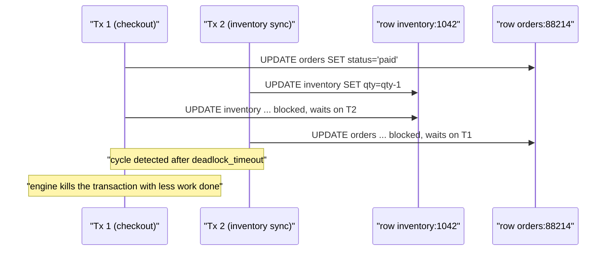
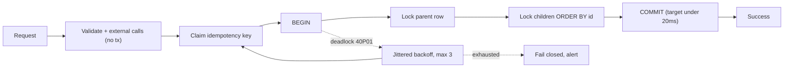

> **Scenario** - সারা সপ্তাহ checkout ঠিকঠাক চলে। শুক্রবার রাত ৮টায় traffic দ্বিগুণ হয় আর MySQL `ERROR 1213: Deadlock found when trying to get lock` log করা শুরু করে। প্রায় ০.৪% order fail করে, retry wrapper চলে, আর support জানায় customer একই cart-এ দুবার charge হয়েছে।

## Why it matters

- Deadlock concurrency-র সাথে super-linearly বাড়ে। Traffic দ্বিগুণ হলে deadlock rate চারগুণ বা তার বেশি হতে পারে - অর্থাৎ ঠিক যখন revenue সর্বোচ্চ তখনই failure।
- Database সঠিকভাবেই সমাধান করে - একটি transaction মেরে ফেলে - কিন্তু *application*-এর প্রতিক্রিয়া সাধারণত সরল retry। Transaction-এর side effect database-এর বাইরে থাকলে (payment capture, email) retry সেটা duplicate করে।
- Deadlock victim engine বেছে নেয়, গুরুত্ব দেখে নয়। 40ms-এর payment write প্রায়ই 3-সেকেন্ডের reporting query-র কাছে হারে।
- Stack trace সেই statement দেখায় যেটা *অপেক্ষা করছিল*, যে transaction আগে conflicting lock নিয়েছিল সেটা নয়। দল ঘণ্টার পর ঘণ্টা ভুল query optimize করে।

## Symptoms

| Signal | What you observe |
|---|---|
| Error code | MySQL `1213` / Postgres `40P01 deadlock detected`, burst-এ, ধারাবাহিকভাবে নয় |
| Correlation | Deadlock rate concurrent-transaction সংখ্যার সাথে চলে, request count-এর সাথে নয় |
| Duration | প্রতিটি victim পুরো detection interval অপেক্ষা করে - Postgres `deadlock_timeout` ডিফল্ট 1s |
| Lock wait | এমন row-তে `SELECT ... FOR UPDATE` যেগুলোর conflict হওয়ার "কথা না" |
| Gap lock (MySQL) | `REPEATABLE READ`-এ এমন range-এ deadlock যেখানে কেউ insert করেনি |
| Retry | Retry সফল হয়, কিন্তু downstream side effect দুবার ঘটে |
| Connection pool | Pool ভরে যায় কারণ প্রতিটি victim backoff-এর পুরো সময় connection ধরে থাকে |

## How it breaks

Deadlock-এর জন্য দুটি transaction একই দুটি resource বিপরীত ক্রমে নিতে হয়। সূক্ষ্ম ব্যাপার হলো "resource" প্রায়ই আপনার নাম করা row নয়। তিনটি সাধারণ চমক:

**Index gap.** MySQL-এর ডিফল্ট `REPEATABLE READ`-এ non-unique index-এ `SELECT ... FOR UPDATE` next-key lock নেয়, যা index entry-র মাঝের *gap* ঢেকে ফেলে। ভিন্ন customer-এর দুটি insert একই gap-এ পড়ে conflict করতে পারে।

**Missing index.** `WHERE` clause index ব্যবহার করতে না পারলে InnoDB scan করা প্রতিটি row lock করে, শুধু match করা row নয়। যুক্তিগতভাবে এক row ছোঁয়া statement ৪০,০০০ row lock করতে পারে।

**Secondary index order.** `UPDATE ... WHERE status = 'pending'` secondary index ধরে হাঁটে, কিন্তু primary-key ক্রমে কোন row আগে আসবে তা data layout-এর উপর নির্ভর করে। দুটি concurrent run একই row ভিন্ন ক্রমে ছুঁতে পারে।



## Root causes

1. দুটি code path একই table ভিন্ন ক্রমে update করে - সাধারণত একটি অন্য টিমের লেখা।
2. দীর্ঘ transaction যা network call-এর মধ্যেও lock ধরে রাখে, ফলে lock window 4ms-এর বদলে 400ms।
3. Missing বা unusable index-এর কারণে full scan অপ্রয়োজনীয় row lock করে।
4. `REPEATABLE READ`-এ gap lock, যখন অন্য transaction-এর range scan-এর ভেতরে insert হয়।
5. Batch job unordered `IN (...)` list নিয়ে চলে, দুই batch বিপরীত ক্রমে interleave করে।
6. Retry logic idempotent নয়, ফলে নিরীহ deadlock duplicate charge-এ পরিণত হয়।

## How to solve it

### 1. Global lock order চাপিয়ে দিন

সবচেয়ে সস্তা structural fix। একটি canonical ক্রম বেছে নিন - table-এর নাম alphabetical, তারপর primary key ascending - এবং সর্বত্র মানুন।

```php
// Laravel: always lock in a deterministic order, never in the order the caller happened to pass.
DB::transaction(function () use ($orderId, $skuIds) {
    // 1. Lock the parent row first, every time.
    $order = Order::whereKey($orderId)->lockForUpdate()->firstOrFail();

    // 2. Then children, always ascending by primary key.
    $items = InventoryItem::whereIn('id', collect($skuIds)->sort()->values())
        ->orderBy('id')
        ->lockForUpdate()
        ->get();

    foreach ($items as $item) {
        $item->decrement('qty_available');
    }

    $order->update(['status' => 'paid']);
}, attempts: 3);
```

`orderBy('id')` প্রসাধনী নয়। এটা ছাড়া MySQL index order-এ row ফেরত দিতে পারে এবং দুটি concurrent transaction একই row বিপরীত ক্রমে নিতে পারে।

### 2. Transaction শুধু প্রয়োজনীয় row পর্যন্ত ছোট করুন

সব read, validation ও external call `BEGIN`-এর *আগে* সারুন। Payment gateway-তে HTTP call ধারণকারী transaction gateway-র p99 (হয়তো ৩ সেকেন্ড) ধরে lock ধরে রাখে।

```php
// Wrong: gateway latency is inside the lock window.
DB::transaction(function () use ($order) {
    $order->lockForUpdate();
    $charge = $this->stripe->charge($order->total);  // 300-3000ms holding locks
    $order->update(['charge_id' => $charge->id]);
});

// Right: charge first with an idempotency key, then a short transaction to record it.
$charge = $this->stripe->charge($order->total, idempotencyKey: "order:{$order->id}:v1");
DB::transaction(fn () => Order::whereKey($order->id)
    ->where('charge_id', null)
    ->update(['charge_id' => $charge->id, 'status' => 'paid']));
```

### 3. আসল deadlock report পড়ুন

অনুমান বন্ধ করুন। দুই engine-ই ঠিক কোন lock ধরা ছিল তা বলে দেয়।

```sql
-- MySQL: the last deadlock, with both transactions and the exact locks held.
SHOW ENGINE INNODB STATUS\G
-- Persist every deadlock instead of only the most recent one:
SET GLOBAL innodb_print_all_deadlocks = ON;
```

```sql
-- Postgres: make the log show both sides of the cycle.
ALTER SYSTEM SET log_lock_waits = on;
ALTER SYSTEM SET deadlock_timeout = '500ms';
SELECT pg_reload_conf();
```

`deadlock_timeout` 500ms-এ নামালে deadlock বাড়ে না; বিদ্যমানগুলো দ্বিগুণ দ্রুত ধরা পড়ে, ফলে প্রতিটি victim-এর connection-pool চাপ অর্ধেক হয়।

### 4. Retry idempotent করুন, তারপর সীমা দিন

```ts
const DEADLOCK_CODES = new Set(['40P01', '40001', 'ER_LOCK_DEADLOCK'])

async function withDeadlockRetry<T>(fn: () => Promise<T>, maxAttempts = 3): Promise<T> {
  for (let attempt = 1; ; attempt++) {
    try {
      return await fn()
    } catch (err) {
      if (!DEADLOCK_CODES.has(codeOf(err)) || attempt >= maxAttempts) throw err
      // Full jitter: two victims must not retry in lockstep and deadlock again.
      const backoffMs = Math.random() * Math.min(50 * 2 ** attempt, 1_000)
      await sleep(backoffMs)
    }
  }
}
```

Transaction body idempotent হলেই কেবল retry নিরাপদ। প্রতিটি external side effect idempotency key দিয়ে পাহারা দিন এবং সেটা retried block-এর *বাইরে* রাখুন।

### 5. যে index over-locking ঘটায় সেটা ঠিক করুন

```sql
-- Before: no usable index, so InnoDB locks every scanned row.
EXPLAIN UPDATE inventory SET qty = qty - 1 WHERE sku = 'AB-1042' AND warehouse_id = 7;
-- type: ALL, rows: 412000

CREATE INDEX idx_inventory_sku_wh ON inventory (sku, warehouse_id);
-- After: type: ref, rows: 1
```

৪,১২,০০০ locked row থেকে ১-এ নামা application logic না ছুঁয়েই একটা পুরো শ্রেণির conflict মুছে দেয়।

## Target design



## Tradeoffs

| Option | Pros | Cons | Choose when |
|---|---|---|---|
| Global lock ordering | Cycle পুরোপুরি দূর করে; runtime খরচ নেই | প্রতিটি টিম ও code path-এ শৃঙ্খলা দরকার | সবসময় - এটাই baseline |
| `REPEATABLE READ`-এর বদলে `READ COMMITTED` | Gap lock নেই; MySQL deadlock অনেক কম | Non-repeatable read; কিছু replication-এ row-based binlog লাগে | Insert-heavy OLTP, ছোট transaction |
| Optimistic concurrency (version column) | কোনো lock ধরা হয় না; core-এর সাথে scale করে | বেশি contention-এ conflict retry হিসেবে আসে | Low-conflict entity, read-mostly workload |
| Key দিয়ে partition করা queue-তে serialize | গঠনগতভাবেই zero contention | Latency ও একটি operational component যোগ হয় | Hot row: এক SKU, এক account, এক seat map |
| `SELECT ... FOR UPDATE NOWAIT` | এক সেকেন্ড অপেক্ষার বদলে সাথে সাথে fail | Caller-কে failure অর্থপূর্ণভাবে সামলাতে হবে | কড়া latency budget-এর interactive path |

## Verification checklist

- [ ] `innodb_print_all_deadlocks` (বা `log_lock_waits`) চালু, এবং deadlock dashboard-এ counter, grep নয়।
- [ ] একাধিক table ছোঁয়া প্রতিটি transaction নথিভুক্ত lock order-এর বিপরীতে review করা।
- [ ] কোনো transaction-এ network call নেই; lint rule বা span-duration alert দিয়ে যাচাই করা।
- [ ] p99 transaction duration 50ms-এর নিচে; এর উপরের সবকিছুর একজন owner সহ তালিকা আছে।
- [ ] 3x peak concurrency-র load test production-এর আগেই deadlock rate reproduce করে।
- [ ] প্রতিটি retried transaction প্রমাণযোগ্যভাবে idempotent, idempotency claim retry loop-এর বাইরে।
- [ ] Transaction-এর ভেতরের প্রতিটি statement-এ `EXPLAIN`-এর `rows` এক অঙ্কের।

## Anti-patterns

- `innodb_lock_wait_timeout` বাড়ানো - deadlock ঠেকাচ্ছেন না, প্রতিটি deadlock connection আরও বেশিক্ষণ ধরে রাখছে।
- স্থির 100ms delay-তে অসীম retry; দুই victim আবার সিঙ্ক হয়ে একই সময়সূচিতে deadlock করে।
- "নিরাপত্তার জন্য" পুরো HTTP handler transaction-এ মোড়ানো, যা প্রতিটি ধীর dependency-কে lock বানায়।
- সমস্যা মেটাতে `LOCK TABLES` যোগ করা, যা ০.৪% error rate-কে global throughput ceiling-এ পরিণত করে।
- ধরে নেওয়া Postgres-এ gap lock নেই তাই deadlock নেই; কম আছে, কিন্তু `SELECT FOR UPDATE`-এর ক্রম এখানেও গুরুত্বপূর্ণ।

## Related

- [Transaction isolation anomalies](/systems/data-storage/transaction-isolation-anomalies)
- [Index design and query plans](/systems/data-storage/index-design-and-query-plans)
- [Connection pool exhaustion](/systems/data-storage/connection-pool-exhaustion)
- [Idempotency keys for payments](/systems/api-integration/idempotency-keys-for-payments)
