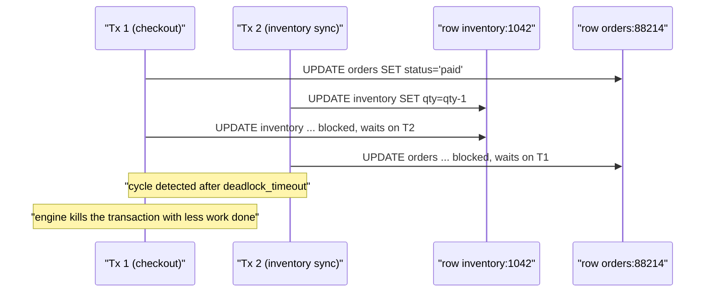
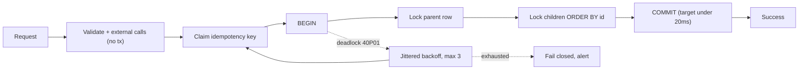

> **Scenario** - Checkout works fine all week. On Friday at 20:00 the traffic doubles and MySQL starts logging `ERROR 1213: Deadlock found when trying to get lock`. Roughly 0.4% of orders fail, the retry wrapper fires, and support reports customers charged twice for the same cart.

## Why it matters

- Deadlocks scale super-linearly with concurrency. Doubling traffic can multiply deadlock rate by four or more, so the failure appears exactly when revenue is highest.
- The database resolves them correctly - it kills one transaction - but the *application's* response is usually a naive retry. If the transaction had side effects outside the database (a payment capture, an email), the retry duplicates them.
- Deadlock victims are chosen by the engine, not by importance. A 40ms payment write loses to a 3-second reporting query as often as not.
- The stack trace points at the statement that *waited*, not the transaction that took the conflicting lock first. Teams spend hours optimising the wrong query.

## Symptoms

| Signal | What you observe |
|---|---|
| Error code | MySQL `1213` / Postgres `40P01 deadlock detected`, in bursts, not steadily |
| Correlation | Deadlock rate tracks concurrent-transaction count, not request count |
| Duration | Each victim waits the full detection interval - Postgres `deadlock_timeout` defaults to 1s |
| Lock waits | `SELECT ... FOR UPDATE` on rows that "should not" conflict |
| Gap locks (MySQL) | Deadlocks on ranges nobody inserted into, under `REPEATABLE READ` |
| Retries | Retry succeeds, but a downstream side effect fires twice |
| Connection pool | Pool saturates because every victim holds a connection through its backoff |

## How it breaks

A deadlock needs two transactions acquiring the same two resources in opposite order. The subtle part is that "resource" often is not the row you named. Three common surprises:

**Index gaps.** Under MySQL's default `REPEATABLE READ`, `SELECT ... FOR UPDATE` on a non-unique index takes a next-key lock covering the *gap* between index entries. Two inserts for different customers can conflict because they fall in the same gap.

**Missing index.** If the `WHERE` clause cannot use an index, InnoDB locks every row it scanned, not just the ones it matched. A statement that logically touches one row can lock 40,000.

**Secondary index order.** An `UPDATE ... WHERE status = 'pending'` walks the secondary index, but the primary-key order it visits rows in depends on data layout. Two concurrent runs can walk the same rows in different orders.



## Root causes

1. Two code paths update the same tables in different order - usually one written by a different team.
2. Long transactions that hold locks across a network call, so the lock window is 400ms instead of 4ms.
3. Missing or unusable index causing a full scan to lock rows it does not need.
4. `REPEATABLE READ` gap locks on inserts into a range covered by another transaction's range scan.
5. Batch jobs running in an unordered `IN (...)` list, so two batches interleave in opposite order.
6. Retry logic that is not idempotent, converting a benign deadlock into a duplicate charge.

## How to solve it

### 1. Impose a global lock order

The cheapest structural fix. Pick a canonical ordering - alphabetical by table, then ascending by primary key - and enforce it everywhere.

```php
// Laravel: always lock in a deterministic order, never in the order the caller happened to pass.
DB::transaction(function () use ($orderId, $skuIds) {
    // 1. Lock the parent row first, every time.
    $order = Order::whereKey($orderId)->lockForUpdate()->firstOrFail();

    // 2. Then children, always ascending by primary key.
    $items = InventoryItem::whereIn('id', collect($skuIds)->sort()->values())
        ->orderBy('id')
        ->lockForUpdate()
        ->get();

    foreach ($items as $item) {
        $item->decrement('qty_available');
    }

    $order->update(['status' => 'paid']);
}, attempts: 3);
```

The `orderBy('id')` is not cosmetic. Without it, MySQL may return rows in index order and two concurrent transactions can acquire the same rows in opposite sequence.

### 2. Shrink the transaction to the rows that need it

Do all reads, validation, and external calls *before* `BEGIN`. A transaction that spans an HTTP call to a payment gateway holds locks for the gateway's p99, which might be 3 seconds.

```php
// Wrong: gateway latency is inside the lock window.
DB::transaction(function () use ($order) {
    $order->lockForUpdate();
    $charge = $this->stripe->charge($order->total);  // 300-3000ms holding locks
    $order->update(['charge_id' => $charge->id]);
});

// Right: charge first with an idempotency key, then a short transaction to record it.
$charge = $this->stripe->charge($order->total, idempotencyKey: "order:{$order->id}:v1");
DB::transaction(fn () => Order::whereKey($order->id)
    ->where('charge_id', null)
    ->update(['charge_id' => $charge->id, 'status' => 'paid']));
```

### 3. Read the actual deadlock report

Stop guessing. Both engines tell you exactly which locks were held.

```sql
-- MySQL: the last deadlock, with both transactions and the exact locks held.
SHOW ENGINE INNODB STATUS\G
-- Persist every deadlock instead of only the most recent one:
SET GLOBAL innodb_print_all_deadlocks = ON;
```

```sql
-- Postgres: make the log show both sides of the cycle.
ALTER SYSTEM SET log_lock_waits = on;
ALTER SYSTEM SET deadlock_timeout = '500ms';
SELECT pg_reload_conf();
```

Lowering `deadlock_timeout` to 500ms does not cause more deadlocks; it detects the existing ones twice as fast, halving the connection-pool pressure each victim creates.

### 4. Make retries idempotent, then bound them

```ts
const DEADLOCK_CODES = new Set(['40P01', '40001', 'ER_LOCK_DEADLOCK'])

async function withDeadlockRetry<T>(fn: () => Promise<T>, maxAttempts = 3): Promise<T> {
  for (let attempt = 1; ; attempt++) {
    try {
      return await fn()
    } catch (err) {
      if (!DEADLOCK_CODES.has(codeOf(err)) || attempt >= maxAttempts) throw err
      // Full jitter: two victims must not retry in lockstep and deadlock again.
      const backoffMs = Math.random() * Math.min(50 * 2 ** attempt, 1_000)
      await sleep(backoffMs)
    }
  }
}
```

Retry is only safe if the transaction body is idempotent. Guard every external side effect with an idempotency key and keep it *outside* the retried block.

### 5. Fix the index that causes the over-locking

```sql
-- Before: no usable index, so InnoDB locks every scanned row.
EXPLAIN UPDATE inventory SET qty = qty - 1 WHERE sku = 'AB-1042' AND warehouse_id = 7;
-- type: ALL, rows: 412000

CREATE INDEX idx_inventory_sku_wh ON inventory (sku, warehouse_id);
-- After: type: ref, rows: 1
```

Going from 412,000 locked rows to 1 removes an entire class of conflicts without touching application logic.

## Target design



## Tradeoffs

| Option | Pros | Cons | Choose when |
|---|---|---|---|
| Global lock ordering | Eliminates the cycle entirely; no runtime cost | Requires discipline across every team and code path | Always - this is the baseline |
| `READ COMMITTED` instead of `REPEATABLE READ` | No gap locks; far fewer MySQL deadlocks | Non-repeatable reads; some replication setups need row-based binlog | Insert-heavy OLTP with short transactions |
| Optimistic concurrency (version column) | No locks held at all; scales with cores | Conflicts surface as retries at high contention | Low-conflict entities, read-mostly workloads |
| Serialize via a queue partitioned by key | Zero contention by construction | Adds latency and an operational component | Hot rows: one SKU, one account, one seat map |
| `SELECT ... FOR UPDATE NOWAIT` | Fails instantly instead of waiting a second | Caller must handle the failure meaningfully | Interactive paths with a tight latency budget |

## Verification checklist

- [ ] `innodb_print_all_deadlocks` (or `log_lock_waits`) is on, and deadlocks are a counter on a dashboard, not a grep.
- [ ] Every transaction that touches more than one table is reviewed against the documented lock order.
- [ ] No transaction contains a network call; verified by a lint rule or a span-duration alert.
- [ ] p99 transaction duration is under 50ms; anything above is on a list with an owner.
- [ ] A load test at 3x peak concurrency reproduces the deadlock rate before it reaches production.
- [ ] Every retried transaction is provably idempotent, with the idempotency claim outside the retry loop.
- [ ] `EXPLAIN` shows `rows` in single digits for every statement inside a transaction.

## Anti-patterns

- Raising `innodb_lock_wait_timeout` - you are not preventing deadlocks, you are making each one hold a connection longer.
- Retrying forever with a fixed 100ms delay; the two victims resynchronise and deadlock again on the same schedule.
- Wrapping the whole HTTP handler in a transaction "for safety", which turns every slow dependency into a lock.
- Adding `LOCK TABLES` to make the problem go away, converting a 0.4% error rate into a global throughput ceiling.
- Assuming Postgres has no gap locks and therefore no deadlocks; it has fewer, but `SELECT FOR UPDATE` ordering still matters.

## Related

- [Transaction isolation anomalies](/systems/data-storage/transaction-isolation-anomalies)
- [Index design and query plans](/systems/data-storage/index-design-and-query-plans)
- [Connection pool exhaustion](/systems/data-storage/connection-pool-exhaustion)
- [Idempotency keys for payments](/systems/api-integration/idempotency-keys-for-payments)
