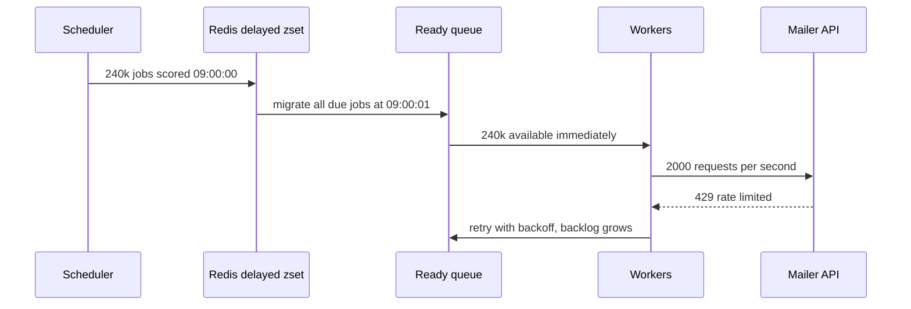
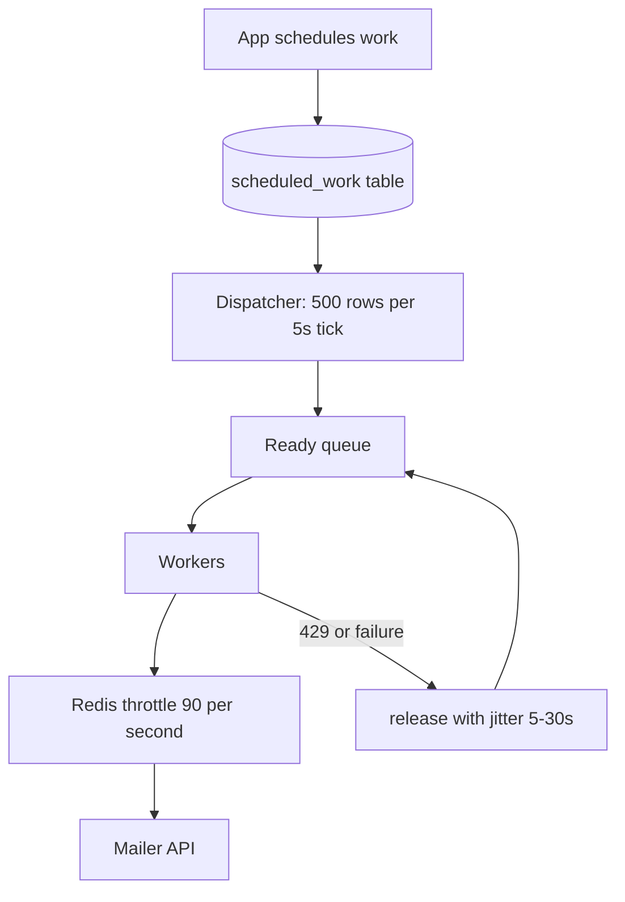

> **Scenario** - একটা subscription platform `dispatch()->delay(now()->addDays(3))` দিয়ে renewal reminder schedule করে। প্রতিটি reminder signup-এর সময় তৈরি হয়, আর signup অফিস সময়ে জড়ো হয়। সোমবার ০৯:০০ UTC-তে ২,৪০,০০০ delayed job একই মিনিটে due হয়ে যায়। Redis `zrangebyscore` সব ফেরত দেয়, worker সব তুলে নেয়, mailer API ১০০/s-এ rate-limit করে, আর retry storm queue backlog পাঁচ ঘণ্টায় নিয়ে যায়।

## Why it matters

- Delayed কাজ জমাট বাঁধে। "N দিন পরে" schedule করা যেকোনো কিছু N দিন আগের arrival distribution উত্তরাধিকার পায়, আর মানুষের traffic spiky।
- ৪০টা service জুড়ে `0 * * * *` cron ঘণ্টার মাথায় প্রতিটি shared dependency-র ওপর synchronised thundering herd বানায়।
- Delay implementation-এর guarantee আলাদা: Redis sorted set, RabbitMQ TTL+DLX, Kafka (native delay নেই), আর SQS (সর্বোচ্চ ১৫ মিনিট) - সবাই ভিন্নভাবে ভাঙে।
- দীর্ঘ delay deploy-এর সঙ্গে খারাপভাবে মেশে: ৩০ দিন পরের job এমন code দিয়ে deserialise হতে হবে যা এখনো লেখা হয়নি।
- Timezone ও DST handling বছরে দুবার নীরবে job দুবার চালায় বা বাদ দেয়।

## Symptoms

| Signal | What you observe |
|---|---|
| Enqueue rate | ঠিক ঘণ্টার মাথায় বা ০৯:০০-তে sawtooth spike |
| Third-party API | এক মিনিটের window-এ জড়ো হওয়া 429 |
| Redis | delayed set-এ `ZCARD` লক্ষ লক্ষ, range scan-এ latency spike |
| Job failures | deploy-এর পর `Unserialize error: Class App\\Jobs\\OldJob not found` |
| Duplicate runs | DST fall-back তারিখে daily job দুবার চলে |
| Scheduler logs | আগের run শেষ না হওয়ায় একই cron-এর overlapping run |

## How it breaks

Delayed job broker সঠিক মুহূর্তে deliver করে না; ওগুলো কোথাও *ধরে রাখা* হয় এবং timestamp পার হলে দলবদ্ধভাবে ছাড়া হয়। Laravel-এর Redis driver ready-time দিয়ে scored sorted set-এ রাখে এবং প্রতিটি poll-এ due job ready list-এ migrate করে। ২,৪০,০০০ entry একই score ভাগ করলে এক migration সব একসাথে সরায় আর ready queue ২০০ থেকে ২,৪০,২০০ হয়ে যায়। Worker ঠিক যা বলা হয়েছে তাই করে: যত দ্রুত সম্ভব টানে আর downstream-এ হাতুড়ি চালায়।



## Root causes

1. jitter ছাড়া নির্দিষ্ট timestamp-এ scheduling, তাই হাজার হাজার job একই ready-time ভাগ করে।
2. `:00`-এ সারিবদ্ধ cron expression, যা অসম্পর্কিত service-দের shared dependency-র বিরুদ্ধে synchronise করে।
3. worker pool আর rate-limited third party-র মাঝে কোনো rate limit নেই।
4. দীর্ঘজীবী job-এ পুরো model object বা closure serialise করা, যা তাদের জন্মদাতা code-এর চেয়ে বেশি বাঁচে।
5. mutex না থাকায় scheduler overlap - ধীর run পরের tick-এর সঙ্গে ধাক্কা খায়।
6. schedule time local time-এ রাখা, তাই DST shift execution সরিয়ে দেয় বা duplicate করে।

## How to solve it

### 1. Add jitter at schedule time

সবচেয়ে সস্তা সমাধান, সাধারণত যথেষ্টও। volume-এর সমানুপাতিক window-এ release ছড়িয়ে দিন।

```php
$window = 900; // seconds
SendRenewalReminder::dispatch($subscription)
    ->delay(now()->addDays(3)->addSeconds(random_int(0, $window)));
```

৯০০ সেকেন্ডে ২,৪০,০০০ job মানে ২,৪০,০০০/s নয়, ২৬৭/s।

### 2. Rate-limit at the boundary you do not control

Laravel-এর `Redis::throttle` সব worker জুড়ে distributed limiter দেয়।

```php
public function handle(): void
{
    Redis::throttle('mailer-api')
        ->allow(90)->every(1)
        ->block(5)
        ->then(
            fn () => app(Mailer::class)->send($this->reminder),
            fn () => $this->release(random_int(5, 30)),
        );
}
```

jitter সহ `release()` job-টা fail না করে randomised delay দিয়ে ফিরিয়ে দেয়।

### 3. Choose a delay mechanism that matches the horizon

১৫ মিনিটের কম delay-এ broker-native ব্যবস্থা ঠিক আছে। তার বেশি হলে durable source of truth broker নয়, একটা database table হওয়া উচিত।

```sql
CREATE TABLE scheduled_work (
  id           BIGSERIAL PRIMARY KEY,
  kind         TEXT        NOT NULL,
  args         JSONB       NOT NULL,
  run_after    TIMESTAMPTZ NOT NULL,
  claimed_at   TIMESTAMPTZ,
  attempts     INT         NOT NULL DEFAULT 0,
  UNIQUE (kind, (args->>'dedup_key'))
);

CREATE INDEX scheduled_work_due_idx
  ON scheduled_work (run_after) WHERE claimed_at IS NULL;
```

একটা dispatcher প্রতি ৫ সেকেন্ডে poll করে tick-প্রতি সর্বোচ্চ N-টা due row enqueue করে, যা release rate কাঠামোগতভাবে cap করে।

```ts
const due = await db.query(`
  UPDATE scheduled_work SET claimed_at = now()
  WHERE id IN (
    SELECT id FROM scheduled_work
    WHERE claimed_at IS NULL AND run_after <= now()
    ORDER BY run_after
    LIMIT 500
    FOR UPDATE SKIP LOCKED
  )
  RETURNING id, kind, args
`)
```

### 4. Keep job payloads small and version-tolerant

ID ও একটা version serialise করুন, কখনো পুরো model বা closure নয়। handler class-এর নাম অন্তত সর্বোচ্চ delay-এর সমান সময় স্থির রাখুন, আর job class মোছার আগে একটা deprecation shim দিন।

### 5. Make schedules DST-safe

Schedule anchor UTC-তে রাখুন। কোনো job local সময় ০৯:০০-এ চলতে হলে timezone name রাখুন এবং প্রতিটি occurrence-এ UTC instant পুনর্গণনা করুন, তারপর `(kind, local_date)`-এ dedup করুন যাতে fall-back ঘণ্টা দুটো run বানাতে না পারে।

### 6. Prevent scheduler overlap

```php
$schedule->command('reports:daily')
    ->dailyAt('02:00')
    ->withoutOverlapping(120)
    ->onOneServer();
```

একাধিক scheduler host চালানোর মুহূর্ত থেকেই `onOneServer` জরুরি।

## Target design



## Tradeoffs

| Option | Pros | Cons | Choose when |
|---|---|---|---|
| Broker-native delay (SQS, RabbitMQ TTL) | বাড়তি infrastructure নেই | ছোট horizon, অস্বচ্ছ state | ১৫ মিনিটের কম delay |
| Redis sorted set (Horizon) | দ্রুত, queue-এর সঙ্গে যুক্ত | bulk release spike, memory-নির্ভর | মাঝারি volume, jitter প্রয়োগ করা আছে |
| Database scheduled table | query ও cancel করা যায়, rate-capped | polling load, বাড়তি component | দীর্ঘ horizon, business-দৃশ্যমান schedule |
| Cron per tenant | সরল mental model | ঘণ্টার মাথায় thundering herd | খুব অল্প tenant |
| Temporal বা workflow engine | durable timer, built-in retry | পুরো নতুন system চালাতে হয় | জটিল multi-step দীর্ঘ flow |

## Verification checklist

- [ ] staging-এ একই মুহূর্তের জন্য ১,০০,০০০ job schedule করে দেখুন পর্যবেক্ষিত enqueue rate jitter window-এর সঙ্গে মেলে।
- [ ] throttle সত্যিই block করছে কিনা দেখুন: spike-এর সময় third-party 429 count শূন্যে থাকা উচিত।
- [ ] দীর্ঘ-delayed job pending থাকা অবস্থায় code deploy করে দেখুন ওগুলো এখনো deserialise হয়।
- [ ] test clock-এ DST transition চালিয়ে নিশ্চিত করুন প্রতিটি daily job ঠিক একবার চলে।
- [ ] `EXPLAIN` দিয়ে দেখুন dispatcher query `scheduled_work_due_idx` ব্যবহার করছে।
- [ ] tick-এর মাঝপথে dispatcher kill করে দেখুন claimed অথচ enqueue-না-হওয়া row lease শেষে ফিরে আসে।

## Anti-patterns

- delay বানাতে worker-এর ভিতরে `sleep()` করা, যা একটা worker slot জিম্মি করে রাখে।
- "পরিপাটি দেখায়" বলে প্রতিটি reminder ঠিক মধ্যরাতে schedule করা।
- সপ্তাহ-মাপের horizon-এ `delay()` ব্যবহার করা, ফলে broker একটা query-interface-হীন database হয়ে যায়।
- ৩০ দিনের job-এ `SerializesModels` দিয়ে Eloquent model serialise করে schema না বদলানোর আশা করা।
- `onOneServer` ছাড়া প্রতিটি app pod-এ scheduler চালানো।
- rate limit-কে `tries = 25` ও backoff ছাড়া সামলানো, যা একটা 429-কে ২৫টা বানায়।

## Related

- [Consumer lag, autoscaling, and drain time](/systems/messaging-async/consumer-lag-and-scaling)
- [Building idempotent consumers](/systems/messaging-async/idempotent-consumers)
- [At-least-once delivery meets real side effects](/systems/messaging-async/at-least-once-side-effects)
