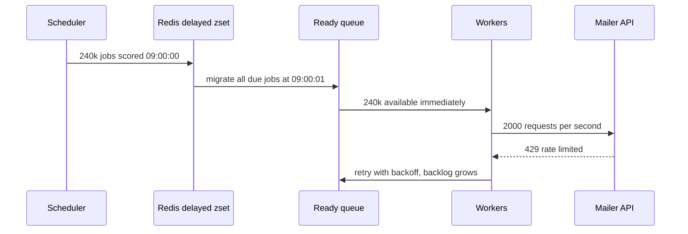
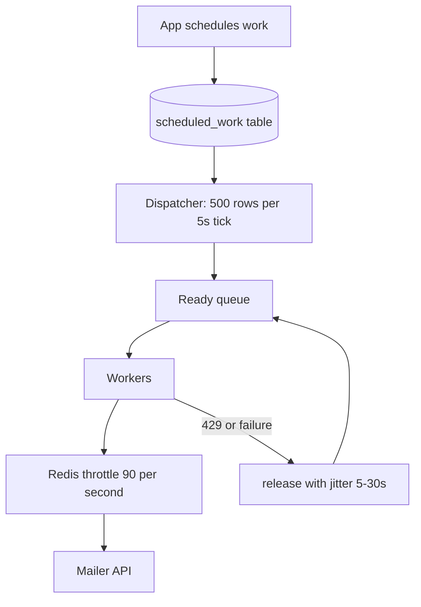

> **Scenario** - A subscription platform schedules renewal reminders with `dispatch()->delay(now()->addDays(3))`. Every reminder is created at signup time, and signups cluster during business hours. At 09:00 UTC on a Monday, 240,000 delayed jobs become due within the same minute. Redis `zrangebyscore` returns them all, workers grab everything, the mailer API rate-limits at 100/s, and the retry storm pushes the queue backlog to five hours.

## Why it matters

- Delayed work concentrates. Anything scheduled "in N days" inherits the arrival distribution of N days ago, and human traffic is spiky.
- A cron that fires `0 * * * *` across 40 services creates a synchronised thundering herd against every shared dependency on the hour.
- Delay implementations differ in guarantees: Redis sorted sets, RabbitMQ TTL+DLX, Kafka (which has no native delay), and SQS (15-minute maximum) all fail differently.
- Long delays interact badly with deploys: a job scheduled for 30 days from now must be deserialisable by code that does not exist yet.
- Timezone and DST handling silently double-runs or skips jobs twice a year.

## Symptoms

| Signal | What you observe |
|---|---|
| Enqueue rate | Sawtooth spikes exactly on the hour or at 09:00 |
| Third-party API | 429 responses clustered in one-minute windows |
| Redis | `ZCARD` on the delayed set in the millions, latency spikes during range scans |
| Job failures | `Unserialize error: Class App\\Jobs\\OldJob not found` after a deploy |
| Duplicate runs | Two executions of a daily job on the DST fall-back date |
| Scheduler logs | Overlapping runs of the same cron because the previous run has not finished |

## How it breaks

Delayed jobs are not delivered by the broker at the right moment; they are *held* somewhere and released in bulk when their timestamp passes. Laravel's Redis driver keeps them in a sorted set keyed by ready-time and migrates due jobs into the ready list on each poll. When 240,000 entries share a score, one migration moves them all at once and the ready queue jumps from 200 to 240,200. Workers do exactly what they are told: pull as fast as possible and hammer the downstream.



## Root causes

1. Scheduling on an exact timestamp with no jitter, so thousands of jobs share one ready-time.
2. Cron expressions aligned to `:00`, synchronising unrelated services against shared dependencies.
3. No rate limit between the worker pool and a rate-limited third party.
4. Serialising full model objects or closures into long-lived jobs that outlive the code that created them.
5. Scheduler overlap because no mutex prevents a slow run from colliding with the next tick.
6. Storing schedule times in local time, so DST shifts move or duplicate executions.

## How to solve it

### 1. Add jitter at schedule time

The cheapest fix, and usually sufficient. Spread the release across a window proportional to the volume.

```php
$window = 900; // seconds
SendRenewalReminder::dispatch($subscription)
    ->delay(now()->addDays(3)->addSeconds(random_int(0, $window)));
```

240,000 jobs over a 900-second window is 267/s instead of 240,000/s.

### 2. Rate-limit at the boundary you do not control

Laravel's `Redis::throttle` gives a distributed limiter across all workers.

```php
public function handle(): void
{
    Redis::throttle('mailer-api')
        ->allow(90)->every(1)
        ->block(5)
        ->then(
            fn () => app(Mailer::class)->send($this->reminder),
            fn () => $this->release(random_int(5, 30)),
        );
}
```

`release()` with jitter puts the job back with a randomised delay instead of failing it.

### 3. Choose a delay mechanism that matches the horizon

For delays under 15 minutes, broker-native mechanisms are fine. For anything longer, the durable source of truth should be a database table, not the broker.

```sql
CREATE TABLE scheduled_work (
  id           BIGSERIAL PRIMARY KEY,
  kind         TEXT        NOT NULL,
  args         JSONB       NOT NULL,
  run_after    TIMESTAMPTZ NOT NULL,
  claimed_at   TIMESTAMPTZ,
  attempts     INT         NOT NULL DEFAULT 0,
  UNIQUE (kind, (args->>'dedup_key'))
);

CREATE INDEX scheduled_work_due_idx
  ON scheduled_work (run_after) WHERE claimed_at IS NULL;
```

A dispatcher polls every 5 seconds and enqueues at most N due rows per tick, which caps the release rate structurally.

```ts
const due = await db.query(`
  UPDATE scheduled_work SET claimed_at = now()
  WHERE id IN (
    SELECT id FROM scheduled_work
    WHERE claimed_at IS NULL AND run_after <= now()
    ORDER BY run_after
    LIMIT 500
    FOR UPDATE SKIP LOCKED
  )
  RETURNING id, kind, args
`)
```

### 4. Keep job payloads small and version-tolerant

Serialise IDs and a version, never entire models or closures. Keep the handler class name stable for at least as long as the maximum delay, and add a deprecation shim before deleting a job class.

### 5. Make schedules DST-safe

Store schedule anchors in UTC. If a job must run at 09:00 local time, store the timezone name and recompute the UTC instant per occurrence, then dedup on `(kind, local_date)` so a fall-back hour cannot produce two runs.

### 6. Prevent scheduler overlap

```php
$schedule->command('reports:daily')
    ->dailyAt('02:00')
    ->withoutOverlapping(120)
    ->onOneServer();
```

`onOneServer` matters the moment you run more than one scheduler host.

## Target design



## Tradeoffs

| Option | Pros | Cons | Choose when |
|---|---|---|---|
| Broker-native delay (SQS, RabbitMQ TTL) | No extra infrastructure | Short horizons, opaque state | Delays under 15 minutes |
| Redis sorted set (Horizon) | Fast, integrated with the queue | Bulk release spikes, memory-bound | Medium volume, jitter applied |
| Database scheduled table | Queryable, cancellable, rate-capped | Polling load, extra component | Long horizons, business-visible schedules |
| Cron per tenant | Simple mental model | Thundering herd on the hour | Very few tenants |
| Temporal or workflow engine | Durable timers, retries built in | Whole new system to operate | Complex multi-step long-running flows |

## Verification checklist

- [ ] Schedule 100,000 jobs for the same instant in staging and confirm the observed enqueue rate matches the jitter window.
- [ ] Verify the throttle actually blocks: watch third-party 429 count stay at zero during the spike.
- [ ] Deploy a code change while long-delayed jobs are pending and confirm they still deserialise.
- [ ] Run the DST transition in a test clock and assert each daily job executes exactly once.
- [ ] Confirm `scheduled_work_due_idx` is used by the dispatcher query via `EXPLAIN`.
- [ ] Kill the dispatcher mid-tick and confirm claimed-but-unenqueued rows are reclaimed after the lease expires.

## Anti-patterns

- `sleep()` inside a worker to implement a delay, which holds a worker slot hostage.
- Scheduling every reminder at exactly midnight because it "looks tidy".
- Using `delay()` for horizons measured in weeks, so the broker becomes a database with no query interface.
- Serialising Eloquent models with `SerializesModels` into 30-day jobs and hoping the schema does not change.
- Running the scheduler on every app pod without `onOneServer`.
- Handling rate limits with `tries = 25` and no backoff, converting one 429 into 25.

## Related

- [Consumer lag, autoscaling, and drain time](/systems/messaging-async/consumer-lag-and-scaling)
- [Building idempotent consumers](/systems/messaging-async/idempotent-consumers)
- [At-least-once delivery meets real side effects](/systems/messaging-async/at-least-once-side-effects)
