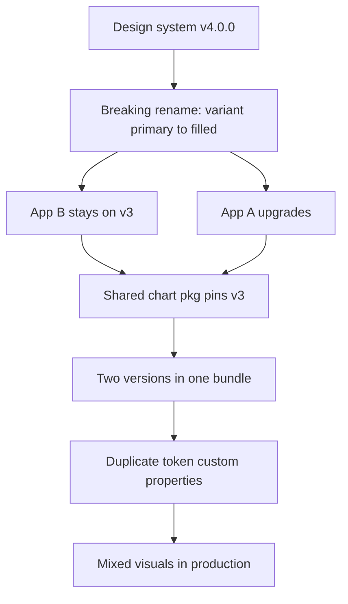
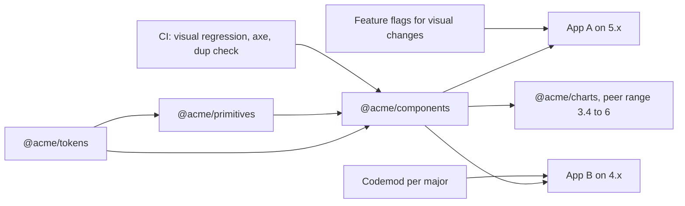

> **Scenario** — Design system `v4.0.0` ship করে `<AppButton variant="primary">`-কে `variant="filled"` নাম দেয়। বারোটা product app এটা ব্যবহার করে। চারটা সেই সপ্তাহেই upgrade করে, ছয়টা `v3`-তে থাকে, আর দুটোর bundle-এ দুই version-ই ঢোকে কারণ একটা shared chart package `v3`-এর উপর নির্ভর করে। এক মাস ধরে button-এর রং না মেলার ticket আসে।

## Why it matters

- Shared component library একটা public API। প্রতিটি breaking change consumer app-এর সংখ্যা দিয়ে গুণ হয়, আর খরচ পড়ে যারা পরিবর্তন চায়নি তাদের ঘাড়ে।
- এক bundle-এ দুই version মানে token CSS-এর দুই copy। ভিন্ন মানে দুবার ঘোষিত custom property এমন mixed page বানায় যার মালিক কোনো একক টিম নয়।
- জোর করা lockstep upgrade product কাজ আটকে দেয়। টিম component locally vendor করা শুরু করে, দুই quarter-এ design system কেবল সাজসজ্জা হয়ে যায়।
- Accessibility ও security fix-এর দ্রুত পথ দরকার। Upgrade ব্যয়বহুল হলে fix tagged release-এ পড়ে থাকে।

## Symptoms

| Signal | What you observe |
| --- | --- |
| Mixed visual | এক page-এ দুই button style, নিজ নিজ version অনুযায়ী দুটোই "ঠিক" |
| Duplicate token | computed style-এ `--color-primary` ভিন্ন মানে দুবার |
| দীর্ঘ branch | কয়েকটা repo-তে `upgrade/ds-v4` branch ছয় সপ্তাহ খোলা |
| Vendored copy | product repo-তে `src/components/vendor/AppButton.vue` |
| Patch release ভাঙে | `4.1.2` bump-এ spacing token সরায়, layout বদলায় |
| Adoption stall | এক বছর পর অর্ধেক estate দুই major পিছনে |

## How it breaks

Semver হলো *public surface* নিয়ে প্রতিশ্রুতি, অথচ অধিকাংশ design system সেই surface সংজ্ঞায়িতই করে না। বাস্তবে CSS class name, test যে DOM structure-এর উপর নির্ভর করে, slot name, default prop value, token value — সবই contract-এর অংশ। ফলে internal wrapper `div` rename করা "patch" সব জায়গায় snapshot test ভাঙে, আর সত্যিকারের breaking rename minor হিসেবে যায় কারণ টিম শুধু prop signature গোনে।



## Root causes

1. Public surface লিখিতভাবে সংজ্ঞায়িত নয়, তাই semver সিদ্ধান্ত অনুমান।
2. Token ও component একসাথে version হয়, ফলে রঙের ছোট পরিবর্তনেও component major লাগে।
3. Deprecation window নেই — নতুন prop আসার release-এই পুরোনোটা মুছে যায়।
4. Consumer exact version pin করে, তাই patched security fix কখনও পৌঁছায় না।
5. Peer dependency range খুব সরু, ফলে duplicate install নিশ্চিত।
6. Visual regression suite নেই, তাই অনিচ্ছাকৃত পরিবর্তন patch হিসেবে যায়।

## How to solve it

### 1. Contract লিখে ফেলুন

স্পষ্টভাবে ঘোষণা করুন: props, events, slots, exported type, documented CSS custom property ও public part selector — এগুলোই contract। Internal DOM structure, class name ও file path নয়। README-তে প্রকাশ করুন এবং review-তে enforce করুন।

### 2. Package ভাগ করুন

```
@acme/tokens      # colours, spacing, type scale — changes rarely
@acme/primitives  # unstyled behaviour: menu, dialog, combobox
@acme/components  # styled Vue components built on both
```

Palette বদলাতে token `2.0.0`-তে যেতে পারে, component major লাগে না।

### 3. মোছার আগে deprecate করুন

```ts
// AppButton.vue
const props = withDefaults(defineProps<{
  variant?: 'filled' | 'outline' | 'ghost'
  /** @deprecated since 4.1 — use `variant="filled"`. Removed in 6.0. */
  primary?: boolean
}>(), { variant: 'outline' })

const resolvedVariant = computed(() => {
  if (props.primary) {
    if (import.meta.env.DEV) {
      console.warn('[AppButton] `primary` is deprecated; use variant="filled". Removed in 6.0.')
    }
    return 'filled' as const
  }
  return props.variant
})
```

সাধারণ নিয়ম: `N.x`-এ deprecate, অন্তত দুই major কাজ করতে দিন, `N+2`-তে মুছুন।

### 4. প্রতিটি breaking change-এর সাথে codemod দিন

```bash
npx @acme/ds-codemod v3-to-v4 "src/**/*.vue"
```

দশ মিনিটের migration হয়ে যায়। দুই দিনেরটা হয় না।

### 5. এক copy রাখতে দেয় এমন peer range দিন

```json
{
  "name": "@acme/charts",
  "peerDependencies": { "@acme/components": ">=3.4.0 <6.0.0" },
  "devDependencies": { "@acme/components": "5.2.0" }
}
```

তারপর CI-তে duplicate আটকান:

```bash
test "$(pnpm ls @acme/components --depth 10 --json | jq '[.. | .version? // empty] | unique | length')" -eq 1
```

### 6. Visual পরিবর্তন version নয়, flag-এর পিছনে রাখুন

```ts
app.use(designSystem, { features: { newDensity: flags.isOn('ds.new-density') } })
```

Upgrade no-op হিসেবে নামে; টিম প্রস্তুত হলে সেই app-এ visual পরিবর্তন flip হয়।

### 7. Safety net automate করুন

CI-তে প্রতিটি component story-তে visual regression (Playwright screenshot) ও axe pass চালান। Pixel বদলানো patch release publish হওয়ার আগেই fail করা উচিত।

## Target design



## Tradeoffs

| Option | Pros | Cons | Choose when |
| --- | --- | --- | --- |
| একক versioned package | সহজ release process | প্রতিটি পরিবর্তনই component major | ছোট estate, এক-দুইটা app |
| Token ও component আলাদা | স্বাধীন cadence, কম major | বেশি package publish ও document | অনেক app, ঘন brand পরিবর্তন |
| Lockstep monorepo | সবসময় consistent, atomic refactor | upgrade-এ product টিম আটকায় | এক org, এক release train |
| Web component distribution | Framework-agnostic consumer | styling ও prop typing friction | React ও Vue মেশানো estate |

## Verification checklist

- [ ] `pnpm ls @acme/components --depth 10` প্রতি app-এ ঠিক একটা version resolve করে।
- [ ] Deprecated prop dev warning দেয় এবং removal version উল্লেখ করে।
- [ ] Codemod আসল product repo-তে clean চলে এবং app build হয়।
- [ ] Release candidate-এ visual regression suite pass করে; diff auto-approve নয়, review করা হয়।
- [ ] Computed style-এ `--color-primary` `:root`-এ একবারই ঘোষিত।
- [ ] `5.2.1` হিসেবে প্রকাশিত security patch এক dependency-bot cycle-এ সব app-এ পৌঁছায়।
- [ ] README-তে লেখা আছে semver কী কভার করে আর কী করে না।

## Anti-patterns

- Prop না বদলানোয় DOM restructure-কে patch বলা।
- যে release-এ replacement আসে সেই release-এই পুরোনো prop মুছে ফেলা।
- এক টিমকে "unblock" করতে feature branch থেকে `latest` publish করা।
- Product app-কে `@acme/components/src/...` import করে internal ছোঁয়ার সুযোগ দেওয়া।
- Design token-কে versioned API নয়, নিছক CSS বিষয় ভাবা।

## Related

- [Micro-frontend integration strategies](/systems/frontend-architecture/micro-frontend-integration-strategies)
- [Accessibility in shared component systems](/systems/frontend-architecture/accessibility-in-component-systems)
- [Micro-packaging decoupled frontend modules](/systems/frontend-architecture/micro-packaging-modules)
