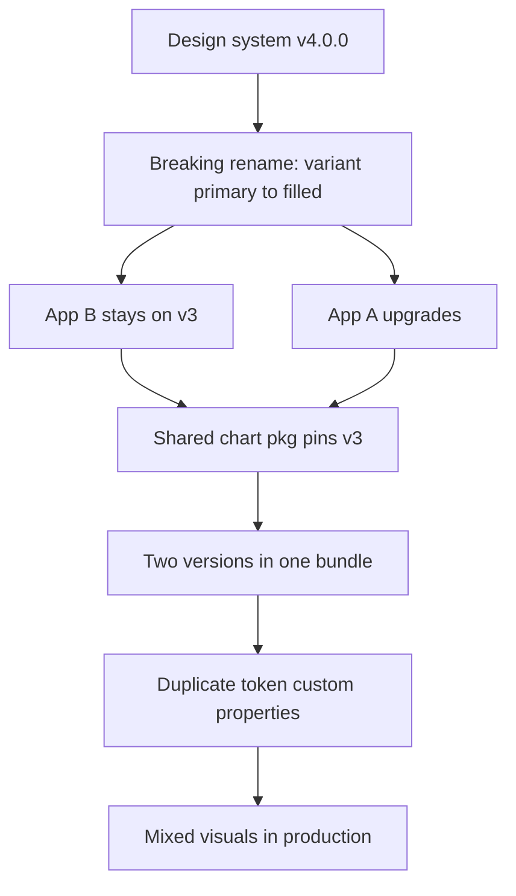
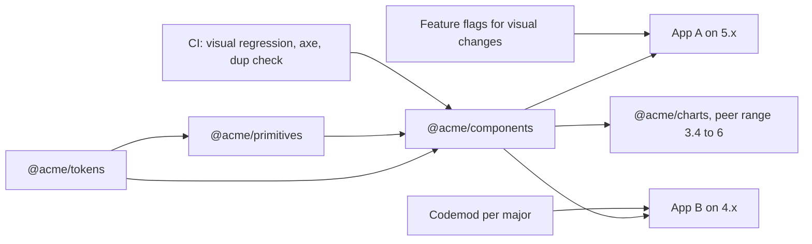

> **Scenario** — The design system ships `v4.0.0` renaming `<AppButton variant="primary">` to `variant="filled"`. Twelve product apps consume it. Four upgrade the same week, six stay on `v3`, and two end up with both versions in one bundle because a shared chart package depends on `v3`. Support tickets about mismatched button colours arrive for a month.

## Why it matters

- A shared component library is a public API. Every breaking change multiplies by the number of consuming apps, and the cost lands on teams who did not ask for the change.
- Two versions in one bundle means two copies of the token CSS. Custom properties defined twice with different values produce visually mixed pages that no single team owns.
- Forced lockstep upgrades stall product work. Teams start vendoring components locally, and within two quarters the design system is decorative.
- Accessibility and security fixes need a fast path to production. If upgrading is expensive, the fixes sit unadopted in a tagged release.

## Symptoms

| Signal | What you observe |
| --- | --- |
| Mixed visuals | Two button styles on one page, both "correct" per their version |
| Duplicate tokens | `--color-primary` declared twice in computed styles with different values |
| Long-lived branches | `upgrade/ds-v4` branches open for six weeks across several repos |
| Vendored copies | `src/components/vendor/AppButton.vue` appears in product repos |
| Patch releases break | A `4.1.2` bump changes layout because spacing tokens shifted |
| Adoption stall | Half the estate is two majors behind after a year |

## How it breaks

Semver is a promise about the *public surface*, and most design systems never define what that surface is. A CSS class name, a DOM structure a test relies on, a slot name, a default prop value, and a token value are all part of the contract in practice. So a "patch" that renames an internal wrapper `div` breaks snapshot tests everywhere, while a genuine breaking rename ships as a minor because the team only counts prop signatures.



## Root causes

1. No written definition of the public surface, so semver decisions are guesses.
2. Tokens and components version together, forcing a component major for a colour tweak.
3. No deprecation window — the old prop is deleted in the same release the new one appears.
4. Consumers pin exact versions, so patched security fixes never flow.
5. Peer dependency ranges are too narrow, guaranteeing duplicate installs.
6. No visual regression suite, so unintended changes ship as patches.

## How to solve it

### 1. Write the contract down

Declare explicitly: props, events, slots, exported types, documented CSS custom properties, and public part selectors are the contract. Internal DOM structure, class names, and file paths are not. Publish it in the README and enforce it in review.

### 2. Split the packages

```
@acme/tokens      # colours, spacing, type scale — changes rarely
@acme/primitives  # unstyled behaviour: menu, dialog, combobox
@acme/components  # styled Vue components built on both
```

Tokens can go to `2.0.0` for a palette change without forcing a component major.

### 3. Deprecate before you delete

```ts
// AppButton.vue
const props = withDefaults(defineProps<{
  variant?: 'filled' | 'outline' | 'ghost'
  /** @deprecated since 4.1 — use `variant="filled"`. Removed in 6.0. */
  primary?: boolean
}>(), { variant: 'outline' })

const resolvedVariant = computed(() => {
  if (props.primary) {
    if (import.meta.env.DEV) {
      console.warn('[AppButton] `primary` is deprecated; use variant="filled". Removed in 6.0.')
    }
    return 'filled' as const
  }
  return props.variant
})
```

Rule of thumb: deprecate in `N.x`, keep it working for at least two majors, remove in `N+2`.

### 4. Ship a codemod with every breaking change

```bash
npx @acme/ds-codemod v3-to-v4 "src/**/*.vue"
```

A migration that takes ten minutes gets done. One that takes two days does not.

### 5. Use peer ranges that allow one copy

```json
{
  "name": "@acme/charts",
  "peerDependencies": { "@acme/components": ">=3.4.0 <6.0.0" },
  "devDependencies": { "@acme/components": "5.2.0" }
}
```

Then guard against duplicates in CI:

```bash
test "$(pnpm ls @acme/components --depth 10 --json | jq '[.. | .version? // empty] | unique | length')" -eq 1
```

### 6. Gate visual change behind flags, not versions

```ts
app.use(designSystem, { features: { newDensity: flags.isOn('ds.new-density') } })
```

The upgrade lands as a no-op; the visual change flips per app when that team is ready.

### 7. Automate the safety net

Run visual regression (Playwright screenshots) and an axe pass on every component story in CI. A patch release that changes pixels should fail before it publishes.

## Target design



## Tradeoffs

| Option | Pros | Cons | Choose when |
| --- | --- | --- | --- |
| Single versioned package | Simple release process | Every change is a component major | Small estate, one or two apps |
| Split tokens and components | Independent cadence, fewer majors | More packages to publish and document | Many apps, frequent brand tweaks |
| Monorepo with lockstep | Always consistent, atomic refactors | Blocks product teams on upgrades | One org, one release train |
| Web components distribution | Framework-agnostic consumers | Styling and prop typing friction | Mixed React and Vue estates |

## Verification checklist

- [ ] `pnpm ls @acme/components --depth 10` resolves exactly one version per app.
- [ ] Deprecated props log a dev warning naming the removal version.
- [ ] The codemod runs clean on a real product repo and the app still builds.
- [ ] Visual regression suite passes on the release candidate; diffs are reviewed, not auto-approved.
- [ ] Computed styles show `--color-primary` declared once on `:root`.
- [ ] A security patch published as `5.2.1` reaches all apps within one dependency-bot cycle.
- [ ] The README lists exactly what is and is not covered by semver.

## Anti-patterns

- Calling a DOM restructure a patch because no prop changed.
- Deleting a prop in the same release its replacement appears.
- Publishing `latest` from a feature branch to "unblock" one team.
- Letting product apps import from `@acme/components/src/...` to reach internals.
- Treating design tokens as CSS trivia rather than a versioned API.

## Related

- [Micro-frontend integration strategies](/systems/frontend-architecture/micro-frontend-integration-strategies)
- [Accessibility in shared component systems](/systems/frontend-architecture/accessibility-in-component-systems)
- [Micro-packaging decoupled frontend modules](/systems/frontend-architecture/micro-packaging-modules)
