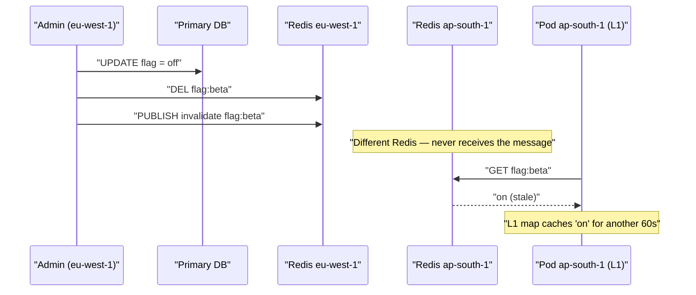
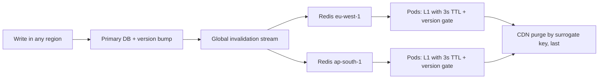

> **Scenario** — একজন tenant admin UI থেকে একটি feature flag বন্ধ করেন। write `eu-west-1`-এ পড়ে, সেখানে Redis key delete হয়, CDN object purge হয়। চল্লিশ মিনিট পরেও `ap-south-1`-এর pod-গুলো flag enabled হিসেবে serve করছে — 60 সেকেন্ডের in-process cache থেকে, যেখানে invalidation কখনো পৌঁছায়নি, কারণ pub/sub message global নয়, regional Redis-এ publish হয়েছিল।

## Why it matters

- প্রতিটি অতিরিক্ত cache layer সত্যের আরেকটি copy, নিজের আয়ুসহ। তিনটি layer মানে তিনটি স্বাধীন staleness window যা যোগ হয়, overlap করে না।
- Feature flag, permission ও pricing — এগুলোই দল সবচেয়ে আগ্রহে cache করে, আর এখানেই staleness correctness বা security সমস্যা।
- অনির্ভরযোগ্য channel-এ (fire-and-forget pub/sub) পাঠানো invalidation নীরবে অবনত হয়: দুই সেকেন্ড disconnected থাকা subscriber message চিরকালের জন্য হারায়।
- Cross-region invalidation data-র মতোই একই partition গণিতের অধীন। partition-এ হয় write আটকান, নয় stale read window মানুন — CAP cache-কে ছাড় দেয় না।
- Debugging নিষ্ঠুর, কারণ আচরণ নির্ভর করে কোন pod ও কোন region request serve করেছে তার উপর।

## Symptoms

| Signal | What you observe |
|--------|------------------|
| Inconsistent reads | page refresh-এ পুরনো ও নতুন value পালা করে আসে |
| Region correlation | শুধু এক region-এ routed user-রা stale value দেখে |
| Pod correlation | ভিন্ন pod-এ `kubectl exec` ভিন্ন cached value দেয় |
| Invalidation lag | purge সাথে সাথে acknowledged, প্রভাব কয়েক মিনিট পরে |
| Reconnect events | drift-এর ঠিক আগে Redis pub/sub subscriber reconnect log |
| Duration | drift ঠিক এক local TTL চলে, তারপর নিজেই ঠিক হয় |

## How it breaks

Redis pub/sub at-most-once এবং কোনো backlog নেই। subscriber disconnected থাকলে — rolling deploy, network blip, failover — ওই সময়ের message হারিয়ে যায়। pod ফিরে এসে resubscribe করে এবং local TTL শেষ না হওয়া পর্যন্ত আত্মবিশ্বাসের সাথে stale data দেয়।

Layering এটা বাড়ায়। browser `max-age` ধরে copy রাখে, CDN নিজের TTL ধরে, regional Redis invalidate না হওয়া পর্যন্ত, আর pod-এর in-process map নিজের ছোট TTL ধরে। কেবল মাঝের layer-এ পৌঁছানো purge বাইরের ও ভেতরের layer-কে পুরনো value দিতে ছেড়ে দেয়।



## Root causes

1. Invalidation regional channel-এ publish, অথচ reader অন্য কোথাও subscribe করে।
2. at-most-once ও replay-হীন হওয়া সত্ত্বেও pub/sub-কে নির্ভরযোগ্য transport ধরা।
3. In-process L1 cache-এ কোনো invalidation path নেই — TTL-ই একমাত্র সংশোধন ব্যবস্থা।
4. version বা generation counter নেই, তাই stale layer নিজের staleness বুঝতে পারে না।
5. Purge ordering অনির্ধারিত: origin cache-এর আগে CDN purge হলে CDN সাথে সাথে stale content দিয়ে ভরে যায়।
6. Invalidation propagation time end-to-end মাপা হয় না।

## How to solve it

### 1. Purge from innermost to outermost

ক্রম গুরুত্বপূর্ণ। আগে CDN purge করলে সে এমন origin থেকে refetch করে যার কাছে এখনো পুরনো value, এবং তা আবার cache করে। data যেদিকে বাইরে বয়, invalidation সেদিকেই চালান।

```ts
export async function invalidateFlag(tenant: string, flag: string) {
  const key = `flag:${tenant}:${flag}`
  await redis.del(key)                                  // 1. shared cache
  await bus.publish('cache.invalidate', { key, at: Date.now() }) // 2. L1 caches
  await cdn.purgeSurrogateKey(`flag-${tenant}`)         // 3. edge, last
}
```

### 2. Replace fire-and-forget pub/sub with a replayable stream

Redis Stream প্রতিটি subscriber-কে cursor দেয়, তাই disconnected pod reconnect-এ পিছিয়ে থাকা message ধরে ফেলে, নীরবে হারায় না।

```bash
# Publisher
XADD cache:invalidations MAXLEN ~ 100000 '*' key flag:acme:beta version 1734500000123

# Subscriber (per pod, durable cursor)
XGROUP CREATE cache:invalidations pods '$' MKSTREAM
XREADGROUP GROUP pods pod-7 COUNT 100 BLOCK 2000 STREAMS cache:invalidations '>'
```

startup-এ ও প্রতিটি reconnect-এর পর `$` নয়, শেষ acknowledged ID থেকে পড়ুন; gap stream retention ছাড়ালে পুরো L1 flush করুন।

### 3. Version-gate every layer

প্রতিটি cacheable entity-কে monotonic version দিন। পুরনো version ধরে থাকা layer না বলা সত্ত্বেও জানে সে stale।

```ts
type Versioned<T> = { v: number; value: T }

const l1 = new Map<string, Versioned<unknown>>()

export function l1Get<T>(key: string, minVersion: number): T | undefined {
  const hit = l1.get(key) as Versioned<T> | undefined
  if (!hit || hit.v < minVersion) return undefined
  return hit.value
}
```

`minVersion` একটি ছোট, ঘন ঘন refresh হওয়া "generation" key-তে রাখুন যা pod প্রতি সেকেন্ডে poll করে। একটি সস্তা `GET` প্রতিটি entity-কে রক্ষা করে।

### 4. Keep L1 TTLs short and bounded

60 সেকেন্ড TTL-এর in-process cache মানে বাকি সব ব্যবস্থা কাজ করলেও সবচেয়ে খারাপ ক্ষেত্রে 60 সেকেন্ড drift নিশ্চিত। flag ও permission-এর জন্য 2–5 সেকেন্ডই সঠিক মাত্রা; L1-কে hit-ratio কৌশল নয়, stampede shield ভাবুন।

```php
// Laravel: two-tier read with a deliberately tiny L1.
public function flag(string $tenant, string $name): bool
{
    return Cache::store('array')->remember("flag:{$tenant}:{$name}", 3, function () use ($tenant, $name) {
        return Cache::store('redis')->remember("flag:{$tenant}:{$name}", 300, function () use ($tenant, $name) {
            return Flag::where(compact('tenant', 'name'))->value('enabled') ?? false;
        });
    });
}
```

### 5. Decide the consistency contract explicitly

লিখে ফেলুন: "flag পরিবর্তন বিশ্বজুড়ে 5 সেকেন্ডে কার্যকর, regional partition-এ সর্বোচ্চ 65 সেকেন্ড।" এই বাক্যটি একইসাথে design constraint ও SLO, আর product-কে বলে দেয় কী প্রতিশ্রুতি দেওয়া যাবে।

## Target design



## Tradeoffs

| Option | Pros | Cons | Choose when |
|--------|------|------|-------------|
| TTL-only convergence | invalidation infrastructure নেই; ভাঙার কিছু নেই | staleness = প্রতিটি layer-এর TTL-এর যোগফল | কম ঝুঁকির data, সেকেন্ড-মাত্রার tolerance |
| Pub/sub invalidation | প্রায় তাৎক্ষণিক, সস্তা | at-most-once; disconnected subscriber নীরবে হারায় | backstop হিসেবে ছোট TTL-এর সাথে মিলিয়ে |
| Replayable stream | disconnect টিকে যায়; auditable | বেশি অংশ, cursor management লাগে | flag, permission, pricing — correctness-critical সব |
| Version gating | layer নিজেই staleness ধরে; নিখুঁত delivery লাগে না | generation key cache না করলে request-প্রতি বাড়তি read | অনেক layer, অনির্ভরযোগ্য delivery |
| Single global cache | এক copy, সহজেই consistent | প্রতিটি read-এ cross-region latency; single failure domain | এক region-এ ছোট deployment |

## Verification checklist

- [ ] একটি flag বদলে প্রতিটি region-এ time-to-effect মাপুন; গল্প নয়, metric হিসেবে রাখুন।
- [ ] pod-এর Redis connection 30 সেকেন্ড kill করুন, invalidation publish করুন, ফিরিয়ে দিন — pod পিছিয়ে থাকা message ধরে কিনা দেখুন।
- [ ] `redis-cli XLEN cache:invalidations` ও consumer-প্রতি lag dashboard-এ আছে।
- [ ] Purge order integration test-এ assert করা — CDN purge সবার শেষে।
- [ ] প্রতিটি cache layer-এর TTL নথিভুক্ত এবং তাদের যোগফল ঘোষিত consistency contract-এর নিচে।
- [ ] একটি synthetic checker প্রতি মিনিটে প্রতিটি region থেকে একই key পড়ে এবং contract ছাড়ানো divergence-এ alert দেয়।
- [ ] simulated cross-region partition-এ আচরণ নথিভুক্ত degradation-এর সাথে মেলে।

## Anti-patterns

- Redis pub/sub-কে durable messaging ভাবা।
- invalidation ছাড়া in-process cache, যার TTL প্রতিশ্রুত propagation time-এর চেয়ে বড়।
- আগে CDN purge করা, যা এখনো-stale origin থেকে আবার ভরে যায়।
- global fan-out ছাড়া per-region invalidation channel।
- যেকোনো পরিবর্তনে "flush everything" broadcast করা, ছোট update-কে fleet-wide stampede বানানো।
- "purge API 200 দিয়েছে" দিয়ে invalidation সফলতা মাপা, পর্যবেক্ষিত read result দিয়ে নয়।

## Related

- [Cache-aside vs write-through vs write-behind](/systems/caching-cdn/cache-aside-vs-write-through)
- [Redis hot key sharding and client-side caching](/systems/caching-cdn/redis-hot-key-sharding)
- [Edge caching personalized content without leaking it](/systems/caching-cdn/edge-caching-personalized-content)
- [Cache invalidation strategies that survive deploys](/systems/caching-cdn/cache-invalidation-strategies)
