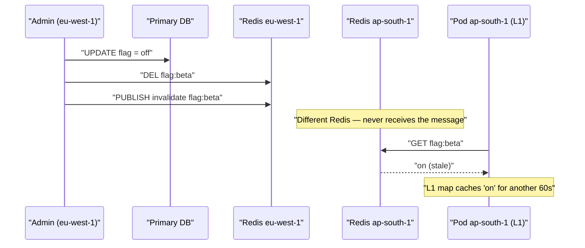
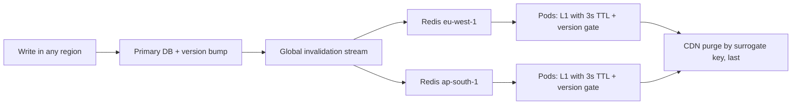

> **Scenario** — A tenant disables a feature flag in the admin UI. The write lands in `eu-west-1`, the Redis key is deleted there, and the CDN object is purged. Forty minutes later, pods in `ap-south-1` are still serving the flag as enabled from a 60-second in-process cache that never received the invalidation, because the pub/sub message was published to the regional Redis, not the global one.

## Why it matters

- Every additional cache layer is another copy of the truth with its own lifetime. Three layers means three independent staleness windows that compose, not overlap.
- Feature flags, permissions, and pricing are the things teams cache most eagerly and the things where staleness is a correctness or security problem.
- Invalidation delivered over an unreliable channel (fire-and-forget pub/sub) silently degrades: a subscriber that was disconnected for two seconds misses the message forever.
- Cross-region invalidation is subject to the same partition arithmetic as the data itself. During a partition you either block writes or accept a stale read window — CAP does not exempt caches.
- Debugging is brutal because behaviour depends on which pod and which region served the request.

## Symptoms

| Signal | What you observe |
|--------|------------------|
| Inconsistent reads | Refreshing the page alternates between old and new values |
| Region correlation | Only users routed to one region see the stale value |
| Pod correlation | `kubectl exec` into different pods returns different cached values |
| Invalidation lag | Purge acknowledged instantly, effect visible minutes later |
| Reconnect events | Redis pub/sub subscriber reconnects logged just before the drift |
| Duration | Drift lasts exactly one local TTL, then self-heals |

## How it breaks

Pub/sub in Redis is at-most-once and has no backlog. If a subscriber is disconnected — a rolling deploy, a network blip, a failover — messages published during that window are gone. The pod comes back, resubscribes, and confidently serves stale data until its local TTL expires.

Layering compounds it. The browser holds a copy for `max-age`, the CDN for its own TTL, the regional Redis until invalidated, and the pod's in-process map for its own short TTL. A purge that reaches only the middle layers leaves the outermost and innermost serving the old value.



## Root causes

1. Invalidation published to a regional channel while readers subscribe elsewhere.
2. Pub/sub used as a reliable transport despite being at-most-once with no replay.
3. In-process L1 caches with no invalidation path at all — TTL is their only correction mechanism.
4. No version or generation counter, so a stale layer cannot detect that it is stale.
5. Purge ordering not defined: the CDN is purged before the origin cache, so the CDN immediately refills with stale content.
6. No end-to-end measurement of invalidation propagation time.

## How to solve it

### 1. Purge from innermost to outermost

Order matters. If you purge the CDN first, it refetches from an origin that still holds the old value and re-caches it. Always invalidate in the direction data flows outward.

```ts
export async function invalidateFlag(tenant: string, flag: string) {
  const key = `flag:${tenant}:${flag}`
  await redis.del(key)                                  // 1. shared cache
  await bus.publish('cache.invalidate', { key, at: Date.now() }) // 2. L1 caches
  await cdn.purgeSurrogateKey(`flag-${tenant}`)         // 3. edge, last
}
```

### 2. Replace fire-and-forget pub/sub with a replayable stream

A Redis Stream gives each subscriber a cursor, so a pod that was disconnected catches up on reconnect instead of silently missing messages.

```bash
# Publisher
XADD cache:invalidations MAXLEN ~ 100000 '*' key flag:acme:beta version 1734500000123

# Subscriber (per pod, durable cursor)
XGROUP CREATE cache:invalidations pods '$' MKSTREAM
XREADGROUP GROUP pods pod-7 COUNT 100 BLOCK 2000 STREAMS cache:invalidations '>'
```

On startup, and after any reconnect, read from the last acknowledged ID rather than `$`, and flush the whole L1 if the gap exceeds the stream retention.

### 3. Version-gate every layer

Give each cacheable entity a monotonic version. Any layer holding an older version knows it is stale without being told.

```ts
type Versioned<T> = { v: number; value: T }

const l1 = new Map<string, Versioned<unknown>>()

export function l1Get<T>(key: string, minVersion: number): T | undefined {
  const hit = l1.get(key) as Versioned<T> | undefined
  if (!hit || hit.v < minVersion) return undefined
  return hit.value
}
```

Publish `minVersion` in a tiny, frequently-refreshed "generation" key that pods poll every second. One cheap `GET` protects every entity.

### 4. Keep L1 TTLs short and bounded

An in-process cache with a 60-second TTL guarantees a 60-second worst-case drift even if every other mechanism works. For flags and permissions, 2–5 seconds is the right order of magnitude; treat L1 as a stampede shield, not a hit-ratio strategy.

```php
// Laravel: two-tier read with a deliberately tiny L1.
public function flag(string $tenant, string $name): bool
{
    return Cache::store('array')->remember("flag:{$tenant}:{$name}", 3, function () use ($tenant, $name) {
        return Cache::store('redis')->remember("flag:{$tenant}:{$name}", 300, function () use ($tenant, $name) {
            return Flag::where(compact('tenant', 'name'))->value('enabled') ?? false;
        });
    });
}
```

### 5. Decide the consistency contract explicitly

Write it down: "flag changes take effect within 5 seconds globally, worst case 65 seconds during a regional partition." That sentence is a design constraint and an SLO, and it tells product what to promise.

## Target design



## Tradeoffs

| Option | Pros | Cons | Choose when |
|--------|------|------|-------------|
| TTL-only convergence | No invalidation infrastructure; cannot break | Staleness equals the sum of every layer's TTL | Low-stakes data with seconds-level tolerance |
| Pub/sub invalidation | Near-instant, cheap | At-most-once; disconnected subscribers miss silently | Combined with a short TTL as a backstop |
| Replayable stream | Survives disconnects; auditable | More moving parts, needs cursor management | Flags, permissions, pricing — anything correctness-critical |
| Version gating | Layers self-detect staleness; no perfect delivery needed | Extra read per request unless the generation key is cached | Many layers, unreliable delivery |
| Single global cache | One copy, trivially consistent | Cross-region latency on every read; single failure domain | Small deployments in one region |

## Verification checklist

- [ ] Flip a flag and measure time-to-effect in every region; record it as a metric, not an anecdote.
- [ ] Kill a pod's Redis connection for 30 seconds, publish an invalidation, restore it, and confirm the pod catches up.
- [ ] `redis-cli XLEN cache:invalidations` and per-consumer lag are on a dashboard.
- [ ] Purge order is asserted by an integration test — CDN purge must be last.
- [ ] Every cache layer's TTL is documented and their sum is under the stated consistency contract.
- [ ] A synthetic checker reads the same key from each region every minute and alerts on divergence beyond the contract.
- [ ] During a simulated cross-region partition, behaviour matches the documented degradation.

## Anti-patterns

- Treating Redis pub/sub as durable messaging.
- An in-process cache with no invalidation and a TTL longer than the promised propagation time.
- Purging the CDN first, which refills it from a still-stale origin.
- Per-region invalidation channels with no global fan-out.
- Broadcasting "flush everything" on any change, turning a small update into a fleet-wide stampede.
- Measuring invalidation success by "the purge API returned 200" rather than by observed read results.

## Related

- [Cache-aside vs write-through vs write-behind](/systems/caching-cdn/cache-aside-vs-write-through)
- [Redis hot key sharding and client-side caching](/systems/caching-cdn/redis-hot-key-sharding)
- [Edge caching personalized content without leaking it](/systems/caching-cdn/edge-caching-personalized-content)
- [Cache invalidation strategies that survive deploys](/systems/caching-cdn/cache-invalidation-strategies)
