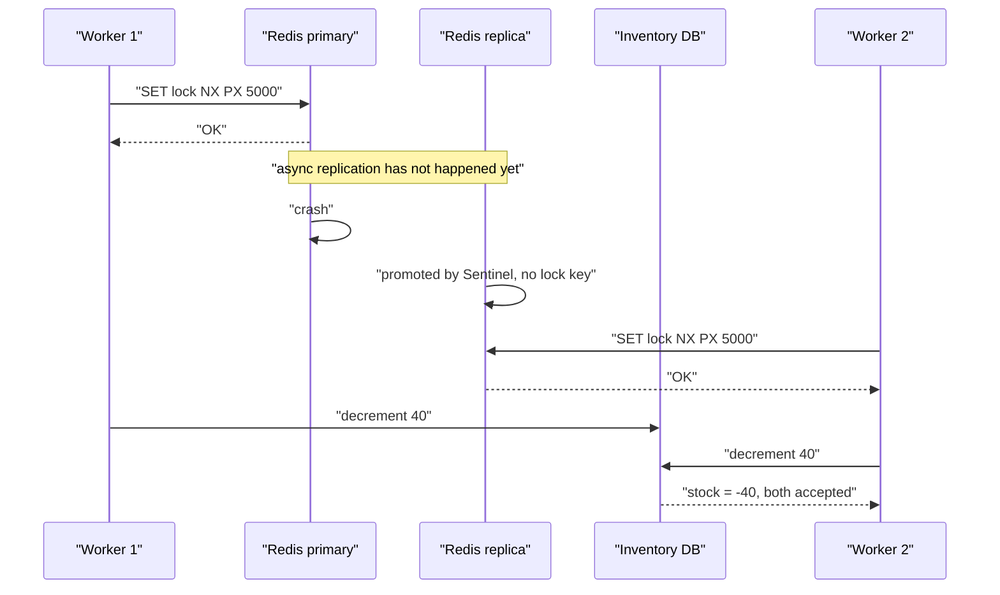
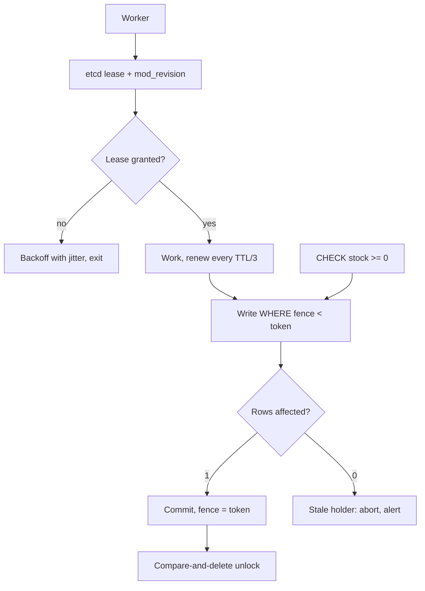

> **Scenario** — একটি inventory service stock কমানোর আগে `SET stock_lock:sku123 <uuid> NX PX 5000` ব্যবহার করে। Redis failover-এর সময় `SET` পৌঁছানোর আগেই replica promote হয়, দ্বিতীয় worker একই lock নেয়, আর ৪০ ইউনিটের SKU-র ৬০ ইউনিট বিক্রি হয়ে যায়।

## Why it matters

- Lock এমন invariant রক্ষা করে যার সাথে টাকা জড়িত: একবার stock decrement, একবার payment capture, একবার email পাঠানো, একবার file rename। দুই holder মানে overselling, double charge, বা নষ্ট output।
- বাস্তবের প্রতিটি distributed lock আসলে **lease** — তার TTL আছে। Lease শুধু তখনই mutual exclusion দেয় যখন holder expire-এর পর কাজ করতে পারে না, আর কোনো TTL tuning যেকোনো দীর্ঘ process pause বাঁধতে পারে না।
- Redis replication default-এ asynchronous। Primary-তে নেওয়া lock failover-এ হারানো Redis-এর bug নয়; এটা async replication-এর documented আচরণ, আর single-instance Redlock ধরনের lock সেটাই উত্তরাধিকার পায়।
- সমাধান — protected resource-এর যাচাই করা fencing token — এক column আর এক তুলনার খরচে correctness-এর জুয়াকে guarantee-তে বদলে দেয়।

## Symptoms

| Signal | What you observe |
|---|---|
| ঋণাত্মক বা oversold stock | `stock < 0` row, বা inventory-র বেশি fulfilment |
| Duplicate side effect | একই order id-তে দুই charge attempt; দুইটি একই email |
| Lock log | একই key-তে দুই host-এ overlapping timestamp সহ `acquired` |
| TTL vs work time | সামান্য অংশ run-এ job p99 duration lock TTL ছাড়ায় |
| GC / throttle pause | STW বা cgroup throttle stall TTL-এর সমান বা বেশি |
| Failover correlation | Redis বা ZooKeeper failover-এর ৩০s-এর মধ্যে incident জমে |
| Unlock error | `unlock of non-owned key` — প্রমাণ যে কাজের মাঝেই lock expire হয়েছে |

## How it breaks

তিনটি স্বাধীন failure, প্রত্যেকটি একাই যথেষ্ট।

**Async replication lock হারায়।** Redis primary `SET NX` নেয়, ack করে, আর replica-তে পাঠানোর আগেই মরে। Sentinel replica promote করে, যার কাছে key-র কোনো রেকর্ড নেই। দ্বিতীয় client সাথে সাথেই সেটা নেয়। দুই client-ই নিজেকে exclusive holder ভাবে, আর যা তারা দেখতে পায় তার ভিত্তিতে কেউ ভুলও নয়।

**Pause lease-কে ছাপিয়ে যায়।** Client A ৫s lease ধরে, ৭s GC pause খায় বা cgroup-এ CPU-throttled হয়, lease expire হয়, B নেয়, A ফিরে এসে লেখে। A-র জানার উপায় নেই সময় পেরিয়েছে — এ কারণেই write-এর আগে `isLocked()` দেখা কাজ করে না; check আর write lease-এর সাপেক্ষে atomic নয়।

**Unlock অন্যের lock মুছে দেয়।** ownership যাচাই না করে `DEL stock_lock:sku123` করলে B-র ধরা lock খুশিমনে ছেড়ে দেবে, আর সমস্যা C-তে গড়াবে।



## Root causes

1. Protected resource যাচাই করে না কে lock ধরে, তাই stale holder-এর write বৈধ write থেকে আলাদা করা যায় না।
2. Lock এমন system-এ রাখা যার replication asynchronous আর durability-র ack নেই।
3. TTL, p99 work duration + p99 process stall-এর চেয়ে ছোট।
4. Unlock compare-and-delete নয়, শর্তহীন `DEL`।
5. NTP step-এর অধীন host-এ `Date.now()` থেকে lease expiry হিসাব।
6. দীর্ঘ কাজ যা lease আর কখনো পুনরায় দেখে বা বাড়ায় না।
7. যেখানে idempotency যথেষ্ট আর অনেক সস্তা হতো, সেখানে lock ব্যবহার।

## How to solve it

### 1. Lock-এর আগে idempotency ভাবুন

"আমাদের distributed lock দরকার" বেশিরভাগ ক্ষেত্রে আসলে "এই operation দুইবার চললেও নিরাপদ হওয়া দরকার"। Unique constraint এমন একটি lock যা database বিনামূল্যে enforce করে।

```sql
-- Instead of locking around "send one email", claim the work atomically.
CREATE TABLE email_sends (
  dedup_key   text PRIMARY KEY,          -- e.g. 'welcome:user:4711'
  sent_at     timestamptz NOT NULL DEFAULT now(),
  provider_id text
);

-- Only one worker can win this insert. No lock service involved.
INSERT INTO email_sends (dedup_key) VALUES ('welcome:user:4711')
ON CONFLICT (dedup_key) DO NOTHING
RETURNING dedup_key;
-- Zero rows returned: someone else already owns this work. Exit quietly.
```

### 2. Lock দরকার হলে সেটা fenced lease বানান

Lock-এর সাথে monotonically increasing token নিন, আর resource ছোট token reject করুক। etcd revision দেয়; ZooKeeper `czxid` দেয়; Redis-এ আলাদা counter-এ `INCR` ব্যবহার করতে পারেন — শর্ত হলো counter-কে lock-এর মতোই durable হতে হবে।

```ts
type FencedLease = { key: string; owner: string; token: bigint; ttlMs: number }

export async function acquire(key: string, ttlMs: number): Promise<FencedLease | null> {
  const owner = crypto.randomUUID()
  const ok = await redis.set(`lock:${key}`, owner, 'PX', ttlMs, 'NX')
  if (ok !== 'OK') return null
  // Monotonic fence token. Must live in the same durable store as the lock.
  const token = BigInt(await redis.incr(`fence:${key}`))
  return { key, owner, token, ttlMs }
}

/** Compare-and-delete: never release a lock you no longer own. */
const UNLOCK = `
if redis.call('get', KEYS[1]) == ARGV[1] then
  return redis.call('del', KEYS[1])
else
  return 0
end`

export const release = (lease: FencedLease) =>
  redis.eval(UNLOCK, 1, `lock:${lease.key}`, lease.owner)
```

```sql
-- The resource is the enforcement point. A stale token can no longer write.
CREATE TABLE inventory (
  sku        text PRIMARY KEY,
  stock      int  NOT NULL CHECK (stock >= 0),
  fence      bigint NOT NULL DEFAULT 0
);

UPDATE inventory
   SET stock = stock - $1, fence = $2
 WHERE sku = $3 AND fence < $2;
-- 0 rows updated means a newer lock holder exists: abort, do not retry blindly.
```

`CHECK (stock >= 0)` দ্বিতীয়, স্বাধীন প্রহরী। এখানে defence in depth দরকার, কারণ ভুলের দাম আসল টাকা।

### 3. Correctness-critical কাজে সত্যিকারের consensus-ভিত্তিক lock store নিন

```bash
# etcd: the lease and the revision are replicated through Raft before acknowledgement.
LEASE=$(etcdctl lease grant 15 -w json | jq -r '.ID')
etcdctl put --lease="$LEASE" /locks/sku123 "$(hostname)"
# The mod_revision of that key is your fence token; it increases globally and monotonically.
etcdctl get /locks/sku123 -w json | jq '.kvs[0].mod_revision'
etcdctl lease keep-alive "$LEASE"   # heartbeat while work is in progress
```

### 4. TTL মাপুন, তারপর প্রতিটি write-এর আগে বাকি lease দেখুন

```ts
// TTL >= p99 work duration + p99 process stall + safety margin.
const TTL_MS = 15_000

async function withLease<T>(key: string, work: (lease: FencedLease) => Promise<T>) {
  const lease = await acquire(key, TTL_MS)
  if (!lease) throw new Error('lock busy')
  const startedAt = performance.now()          // monotonic, immune to NTP steps
  const timer = setInterval(() => renew(lease), TTL_MS / 3)
  try {
    return await work(lease)
  } finally {
    clearInterval(timer)
    if (performance.now() - startedAt < TTL_MS) await release(lease)
  }
}
```

Renewal expire-এ পৌঁছানোর হার কমায়; expire-কে *নিরাপদ* করে fence token।

### 5. Pause স্পষ্টভাবে test করুন

Holder-কে TTL-এর ৩x সময় `SIGSTOP` করে `SIGCONT` করুন, আর নিশ্চিত করুন তার পরের write reject হয়। সফল হলে আপনার lock নেই — ভালো success rate-এর একটি race আছে।

## Target design



## Tradeoffs

| Option | Pros | Cons | Choose when |
|---|---|---|---|
| Unique constraint / idempotency key | lock service নেই, database enforce করে | শুধু claim ধরনের কাজে চলে | default; আগে এটাই দেখুন |
| শুধু Redis `SET NX PX` | এক round trip, খুব দ্রুত | failover-এ হারায়; pause-এ unsafe | best-effort dedup, correctness দরকার নেই |
| N Redis node-এ Redlock | single point of failure নেই | এখনো clock-নির্ভর; literature-এ বিতর্কিত | বিরলভাবে; consensus ভালো |
| etcd/ZooKeeper lease + fence | consensus-backed, আসল fence token | বাড়তি cluster; ২-১০ms acquisition | correctness-critical singleton |
| Database row lock (`SELECT FOR UPDATE`) | write-এর একই transaction; সহজেই সঠিক | DB connection ধরে রাখে; cross-DB scope নেই | কাজ এক database-এর ভেতরেই |
| Partitioned ownership (lock ছাড়া) | contention নেই, linearly scale | partitioning scheme ও rebalance লাগে | কাজ key দিয়ে পরিষ্কারভাবে shard হয় |

## Verification checklist

- [ ] Holder-কে TTL-এর ৩x `SIGSTOP` করে `SIGCONT`: পরের write fence-এ reject হয়, test-এ যাচাই করা।
- [ ] Unlock compare-and-delete (Lua script বা transaction), কখনো খালি `DEL` নয়।
- [ ] TTL `p99 work + p99 stall + margin` হিসেবে documented, দুই সংখ্যাই মাপা।
- [ ] Lock acquisition ও fence token একই durable, replicated store থেকে আসে।
- [ ] Protected table-এ fence column আর domain `CHECK` constraint দুটোই আছে।
- [ ] সব lease হিসাব monotonic clock-এ; expiry path-এ `Date.now()` নেই।
- [ ] Load test-এর মাঝে Redis/etcd failover inject করলে শূন্য duplicate side effect হয়।

## Anti-patterns

- duplicate থামা পর্যন্ত TTL বাড়ানো — জানালা বিরল করেছেন, বন্ধ করেননি।
- Unlock-এ `DEL`, যা তখনকার যেকোনো holder-কে ছেড়ে দেয়।
- write-এর ঠিক আগে `isLocked()` দেখে সেটাকে atomic ধরা।
- এক column-এর fence token যে সমস্যা মেটায়, তার জন্য পাঁচ Redis node-এ Redlock বানানো।
- unique constraint দিয়ে key করা যেত এমন কাজ serialise করতে distributed lock ব্যবহার।
- "আমরা কখনো duplicate দেখিনি"-কে correctness-এর প্রমাণ ধরা, যখন exposure window ত্রৈমাসিকে একবারের ২০০ms failover।

## Related

- [Clock skew and event ordering](/systems/distributed-systems/clock-skew-and-event-ordering)
- [Raft in practice: what the paper leaves out](/systems/distributed-systems/consensus-raft-in-practice)
- [Two-phase commit versus sagas](/systems/distributed-systems/two-phase-commit-vs-saga)
