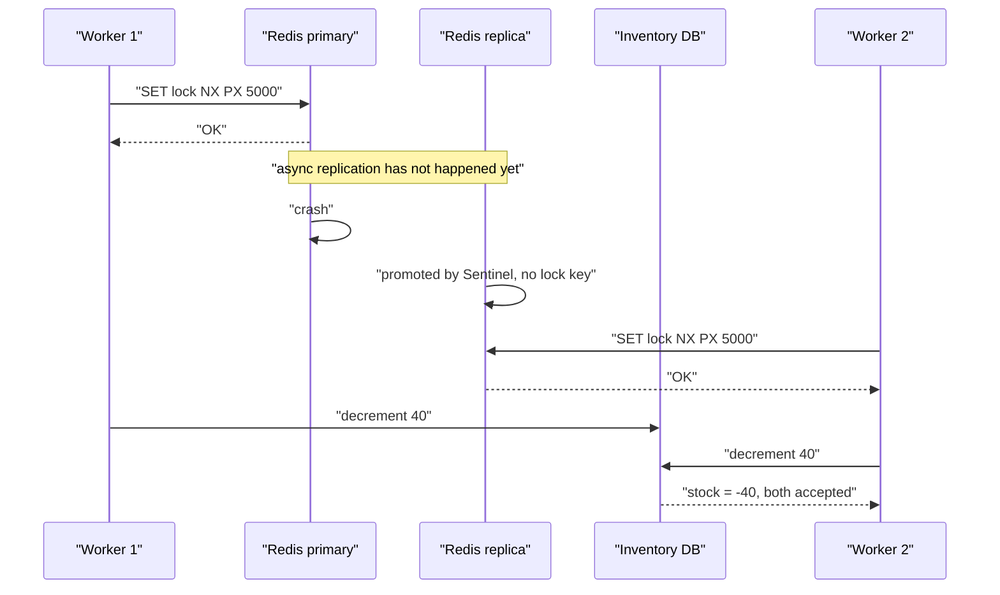
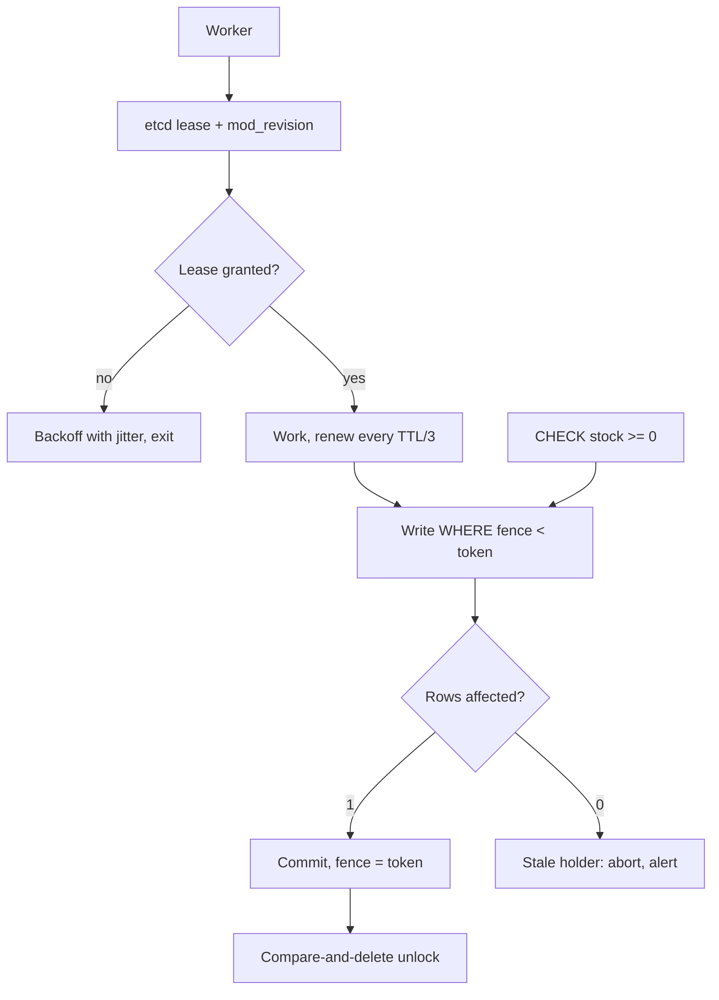

> **Scenario** — An inventory service uses `SET stock_lock:sku123 <uuid> NX PX 5000` before decrementing stock. During a Redis failover, the replica is promoted before it has received the `SET`, a second worker acquires the same lock, and 60 units of a 40-unit SKU get sold.

## Why it matters

- A lock protects an invariant that money depends on: single stock decrement, one payment capture, one email send, one file rename. Two holders means overselling, double charges, or corrupted output.
- Every practical distributed lock is a **lease** — it has a TTL. A lease guarantees mutual exclusion only if the holder cannot act after it expires, and no amount of TTL tuning can bound an arbitrary process pause.
- Redis replication is asynchronous by default. A lock acquired on the primary and lost in a failover is not a bug in Redis; it is the documented behaviour of async replication, and single-instance Redlock-style locks inherit it.
- The fix — fencing tokens checked by the protected resource — costs one column and one comparison, and it converts a correctness gamble into a guarantee.

## Symptoms

| Signal | What you observe |
|---|---|
| Negative or oversold stock | `stock < 0` rows, or fulfilment exceeding inventory |
| Duplicate side effects | Two charge attempts with the same order id; two identical emails |
| Lock logs | `acquired` on two hosts with overlapping timestamps for the same key |
| TTL vs work time | Job p99 duration exceeds the lock TTL for a small fraction of runs |
| GC / throttle pauses | STW or cgroup throttle stalls at or above the TTL |
| Failover correlation | Incidents cluster within 30s of a Redis or ZooKeeper failover event |
| Unlock errors | `unlock of non-owned key` — proof that the lock expired mid-work |

## How it breaks

Three independent failures, each sufficient on its own.

**Async replication loses the lock.** Redis primary accepts `SET NX`, acknowledges, and dies before propagating to the replica. Sentinel promotes the replica, which has no record of the key. A second client acquires it immediately. Both clients believe they hold an exclusive lock, and neither is wrong given what it can observe.

**Pause outlives the lease.** Client A holds a 5s lease, takes a 7s GC pause or gets CPU-throttled by its cgroup, the lease expires, B acquires, A resumes and writes. A has no way to know time passed — this is why checking `isLocked()` before the write does not help; the check and the write are not atomic with respect to the lease.

**Unlock deletes someone else's lock.** `DEL stock_lock:sku123` without verifying ownership will happily release the lock B is holding, cascading the problem to C.



## Root causes

1. The protected resource does not verify who holds the lock, so a stale holder's write is indistinguishable from a valid one.
2. Lock stored in a system with asynchronous replication and no acknowledgement of durability.
3. TTL shorter than the p99 work duration plus the p99 process stall.
4. Unlock implemented as an unconditional `DEL` instead of a compare-and-delete.
5. Lease expiry computed from `Date.now()` on a host subject to NTP steps.
6. Long-running work that never re-checks or extends the lease.
7. A lock used where idempotency would have been sufficient and much cheaper.

## How to solve it

### 1. Prefer idempotency over locking

Most "we need a distributed lock" problems are really "we need this operation to be safe to run twice". A unique constraint is a lock that the database enforces for free.

```sql
-- Instead of locking around "send one email", claim the work atomically.
CREATE TABLE email_sends (
  dedup_key   text PRIMARY KEY,          -- e.g. 'welcome:user:4711'
  sent_at     timestamptz NOT NULL DEFAULT now(),
  provider_id text
);

-- Only one worker can win this insert. No lock service involved.
INSERT INTO email_sends (dedup_key) VALUES ('welcome:user:4711')
ON CONFLICT (dedup_key) DO NOTHING
RETURNING dedup_key;
-- Zero rows returned: someone else already owns this work. Exit quietly.
```

### 2. If you need a lock, make it a fenced lease

Get a monotonically increasing token with the lock, and have the resource reject lower tokens. etcd gives you the revision; ZooKeeper gives you `czxid`; with Redis you can use `INCR` on a separate counter, accepting that the counter must be as durable as the lock.

```ts
type FencedLease = { key: string; owner: string; token: bigint; ttlMs: number }

export async function acquire(key: string, ttlMs: number): Promise<FencedLease | null> {
  const owner = crypto.randomUUID()
  const ok = await redis.set(`lock:${key}`, owner, 'PX', ttlMs, 'NX')
  if (ok !== 'OK') return null
  // Monotonic fence token. Must live in the same durable store as the lock.
  const token = BigInt(await redis.incr(`fence:${key}`))
  return { key, owner, token, ttlMs }
}

/** Compare-and-delete: never release a lock you no longer own. */
const UNLOCK = `
if redis.call('get', KEYS[1]) == ARGV[1] then
  return redis.call('del', KEYS[1])
else
  return 0
end`

export const release = (lease: FencedLease) =>
  redis.eval(UNLOCK, 1, `lock:${lease.key}`, lease.owner)
```

```sql
-- The resource is the enforcement point. A stale token can no longer write.
CREATE TABLE inventory (
  sku        text PRIMARY KEY,
  stock      int  NOT NULL CHECK (stock >= 0),
  fence      bigint NOT NULL DEFAULT 0
);

UPDATE inventory
   SET stock = stock - $1, fence = $2
 WHERE sku = $3 AND fence < $2;
-- 0 rows updated means a newer lock holder exists: abort, do not retry blindly.
```

The `CHECK (stock >= 0)` is a second, independent guard. Defence in depth matters here because the cost of being wrong is real money.

### 3. Use a lock store with real consensus for correctness-critical work

```bash
# etcd: the lease and the revision are replicated through Raft before acknowledgement.
LEASE=$(etcdctl lease grant 15 -w json | jq -r '.ID')
etcdctl put --lease="$LEASE" /locks/sku123 "$(hostname)"
# The mod_revision of that key is your fence token; it increases globally and monotonically.
etcdctl get /locks/sku123 -w json | jq '.kvs[0].mod_revision'
etcdctl lease keep-alive "$LEASE"   # heartbeat while work is in progress
```

### 4. Size the TTL, then check the remaining lease before each write

```ts
// TTL >= p99 work duration + p99 process stall + safety margin.
const TTL_MS = 15_000

async function withLease<T>(key: string, work: (lease: FencedLease) => Promise<T>) {
  const lease = await acquire(key, TTL_MS)
  if (!lease) throw new Error('lock busy')
  const startedAt = performance.now()          // monotonic, immune to NTP steps
  const timer = setInterval(() => renew(lease), TTL_MS / 3)
  try {
    return await work(lease)
  } finally {
    clearInterval(timer)
    if (performance.now() - startedAt < TTL_MS) await release(lease)
  }
}
```

Renewal reduces how often you hit the expiry; the fence token is what makes expiry *safe*.

### 5. Test the pause explicitly

`SIGSTOP` the holder for 3x the TTL, `SIGCONT` it, and assert its next write is rejected. If it succeeds, you do not have a lock — you have a race with a good success rate.

## Target design



## Tradeoffs

| Option | Pros | Cons | Choose when |
|---|---|---|---|
| Unique constraint / idempotency key | No lock service, database-enforced | Only works for claim-style work | The default; try this first |
| Redis `SET NX PX` alone | One round trip, very fast | Lost on failover; unsafe under pauses | Best-effort deduplication, no correctness need |
| Redlock across N Redis nodes | No single point of failure | Still clock-dependent; contested in the literature | Rarely; prefer consensus |
| etcd/ZooKeeper lease + fence | Consensus-backed, real fence token | Extra cluster; 2-10ms acquisition | Correctness-critical singletons |
| Database row lock (`SELECT FOR UPDATE`) | Same transaction as the write; trivially correct | Holds a DB connection; no cross-DB scope | Work already inside one database |
| Partitioned ownership (no lock) | No contention, scales linearly | Needs a partitioning scheme and rebalance | Work shards cleanly by key |

## Verification checklist

- [ ] `SIGSTOP` the holder for 3x TTL then `SIGCONT`: the next write is rejected by the fence, verified in a test.
- [ ] Unlock is a compare-and-delete (Lua script or transaction), never a bare `DEL`.
- [ ] TTL is documented as `p99 work + p99 stall + margin`, with both numbers measured.
- [ ] Lock acquisition and the fence token come from the same durable, replicated store.
- [ ] The protected table has both a fence column and a domain `CHECK` constraint.
- [ ] All lease arithmetic uses a monotonic clock; expiry paths contain no `Date.now()`.
- [ ] A Redis/etcd failover injected during a load test produces zero duplicate side effects.

## Anti-patterns

- Raising the TTL until the duplicates stop — you have made the window rarer, not closed it.
- `DEL` to unlock, releasing whichever holder happens to be current.
- Checking `isLocked()` immediately before the write and treating that as atomic.
- Implementing Redlock across five Redis nodes to fix a problem that a fence token solves with one column.
- Using a distributed lock to serialise work that could have been keyed by a unique constraint.
- Treating "we have never seen a duplicate" as evidence of correctness when the exposure window is a 200ms failover once a quarter.

## Related

- [Clock skew and event ordering](/systems/distributed-systems/clock-skew-and-event-ordering)
- [Raft in practice: what the paper leaves out](/systems/distributed-systems/consensus-raft-in-practice)
- [Two-phase commit versus sagas](/systems/distributed-systems/two-phase-commit-vs-saga)
