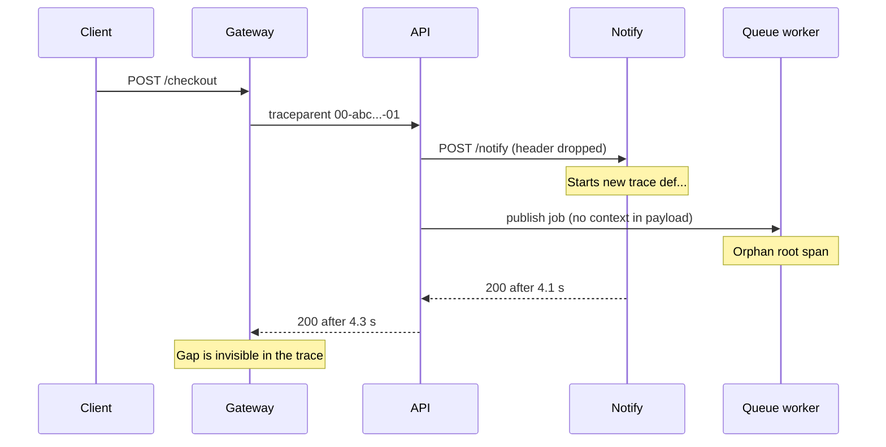
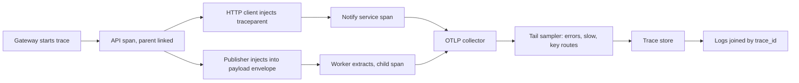

> **Scenario** - OpenTelemetry rollout-এর ছয় মাস পর 84% trace-এ ঠিক একটি span। Gateway trace শুরু করে, Laravel API continue করে, তারপর notification service - যার HTTP client rollout-এর আগে লেখা - নতুন trace ID শুরু করে। প্রতিটি slow checkout দেখতে লাগে দ্রুত gateway call, তারপর কিছুই নেই।

## Why it matters

- Service boundary-তে থেমে যাওয়া trace "কোন hop 4 সেকেন্ড খেল" বলতে পারে না - tracing-এর অস্তিত্বই এই প্রশ্নের জন্য।
- ভাঙা propagation চুপচাপ span bill দ্বিগুণ করে: যে fragment কেউ join করতে পারে না, তার storage-এর দাম দিচ্ছেন।
- 1% head sampling ঠিক সেই বিরল slow request ফেলে দেয় যেগুলো debug করতে চাইছেন।
- Span name-এ ID (`GET /orders/8814`) থাকলে operation dimension বিস্ফোরিত হয়, per-endpoint latency aggregation অকেজো।
- Log, metric ও trace-কে জোড়া লাগায় trace context। হারালে প্রতিটি signal আলাদা তদন্ত হয়ে যায়।

## Symptoms

| Signal | What you observe |
| --- | --- |
| Trace shape | single-span trace-ই বেশি; service dependency graph তৈরি হয় না |
| Latency gap | parent span 4.2 s, child মিলিয়ে 180 ms, বাকিটা অব্যাখ্যাত |
| Sampling | slow request trace store-এ প্রায় আসেই না |
| Operation names | হাজারো আলাদা operation, প্রতি resource ID-তে একটি |
| Async work | queue job ও cron-এর parent নেই, বিচ্ছিন্ন root হয়ে আসে |
| Overhead | span export request thread block করে; instrumentation-এর পর p99 বাড়ে |

## How it breaks

W3C trace context যায় `traceparent` header-এ: `00-<32 hex trace id>-<16 hex span id>-01`। যে component সেই header copy না করে outbound request বানায়, সে trace শেষ করে দেয়। সাধারণ অপরাধী: hand-rolled HTTP client, শুধু domain payload serialise করা message publisher, এবং unknown header strip করতে configure করা load balancer বা proxy। আরও খারাপ, downstream service তবুও span *শুরু* করে - তাই volume-এর হিসাবে data সুস্থ দেখায়; span প্রচুর, শুধু tree নেই। এদিকে head-based sampling root-এ সিদ্ধান্ত নেয়, latency জানার আগেই; ফলে 9 সেকেন্ড নেওয়া 0.3% request বাকি সবের মতোই সমান সম্ভাবনায় বাদ পড়ে।



## Root causes

1. Outbound call যায় এমন client দিয়ে যা instrumented নয় বা SDK দিয়ে wrap করা নয়।
2. Proxy, service mesh বা WAF `traceparent` ও `tracestate` strip করে।
3. Message payload-এ context envelope নেই, তাই async কাজ সবসময় orphan।
4. শুধু head sampling; slow ও failed trace রাখার tail sampler নেই।
5. Route template নয়, ID-সহ URL থেকে span name বানানো।
6. Production-এ simple span processor, তাই export latency request path-এ যোগ হয়।

## How to solve it

### 1. SDK একবার initialise করুন - batching ও route-aware namer দিয়ে

```ts
import { NodeSDK } from '@opentelemetry/sdk-node'
import { OTLPTraceExporter } from '@opentelemetry/exporter-trace-otlp-http'
import { BatchSpanProcessor, ParentBasedSampler, TraceIdRatioBasedSampler } from '@opentelemetry/sdk-trace-base'
import { getNodeAutoInstrumentations } from '@opentelemetry/auto-instrumentations-node'
import { W3CTraceContextPropagator } from '@opentelemetry/core'
import { resourceFromAttributes } from '@opentelemetry/resources'

const sdk = new NodeSDK({
  resource: resourceFromAttributes({
    'service.name': process.env.SERVICE_NAME!,
    'service.version': process.env.GIT_SHA!,
    'deployment.environment': process.env.APP_ENV!,
  }),
  // Keep the parent's decision; sample 100% at the root and let the
  // collector's tail sampler do the real filtering.
  sampler: new ParentBasedSampler({ root: new TraceIdRatioBasedSampler(1.0) }),
  textMapPropagator: new W3CTraceContextPropagator(),
  spanProcessors: [
    new BatchSpanProcessor(new OTLPTraceExporter({ url: process.env.OTLP_ENDPOINT }), {
      maxQueueSize: 4096,
      maxExportBatchSize: 512,
      scheduledDelayMillis: 5000,
    }),
  ],
  instrumentations: [
    getNodeAutoInstrumentations({
      '@opentelemetry/instrumentation-http': {
        ignoreIncomingRequestHook: (req) => req.url === '/healthz' || req.url === '/metrics',
      },
      '@opentelemetry/instrumentation-fs': { enabled: false },
    }),
  ],
})

sdk.start()
```

### 2. SDK যেখানে পৌঁছায় না সেখানে explicitly propagate করুন

```ts
import { context, propagation, trace, SpanStatusCode } from '@opentelemetry/api'

export async function publishJob(queue: string, payload: unknown) {
  const carrier: Record<string, string> = {}
  propagation.inject(context.active(), carrier) // writes traceparent, tracestate
  await redis.lpush(queue, JSON.stringify({ _otel: carrier, payload }))
}

export async function runJob(raw: string, handler: (p: unknown) => Promise<void>) {
  const { _otel, payload } = JSON.parse(raw)
  const parent = propagation.extract(context.active(), _otel ?? {})
  const span = trace.getTracer('worker').startSpan('job.process', {}, parent)
  await context.with(trace.setSpan(parent, span), async () => {
    try {
      await handler(payload)
    } catch (err) {
      span.recordException(err as Error)
      span.setStatus({ code: SpanStatusCode.ERROR })
      throw err
    } finally {
      span.end()
    }
  })
}
```

### 3. Span name হোক route template, identifier যাক attribute-এ

```ts
span.updateName(`${req.method} ${req.route?.path ?? 'unmatched'}`) // "POST /orders/:id"
span.setAttributes({
  'http.route': req.route?.path,
  'app.order_id': req.params.id,   // attribute, not name
  'app.tenant_id': req.auth?.tenantId,
})
```

### 4. আকর্ষণীয় trace রাখার কাজ collector-কে দিন

```yaml
processors:
  tail_sampling:
    decision_wait: 12s
    num_traces: 100000
    policies:
      - name: keep-errors
        type: status_code
        status_code: { status_codes: [ERROR] }
      - name: keep-slow
        type: latency
        latency: { threshold_ms: 1000 }
      - name: keep-checkout
        type: string_attribute
        string_attribute: { key: http.route, values: ["/checkout", "/payments"] }
      - name: baseline
        type: probabilistic
        probabilistic: { sampling_percentage: 2 }
service:
  pipelines:
    traces:
      receivers: [otlp]
      processors: [tail_sampling, batch]
      exporters: [otlp/backend]
```

### 5. প্রতিটি proxy-তে header ধরে রাখুন

```nginx
location /api/ {
    proxy_pass http://api_upstream;
    proxy_set_header traceparent $http_traceparent;
    proxy_set_header tracestate  $http_tracestate;
    proxy_set_header X-Request-ID $request_id;
}
```

### 6. Trace health-এই alert করুন

```promql
# Fraction of traces that never got a child span - propagation regression detector.
sum(rate(otelcol_processor_tail_sampling_sampling_trace_dropped_too_early[10m]))
/
sum(rate(otelcol_receiver_accepted_spans[10m]))
```

এর সাথে trace backend-এ দৈনিক একটি query রাখুন: "যে root span-এর service-এর জানা downstream call আছে কিন্তু child শূন্য"।

## Target design



## Tradeoffs

| Option | Pros | Cons | Choose when |
| --- | --- | --- | --- |
| 1% head sampling | সবচেয়ে সস্তা, সরল | বিরল slow ও failed trace হারায় | অতি high volume, cost-bound, কম debugging |
| Collector-এ tail sampling | error ও slow trace রাখে | collector memory ও decision window লাগে | production service-এর default |
| 100% retention, ছোট TTL | সাম্প্রতিক ছবি সম্পূর্ণ | দামি storage, ভারী ingest | ছোট fleet বা launch period |
| শুধু auto-instrumentation | দ্রুত rollout, code লাগে না | custom client ও queue বাদ পড়ে | adoption-এর শুরু |
| Business step-এ manual span | সমৃদ্ধ domain context | maintenance cost, drift ঝুঁকি | critical revenue path |

## Verification checklist

- [ ] Trace store-এ ঠিক একটি span-যুক্ত trace query করুন; 10%-এর অনেক নিচে থাকা উচিত।
- [ ] Edge দিয়ে `curl -H 'traceparent: 00-<32 hex>-<16 hex>-01'` পাঠিয়ে দেখুন একই trace ID প্রতিটি service-এর log-এ আছে।
- [ ] একটি job publish করে দেখুন worker span producer-এর trace ID শেয়ার করে।
- [ ] Backend-এর service dependency graph আসল architecture diagram-এর সাথে মেলে।
- [ ] `otelcol_exporter_send_failed_spans` শূন্য এবং batch queue saturate নয়।
- [ ] Instrumentation-এর আগে-পরে p99 তুলনা করুন; regression কয়েক মিলিসেকেন্ডের মধ্যে থাকা উচিত।

## Anti-patterns

- Production-এ `SimpleSpanProcessor` ব্যবহার করে request path-এ synchronously export করা।
- Root-এ 1% sample করে পরে অবাক হওয়া কেন কোনো incident trace পাওয়া যায় না।
- Span name-এ user ID, order ID বা literal-সহ SQL বসানো।
- প্রতি loop iteration-এ span বানিয়ে 20,000-span trace তৈরি করা, যা কোনো UI render করতে পারে না।
- Service জুড়ে অসংগতভাবে দুটি propagator (B3 ও W3C) চালানো, যাতে seam-এ chain ভাঙে।

## Related

- [Correlation IDs across services and queues](/systems/observability-sli/correlation-ids-across-services)
- [Instrumenting the four golden signals](/systems/observability-sli/golden-signals-instrumentation)
- [Incident timeline reconstruction](/systems/observability-sli/incident-timeline-reconstruction)
- [Log sampling and observability cost control](/systems/observability-sli/log-sampling-and-cost-control)
