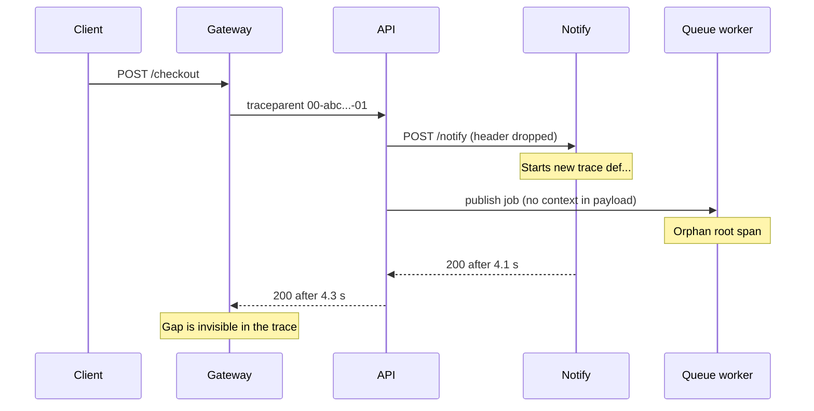
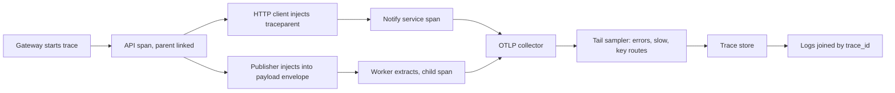

> **Scenario** — Six months into an OpenTelemetry rollout, 84% of traces contain exactly one span. The gateway starts a trace, the Laravel API continues it, and then the notification service — which calls an HTTP client built before the rollout — starts a brand new trace ID. Every slow checkout looks like a fast gateway call followed by nothing.

## Why it matters

- A trace that stops at a service boundary cannot answer "which hop consumed the 4 seconds", which is the only question tracing exists to answer.
- Broken propagation silently doubles your span bill: you pay to store fragments that nobody can join.
- Head sampling at 1% throws away exactly the rare slow requests you are trying to debug.
- Span names with IDs in them (`GET /orders/8814`) explode the operation dimension, so per-endpoint latency aggregation becomes useless.
- Trace context is what lets logs, metrics, and traces link. Lose it and each signal becomes a separate investigation.

## Symptoms

| Signal | What you observe |
| --- | --- |
| Trace shape | Single-span traces dominate; no service dependency graph forms |
| Latency gap | Parent span 4.2 s, child spans total 180 ms, remainder unexplained |
| Sampling | Slow requests almost never appear in the trace store |
| Operation names | Thousands of distinct operations, one per resource ID |
| Async work | Queue jobs and cron runs have no parent, appearing as isolated roots |
| Overhead | Span export blocking request threads; p99 rises after instrumentation |

## How it breaks

W3C trace context travels in a `traceparent` header: `00-<32 hex trace id>-<16 hex span id>-01`. Any component that constructs an outbound request without copying that header ends the trace. The usual offenders are hand-rolled HTTP clients, message publishers that only serialise a domain payload, and load balancers or proxies configured to strip unknown headers. Worse, the downstream service still *starts* a span, so the data looks healthy in volume terms — you have plenty of spans, just no trees. Meanwhile head-based sampling decides at the root, before latency is known, so the 0.3% of requests taking 9 seconds are dropped with the same probability as everything else.



## Root causes

1. Outbound calls made by clients that are not instrumented or not wrapped by the SDK.
2. Proxies, service meshes, or WAFs stripping `traceparent` and `tracestate`.
3. Message payloads carrying no context envelope, so async work is always orphaned.
4. Head sampling only, with no tail sampler to keep slow and failed traces.
5. Span names built from URLs including IDs instead of route templates.
6. Simple span processor in production, so export latency is added to the request path.

## How to solve it

### 1. Initialise the SDK once, with batching and a route-aware namer

```ts
import { NodeSDK } from '@opentelemetry/sdk-node'
import { OTLPTraceExporter } from '@opentelemetry/exporter-trace-otlp-http'
import { BatchSpanProcessor, ParentBasedSampler, TraceIdRatioBasedSampler } from '@opentelemetry/sdk-trace-base'
import { getNodeAutoInstrumentations } from '@opentelemetry/auto-instrumentations-node'
import { W3CTraceContextPropagator } from '@opentelemetry/core'
import { resourceFromAttributes } from '@opentelemetry/resources'

const sdk = new NodeSDK({
  resource: resourceFromAttributes({
    'service.name': process.env.SERVICE_NAME!,
    'service.version': process.env.GIT_SHA!,
    'deployment.environment': process.env.APP_ENV!,
  }),
  // Keep the parent's decision; sample 100% at the root and let the
  // collector's tail sampler do the real filtering.
  sampler: new ParentBasedSampler({ root: new TraceIdRatioBasedSampler(1.0) }),
  textMapPropagator: new W3CTraceContextPropagator(),
  spanProcessors: [
    new BatchSpanProcessor(new OTLPTraceExporter({ url: process.env.OTLP_ENDPOINT }), {
      maxQueueSize: 4096,
      maxExportBatchSize: 512,
      scheduledDelayMillis: 5000,
    }),
  ],
  instrumentations: [
    getNodeAutoInstrumentations({
      '@opentelemetry/instrumentation-http': {
        ignoreIncomingRequestHook: (req) => req.url === '/healthz' || req.url === '/metrics',
      },
      '@opentelemetry/instrumentation-fs': { enabled: false },
    }),
  ],
})

sdk.start()
```

### 2. Propagate explicitly where the SDK cannot reach

```ts
import { context, propagation, trace, SpanStatusCode } from '@opentelemetry/api'

export async function publishJob(queue: string, payload: unknown) {
  const carrier: Record<string, string> = {}
  propagation.inject(context.active(), carrier) // writes traceparent, tracestate
  await redis.lpush(queue, JSON.stringify({ _otel: carrier, payload }))
}

export async function runJob(raw: string, handler: (p: unknown) => Promise<void>) {
  const { _otel, payload } = JSON.parse(raw)
  const parent = propagation.extract(context.active(), _otel ?? {})
  const span = trace.getTracer('worker').startSpan('job.process', {}, parent)
  await context.with(trace.setSpan(parent, span), async () => {
    try {
      await handler(payload)
    } catch (err) {
      span.recordException(err as Error)
      span.setStatus({ code: SpanStatusCode.ERROR })
      throw err
    } finally {
      span.end()
    }
  })
}
```

### 3. Name spans by route template and put identifiers in attributes

```ts
span.updateName(`${req.method} ${req.route?.path ?? 'unmatched'}`) // "POST /orders/:id"
span.setAttributes({
  'http.route': req.route?.path,
  'app.order_id': req.params.id,   // attribute, not name
  'app.tenant_id': req.auth?.tenantId,
})
```

### 4. Let the collector keep the interesting traces

```yaml
processors:
  tail_sampling:
    decision_wait: 12s
    num_traces: 100000
    policies:
      - name: keep-errors
        type: status_code
        status_code: { status_codes: [ERROR] }
      - name: keep-slow
        type: latency
        latency: { threshold_ms: 1000 }
      - name: keep-checkout
        type: string_attribute
        string_attribute: { key: http.route, values: ["/checkout", "/payments"] }
      - name: baseline
        type: probabilistic
        probabilistic: { sampling_percentage: 2 }
service:
  pipelines:
    traces:
      receivers: [otlp]
      processors: [tail_sampling, batch]
      exporters: [otlp/backend]
```

### 5. Preserve the header through every proxy

```nginx
location /api/ {
    proxy_pass http://api_upstream;
    proxy_set_header traceparent $http_traceparent;
    proxy_set_header tracestate  $http_tracestate;
    proxy_set_header X-Request-ID $request_id;
}
```

### 6. Alert on trace health itself

```promql
# Fraction of traces that never got a child span — propagation regression detector.
sum(rate(otelcol_processor_tail_sampling_sampling_trace_dropped_too_early[10m]))
/
sum(rate(otelcol_receiver_accepted_spans[10m]))
```

Pair it with a daily query in the trace backend for "root spans whose service has known downstream calls but zero children".

## Target design



## Tradeoffs

| Option | Pros | Cons | Choose when |
| --- | --- | --- | --- |
| Head sampling at 1% | Cheapest, simple | Loses rare slow and failed traces | Very high volume, cost-bound, low debugging need |
| Tail sampling in collector | Keeps errors and slow traces | Needs collector memory and a decision window | Default for production services |
| 100% retention, short TTL | Complete recent picture | Expensive storage, heavy ingest | Small fleets or launch periods |
| Auto-instrumentation only | Fast rollout, no code | Misses custom clients and queues | Early adoption phase |
| Manual spans for business steps | Rich domain context | Maintenance cost, drift risk | Critical revenue paths |

## Verification checklist

- [ ] Query the trace store for traces with exactly one span; expect well under 10%.
- [ ] `curl -H 'traceparent: 00-<32 hex>-<16 hex>-01'` through the edge and confirm the same trace ID appears in every service's logs.
- [ ] Publish a job and confirm the worker span shares the producer's trace ID.
- [ ] Confirm the service dependency graph in the backend matches the real architecture diagram.
- [ ] Check `otelcol_exporter_send_failed_spans` is zero and the batch queue is not saturated.
- [ ] Compare p99 latency before and after instrumentation; regression should be under a few milliseconds.

## Anti-patterns

- Using `SimpleSpanProcessor` in production and exporting synchronously on the request path.
- Sampling at 1% at the root and then wondering why no incident trace is ever available.
- Putting user IDs, order IDs, or SQL statements with literals into span names.
- Creating a span per loop iteration, producing 20,000-span traces that no UI can render.
- Running two propagators (B3 and W3C) inconsistently across services so the chain breaks at the seam.

## Related

- [Correlation IDs across services and queues](/systems/observability-sli/correlation-ids-across-services)
- [Instrumenting the four golden signals](/systems/observability-sli/golden-signals-instrumentation)
- [Incident timeline reconstruction](/systems/observability-sli/incident-timeline-reconstruction)
- [Log sampling and observability cost control](/systems/observability-sli/log-sampling-and-cost-control)
