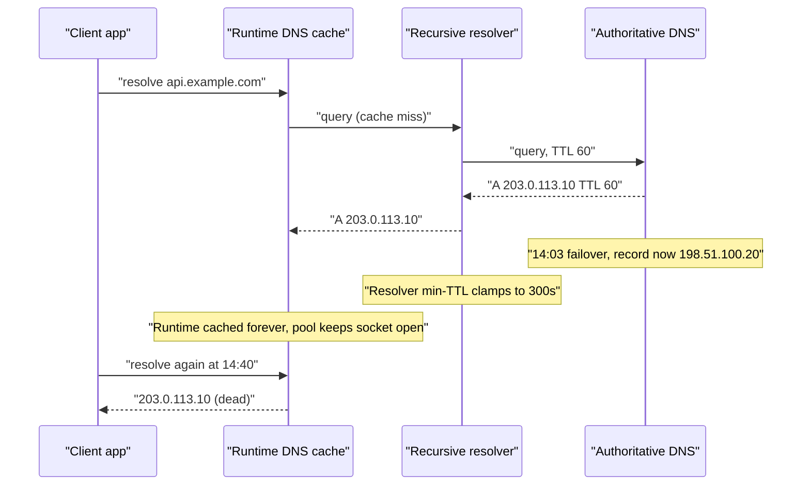
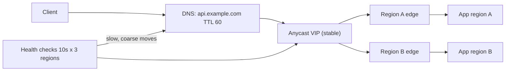

> **Scenario** - ১৪:০২-এ primary region পড়ে গেল। DNS provider-এর health check ১৪:০৩-এ `api.example.com`-কে standby region-এ ফ্লিপ করল, record-এর TTL ৬০ সেকেন্ড। ১৪:৪০-এ এসেও ৮% traffic - মূলত এক বড় enterprise customer আর একদল mobile client - মৃত IP-তে হাতুড়ি পিটছে।

## Why it matters

- DNS হলো সেই failover যন্ত্র যার উপর বেশিরভাগ team নির্ভর করে, অথচ যেটির নিয়ন্ত্রণ তাদের হাতে সবচেয়ে কম। আপনি TTL publish করেন; resolver, stub library আর app runtime ঠিক করে কতটা মানবে।
- "৬০ সেকেন্ড RTO" আসলে ৪০ মিনিট হলে একটি regional outage কয়েক ঘণ্টার SLA breach হয়ে যায়।
- মৃত IP-তে pinned client সুন্দরভাবে fail করে না - connection pool ভরায়, retry শেষ করে, আর dashboard "recovered" বলার অনেক পরেও support ticket তৈরি করে।
- negative caching (SOA minimum) মানে একটি ভুল - মুছে যাওয়া record, একটি typo - positive TTL-এর অনেক পরেও টিকে থাকে।
- কম TTL বিনামূল্যে নয়: query volume গুণ হয় আর প্রতিটি cold connection-এ DNS provider কঠিন dependency হয়ে দাঁড়ায়।

## Symptoms

| Signal | What you observe |
| --- | --- |
| Traffic split | ৩ মিনিটে standby ৯২% নেয়, শেষ ৮% নিতে ৪০+ মিনিট |
| Client logs | record বদলের অনেক পরেও `connect ETIMEDOUT 203.0.113.10:443` |
| client network থেকে `dig` | পুরনো A record, TTL এমন মান থেকে নামছে যা আপনি publish করেননি |
| App runtime | JVM বা connection pool process-জীবনভর এক IP ধরে আছে |
| Provider dashboard | health check লাল, record updated, propagation "complete" |
| Recovery | client-side restart বা pool recycle-এর পরেই traffic ফেরে |
| Rollback attempt | record ফেরাতেও ঠিক ততটাই সময় লাগে |

## How it breaks

publish করা TTL একটি অনুরোধ-সীমা, guarantee নয়। তিনটি layer আলাদা করে দেরি যোগ করে। recursive resolver TTL অনুযায়ী উত্তর cache করে, কিন্তু অনেকে একটি minimum (সাধারণত ৩০–৩০০s) চাপায় আর কিছু corporate resolver আগ্রাসীভাবে উপরে clamp করে। stub resolver ও language runtime আবার cache করে: JVM ঐতিহাসিকভাবে default security policy-তে সফল lookup চিরকাল cache করত, আর অনেক HTTP client connection pool তৈরির সময় একবার resolve করে, connection বাঁচা পর্যন্ত আর করে না। শেষে keepalive: নিখুঁত re-resolution-ও কিছু বদলায় না, কারণ মৃত IP-র খোলা connection error না দেওয়া পর্যন্ত reuse হতেই থাকে।



## Root causes

1. TTL কম publish করা, কিন্তু resolver-এর minimum TTL সেটিকে উপরে clamp করে।
2. runtime-level caching (`networkaddress.cache.ttl`, glibc `nscd`, Node-এর `dns.lookup` আচরণ) কখনো revalidate করে না।
3. HTTP connection pool connection-জীবনভর resolved IP-তে বাঁধা, max connection age নেই।
4. negative TTL (SOA minimum) ৩৬০০s, তাই record error এক ঘণ্টা টেকে।
5. health check interval + failure threshold মিলে record বদলানোর আগেই কয়েক মিনিট খরচ।
6. incident-এর কয়েক মাস আগে "performance-এর জন্য" TTL ৩৬০০s করা হয়েছিল, আর নামানো হয়নি।
7. দ্বিতীয় স্তর হিসেবে anycast বা load-balancer steering ছাড়া শুধু DNS-এর উপর failover।

## How to solve it

### 1. publish করা TTL নয়, আসল propagation curve মাপুন

```bash
dig +noall +answer api.example.com @1.1.1.1
# api.example.com. 47 IN A 198.51.100.20

dig +noall +answer api.example.com @8.8.8.8
# api.example.com. 284 IN A 203.0.113.10   <- clamped to 300s
```

কয়েকটি public resolver ও একটি client network থেকে query করুন। সবচেয়ে বড় দেখা TTL-ই আপনার আসল RTO floor।

### 2. positive ও negative - দুই TTL-ই সচেতনভাবে দিন

```
; zone file
$TTL 60
@   IN SOA ns1.example.com. host.example.com. (
        2026082401 ; serial
        3600       ; refresh
        600        ; retry
        1209600    ; expire
        60 )       ; MINIMUM -> negative cache TTL
api IN A 198.51.100.20
```

SOA-র `MINIMUM` field-ই negative caching TTL। ৩৬০০ রেখে দিলে একটি দুর্ঘটনাজনিত NXDOMAIN এক ঘণ্টা থাকবে।

### 3. connection age সীমিত করুন যাতে pool আবার resolve করে

```nginx
resolver 10.0.0.2 valid=30s ipv6=off;
resolver_timeout 3s;

location /api/ {
    set $backend "api-internal.example.com";
    proxy_pass http://$backend;   # variable forces runtime resolution
}
```

`proxy_pass`-এ variable ব্যবহার করলে nginx config load-এ IP pin না করে `resolver valid=` সূচি অনুযায়ী re-resolve করে। client দিকে max connection lifetime দিন - যেমন Go transport-এ ৬০s, বা Node-এ `keepAliveTimeout` সহ pool recycle।

### 4. runtime cache স্পষ্টভাবে ঠিক করুন

```
# JVM
-Dnetworkaddress.cache.ttl=30
-Dnetworkaddress.cache.negative.ttl=5
```

```python
# Python requests: DNS-এ ভরসা না করে session পর্যায়ক্রমে নতুন করে বানান
session = requests.Session()
adapter = requests.adapters.HTTPAdapter(pool_maxsize=32, max_retries=0)
session.mount("https://", adapter)
# background task-এ প্রতি ৬০s recycle, বা resolving connector ব্যবহার
```

### 5. budget-এর detection অংশটা ছোট করুন

failover time = `detect + publish + propagate`। ৩০s interval ও ৩-failure threshold মানে publish-এর আগেই ৯০s। তিনটি ভৌগোলিক checker থেকে ১০s interval ও ২ failure নিন।

### 6. শুধু DNS-এর উপর ভরসা করবেন না

সামনে একটি স্থির anycast address বা load balancer রাখুন, আর DNS-কে শুধু ধীর, মোটা দাগের সরানোর কাজ দিন। তখন failover মানে routing পরিবর্তন - সেকেন্ডে মাপা, cache expiry নয়।

## Target design



## Tradeoffs

| Option | Pros | Cons | Choose when |
| --- | --- | --- | --- |
| কম TTL (৩০–৬০s) | record মোটামুটি দ্রুত সরে | বেশি query, প্রতিটি cold path-এ DNS | DNS-ই একমাত্র failover lever |
| বেশি TTL (১ঘ+) | DNS outage-এ সহনশীল, সস্তা | failover ঘণ্টায় মাপা | সত্যিই কখনো না সরা record |
| Anycast VIP | সেকেন্ডে failover, TTL অপ্রাসঙ্গিক | BGP বা এমন provider লাগে | আসল RTO target সহ multi-region |
| client-side multi-IP retry | এক মৃত A record টেকে | client পরিবর্তন লাগে, browser-এ কঠিন | SDK আপনার নিয়ন্ত্রণে |
| load balancer steering | তাৎক্ষণিক, observable, ফেরানো যায় | একটি control plane রক্ষা করতে হয় | এক entry point-এর পিছনে regional failover |

## Verification checklist

- [ ] test পরিবর্তনের পর ৫+ public resolver-এ `dig` উদ্দেশ্যের চেয়ে বেশি TTL দেখায় না।
- [ ] SOA `MINIMUM` ৬০s বা কম এবং নথিভুক্ত।
- [ ] game-day failover-এ ৯০% নয়, ৯৯% traffic shift-এর সময় রেকর্ড করা হয়।
- [ ] JVM/Node/Python service-এর startup config dump-এ DNS cache TTL দেখা যায়।
- [ ] connection pool-এর max lifetime DNS TTL-এর চেয়ে ছোট।
- [ ] health check detection window end-to-end ৩০s-এর নিচে।
- [ ] DNS পরিবর্তনের rollback ধারণা নয়, পরীক্ষিত।

## Anti-patterns

- provider dashboard "propagated" বললেই failover সম্পূর্ণ ঘোষণা করা।
- TTL ৫s করে DNS provider-কে প্রতিটি request path-এর কঠিন dependency বানানো।
- record মুছে যাওয়ায় এক ঘণ্টা আটকে না পড়া পর্যন্ত negative TTL উপেক্ষা করা।
- একটি laptop থেকে `nslookup`-কে global propagation-এর প্রমাণ ধরা।
- application মৃত region-এ warm connection ধরে রেখেছে, এমন অবস্থায় DNS failover করা।
- ৪০ মিনিটের long tail-কে "কয়েকটা অদ্ভুত client" ভাবা, যদিও সেটি সাধারণত enterprise customer।

## Related

- [Geo routing and anycast in practice](/systems/networking-edge/geo-routing-and-anycast)
- [Multi-region failover without dual writes](/systems/product-platform/multi-region-failover)
- [Keepalive and upstream connection reuse](/systems/networking-edge/keepalive-and-connection-reuse)
