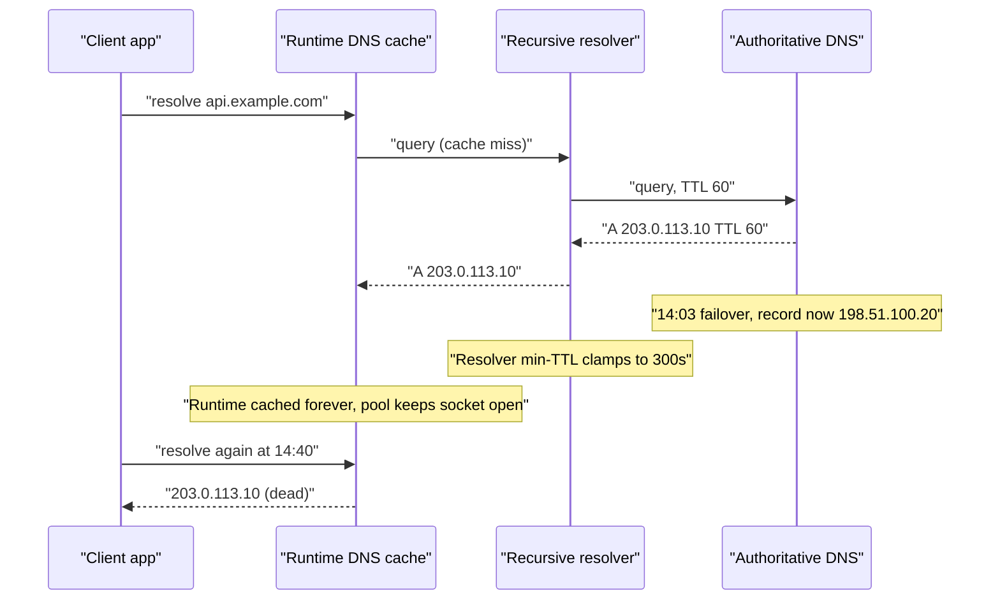
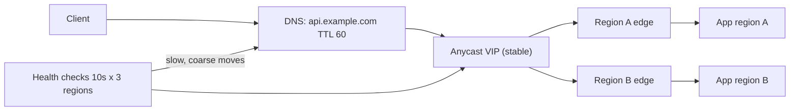

> **Scenario** — The primary region goes down at 14:02. The DNS provider health check flips `api.example.com` to the standby region at 14:03 and the record has a 60-second TTL. At 14:40, 8% of traffic — mostly one large enterprise customer and a fleet of mobile clients — is still hammering the dead IP.

## Why it matters

- DNS is the failover mechanism most teams rely on and the one they control least. You publish a TTL; resolvers, stub libraries, and app runtimes decide what to honour.
- A "60-second RTO" that is really 40 minutes turns a regional outage into a multi-hour SLA breach.
- Clients pinned to a dead IP do not fail gracefully — they fill connection pools, exhaust retries, and generate support tickets long after the dashboard says "recovered".
- Negative caching (SOA minimum) means a mistake — a deleted record, a typo — persists far past the positive TTL.
- Low TTLs are not free: they multiply query volume and make your DNS provider a hard dependency on every cold connection.

## Symptoms

| Signal | What you observe |
| --- | --- |
| Traffic split | Standby region takes 92% within 3 minutes, the last 8% takes 40+ minutes |
| Client logs | `connect ETIMEDOUT 203.0.113.10:443` long after the record changed |
| `dig` from a client network | Old A record with a TTL counting down from a value you never published |
| App runtime | JVM or connection-pool holding one IP for the process lifetime |
| Provider dashboard | Health check red, record updated, propagation "complete" |
| Recovery | Traffic returns only after a client-side restart or pool recycle |
| Rollback attempt | Reverting the record takes just as long to take effect |

## How it breaks

A published TTL is an upper bound request, not a guarantee. Three layers each add their own delay. Recursive resolvers cache the answer for the TTL, but many enforce a minimum (commonly 30–300s) and some corporate resolvers clamp aggressively upward. Stub resolvers and language runtimes cache again: the JVM historically cached successful lookups forever under the default security policy, and many HTTP clients resolve once when a connection pool is created and never re-resolve while connections stay alive. Finally, keepalive means even a perfect re-resolution changes nothing — an open connection to the dead IP is reused until it errors.



## Root causes

1. TTL published low but resolver minimum TTL clamps it upward.
2. Runtime-level caching (`networkaddress.cache.ttl`, Go's absence of caching versus glibc `nscd`, Node's `dns.lookup` behaviour) never revalidates.
3. HTTP connection pools bound to a resolved IP for the connection lifetime, with no max connection age.
4. Negative TTL (SOA minimum) at 3600s, so a record error persists for an hour.
5. Health check interval plus failure threshold adds minutes before the record ever changes.
6. TTL raised to 3600s "for performance" months before the incident and never lowered.
7. Failover relying on DNS alone with no anycast or load-balancer-level steering as a second layer.

## How to solve it

### 1. Measure the real propagation curve, not the published TTL

```bash
dig +noall +answer api.example.com @1.1.1.1
# api.example.com. 47 IN A 198.51.100.20

dig +noall +answer api.example.com @8.8.8.8
# api.example.com. 284 IN A 203.0.113.10   <- clamped to 300s
```

Query from several public resolvers and from a client network. The largest observed TTL is your real RTO floor.

### 2. Set both positive and negative TTL deliberately

```
; zone file
$TTL 60
@   IN SOA ns1.example.com. host.example.com. (
        2026082401 ; serial
        3600       ; refresh
        600        ; retry
        1209600    ; expire
        60 )       ; MINIMUM -> negative cache TTL
api IN A 198.51.100.20
```

The SOA `MINIMUM` field is the negative caching TTL. Leaving it at 3600 means an accidental NXDOMAIN lasts an hour.

### 3. Cap connection age so pools re-resolve

```nginx
resolver 10.0.0.2 valid=30s ipv6=off;
resolver_timeout 3s;

location /api/ {
    set $backend "api-internal.example.com";
    proxy_pass http://$backend;   # variable forces runtime resolution
}
```

Using a variable in `proxy_pass` makes nginx re-resolve on the `resolver valid=` schedule instead of pinning the IP at config load. On the client side, set a max connection lifetime — for example `MaxConnLifetime: 60s` in a Go transport wrapper, or `keepAliveTimeout` plus a pool recycle in Node.

### 4. Fix runtime caches explicitly

```
# JVM
-Dnetworkaddress.cache.ttl=30
-Dnetworkaddress.cache.negative.ttl=5
```

```python
# Python requests: rebuild the session periodically rather than trusting DNS
session = requests.Session()
adapter = requests.adapters.HTTPAdapter(pool_maxsize=32, max_retries=0)
session.mount("https://", adapter)
# recycle every 60s in a background task, or use a resolving connector
```

### 5. Shorten the detection half of the budget

Failover time is `detect + publish + propagate`. A health check at 30s interval with a 3-failure threshold costs 90s before publish. Use 10s intervals with 2 failures from 3 geographic checkers.

### 6. Do not rely on DNS alone

Put a stable anycast address or a load balancer in front, and let DNS handle only the slow, coarse-grained moves. Then a failover is a routing change, measured in seconds, not a cache expiry.

## Target design



## Tradeoffs

| Option | Pros | Cons | Choose when |
| --- | --- | --- | --- |
| Low TTL (30–60s) | Fast-ish record moves | More queries, DNS is on every cold path | DNS is your only failover lever |
| High TTL (1h+) | Resilient to DNS outage, cheap | Failover measured in hours | Records that genuinely never move |
| Anycast VIP | Failover in seconds, TTL irrelevant | Needs BGP or a provider that owns it | Multi-region with real RTO targets |
| Client-side multi-IP retry | Survives one dead A record | Requires client changes, hard for browsers | You control the SDK |
| Load balancer steering | Instant, observable, revertible | Single control plane to protect | Regional failover behind one entry point |

## Verification checklist

- [ ] `dig` against 5+ public resolvers returns a TTL no higher than intended after a test change.
- [ ] SOA `MINIMUM` is 60s or lower and documented.
- [ ] A game-day failover records the time to reach 99% traffic shift, not just 90%.
- [ ] JVM/Node/Python services show DNS cache TTL settings in their startup config dump.
- [ ] Connection pools have a max lifetime shorter than the DNS TTL.
- [ ] Health check detection window is under 30s end to end.
- [ ] Rollback of a DNS change is tested, not assumed.

## Anti-patterns

- Declaring failover complete when the provider dashboard says "propagated".
- Setting TTL to 5s and making the DNS provider a hard dependency of every request path.
- Ignoring negative TTL until an accidental record deletion locks you out for an hour.
- Relying on `nslookup` from one laptop as evidence of global propagation.
- Failing over DNS while the application keeps warm connections to the dead region.
- Treating a 40-minute long tail as "a few weird clients" instead of the enterprise customer it usually is.

## Related

- [Geo routing and anycast in practice](/systems/networking-edge/geo-routing-and-anycast)
- [Multi-region failover without dual writes](/systems/product-platform/multi-region-failover)
- [Keepalive and upstream connection reuse](/systems/networking-edge/keepalive-and-connection-reuse)
