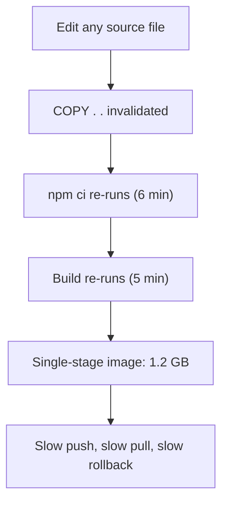
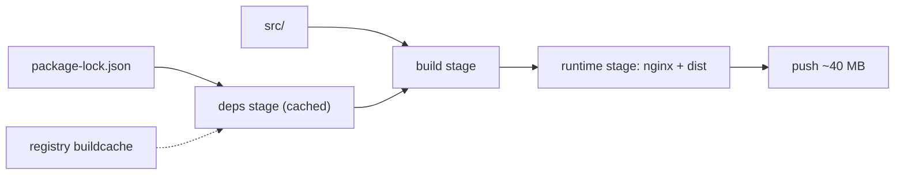

> **পরিস্থিতি** — একটা Vue component-এ এক অক্ষরের fix ১৪ মিনিটের CI build চালায়। Image ১.২ GB, প্রতি push-এ `npm ci` চলে, আর registry-র বিল traffic-এর চেয়ে দ্রুত বাড়ছে।

## কেন গুরুত্বপূর্ণ

- Build time প্রতিটি hotfix-এর critical path-এ থাকে। ১৪ মিনিটের image build ২ মিনিটের rollback-কে ১৬ মিনিটের outage বানায়।
- বড় image প্রতিটি scale-up ধীর করে: cache ছাড়া node-কে পুরো compressed image pull করতে হয় pod start করার আগে।
- অপ্রয়োজনীয় layer build tooling, compiler ও package manager cache production-এ নিয়ে যায় — বেশি CVE, বেশি attack surface।
- Registry storage ও egress প্রতি GB হিসেবে bill হয়। দিনে ৫০ বার ১.২ GB push মানে আসল টাকা।

## লক্ষণ

| Signal | যা দেখবেন |
|---|---|
| CI duration | diff যত ছোটই হোক build time প্রায় একই |
| Build log | প্রতি build-এ `npm ci` / `composer install` পুনরায় চলে, কখনো `CACHED` নয় |
| `docker history` | একটা বিশাল layer-এ source, `node_modules` ও build output একসাথে |
| Pod startup | cold node-এ ৪০-৯০ সেকেন্ড `ContainerCreating`, event-এ `Pulling image` |
| Registry | প্রতি merge-এ storage কয়েকশো MB বাড়ে |

## কীভাবে ভাঙে

Docker প্রতি instruction-এ একটা layer বানায় এবং cached layer তখনই reuse করে যখন সেই instruction *এবং তার আগের প্রতিটি layer* অপরিবর্তিত থাকে। dependency install-এর আগে বসানো `COPY . .` যেকোনো file পরিবর্তনে — এমনকি `README.md`-তেও — cache invalid করে। এরপরের সব কিছু (install, compile, prune) আবার চলে।

দ্বিতীয় সমস্যা: single-stage build builder-কেই ship করে। Compiler, dev dependency ও package cache final image-এ থাকে, কারণ সবই একই filesystem layer-এ তৈরি হয়েছে।



## মূল কারণ

1. dependency install-এর আগে `COPY . .` থাকায় cache key-তে সব source ঢুকে যায়।
2. `.dockerignore` নেই, তাই `node_modules`, `.git` ও local `.env` build context-এ ঢুকে checksum বদলায়।
3. Single-stage build compiler ও dev dependency runtime image-এ রেখে দেয়।
4. Package manager cache build cache mount-এর বদলে image layer-এ লেখা হয়।
5. CI ephemeral runner-এ চলে, registry-backed cache import নেই, তাই প্রতি build cold শুরু হয়।

## কীভাবে সমাধান করবেন

### ১. Manifest copy আর source copy আলাদা করুন

আগে শুধু lockfile copy করুন। তাহলে lockfile বদলালেই কেবল dependency আবার resolve হবে।

```dockerfile
# syntax=docker/dockerfile:1.7
FROM node:20-alpine AS deps
WORKDIR /app
COPY package.json package-lock.json ./
RUN --mount=type=cache,target=/root/.npm \
    npm ci --no-audit --no-fund

FROM deps AS build
COPY . .
RUN npm run build

FROM nginx:1.27-alpine AS runtime
COPY --from=build /app/dist /usr/share/nginx/html
COPY deploy/nginx.conf /etc/nginx/conf.d/default.conf
USER nginx
EXPOSE 8080
```

`cache` mount npm cache-কে image-এর বাইরে রাখে, অথচ build-এর মধ্যে reuse হয়।

### ২. `.dockerignore` যোগ করুন

```gitignore
.git
node_modules
dist
coverage
**/*.log
.env*
```

### ৩. CI-তে cache import ও export করুন

```yaml
- name: Build and push
  uses: docker/build-push-action@v6
  with:
    push: true
    tags: ${{ env.REGISTRY }}/web:${{ github.sha }}
    cache-from: type=registry,ref=${{ env.REGISTRY }}/web:buildcache
    cache-to: type=registry,ref=${{ env.REGISTRY }}/web:buildcache,mode=max
```

### ৪. আগে-পরে মাপুন

```bash
docker build -t web:new .
docker image ls web:new --format '{{.Size}}'
docker history web:new --no-trunc --format '{{.Size}}\t{{.CreatedBy}}' | head -20
# second build should print CACHED for the deps stage
docker build -t web:new . 2>&1 | grep -c CACHED
```

### ৫. Reproducibility-র জন্য digest দিয়ে pin করুন

```bash
docker buildx imagetools inspect registry.example.com/web:2026.08.24 \
  --format '{{.Manifest.Digest}}'
```

## কাঙ্ক্ষিত ডিজাইন



## Tradeoff

| Option | সুবিধা | খরচ | কখন বেছে নেবেন |
|---|---|---|---|
| Single-stage build | সহজ Dockerfile, debug সহজ | বিশাল image, production-এ build tool | throwaway internal tooling |
| Multi-stage + cache mount | ছোট runtime image, দ্রুত rebuild | BuildKit লাগে, intermediate inspect কঠিন | সপ্তাহে একাধিকবার deploy হয় এমন service |
| Distroless runtime | সর্বনিম্ন CVE surface | shell নেই, `kubectl exec` debugging কষ্টকর | ভালো remote debugging আছে এমন security-sensitive service |
| Registry cache import | ephemeral runner-এ দ্রুত build | বাড়তি registry storage, cache stale হতে পারে | persistent build host ছাড়া CI |

## যাচাই checklist

- [ ] শুধু whitespace বদলালে dependency stage-এ `CACHED` আসে।
- [ ] `docker image ls`-এ runtime image টিমের budget-এর নিচে (যেমন ১৫০ MB)।
- [ ] `docker history`-তে source ও `node_modules` একসাথে রাখা কোনো layer নেই।
- [ ] Final image-এ package manager, compiler বা `.git` directory নেই।
- [ ] Deployment manifest immutable digest বা commit SHA ব্যবহার করে, কখনো `:latest` নয়।
- [ ] `kubectl get events` দিয়ে মাপা cold-node pull time ১৫ সেকেন্ডের নিচে।

## Anti-pattern

- "layer কমাতে" সব command এক বিশাল `RUN`-এ জোড়া — এতে প্রতিটি cache boundary-ও মুছে যায়।
- install-এর পরে `RUN npm cache clean`, যা ওই layer ছোট করে কিন্তু আগের cached layer নয়।
- পরের layer-এ file মুছে image ছোট হবে ভাবা; আগের layer এখনো bytes বহন করে।
- প্রতিটি build `:latest` tag করা, তারপর production-এ কোন commit চলছে তা নিয়ে বিভ্রান্তি।
- CI যে artifact test করেছে সেটা promote না করে deploy job-এ আবার image build করা।

## সম্পর্কিত

- [CI/CD pipeline safety gates](/systems/devops-containers/ci-cd-pipeline-safety-gates)
- [Sidecar and init container patterns](/systems/devops-containers/sidecar-and-init-container-patterns)
- [Kubernetes rollout failure modes](/systems/devops-containers/k8s-rollout-failure-modes)
