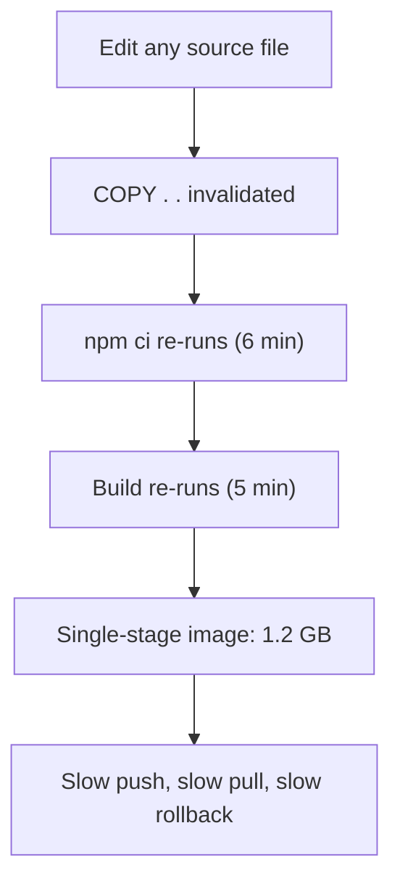
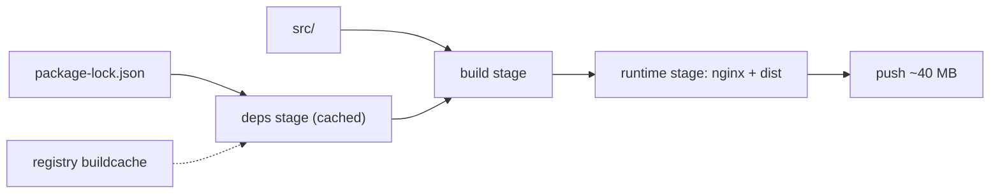

> **Scenario** - A one-character fix to a Vue component triggers a 14-minute CI build. The image is 1.2 GB, `npm ci` runs on every push, and the registry bill grew faster than traffic did.

## Why it matters

- Build time is on the critical path of every hotfix. A 14-minute image build turns a 2-minute rollback into a 16-minute outage.
- Large images slow every scale-up: a node without a warm cache must pull the full compressed image before the pod can start.
- Each unnecessary layer carries build tooling, compilers, and package manager caches into production - more CVEs to triage, more attack surface.
- Registry storage and egress are billed per GB. Fifty pushes a day of a 1.2 GB image is real money.

## Symptoms

| Signal | What you observe |
|---|---|
| CI duration | Near-constant build time regardless of how small the diff is |
| Build log | `npm ci` / `composer install` re-runs on every build, never `CACHED` |
| `docker history` | One giant layer holding source, `node_modules`, and build output together |
| Pod startup | 40-90s in `ContainerCreating` on cold nodes, `Pulling image` in events |
| Registry | Storage grows by hundreds of MB per merge |

## How it breaks

Docker builds a layer per instruction and reuses a cached layer only when that instruction *and every layer before it* are unchanged. `COPY . .` placed before dependency installation invalidates the cache on any file change, including `README.md`. Everything downstream - install, compile, prune - reruns.

The second failure is that a single-stage build ships the builder. The compiler, dev dependencies, and package cache all live in the final image because they were created in the same filesystem layer.



## Root causes

1. `COPY . .` appears before the dependency install step, so the manifest cache key includes all source.
2. No `.dockerignore`, so `node_modules`, `.git`, and local `.env` files enter the build context and change the checksum.
3. Single-stage build keeps compilers and dev dependencies in the runtime image.
4. Package manager caches are written into the image layer instead of a build cache mount.
5. CI runs on ephemeral runners with no registry-backed cache import, so every build starts cold.

## How to solve it

### 1. Split the manifest copy from the source copy

Copy only the lockfile first. Dependencies then re-resolve only when the lockfile changes.

```dockerfile
# syntax=docker/dockerfile:1.7
FROM node:20-alpine AS deps
WORKDIR /app
COPY package.json package-lock.json ./
RUN --mount=type=cache,target=/root/.npm \
    npm ci --no-audit --no-fund

FROM deps AS build
COPY . .
RUN npm run build

FROM nginx:1.27-alpine AS runtime
COPY --from=build /app/dist /usr/share/nginx/html
COPY deploy/nginx.conf /etc/nginx/conf.d/default.conf
USER nginx
EXPOSE 8080
```

The `cache` mount keeps the npm cache out of the image while still reusing it across builds.

### 2. Add a `.dockerignore`

```gitignore
.git
node_modules
dist
coverage
**/*.log
.env*
```

### 3. Import and export cache in CI

```yaml
- name: Build and push
  uses: docker/build-push-action@v6
  with:
    push: true
    tags: ${{ env.REGISTRY }}/web:${{ github.sha }}
    cache-from: type=registry,ref=${{ env.REGISTRY }}/web:buildcache
    cache-to: type=registry,ref=${{ env.REGISTRY }}/web:buildcache,mode=max
```

### 4. Measure before and after

```bash
docker build -t web:new .
docker image ls web:new --format '{{.Size}}'
docker history web:new --no-trunc --format '{{.Size}}\t{{.CreatedBy}}' | head -20
# second build should print CACHED for the deps stage
docker build -t web:new . 2>&1 | grep -c CACHED
```

### 5. Pin by digest for reproducibility

```bash
docker buildx imagetools inspect registry.example.com/web:2026.08.24 \
  --format '{{.Manifest.Digest}}'
```

## Target design



## Tradeoffs

| Option | Pros | Cons | Choose when |
|---|---|---|---|
| Single-stage build | Simple Dockerfile, easy to debug | Huge images, build tools in production | Throwaway internal tooling |
| Multi-stage + cache mounts | Small runtime image, fast rebuilds | Requires BuildKit, harder to inspect intermediates | Any service you deploy more than weekly |
| Distroless runtime | Minimal CVE surface | No shell, `kubectl exec` debugging is painful | Security-sensitive services with good remote debugging |
| Registry cache import | Fast builds on ephemeral runners | Extra registry storage, cache can go stale | CI without persistent build hosts |

## Verification checklist

- [ ] A whitespace-only source change produces `CACHED` on the dependency stage.
- [ ] `docker image ls` shows the runtime image under your team budget (e.g. 150 MB).
- [ ] `docker history` shows no layer containing both source and `node_modules`.
- [ ] The final image has no package manager, compiler, or `.git` directory.
- [ ] Deployment manifests reference an immutable digest or commit SHA, never `:latest`.
- [ ] Cold-node pull time measured with `kubectl get events` is under 15s.

## Anti-patterns

- Chaining every command into one giant `RUN` "to reduce layers" - you also delete every cache boundary.
- `RUN npm cache clean` after installing, which shrinks the layer but not the cached ancestor layers.
- Deleting files in a later layer and expecting the image to shrink; earlier layers still carry the bytes.
- Tagging every build `:latest` and wondering which commit is running in production.
- Building the image again in the deploy job instead of promoting the artifact CI already tested.

## Related

- [CI/CD pipeline safety gates](/systems/devops-containers/ci-cd-pipeline-safety-gates)
- [Sidecar and init container patterns](/systems/devops-containers/sidecar-and-init-container-patterns)
- [Kubernetes rollout failure modes](/systems/devops-containers/k8s-rollout-failure-modes)
