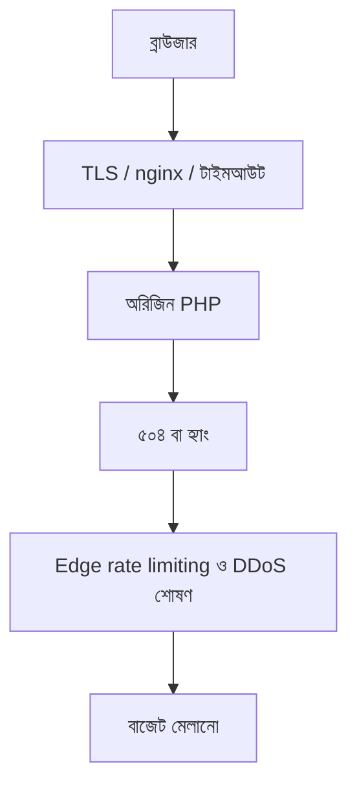

> **পাঠ 90 · মাঝারি ধাপ** - edge-এ token bucket, NAT-shared IP, burst tuning - attack আর marketing email আলাদা করা।

## কেন এটা জরুরি

- প্রক্সির পেছনে Laravel API-এর আসল UX হলো Nginx বাফার, TLS হ্যান্ডশেক খরচ, আর টাইমআউট।
- এজ রেট লিমিট PHP-FPM জাগার আগে অপব্যবহার আটকায়।
- MTU/MSS সমস্যা “এলোমেলো” টাইমআউট, অ্যাপ লগে ব্যাখ্যা মেলে না।
- এই পাঠটা ঠিক **Edge rate limiting ও DDoS শোষণ** নিয়ে। ট্যাগ: rate-limiting, ddos, nginx, waf, edge।

## কী দেখে বুঝবেন সমস্যা আছে

| সংকেত | যা দেখা যায় |
| --- | --- |
| ৫০৪ | PHP শেষ, প্রক্সি আগেই ছেড়েছে |
| TLS কর | মোবাইল p99 হ্যান্ডশেকে, JSON-এ নয় |
| DDoS-সদৃশ | অনঅথেন্টিকেটেড POST-এ লগইন CPU |
| আংশিক বডি | বড় আপলোড প্রক্সি ১ MB লিমিটে মরে |

## কীভাবে ভাঙে



ভাঙে প্রযুক্তির নামে নয়, চুক্তির অভাবে। Vue/Quasar স্ক্রিন আর Laravel রাইট যদি উল্টো উত্তর ধরে, প্রোডাকশন সেই রেসটা খুঁজে বের করে। এই টপিকের চুক্তিটা হলো: edge-এ token bucket, NAT-shared IP, burst tuning - attack আর marketing email আলাদা করা।

## মূল কারণ

1. সবচেয়ে ধীর সৎ জবের চেয়ে proxy_read_timeout ছোট।
2. সার্টে সেশন রিজাম্পশন / HTTP/2 নেই।
3. রেট লিমিট শুধু Laravel-এ, nginx-এ নয়।
4. client_max_body_size ব্লগ থেকে কপি, প্রোডাক্টের সাথে মেলেনি।

## কীভাবে সমাধান করবেন

### ১. ইনভেরিয়েন্ট এক বাক্যে লিখুন

edge-এ token bucket, NAT-shared IP, burst tuning - attack আর marketing email আলাদা করা। এই বাক্য পিআর, Pinia অ্যাকশন, আর Laravel ক্লাসে রাখুন।

### ২. কোডে কিনারা আটকে দিন

```ts
// Axios timeout must be < nginx, or the user retries while PHP still runs
api.defaults.timeout = 12_000
```

```php
# nginx
proxy_read_timeout 30s;
client_max_body_size 12m;
limit_req zone=login burst=20 nodelay;
```

### ৩. যে চার্ট সত্যি দেখবেন, সেটাই রাখুন

এজ ৪xx/৫xx, TLS হ্যান্ডশেক সময়, আর অরিজিন vs এজ হিট। **Edge rate limiting ও DDoS শোষণ**-এর রিগ্রেশন এই চার্টে না ধরা পড়লে পাঠ শেষ হয়নি।

## কাজের উদাহরণ

Quasar ফাইল আপলোড ৯৯%-এ আটকে। nginx `client_max_body_size` ১m, Laravel ৮m নেয়। প্রক্সি লিমিট মিলিয়ে ক্লায়েন্টে সাইজ চেক দিলে ভুত প্রোগ্রেস বার কাটে।

এই টপিকে নিজের শেষ ইনসিডেন্টের লক্ষণ টেবিলে মিলিয়ে নিন, তারপর ডায়াগ্রাম ধরে এগোন যতক্ষণ না উপরের গার্ড আগুন ধরত।

## শিপ করার আগে

- [ ] **Edge rate limiting ও DDoS শোষণ**-এর ইনভেরিয়েন্ট এক বাক্যে লেখা।
- [ ] খালি, ডুপ্লিকেট, টাইমআউট বা পারমিশন পাথের টেস্ট বা রিহার্সাল আছে।
- [ ] এক ডিপ্লয়ের মধ্যে রিগ্রেশন ধরার লগ বা চার্ট আছে।
- [ ] আত্মীয় পাঠ এখনও মিলছে: nginx-edge-tls-termination, geo-routing-and-anycast, retry-storm-prevention।

## যা করবেন না

- অনন্ত রিট্রাই বা এররকে সাকসেস হিসেবে ক্যাশ করা ব্লগ স্নিপেট কপি করবেন না।
- Laravel সারির সত্য Pinia-কে বলে দেবেন না।
- ঘন মনে হলে আগের নম্বরের পাঠ আগে শেষ করুন। পথটা ইচ্ছা করেই শুরু → মাঝারি → উন্নত।
