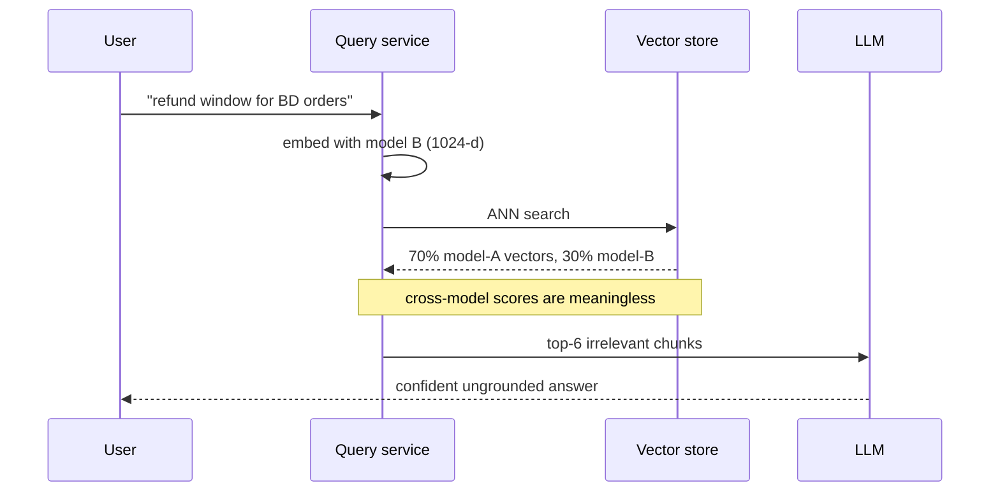
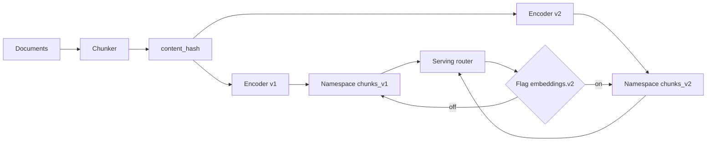

> **Scenario** — Bengali document সমর্থনের জন্য দল ৭৬৮-dimension English embedding model থেকে ১০২৪-dimension multilingual model-এ যাচ্ছে। "nightly backfill-এ index ধরে ফেলবে" ভেবে তারা আগে query path-এ model বদলে দেয়। কয়েক মিনিটেই retrieval quality খাদে পড়ে।

## Why it matters

- দুই model-এর vector সম্পূর্ণ অসম্পর্কিত coordinate system-এ থাকে। তাদের মধ্যে cosine score similarity নয়, noise-এর উপর গাণিতিক ক্রিয়া।
- ৮M chunk backfill করা তাৎক্ষণিক নয়। hosted embedding API-তে ৪০০ chunk/সেকেন্ড হারে পুরো re-embed-এ প্রায় ৫.৫ ঘণ্টা লাগে আর সত্যিকারের টাকা যায় — প্রতি chunk ৩৫০ token ধরে ৮M chunk মানে ২.৮B token।
- Dimension বদলালে index schema সরাসরি ভাঙে, তাই পুরনো collection-এ নতুন vector লেখাই যায় না।
- অর্ধেক migrate হওয়া corpus সবচেয়ে খারাপ failure দেয়: retrieval result দেয় ঠিকই, কিন্তু ranking অর্থহীন।
- Bengali ও অন্যান্য non-Latin script-এর জন্য migration-টাই আসল উদ্দেশ্য — কিন্তু লাভ দেখা যায় corpus পুরো re-embed হওয়ার পরে, তাই খারাপ rollout দেখে মনে হয় নতুন model-ই খারাপ।

## Symptoms

| Signal | What you observe |
|---|---|
| Score collapse | Top-1 cosine ~০.৮৩ থেকে ~০.১২-এ নেমে সব query-তে সমতল |
| Ranking noise | প্রতি deploy-এ একই query ভিন্ন, অসম্পর্কিত top-10 দেয় |
| Dimension error | vector store dimension mismatch বলে write reject করে |
| Partial recovery | backfill এগোনোর সাথে ঘণ্টায় ঘণ্টায় quality ধীরে ভালো হয় |
| Language skew | Bengali query ভালো হয় অথচ English খারাপ হয়, বা উল্টো |

## How it breaks

Embedding space শেখা জিনিস, canonical নয়। Model A "refund policy"-কে এক অঞ্চলে বসাতে পারে, model B একেবারে অন্য জায়গায়; এমন কোনো rotation নেই যা দিয়ে দুটো মেলানো যায়। Query path model B ব্যবহার করছে অথচ corpus-এর ৭০% এখনো model A — তখন ANN search বেশিরভাগ candidate-এর ক্ষেত্রে model-B query-কে model-A vector-এর সাথে তুলনা করে। সেই তুলনাগুলো প্রায়-random score দেয়, তবু sort হয়, তাই সিস্টেম আবর্জনার একটি আত্মবিশ্বাসী ranking তৈরি করে।



## Root causes

1. Corpus re-encode হওয়ার আগেই query encoder বদলে ফেলা হয়েছে।
2. Vector-এ `model_version` field নেই, তাই মিশ্র প্রজন্মের row আলাদা করা বা filter করা যায় না।
3. নতুন namespace-এ না লিখে model version জুড়ে একই collection পুনর্ব্যবহার করা হয়েছে।
4. Backfill-এর কোনো progress metric নেই যা cutover সিদ্ধান্তের সাথে যুক্ত।
5. শুরু করার আগে একই golden set-এ পুরনো ও নতুন model-এর offline তুলনা হয়নি।

## How to solve it

### 1. আগে offline-এ প্রমাণ করুন নতুন model ভালো

৫০k chunk-এর একটি sample ও golden query set re-embed করে retrieval metric মুখোমুখি তুলনা করুন। রিপোর্ট ভাষা অনুযায়ী ভাগ করুন।

```python
for name, encoder in (("v1-768", old_encoder), ("v2-1024", new_encoder)):
    idx = build_index([encoder(c) for c in sample_chunks])
    for bucket in ("en", "bn", "identifier"):
        qs = [q for q in golden if q.bucket == bucket]
        r = mean(recall_at_k(idx.search(encoder(q.text), 10), q.relevant) for q in qs)
        n = mean(ndcg_at_k(idx.search(encoder(q.text), 10), q.relevant, 10) for q in qs)
        print(f"{name} {bucket}: recall@10={r:.3f} nDCG@10={n:.3f}")
```

যে bucket নিয়ে আপনার মাথাব্যথা সেখানে নতুন model না জিতলে এখানেই থামুন — ২.৮B token বেঁচে গেল।

### 2. নতুন namespace-এ লিখুন, কখনো in-place নয়

```python
NAMESPACES = {"v1-768": "chunks_v1", "v2-1024": "chunks_v2"}

vector_db.create_collection(
    name="chunks_v2", dimension=1024, metric="cosine",
    index_params={"M": 32, "efConstruction": 200},
)
```

প্রতিটি row-তে `model_version`, `embedded_at` আর যে `content_hash` থেকে এসেছে তা রাখুন। `content_hash` ছাড়া document edit-এর পরে stale vector আর fresh vector আলাদা করা যায় না।

### 3. Resumable cursor সহ idempotent backfill

```python
def backfill(batch_size: int = 256) -> None:
    cursor = state.get("last_chunk_id", 0)
    while chunks := repo.fetch_after(cursor, limit=batch_size):
        pending = [c for c in chunks if not store.has(c.id, "v2-1024", c.content_hash)]
        if pending:
            vectors = new_encoder([c.text for c in pending])
            store.upsert("chunks_v2", zip([c.id for c in pending], vectors))
        cursor = chunks[-1].id
        state.set("last_chunk_id", cursor)
        metrics.gauge("backfill.progress", repo.progress_ratio(cursor))
```

শুরুর আগে খরচের হিসাব: ৮M chunk × ৩৫০ token = ২.৮B token। প্রতি মিলিয়ন input token $0.02 হলে $56 — সস্তা। $0.13 হলে $364, যেটা হঠাৎ invoice নয়, budget approval-এর যোগ্য।

### 4. Parity না আসা পর্যন্ত shadow-read করুন

`chunks_v1` থেকেই serve করতে থাকুন। পাশাপাশি প্রতিটি production query `chunks_v2`-তেও চালিয়ে দুই result set log করুন। Rank overlap তুলনা করুন এবং একটি sample-এ human বা LLM-judged relevance দেখুন। `chunks_v2`-তে পূর্ণ coverage এলে আর golden set-এ জিতলে তবেই cut over করুন।

### 5. Flag-এর পেছনে cut over, পুরনো namespace গরম রাখুন

```ts
const namespace = flags.enabled('embeddings.v2', { tenant }) ? 'chunks_v2' : 'chunks_v1'
```

অন্তত একটি পূর্ণ incident cycle পর্যন্ত `chunks_v1` রাখুন। Rollback মানে হবে flag flip, নতুন করে backfill নয়।

## Target design



## Tradeoffs

| Option | Pros | Cons | Choose when |
|---|---|---|---|
| In-place swap | সবচেয়ে সরল, বাড়তি storage নেই | মিশ্র vector সহ নিশ্চিত outage window | corpus এত ছোট যে মিনিটে re-embed হয় |
| Dual namespace | zero-downtime, তাৎক্ষণিক rollback | migration-কালে ২ গুণ vector storage | deploy-এর মধ্যে re-embed করা যায় না এমন corpus |
| Ingest-এ dual-write | নতুন doc প্রথম দিন থেকেই দুটোতেই সঠিক | প্রতি document-এ দুটি encoder call | লম্বা migration, সক্রিয় write |
| Matryoshka truncation | এক model একাধিক dimension-এ | শুধু এক model family-র ভেতরে চলে | নতুন model nested dimension সমর্থন করে |
| Migration পেছানো | খরচ নেই, ঝুঁকি নেই | Bengali retrieval খারাপই থাকে | multilingual লাভ এখনো যথেষ্ট নয় |

## Verification checklist

- [ ] একই golden set-এ দুই model-এর জন্য ভাষা-bucket অনুযায়ী `recall@10` ও `nDCG@10` রিপোর্ট করা হয়েছে।
- [ ] কোনো traffic যাওয়ার আগেই `chunks_v2`-এর row count উৎস chunk count-এর সমান।
- [ ] প্রতিটি vector-এ `model_version` ও `content_hash` আছে।
- [ ] Backfill job kill হলেও cursor থেকে resume করে, খরচ দ্বিগুণ না করে।
- [ ] অন্তত ২৪ ঘণ্টার production traffic-এ shadow-read rank overlap log করা হয়েছে।
- [ ] Flag flip করে rollback পরীক্ষা করা হয়েছে এবং latency ও quality baseline-এ ফিরেছে।

## Anti-patterns

- আগে query encoder বদলে corpus-কে "ধরে ফেলতে" বলা।
- ছোট vector-এ zero-padding দিয়ে এক collection-এ dimension মেশানো।
- Cutover-এর দিনই পুরনো namespace মুছে ফেলা।
- শুধু aggregate metric দেখে migration বিচার করা, ফলে এক ভাষার regression চাপা পড়ে।
- `content_hash` check না থাকায় প্রতি backfill run-এ অপরিবর্তিত chunk আবার embed করা।

## Related

- [Vector index selection and ANN parameter tuning](/systems/ai-rag-agents/vector-index-selection-and-tuning)
- [Eval harness design for LLM features in CI](/systems/ai-rag-agents/eval-harness-design)
- [RAG chunking strategies and offline evals](/systems/ai-rag-agents/rag-chunking-evals)
