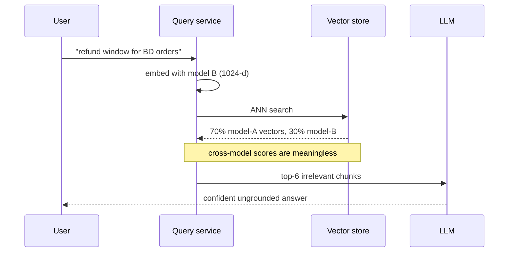
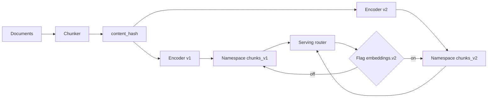

> **Scenario** - The team upgrades from a 768-dimension English embedding model to a 1024-dimension multilingual one to support Bengali documents. They swap the model in the query path first because "the index will catch up during the nightly backfill." Retrieval quality falls off a cliff within minutes.

## Why it matters

- Vectors from two different models live in unrelated coordinate systems. A cosine score between them is arithmetic on noise, not similarity.
- Backfilling 8M chunks is not instant. At 400 chunks/second through a hosted embedding API, a full re-embed takes about 5.5 hours and costs real money - 8M chunks at 350 tokens each is 2.8B tokens.
- Dimension changes break the index schema outright, so you cannot even write the new vectors into the old collection.
- Half-migrated corpora produce the worst possible failure: retrieval still returns results, ranked meaninglessly.
- For Bengali and other non-Latin scripts, the migration is usually the whole point - but the win only appears after the corpus is fully re-embedded, so a bad rollout looks like the new model is worse.

## Symptoms

| Signal | What you observe |
|---|---|
| Score collapse | Top-1 cosine drops from ~0.83 to ~0.12 and stays flat across queries |
| Ranking noise | The same query returns a different, unrelated top-10 on each deploy |
| Dimension error | The vector store rejects writes with a dimension mismatch |
| Partial recovery | Quality improves gradually over hours as the backfill progresses |
| Language skew | Bengali queries improve while English regresses, or the reverse |

## How it breaks

Embedding spaces are learned, not canonical. Model A may place "refund policy" at one region and model B somewhere else entirely; there is no rotation you can apply to reconcile them. When the query path uses model B and 70% of the corpus is still model A, the ANN search is comparing a model-B query against model-A vectors for most candidates. Those comparisons return near-random scores that nevertheless sort, so the system produces a confident ranking of garbage.



## Root causes

1. The query encoder was switched before the corpus was re-encoded.
2. Vectors carry no `model_version` field, so mixed-generation rows cannot be distinguished or filtered.
3. One collection is reused across model versions instead of writing to a new namespace.
4. The backfill has no progress metric tied to the cutover decision.
5. No offline comparison of old versus new model on the same golden set before starting.

## How to solve it

### 1. Prove the new model is better, offline, first

Re-embed a 50k-chunk sample plus the golden query set and compare retrieval metrics head to head. Split the report by language.

```python
for name, encoder in (("v1-768", old_encoder), ("v2-1024", new_encoder)):
    idx = build_index([encoder(c) for c in sample_chunks])
    for bucket in ("en", "bn", "identifier"):
        qs = [q for q in golden if q.bucket == bucket]
        r = mean(recall_at_k(idx.search(encoder(q.text), 10), q.relevant) for q in qs)
        n = mean(ndcg_at_k(idx.search(encoder(q.text), 10), q.relevant, 10) for q in qs)
        print(f"{name} {bucket}: recall@10={r:.3f} nDCG@10={n:.3f}")
```

If the new model does not win on the buckets you care about, stop here - you have saved 2.8B tokens.

### 2. Write to a new namespace, never in place

```python
NAMESPACES = {"v1-768": "chunks_v1", "v2-1024": "chunks_v2"}

vector_db.create_collection(
    name="chunks_v2", dimension=1024, metric="cosine",
    index_params={"M": 32, "efConstruction": 200},
)
```

Every row carries `model_version`, `embedded_at`, and the `content_hash` it was derived from. Without `content_hash` you cannot tell a stale vector from a fresh one after a document edit.

### 3. Backfill idempotently with a resumable cursor

```python
def backfill(batch_size: int = 256) -> None:
    cursor = state.get("last_chunk_id", 0)
    while chunks := repo.fetch_after(cursor, limit=batch_size):
        pending = [c for c in chunks if not store.has(c.id, "v2-1024", c.content_hash)]
        if pending:
            vectors = new_encoder([c.text for c in pending])
            store.upsert("chunks_v2", zip([c.id for c in pending], vectors))
        cursor = chunks[-1].id
        state.set("last_chunk_id", cursor)
        metrics.gauge("backfill.progress", repo.progress_ratio(cursor))
```

Cost arithmetic before you start: 8M chunks × 350 tokens = 2.8B tokens. At $0.02 per million input tokens that is $56 - cheap. At $0.13 per million it is $364, which is worth a budget approval rather than a surprise invoice.

### 4. Shadow-read until parity

Keep serving from `chunks_v1`. In parallel, run each production query against `chunks_v2` and log both result sets. Compare rank overlap and, on a sample, human or LLM-judged relevance. Only cut over when `chunks_v2` has full coverage and wins on the golden set.

### 5. Cut over behind a flag, keep the old namespace warm

```ts
const namespace = flags.enabled('embeddings.v2', { tenant }) ? 'chunks_v2' : 'chunks_v1'
```

Retain `chunks_v1` for at least one full incident cycle. Rollback should be a flag flip, not a re-backfill.

## Target design



## Tradeoffs

| Option | Pros | Cons | Choose when |
|---|---|---|---|
| In-place swap | Simplest, no extra storage | Guaranteed outage window with mixed vectors | Corpus small enough to re-embed in minutes |
| Dual namespace | Zero-downtime, instant rollback | 2x vector storage during migration | Any corpus you cannot re-embed in a deploy |
| Dual-write at ingest | New docs correct in both from day one | Two encoder calls per document | Long migrations with active writes |
| Matryoshka truncation | Reuse one model at multiple dimensions | Only works within a model family | The new model supports nested dimensions |
| Delay migration | No cost, no risk | Bengali retrieval stays poor | The multilingual gain is not yet worth it |

## Verification checklist

- [ ] Offline `recall@10` and `nDCG@10` reported per language bucket for both models on the same golden set.
- [ ] `chunks_v2` row count equals the source chunk count before any traffic is routed to it.
- [ ] Every vector carries `model_version` and `content_hash`.
- [ ] Backfill job survives a kill and resumes from its cursor without duplicating spend.
- [ ] Shadow-read rank overlap logged for at least 24 hours of production traffic.
- [ ] Rollback tested by flipping the flag and confirming latency and quality return to baseline.

## Anti-patterns

- Switching the query encoder first and letting the corpus "catch up".
- Mixing dimensions in one collection by zero-padding the shorter vectors.
- Deleting the old namespace on cutover day.
- Judging the migration on aggregate metrics only, hiding a regression in one language.
- Re-embedding unchanged chunks on every backfill run because there is no `content_hash` check.

## Related

- [Vector index selection and ANN parameter tuning](/systems/ai-rag-agents/vector-index-selection-and-tuning)
- [Eval harness design for LLM features in CI](/systems/ai-rag-agents/eval-harness-design)
- [RAG chunking strategies and offline evals](/systems/ai-rag-agents/rag-chunking-evals)
