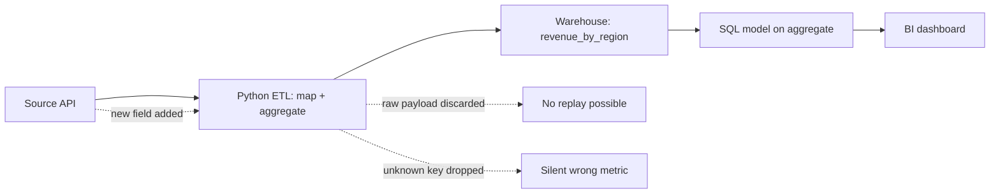
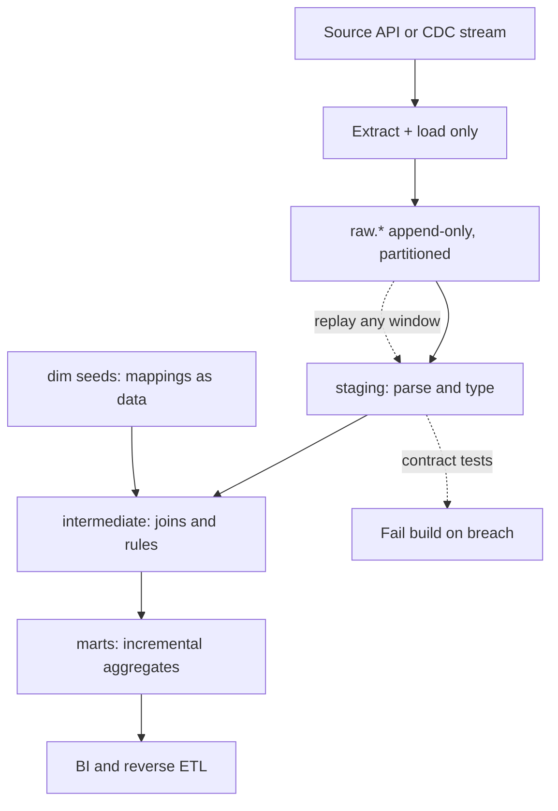

> **Scenario** - Finance জানাল গত quarter-এর region-wise revenue ভুল। `country_code` থেকে region map করার transformation ছয় সপ্তাহ আগে একটি Python ETL job-এর ভিতরে চলেছিল, শুধু aggregated result লিখেছিল, raw payload কখনও land করা হয়নি। পুরনো বা নতুন - কোনো সংখ্যাই এখন reproduce করা যাচ্ছে না।

## Why it matters

- load-এর আগে transform হলে source আসলে কী বলেছিল তার একমাত্র প্রমাণ raw record - আর সেটাই ফেলে দেওয়া হয়েছে। প্রতিটি audit তখন archaeology।
- ছয় সপ্তাহের history re-run করতে ELT-তে একটি SQL statement লাগে, ETL-তে পুরো pipeline redeploy। এই পার্থক্যই ২০ মিনিটের fix আর দুই দিনের incident-এর মধ্যে দূরত্ব।
- Warehouse compute metered। প্রতি `dbt run`-এ ৪ TB table full scan করা naive ELT $900/month bill-কে $9,000 বানায়, invoice আসার আগে কেউ টের পায় না।
- On-call load transformation boundary অনুসরণ করে: ETL failure Python ও Airflow-এর owner data engineer-কে page করে; ELT failure SQL model owner-কে - যিনি প্রায়ই pager-বিহীন analyst।
- Compliance deletion request প্রতিটি copy-তে পৌঁছাতে হবে। load-এর আগে বেশি stage মানে personal data-র বেশি undocumented intermediate copy।

## Symptoms

| Signal | What you observe |
| --- | --- |
| Unreproducible history | metric definition বদলাল, পুরনো value recompute করার raw layer নেই |
| Warehouse spend spike | তিনটি model যোগ করার পরে `dbt run` ৮ মিনিট থেকে ৭০ মিনিট, প্রতিবার full-refresh |
| Silent column loss | নতুন field API payload-এ আছে কিন্তু warehouse-এ নেই - ETL mapper unknown key drop করে |
| Long fix latency | "region mapping বদলাও" মানে code review + deploy + backfill, এক model edit নয় |
| Duplicated logic | একই `is_active` rule Python job, dbt model ও BI tool-এ, তিনটি ভিন্ন উত্তর দেয় |

## How it breaks

সমস্যা সাধারণত choice নয়; সমস্যা হলো এমন একটি hybrid যা কেউ design করেনি। Team ETL দিয়ে শুরু করে কারণ source API-তে pagination ও auth Python-এ দরকার। এরপর analyst-এর এমন metric লাগে যা ETL job দেয় না, তাই সে aggregate-এর উপরে একটি SQL model বসায়। এখন lineage হলো Python → aggregate table → SQL → dashboard, আর SQL layer সেই column গুলো দেখতেই পায় না যেগুলো Python layer ফেলে দিয়েছে।

Source বদলালে Python job হয় নতুন field নীরবে drop করে, নয়তো crash করে। Drop করলে SQL layer বিশ্বাসযোগ্য দেখতে একটি ভুল সংখ্যা বের করে। কোনো মানুষ external system-এর সঙ্গে মিলিয়ে না দেখা পর্যন্ত কেউ জানে না।



## Root causes

1. Durable landing zone-এর আগে transformation logic বসানো, ফলে raw input কখনও persist হয় না।
2. ingestion (bytes সরানো) ও modelling (অর্থ দেওয়া) আলাদা না করা।
3. ELT model incremental-এর বদলে `table` materialisation ও full refresh, ফলে cost নতুন data নয় - history-র সঙ্গে বাড়ে।
4. Business rule extraction script, warehouse model ও BI semantic layer - তিন জায়গায় duplicate।
5. Column-level lineage নেই, তাই upstream rename কোন dashboard ভাঙবে তা trace করা যায় না।
6. Schema-on-write ingestion যা unexpected field reject বা drop করে, পরে inspect করার জন্য land করে না।

## How to solve it

### 1. আগে raw land করুন, সবসময়

Ingestion-এর কাজ ঠিক একটাই: bytes অপরিবর্তিতভাবে metadata সহ cheap storage-এ আনা। Transformation আলাদা, replayable job।

```python
import hashlib
import json
from datetime import datetime, timezone

import pandas as pd


def land_raw(records: list[dict], source: str, run_id: str) -> pd.DataFrame:
    """Land payloads unchanged; add only lineage columns."""
    ingested_at = datetime.now(timezone.utc)
    rows = []
    for record in records:
        body = json.dumps(record, sort_keys=True, separators=(",", ":"))
        rows.append(
            {
                "source": source,
                "run_id": run_id,
                "record_hash": hashlib.sha256(body.encode()).hexdigest(),
                "ingested_at": ingested_at,
                "payload": body,
            }
        )
    frame = pd.DataFrame(rows)
    # Dedupe within the batch; the merge downstream handles cross-batch dupes.
    return frame.drop_duplicates(subset=["record_hash"])
```

### 2. Raw table append-only ও partitioned রাখুন

```sql
CREATE TABLE IF NOT EXISTS raw.orders_events (
  source        TEXT        NOT NULL,
  run_id        TEXT        NOT NULL,
  record_hash   TEXT        NOT NULL,
  ingested_at   TIMESTAMPTZ NOT NULL,
  payload       JSONB       NOT NULL,
  PRIMARY KEY (record_hash)
) PARTITION BY RANGE (ingested_at);
```

`record_hash` primary key হলে একই batch আবার land করা no-op - ingestion task retry হলে ঠিক এটাই চাই।

### 3. Warehouse-এ incremental transform করুন

```sql
-- models/marts/revenue_by_region.sql
{{ config(materialized='incremental', unique_key='order_id',
          incremental_strategy='merge') }}

WITH parsed AS (
  SELECT
    payload->>'order_id'                     AS order_id,
    (payload->>'amount_cents')::BIGINT       AS amount_cents,
    payload->>'country_code'                 AS country_code,
    (payload->>'occurred_at')::TIMESTAMPTZ   AS occurred_at
  FROM {{ source('raw', 'orders_events') }}
  
    WHERE ingested_at > (SELECT COALESCE(MAX(ingested_at), '1970-01-01')
                         FROM {{ this }})
  
)
SELECT
  p.order_id,
  p.occurred_at,
  p.amount_cents,
  COALESCE(m.region, 'unmapped') AS region
FROM parsed p
LEFT JOIN {{ ref('dim_country_region') }} m
  ON m.country_code = p.country_code;
```

`LEFT JOIN` + `COALESCE` ইচ্ছাকৃত: unknown country row drop না হয়ে দৃশ্যমান `unmapped` bucket-এ যায়। `unmapped` ০.৫%-এর বেশি হলে fail করে এমন test যোগ করুন।

### 4. Mapping-কে code নয়, data হিসেবে রাখুন

`dim_country_region` seed table বা ছোট managed table হওয়া উচিত। তখন region assignment বদলানো মানে একটি insert ও model re-run, deploy নয়।

### 5. Boundary স্পষ্ট করে লিখে রাখুন

Ingestion-এর দায়িত্ব: auth, pagination, rate limit, retry, landing। Modelling-এর দায়িত্ব: parsing, typing, join, business rule, aggregation। যেখানে secret বা HTTP client লাগে সেটা ingestion; বাকি সব SQL।

## Target design



## Tradeoffs

| Option | Pros | Cons | Choose when |
| --- | --- | --- | --- |
| ETL (load-এর আগে transform) | ছোট warehouse footprint; land করার আগেই PII mask; দুর্বল destination-এও চলে | raw replay নেই; fix-এ code deploy; logic Python-এ লুকানো | destination দামি বা restricted, বা regulation raw PII land করতে দেয় না |
| ELT (load-এর পরে transform) | সস্তা replay; SQL-জানা contributor; lineage tooling কাজ করে | warehouse cost বাড়ে; raw PII land করে ও govern করতে হয় | storage সস্তা, warehouse elastic, metric definition analyst-দের হাতে |
| Hybrid (হালকা ETL, ভারী ELT) | edge-এ redaction ও shaping, SQL-এ modelling | column হারালে দুই জায়গায় খুঁজতে হয় | ingestion-এ PII tokenise করা বাধ্যতামূলক কিন্তু modelling SQL-এ চাই |
| Streaming transform (in-flight ETL) | এক মিনিটের কম freshness | replay সবচেয়ে কঠিন; state management সত্যিকারের কাজ | এক মিনিটের কম freshness product requirement |

## Verification checklist

- [ ] ৬০ দিন আগের একটি random dashboard সংখ্যা নিন, শুধু `raw.*` থেকে reproduce করুন।
- [ ] সম্পন্ন partition-এর ingestion task দুবার চালান; `raw.*`-এ row count বদলায় না।
- [ ] সাধারণ দিনে `dbt run` শুধু নতুন partition scan করে - wall clock নয়, query history-তে bytes scanned দেখুন।
- [ ] staging fixture-এ unknown `country_code` দিন; `unmapped` test build fail করে।
- [ ] প্রতিটি business rule ঠিক একটি model-এ আছে; repo-তে rule name grep করুন।
- [ ] `raw.payload` থেকে প্রতিটি mart column পর্যন্ত column-level lineage catalog tool-এ resolve হয়।
- [ ] Deletion request raw, staging ও marts কভার করা documented query list দিয়ে পূরণ হয়।

## Anti-patterns

- "raw layer পরে যোগ করব।" Raw layer শুধু ইতিমধ্যে land করা data-র জন্য কাজে আসে; পরে যোগ করলে history ফেরে না।
- incremental logic ঝামেলার বলে সবখানে full-refresh materialisation - bill আসা পর্যন্ত।
- schema পরিষ্কার রাখার নামে ingestion layer-এ unknown JSON key drop করা।
- দ্রুত হবে বলে BI tool-এ business rule লেখা, ফলে `active_user`-এর চতুর্থ definition তৈরি।
- `dbt test` warning-কে informational ভাবা; যে warning কেউ পড়ে না, সেটা contract নয়।
- staging layer জুড়ে `SELECT *` ব্যবহার, ফলে upstream column যোগ হলে downstream schema নীরবে বদলায়।

## Related

- [Data quality contracts between producers and consumers](/systems/data-pipelines-ml/data-quality-contracts)
- [Batch vs streaming: picking the cheaper correctness](/systems/data-pipelines-ml/batch-vs-streaming-pipelines)
- [Idempotent backfills that can be re-run safely](/systems/data-pipelines-ml/idempotent-backfills)
- [Schema drift detection before it reaches the model](/systems/data-pipelines-ml/schema-drift-detection)
