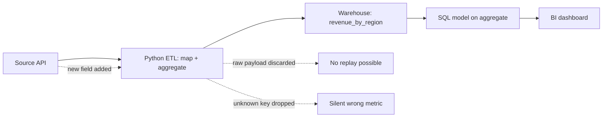
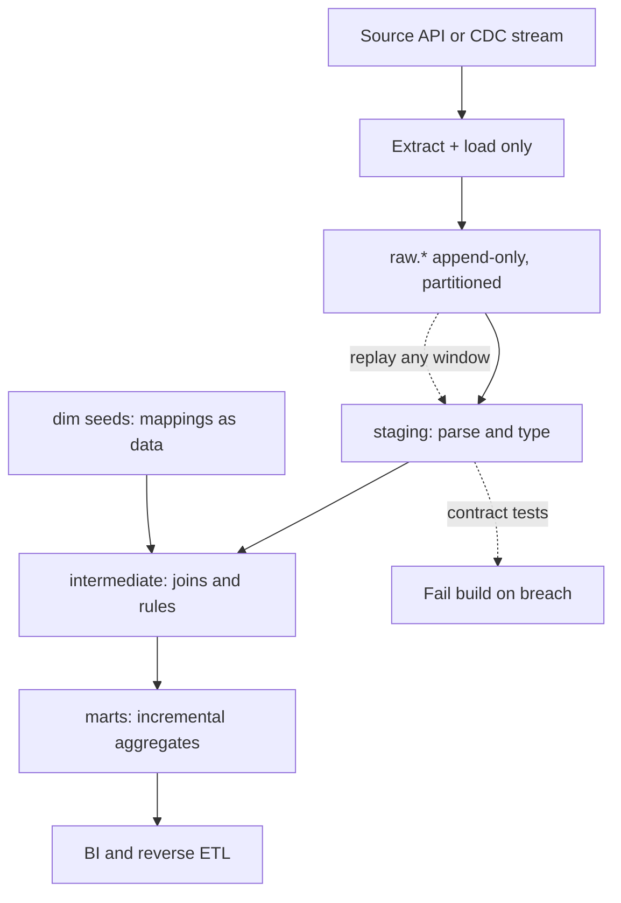

> **Scenario** — Finance reports that last quarter's revenue by region is wrong. The transformation that mapped `country_code` to region ran inside a Python ETL job six weeks ago, wrote only the aggregated result, and the raw payloads were never landed. Nobody can reproduce the old numbers or the new ones.

## Why it matters

- When transformation happens before load, the raw record is the only evidence of what the source actually said — and you threw it away. Every audit becomes an archaeology project.
- Re-running six weeks of history costs one SQL statement in ELT and a full pipeline redeploy in ETL. That difference is the gap between a 20-minute fix and a two-day incident.
- Warehouse compute is metered. Naive ELT that re-scans a 4 TB table on every `dbt run` turns a $900/month bill into $9,000 without anyone noticing until the invoice.
- On-call load follows the transformation boundary: ETL failures page a data engineer who owns Python and Airflow; ELT failures page whoever owns SQL models, which is often an analyst with no pager.
- Compliance deletion requests must reach every copy. More transformation stages before load means more undocumented intermediate copies of personal data.

## Symptoms

| Signal | What you observe |
| --- | --- |
| Unreproducible history | A metric changes definition and there is no raw layer to recompute the old value from |
| Warehouse spend spike | `dbt run` wall-clock grows from 8 min to 70 min after adding three models, full-refresh on every run |
| Silent column loss | An upstream field appears in the API payload but never in the warehouse, because the ETL mapper drops unknown keys |
| Long fix latency | "Change region mapping" is a code review, a deploy, and a backfill instead of one model edit |
| Duplicated logic | The same `is_active` rule exists in a Python job, a dbt model, and a BI tool, with three different answers |

## How it breaks

The failure is rarely the choice itself; it is a hybrid that nobody designed. A team starts with ETL because the source API needs pagination and auth in Python. Then an analyst needs a metric that the ETL job does not produce, so they add a SQL model on top of the aggregate. Now the lineage is Python → aggregate table → SQL → dashboard, and the SQL layer cannot see the columns the Python layer discarded.

When the source changes, the Python job either drops the new field silently or crashes. If it drops it, the SQL layer computes a plausible-looking wrong number. Nobody notices until a human compares against an external system.



## Root causes

1. Transformation logic placed before the durable landing zone, so raw input is never persisted.
2. No separation between ingestion (move bytes) and modelling (assign meaning).
3. ELT models written as `table` materialisation with full refresh instead of incremental, so cost scales with history, not with new data.
4. Business rules duplicated across the extraction script, the warehouse models, and the BI semantic layer.
5. No column-level lineage, so an upstream rename cannot be traced to the dashboards it will break.
6. Schema-on-write ingestion that rejects or drops unexpected fields instead of landing them for later inspection.

## How to solve it

### 1. Land raw first, always

Ingestion should do exactly one thing: get the bytes into cheap storage with metadata, unchanged. Transformation is a separate, replayable job.

```python
import hashlib
import json
from datetime import datetime, timezone

import pandas as pd


def land_raw(records: list[dict], source: str, run_id: str) -> pd.DataFrame:
    """Land payloads unchanged; add only lineage columns."""
    ingested_at = datetime.now(timezone.utc)
    rows = []
    for record in records:
        body = json.dumps(record, sort_keys=True, separators=(",", ":"))
        rows.append(
            {
                "source": source,
                "run_id": run_id,
                "record_hash": hashlib.sha256(body.encode()).hexdigest(),
                "ingested_at": ingested_at,
                "payload": body,
            }
        )
    frame = pd.DataFrame(rows)
    # Dedupe within the batch; the merge downstream handles cross-batch dupes.
    return frame.drop_duplicates(subset=["record_hash"])
```

### 2. Make the raw table append-only and partitioned

```sql
CREATE TABLE IF NOT EXISTS raw.orders_events (
  source        TEXT        NOT NULL,
  run_id        TEXT        NOT NULL,
  record_hash   TEXT        NOT NULL,
  ingested_at   TIMESTAMPTZ NOT NULL,
  payload       JSONB       NOT NULL,
  PRIMARY KEY (record_hash)
) PARTITION BY RANGE (ingested_at);
```

`record_hash` as the primary key makes re-landing the same batch a no-op, which is what you want when an ingestion task retries.

### 3. Transform in the warehouse, incrementally

```sql
-- models/marts/revenue_by_region.sql
{{ config(materialized='incremental', unique_key='order_id',
          incremental_strategy='merge') }}

WITH parsed AS (
  SELECT
    payload->>'order_id'                     AS order_id,
    (payload->>'amount_cents')::BIGINT       AS amount_cents,
    payload->>'country_code'                 AS country_code,
    (payload->>'occurred_at')::TIMESTAMPTZ   AS occurred_at
  FROM {{ source('raw', 'orders_events') }}
  
    WHERE ingested_at > (SELECT COALESCE(MAX(ingested_at), '1970-01-01')
                         FROM {{ this }})
  
)
SELECT
  p.order_id,
  p.occurred_at,
  p.amount_cents,
  COALESCE(m.region, 'unmapped') AS region
FROM parsed p
LEFT JOIN {{ ref('dim_country_region') }} m
  ON m.country_code = p.country_code;
```

The `LEFT JOIN` plus `COALESCE` is deliberate: an unknown country becomes a visible `unmapped` bucket rather than a dropped row. Add a test that fails when `unmapped` exceeds 0.5% of rows.

### 4. Keep the mapping as data, not code

`dim_country_region` should be a seed table or a small managed table. Changing a region assignment is then an insert plus a model re-run, not a deploy.

### 5. Decide the boundary explicitly

Write it down: ingestion owns auth, pagination, rate limits, retries, and landing. Modelling owns parsing, typing, joins, business rules, and aggregation. Anything that needs a secret or an HTTP client lives in ingestion; everything else lives in SQL.

## Target design



## Tradeoffs

| Option | Pros | Cons | Choose when |
| --- | --- | --- | --- |
| ETL (transform before load) | Small warehouse footprint; PII can be masked before it lands; works with weak destinations | No raw replay; fixes need code deploys; logic hidden in Python | The destination is expensive or restricted, or regulation forbids landing raw PII |
| ELT (transform after load) | Cheap replay; SQL-literate contributors; lineage tooling works | Warehouse cost grows; raw PII lands and must be governed | Storage is cheap, warehouse is elastic, and analysts own metric definitions |
| Hybrid (light ETL, heavy ELT) | Redaction and shaping at the edge, modelling in SQL | Two places to look when a column is missing | You must tokenise PII at ingestion but want SQL modelling |
| Streaming transform (ETL in flight) | Sub-minute freshness | Hardest to replay; state management is real work | Freshness under one minute is a product requirement |

## Verification checklist

- [ ] Pick a random dashboard number from 60 days ago and reproduce it from `raw.*` alone.
- [ ] Re-run the ingestion task for a completed partition twice; row counts in `raw.*` do not change.
- [ ] `dbt run` on a normal day scans new partitions only — check bytes scanned in the query history, not just wall clock.
- [ ] Add an unknown `country_code` in a staging fixture; the `unmapped` test fails the build.
- [ ] Every business rule appears in exactly one model; grep the repo for the rule name.
- [ ] Column-level lineage from `raw.payload` to each mart column is resolvable in your catalog tool.
- [ ] A deletion request can be satisfied by a documented query list covering raw, staging, and marts.

## Anti-patterns

- "We'll add the raw layer later." The raw layer only has value for data you already landed; adding it later does not recover history.
- Full-refresh materialisation everywhere because incremental logic is fiddly — until the bill arrives.
- Dropping unknown JSON keys in the ingestion layer to keep the schema tidy.
- Encoding business rules in the BI tool because it is faster, creating a fourth definition of `active_user`.
- Treating `dbt test` warnings as informational; a warning nobody reads is not a contract.
- Using `SELECT *` through the staging layer, so an upstream column addition silently changes downstream schemas.

## Related

- [Data quality contracts between producers and consumers](/systems/data-pipelines-ml/data-quality-contracts)
- [Batch vs streaming: picking the cheaper correctness](/systems/data-pipelines-ml/batch-vs-streaming-pipelines)
- [Idempotent backfills that can be re-run safely](/systems/data-pipelines-ml/idempotent-backfills)
- [Schema drift detection before it reaches the model](/systems/data-pipelines-ml/schema-drift-detection)
