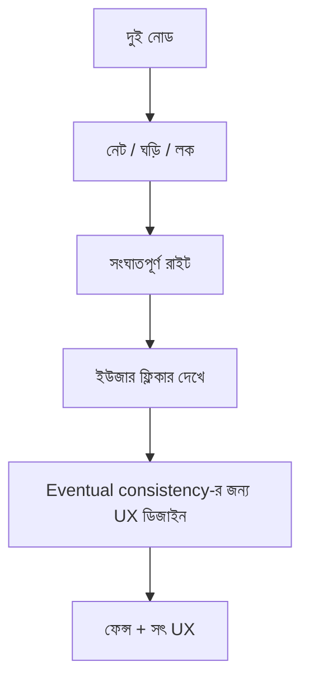

> **পাঠ 98 · মাঝারি ধাপ** - User replication lag নিয়ে bug করে না; সদ্য post করা comment হারিয়ে গেলে bug করে। Read-your-writes একটি product requirement, database feature নয়।

## কেন এটা জরুরি

- দুটো Laravel বক্স আর একটা Redis লকেও ঘড়ি, স্প্লিট ব্রেইন, আর “এক্সাক্টলি ওয়ান্স”-এর গল্প লাগে।
- PACELC হলো CAP-এর দুপুরের মেনু: নেট ঠিক থাকলেও কনসিস্টেন্সির জন্য লেটেন্সি দিতে হয়।
- গসিপ, মেম্বারশিপ, মাল্টি-রিজিয়ন ফেইলওভার-“অন্য DC ডাউন” ইউজারের ব্যানার হয়।
- এই পাঠটা ঠিক **Eventual consistency-র জন্য UX ডিজাইন** নিয়ে। ট্যাগ: eventual-consistency, read-your-writes, ux, replication-lag।

## কী দেখে বুঝবেন সমস্যা আছে

| সংকেত | যা দেখা যায় |
| --- | --- |
| স্প্লিট | দুই লিডার দুজনেই রাইট নেয় |
| ঘড়ি | NTP সরে গেছে, LWW নতুন টিকিট মুছে |
| ফেইলওভার | ৩০ মিনিট DNS অসুস্থ রিজিয়নে |
| মায়া | টিম ভাবে Kafka এন্ড-টু-এন্ড এক্সাক্টলি-ওয়ান্স |

## কীভাবে ভাঙে



ভাঙে প্রযুক্তির নামে নয়, চুক্তির অভাবে। Vue/Quasar স্ক্রিন আর Laravel রাইট যদি উল্টো উত্তর ধরে, প্রোডাকশন সেই রেসটা খুঁজে বের করে। এই টপিকের চুক্তিটা হলো: User replication lag নিয়ে bug করে না; সদ্য post করা comment হারিয়ে গেলে bug করে। Read-your-writes একটি product requirement, database feature নয়।

## মূল কারণ

1. লকে ফেন্সিং টোকেন নেই; পজ করা প্রসেস লিখতে থাকে।
2. হোস্টের টাইমস্ট্যাম্প তুলনা, সত্যিকারের টাইম সোর্স নেই।
3. হেলথ চেক nginx ২০০, Laravel ডিপেন্ডেন্সি নয়।
4. ব্রোকারের ডেলিভারি গ্যারান্টি আর বিজনেস আইডেমপোটেন্সি গুলিয়ে ফেলা।

## কীভাবে সমাধান করবেন

### ১. ইনভেরিয়েন্ট এক বাক্যে লিখুন

User replication lag নিয়ে bug করে না; সদ্য post করা comment হারিয়ে গেলে bug করে। Read-your-writes একটি product requirement, database feature নয়। এই বাক্য পিআর, Pinia অ্যাকশন, আর Laravel ক্লাসে রাখুন।

### ২. কোডে কিনারা আটকে দিন

```ts
// Show eventual consistency honestly in the UI
if (ticket.status === 'pending_sync') return 'Saving across regions…'
```

```php
Cache::lock('ticket:'.$id, 10)->get(function () use ($id) {
    // fencing: lock owner id stored; expired owner must not commit
    return Ticket::query()->findOrFail($id);
});
```

### ৩. যে চার্ট সত্যি দেখবেন, সেটাই রাখুন

ক্রস-রিজিয়ন ল্যাগ, লক ওয়েট, আর স্প্লিট-ব্রেইন ধরা। **Eventual consistency-র জন্য UX ডিজাইন**-এর রিগ্রেশন এই চার্টে না ধরা পড়লে পাঠ শেষ হয়নি।

## কাজের উদাহরণ

রিপোর্ট জব GC-তে পজ, Redis লক শেষ। জব ফিরে নতুন এডিট ওভাররাইট করে। ফেন্সিং টোকেন (সারিতে লক জেনারেশন) দেরি লেখককে অ্যাবর্ট করায়।

এই টপিকে নিজের শেষ ইনসিডেন্টের লক্ষণ টেবিলে মিলিয়ে নিন, তারপর ডায়াগ্রাম ধরে এগোন যতক্ষণ না উপরের গার্ড আগুন ধরত।

## শিপ করার আগে

- [ ] **Eventual consistency-র জন্য UX ডিজাইন**-এর ইনভেরিয়েন্ট এক বাক্যে লেখা।
- [ ] খালি, ডুপ্লিকেট, টাইমআউট বা পারমিশন পাথের টেস্ট বা রিহার্সাল আছে।
- [ ] এক ডিপ্লয়ের মধ্যে রিগ্রেশন ধরার লগ বা চার্ট আছে।
- [ ] আত্মীয় পাঠ এখনও মিলছে: quorum-read-write-tuning, pacelc-latency-consistency, clock-skew-and-event-ordering।

## যা করবেন না

- অনন্ত রিট্রাই বা এররকে সাকসেস হিসেবে ক্যাশ করা ব্লগ স্নিপেট কপি করবেন না।
- Laravel সারির সত্য Pinia-কে বলে দেবেন না।
- ঘন মনে হলে আগের নম্বরের পাঠ আগে শেষ করুন। পথটা ইচ্ছা করেই শুরু → মাঝারি → উন্নত।
