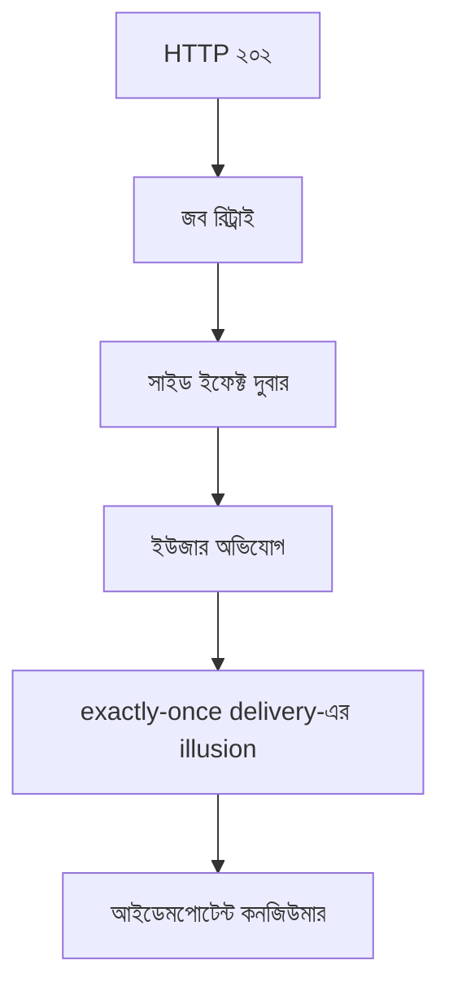

> **পাঠ 139 · উন্নত ধাপ** - at-least-once + idempotent consumer practical ceiling - broker কেন gently lie করে।

## কেন এটা জরুরি

- কিউ লেটেন্সি অন্যের সমস্যা করে, যতক্ষণ একটা বিষাক্ত মেসেজ লেন না আটকে।
- অ্যাট-লিস্ট-ওয়ান্স আর সাইড ইফেক্ট, আইডেমপোটেন্সি টেবিল ছাড়া: ডুপ্লিকেট SMS, মেইল, চার্জ।
- ইভেন্ট স্কিমা বদল মানে শুক্রবারের কনজিউমার সোমবারের ফিল্ড নামে মরে।
- এই পাঠটা ঠিক **exactly-once delivery-এর illusion** নিয়ে। ট্যাগ: messaging, exactly-once, idempotency।

## কী দেখে বুঝবেন সমস্যা আছে

| সংকেত | যা দেখা যায় |
| --- | --- |
| ল্যাগ | HTTP ঠিক, Horizon / কিউ গভীরতা বাড়ে |
| বিষ | একটা খারাপ পেলোড অনন্ত রিট্রাই, বাকি কাজ অনাহারী |
| ডুপ্লিকেট কাজ | মেইল সংখ্যা টিকিটের দ্বিগুণ |
| স্কিমা | পুরনো ওয়ার্কার এমন ফিল্ড ডিকোড করে যা আর নেই |

## কীভাবে ভাঙে



ভাঙে প্রযুক্তির নামে নয়, চুক্তির অভাবে। Vue/Quasar স্ক্রিন আর Laravel রাইট যদি উল্টো উত্তর ধরে, প্রোডাকশন সেই রেসটা খুঁজে বের করে। এই টপিকের চুক্তিটা হলো: at-least-once + idempotent consumer practical ceiling - broker কেন gently lie করে।

## মূল কারণ

1. কনজিউমার মেসেজ আইডিতে আইডেমপোটেন্ট নয়।
2. ব্যাকঅফ ও ডেড-লেটার ছাড়া রিট্রাই।
3. আউটবক্স সারি কমিটের আগে সাইড ইফেক্ট চলেছে।
4. প্রডিউসার ভার্সন ফিল্ড ছাড়া ভাঙা ইভেন্ট শেপ পাঠিয়েছে।

## কীভাবে সমাধান করবেন

### ১. ইনভেরিয়েন্ট এক বাক্যে লিখুন

at-least-once + idempotent consumer practical ceiling - broker কেন gently lie করে। এই বাক্য পিআর, Pinia অ্যাকশন, আর Laravel ক্লাসে রাখুন।

### ২. কোডে কিনারা আটকে দিন

```ts
// Pinia only reflects job state from the API — it does not enqueue twice
export async function enqueueExport(ticketId: number) {
  return api.post('/api/tickets/export', { ticketId })
}
```

```php
class SendTicketMail implements ShouldQueue
{
    public function handle(): void
    {
        if (ProcessedMessage::query()->where('id', $this->messageId)->exists()) return;
        Mail::to($this->email)->send(new TicketCreated($this->ticket));
        ProcessedMessage::query()->create(['id' => $this->messageId]);
    }
}
```

### ৩. যে চার্ট সত্যি দেখবেন, সেটাই রাখুন

কিউ গভীরতা, ডেড-লেটার হার, আর ডুপ্লিকেট সাইড ইফেক্ট। **exactly-once delivery-এর illusion**-এর রিগ্রেশন এই চার্টে না ধরা পড়লে পাঠ শেষ হয়নি।

## কাজের উদাহরণ

টিকিট-তৈরি মেইল `ShouldQueue` আর তিন রিট্রাই। SMTP সফল, ওয়ার্কার টাইমআউট, Laravel আবার চেষ্টা। মেসেজ আইডিতে আইডেমপোটেন্সি সারি দ্বিতীয় চেষ্টাকে নো-অপ করে।

এই টপিকে নিজের শেষ ইনসিডেন্টের লক্ষণ টেবিলে মিলিয়ে নিন, তারপর ডায়াগ্রাম ধরে এগোন যতক্ষণ না উপরের গার্ড আগুন ধরত।

## শিপ করার আগে

- [ ] **exactly-once delivery-এর illusion**-এর ইনভেরিয়েন্ট এক বাক্যে লেখা।
- [ ] খালি, ডুপ্লিকেট, টাইমআউট বা পারমিশন পাথের টেস্ট বা রিহার্সাল আছে।
- [ ] এক ডিপ্লয়ের মধ্যে রিগ্রেশন ধরার লগ বা চার্ট আছে।
- [ ] আত্মীয় পাঠ এখনও মিলছে: backpressure-queue-design।

## যা করবেন না

- অনন্ত রিট্রাই বা এররকে সাকসেস হিসেবে ক্যাশ করা ব্লগ স্নিপেট কপি করবেন না।
- Laravel সারির সত্য Pinia-কে বলে দেবেন না।
- ঘন মনে হলে আগের নম্বরের পাঠ আগে শেষ করুন। পথটা ইচ্ছা করেই শুরু → মাঝারি → উন্নত।
