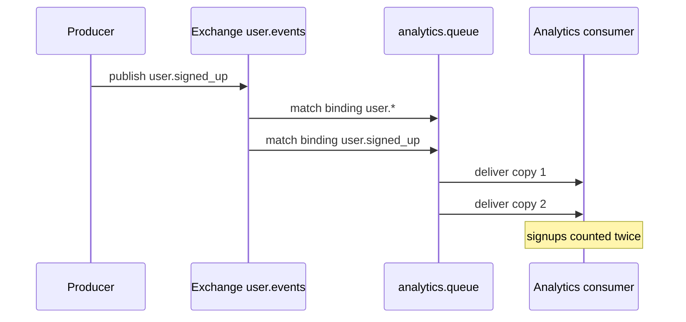
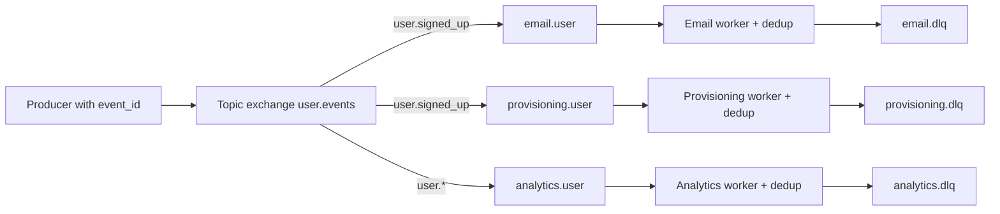

> **Scenario** - `user.signed_up` ছয়টা subscriber-এ fan-out হয়: welcome email, CRM sync, analytics, provisioning, referral credit ও Slack notification। RabbitMQ config reload-এর সময় একটা deploy script analytics queue-এর জন্য দ্বিতীয় একটা routing key দিয়ে `queue_bind` আবার চালায়, যেটাও match করে। এখন প্রতিটি signup ওই queue-তে দুবার যায়। নয় দিন কেউ টের পায় না, কারণ একমাত্র দৃশ্যমান উপসর্গ হলো dashboard বলছে signup দ্বিগুণ।

## Why it matters

- Fan-out ভুলকে গুণ করে। এক producer bug ছয়টা downstream incident হয়ে যায়, প্রতিটি আলাদা দলের on-call rotation-এ।
- Duplicate binding application code-এ অদৃশ্য; ওরা থাকে broker topology-তে, যা প্রায়ই হাতে বা কেউ review না করা script দিয়ে বদলানো হয়।
- Subscriber-দের reliability চাহিদা আকাশ-পাতাল আলাদা - analytics write fail হলে চলে, provisioning write fail হলে চলে না - অথচ সরল fan-out সবাইকে এক চোখে দেখে।
- ব্যস্ত topic-এ নতুন subscriber যোগ করলে broker egress গুণিত হয় এবং কেউ capacity হিসাব করার আগেই network saturate হয়।
- Fan-out-এ duplicate side effect (দুটো welcome email, দুটো referral credit) সরাসরি customer-এর কাছে পৌঁছায়।

## Symptoms

| Signal | What you observe |
|---|---|
| Metric doubling | Downstream count ঠিক source count-এর ২× |
| Broker topology | `rabbitmqctl list_bindings`-এ একই queue-তে দুটো binding |
| Consumer group IDs | দুটো deployment এক group ID ভাগ করছে, বা প্রতিটি pod আলাদা ID নিচ্ছে |
| Egress bandwidth | প্রতি নতুন subscriber-এ broker network out linear বাড়ছে |
| Slow subscriber | এক queue জমছে, বাকি পাঁচটা প্রায় শূন্য |
| Email complaints | Customer একই notification দুবার পাচ্ছে |

## How it breaks

দুই topology, দুই রকম failure। RabbitMQ-তে fanout বা topic exchange প্রতিটি bound queue-তে একটা copy দেয়। Duplicate binding, বা `user.*` ও `user.signed_up` দুটোতেই bound queue, এক queue-তে দুটো copy পাঠায়। Kafka-তে fan-out প্রকাশ পায় consumer group দিয়ে: এক group-এর সব pod partition ভাগ করে নেয়, আলাদা group প্রত্যেকে সবকিছু পায়। ভুল করে প্রতিটি pod-কে নিজস্ব group ID দিন - যেমন hostname যোগ করে - তাহলে ছয়-pod deployment প্রতিটি message ছয়বার process করবে।



## Root causes

1. Overlapping routing key একই queue-কে এক exchange-এ দুবার bind করে।
2. Topology declarative ও idempotent না হয়ে deploy script দিয়ে imperatively চালানো।
3. Kafka consumer group ID hostname বা pod name থেকে বানানো, ফলে shared group N-টা group হয়ে যায়।
4. event ID নেই, তাই subscriber বুঝতে পারে না সে এই message আগেই সামলেছে।
5. অসামঞ্জস্যপূর্ণ SLA-র subscriber-দের এক shared queue-তে fan-out করা।
6. delivery নয়, *publish* retry করা - যা upstream-এ সত্যিকারের duplicate event বানায়।

## How to solve it

### 1. Declare topology idempotently, in one place

```php
// config/rabbit.php consumed by a single provisioning command
return [
    'exchanges' => [
        'user.events' => ['type' => 'topic', 'durable' => true],
    ],
    'queues' => [
        'analytics.user'    => ['bind' => ['user.*'],           'dlx' => 'user.dlx'],
        'provisioning.user' => ['bind' => ['user.signed_up'],   'dlx' => 'user.dlx'],
        'email.user'        => ['bind' => ['user.signed_up'],   'dlx' => 'user.dlx'],
    ],
];
```

একটা command এটা apply করে এবং file-এ না থাকা binding *মুছে দেয়*। deploy script-এ হাতে লেখা `queue_bind` call-ই মূল কারণ; ওগুলো মুছে ফেলাই সমাধান।

### 2. Use one consumer group per logical subscriber

```ts
const consumer = kafka.consumer({
  groupId: 'analytics-user-events-v2',   // constant, never includes hostname
  sessionTimeout: 30_000,
})
```

ইচ্ছাকৃত replay দরকার হলে group ID version করুন (`-v2`); কখনো instance-ভেদে বদলাতে দেবেন না।

### 3. Dedup per subscriber, not globally

প্রতিটি subscriber-এর নিজের dedup namespace থাকবে, কারণ "analytics event X দেখেছে" provisioning সম্পর্কে কিছুই বলে না।

```sql
CREATE TABLE processed_events (
  consumer     TEXT NOT NULL,
  event_id     TEXT NOT NULL,
  processed_at TIMESTAMPTZ NOT NULL DEFAULT now(),
  PRIMARY KEY (consumer, event_id)
);
```

### 4. Give each subscriber its own queue and failure isolation

ধীর বা ভাঙা subscriber যেন বাকিদের প্রভাবিত না করে। প্রতি subscriber-এ এক queue, প্রতি queue-তে এক DLQ, স্বাধীন scaling। Kafka-তে আলাদা group থাকলে এটা আপনাআপনি হয়; RabbitMQ-তে মানে দুই service-এর মধ্যে কখনো queue ভাগ না করা।

### 5. Model the egress cost before adding subscribers

৪ KB message ৩,০০০/s হারে গেলে প্রতিটি নতুন subscriber ১২ MB/s broker egress যোগ করে। দশটা subscriber মানে ১২০ MB/s, যা ১ Gbps link-এর বড় অংশ। বড় payload-এ claim-check pattern নিন: pointer publish করুন, subscriber object storage থেকে body আনুক।

### 6. Distinguish fan-out from work distribution

Fan-out মানে "সবাই একটা copy পাবে"। Work distribution মানে "ঠিক একজন worker এটা সামলাবে"। দুটো মেশালে - যেমন একই service-এর দুই instance-কে fanout exchange-এর দুটো আলাদা queue-তে bind করলে - কাজ নীরবে duplicate হয়।

## Target design



## Tradeoffs

| Option | Pros | Cons | Choose when |
|---|---|---|---|
| Fanout exchange | সরল, subscriber নিজেরাই যুক্ত হয় | filtering নেই, প্রতিটি queue সব পায় | কম event volume, অল্প type |
| Topic exchange with routing keys | broker-এই নিখুঁত filtering | overlapping pattern duplicate বানায় | অনেক event type, বাছাই করা consumer |
| Kafka consumer groups | replayable, topology সামলাতে হয় না | group ID শৃঙ্খলা লাগে | উচ্চ volume, replay দরকার |
| Direct per-subscriber publish | গন্তব্যভেদে পূর্ণ নিয়ন্ত্রণ | producer-কে প্রতিটি subscriber জানতে হয় | দুই-তিনটা স্থিতিশীল consumer |
| Claim check (pointer + storage) | ছোট message, সস্তা fan-out | বাড়তি fetch ও lifecycle ব্যবস্থাপনা | ~১০০ KB-র বেশি payload |

## Verification checklist

- [ ] `rabbitmqctl list_bindings` চালিয়ে নিশ্চিত করুন একই exchange ও matching pattern-এ কোনো queue দুবার নেই।
- [ ] একটা event publish করে প্রতি queue-তে delivery গুনুন; প্রতিটি count ঠিক এক হওয়া উচিত।
- [ ] consumer group ID config-এ constant কিনা দেখুন, এবং group ID তৈরির আশেপাশে `hostname` আছে কিনা codebase-এ grep করুন।
- [ ] প্রতিটি subscriber-এর নিজস্ব DLQ ও নিজস্ব alert আছে কিনা যাচাই করুন।
- [ ] একটা subscriber ১০ মিনিট থামিয়ে দেখুন বাকিরা অপ্রভাবিত থাকে।
- [ ] পরবর্তী subscriber যোগ করার আগে per-subscriber broker egress মেপে link capacity-র সঙ্গে তুলনা করুন।

## Anti-patterns

- "নিরাপদ থাকতে" queue-কে wildcard ও specific key দুটো দিয়েই bind করা।
- Incident-এর সময় ad-hoc `rabbitmqadmin` command দিয়ে binding সামলানো, যা কখনো config-এ ফেরে না।
- দুই service-এর মধ্যে এক queue ভাগ করা, ফলে দুজনেই এমন message-এর জন্য লড়ে যা কারোরই হারানো উচিত নয়।
- "সবাই পেয়েছে নিশ্চিত করতে" producer retry loop ব্যবহার করা, যা সত্যিকারের duplicate publish করে।
- এক জায়গায় কেন্দ্রীয়ভাবে dedup করে ধরে নেওয়া সব subscriber উপকৃত।
- আটটা subscriber সহ fanout exchange-এ ২ MB payload publish করা।

## Related

- [Building idempotent consumers](/systems/messaging-async/idempotent-consumers)
- [Poison messages and dead-letter queue design](/systems/messaging-async/poison-message-and-dlq)
- [Choosing between a queue and a stream](/systems/messaging-async/queue-vs-stream-selection)
