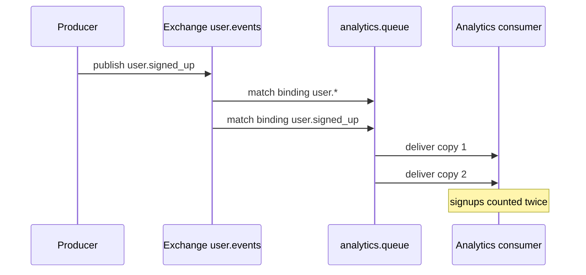
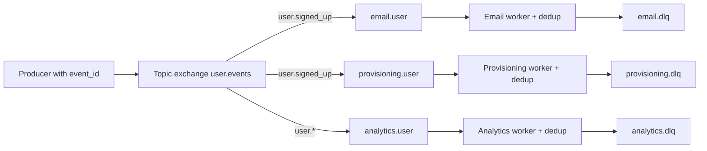

> **Scenario** - `user.signed_up` fans out to six subscribers: welcome email, CRM sync, analytics, provisioning, referral credit, and a Slack notification. During a RabbitMQ config reload, a deploy script re-runs `queue_bind` for the analytics queue with a second routing key that also matches. Every signup now delivers twice to that queue. Nobody notices for nine days, because the only visible symptom is a dashboard that says signups doubled.

## Why it matters

- Fan-out multiplies mistakes. One producer bug becomes six downstream incidents, each in a different team's on-call rotation.
- Duplicate bindings are invisible in application code; they live in broker topology that is often edited by hand or by a script nobody reviews.
- Subscribers have wildly different reliability requirements - a failed analytics write is fine, a failed provisioning write is not - but a naive fan-out treats them identically.
- Adding a subscriber to a busy topic can multiply broker egress and saturate the network before anyone models the capacity.
- Duplicate side effects in fan-out (two welcome emails, two referral credits) reach customers directly.

## Symptoms

| Signal | What you observe |
|---|---|
| Metric doubling | Downstream counts exactly 2× the source count |
| Broker topology | `rabbitmqctl list_bindings` shows two bindings resolving to the same queue |
| Consumer group IDs | Two deployments sharing one group ID, or each pod using a unique one |
| Egress bandwidth | Broker network out grows linearly with each new subscriber |
| Slow subscriber | One queue backs up while five others stay near zero |
| Email complaints | Customers receiving the same notification twice |

## How it breaks

Two topologies, two failure shapes. In RabbitMQ, a fanout or topic exchange delivers a copy to every bound queue. Duplicate bindings, or a queue bound with both `user.*` and `user.signed_up`, deliver two copies to one queue. In Kafka, fan-out is expressed by consumer groups: all pods in one group split the partitions, while separate groups each receive everything. Give every pod its own group ID by accident - for example by including the hostname - and a six-pod deployment processes every message six times.



## Root causes

1. Overlapping routing keys binding the same queue twice to one exchange.
2. Topology managed imperatively by deploy scripts rather than declaratively and idempotently.
3. Kafka consumer group ID derived from hostname or pod name, turning a shared group into N groups.
4. No event ID, so subscribers cannot detect that they already handled this message.
5. Fan-out to subscribers with incompatible SLAs on one shared queue.
6. Retry of the *publish* rather than the delivery, creating genuine duplicate events upstream.

## How to solve it

### 1. Declare topology idempotently, in one place

```php
// config/rabbit.php consumed by a single provisioning command
return [
    'exchanges' => [
        'user.events' => ['type' => 'topic', 'durable' => true],
    ],
    'queues' => [
        'analytics.user'    => ['bind' => ['user.*'],           'dlx' => 'user.dlx'],
        'provisioning.user' => ['bind' => ['user.signed_up'],   'dlx' => 'user.dlx'],
        'email.user'        => ['bind' => ['user.signed_up'],   'dlx' => 'user.dlx'],
    ],
];
```

One command applies this and *removes* bindings not in the file. Manual `queue_bind` calls in deploy scripts are the root cause; deleting them is the fix.

### 2. Use one consumer group per logical subscriber

```ts
const consumer = kafka.consumer({
  groupId: 'analytics-user-events-v2',   // constant, never includes hostname
  sessionTimeout: 30_000,
})
```

Version the group ID (`-v2`) when you need a deliberate replay from the beginning; never let it vary per instance.

### 3. Dedup per subscriber, not globally

Each subscriber owns its own dedup namespace, because "analytics already saw event X" says nothing about provisioning.

```sql
CREATE TABLE processed_events (
  consumer     TEXT NOT NULL,
  event_id     TEXT NOT NULL,
  processed_at TIMESTAMPTZ NOT NULL DEFAULT now(),
  PRIMARY KEY (consumer, event_id)
);
```

### 4. Give each subscriber its own queue and failure isolation

A slow or broken subscriber must not affect the others. One queue per subscriber, one DLQ per queue, independent scaling. In Kafka, this is automatic with separate groups; in RabbitMQ it means never sharing a queue between two services.

### 5. Model the egress cost before adding subscribers

Each new subscriber to a 4 KB message at 3,000/s adds 12 MB/s of broker egress. Ten subscribers is 120 MB/s, which is a real fraction of a 1 Gbps link. For large payloads use the claim-check pattern: publish a pointer, let subscribers fetch the body from object storage.

### 6. Distinguish fan-out from work distribution

Fan-out means "everyone gets a copy". Work distribution means "exactly one worker handles this". Mixing them - for instance binding two instances of the same service to two different queues on a fanout exchange - silently duplicates work.

## Target design



## Tradeoffs

| Option | Pros | Cons | Choose when |
|---|---|---|---|
| Fanout exchange | Simple, subscribers add themselves | No filtering, every queue gets everything | Small event volume, few types |
| Topic exchange with routing keys | Precise filtering at the broker | Overlapping patterns cause duplicates | Many event types, selective consumers |
| Kafka consumer groups | Replayable, no topology to manage | Group ID discipline required | High volume, replay needed |
| Direct per-subscriber publish | Total control per destination | Producer must know every subscriber | Two or three stable consumers |
| Claim check (pointer + storage) | Tiny messages, cheap fan-out | Extra fetch and lifecycle management | Payloads over ~100 KB |

## Verification checklist

- [ ] Run `rabbitmqctl list_bindings` and assert no queue appears twice for the same exchange and matching pattern.
- [ ] Publish one event and count deliveries per queue; every count should be exactly one.
- [ ] Confirm consumer group IDs are constants in config, and grep the codebase for `hostname` near group ID construction.
- [ ] Verify each subscriber has its own DLQ and its own alert.
- [ ] Stop one subscriber for 10 minutes and confirm the others are unaffected.
- [ ] Measure broker egress per subscriber and compare against link capacity before adding the next one.

## Anti-patterns

- Binding a queue with both a wildcard and a specific key "to be safe".
- Managing bindings with ad-hoc `rabbitmqadmin` commands during incidents, which never make it back into config.
- Sharing one queue across two services so both compete for messages neither should miss.
- Using the producer's retry loop to "make sure everyone got it", which publishes genuine duplicates.
- Deduping in one central place and assuming all subscribers benefit.
- Publishing 2 MB payloads to a fanout exchange with eight subscribers.

## Related

- [Building idempotent consumers](/systems/messaging-async/idempotent-consumers)
- [Poison messages and dead-letter queue design](/systems/messaging-async/poison-message-and-dlq)
- [Choosing between a queue and a stream](/systems/messaging-async/queue-vs-stream-selection)
