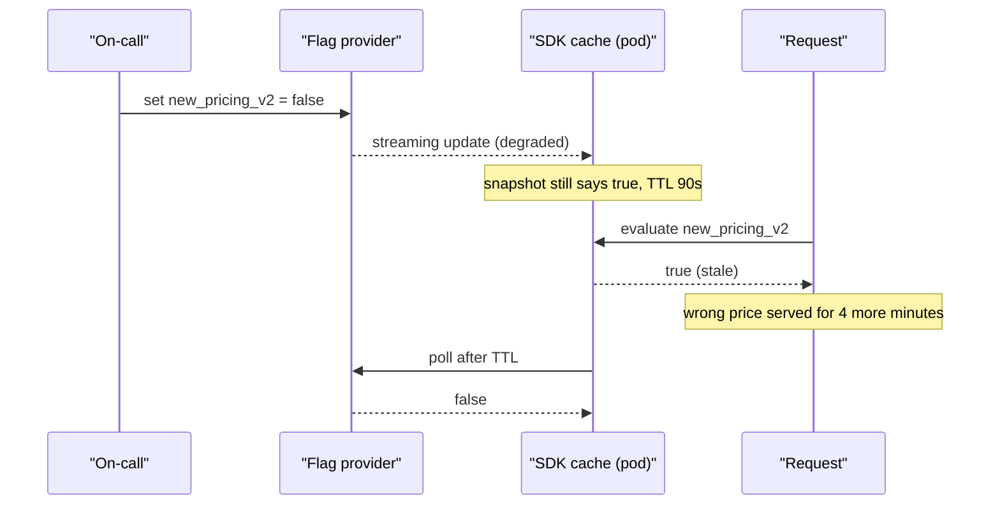
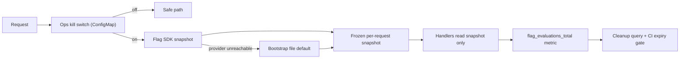

> **Scenario** — একটা খারাপ pricing rule `new_pricing_v2` flag-এর পেছনে ship হয়। On-call kill switch চাপে, কিন্তু flag provider-এর edge-ই degraded, SDK-র cached value ৯০ সেকেন্ড পুরনো, আর অর্ধেক fleet আরও চার মিনিট ভুল দাম দেখাতে থাকে। এদিকে flag repository-তে ৩১২টি flag, যার ৪১টি এক বছরের বেশি সময় ধরে স্থায়ীভাবে `true`।

## Why it matters

- যে kill switch third party-র সুস্থ network path-এর উপর নির্ভর করে সেটা kill switch নয়। যখন সবচেয়ে বেশি দরকার, ঠিক তখনই সেটা unreachable থাকার সম্ভাবনা বেশি।
- Flag debt আসল coupling। ৩১২ flag মানে কোডে nominal ভাবে 2^312 state; কেউ গুটিকয়ের বেশি test করে না, আর dead branch পচে security hole হয়।
- Request path-এ synchronous flag evaluation প্রতিটি request-এ latency যোগ করে — যাদের flag লাগে না তাদেরও।
- Founder-দের গুরুত্ব দেওয়া উচিত কারণ flag সবচেয়ে সস্তা বীমা: "deploy rollback করো, release manager-কে জাগাও" ধরনের incident ৩০ সেকেন্ডের config change-এ নেমে আসে।
- Entitlement (paid plan gating)-এর জন্য ব্যবহৃত flag যদি release flag হিসেবে বানানো হয়, কেউ cleanup করার দিনই সেটা billing bug হয়ে যায়।

## Symptoms

| Signal | What you observe |
|---|---|
| Kill switch latency | Toggle থেকে শেষ stale pod পর্যন্ত সেকেন্ড নয়, মিনিট |
| Flag count | কেবল বাড়ে; ছয় মাসে একটাও flag delete হয়নি |
| Request latency | Cold cache-এ p99-এ flag provider-এ network hop ঢুকে যায় |
| Incident timeline | "১৪:০২-এ flag off, ১৪:০৭-এ error বন্ধ" — মাঝের ফাঁকের ব্যাখ্যা নেই |
| Test suite | শুধু default path covered; অন্য branch CI-তে dead code |
| Config drift | Staging ও production-এ ভিন্ন flag value, তাই staging কিছুই প্রমাণ করে না |

## How it breaks

বেশিরভাগ দলের mental model হলো "flag মানে একটা service-এ রাখা boolean"। Production-এ এটা তিন স্তরের distributed cache: provider-এর edge, প্রতিটি process-এর ভেতরে SDK-র in-memory snapshot, আর দুটোই fail করলে যা local fallback আছে তা। Toggle সবচেয়ে ধীর স্তরের গতিতে ছড়ায়, আর প্রতিটি স্তর আলাদাভাবে fail করে — edge up কিন্তু stale হতে পারে, SDK connected কিন্তু পুরনো snapshot ধরে থাকতে পারে, আর incident চলাকালে চালু হওয়া pod compile-time default-এ পড়ে যেতে পারে, যা প্রায়ই *ভুল* মান।

দ্বিতীয় failure semantic। Release flag, experiment flag, operational kill switch আর permission entitlement-এর lifecycle একেবারে আলাদা, অথচ সবগুলো এক সিস্টেমে এক interface-এ থাকে। কেউ "stale" flag পরিষ্কার করতে গিয়ে এক বছর ধরে `true` থাকা entitlement flag মুছে দেয়, আর প্রতিটি enterprise customer টাকা দেওয়া feature হারায়।



## Root causes

1. Local fallback file নেই, তাই fail-safe path মানে "SDK যা cache করেছিল", আপনার বাছা মান নয়।
2. কোডের default value-ই *নতুন* behaviour, তাই flag-service outage ঝুঁকিপূর্ণ path চালু করে দেয়।
3. চারটি আলাদা lifecycle-এর জন্য একটাই flag type: release, experiment, operational, entitlement।
4. Flag-এ expiry metadata নেই, তাই cleanup আলোচনা কখনো জোর করে আসে না।
5. Kill switch কখনো exercise করা হয় না, তাই propagation time incident-এর দিনই প্রথম মাপা হয়।
6. Request-প্রতি একবার নয়, call site-প্রতি evaluation হয়, ফলে এক request-এর ভেতরেই অসামঞ্জস্যপূর্ণ সিদ্ধান্ত।

## How to solve it

### 1. Flag-এর type ঠিক করুন, প্রতিটির lifecycle দিন

```ts
export type FlagKind =
  | 'release'      // temporary; delete after full rollout
  | 'experiment'   // temporary; delete when the test concludes
  | 'ops'          // long-lived kill switch, owned by on-call
  | 'entitlement'  // permanent; driven by plan, never "cleaned up"

export type FlagDefinition = {
  key: string
  kind: FlagKind
  owner: string
  /** Required for release and experiment. CI fails when this date passes. */
  expiresOn?: string
  /** The value used when the provider is unreachable. Must be the safe path. */
  fallback: boolean
}
```

আসলে flag debt আটকায় `expiresOn`: একটি CI job registry পড়ে, temporary flag-এর তারিখ পেরোলে build fail করে — ফলে হয় deletion, নয়তো নাম সহ স্পষ্ট extension।

### 2. Request-প্রতি একবার evaluate করুন, নিরাপদ fallback সহ

```ts
import fs from 'node:fs'

const BOOTSTRAP: Record<string, boolean> = JSON.parse(
  // Written into the image at build time; read once at process start.
  fs.readFileSync('/etc/flags/bootstrap.json', 'utf8'),
)

export function resolveFlags(ctx: RequestContext): FlagSnapshot {
  const snapshot: Record<string, boolean> = {}
  for (const def of REGISTRY) {
    let value: boolean
    try {
      value = sdk.boolVariation(def.key, ctx, BOOTSTRAP[def.key] ?? def.fallback)
    } catch {
      value = BOOTSTRAP[def.key] ?? def.fallback
    }
    snapshot[def.key] = value
  }
  // Freeze for the request: no call site can observe a mid-request flip.
  return Object.freeze(snapshot)
}
```

দুটো property জরুরি। Bootstrap file মানে provider পুরো down হলেও জানা state-এ degrade হয়, undefined state-এ নয়; আর snapshot freeze মানে flag flip কোনো request-কে অর্ধেক migrate অবস্থায় ফেলতে পারে না।

### 3. Kill switch-কে flag provider থেকে স্বাধীন করুন

Operational kill switch এমন path থেকে পড়া উচিত যা শুরু থেকে শেষ আপনার নিয়ন্ত্রণে — environment variable, ConfigMap বা নিজের database-এর row — আর সেটা SDK-র আগে দেখা হবে।

```yaml
# ConfigMap watched by the pod; propagates in ~5s without a provider round trip.
apiVersion: v1
kind: ConfigMap
metadata:
  name: ops-kill-switches
data:
  new_pricing_v2: "off"
  bulk_export: "on"
```

```bash
# Measured propagation, not assumed.
kubectl patch configmap ops-kill-switches -p '{"data":{"new_pricing_v2":"off"}}'
date +%s
# Watch the metric that proves the behaviour stopped.
watch -n1 'curl -s localhost:9090/metrics | grep pricing_v2_evaluations_total'
```

### 4. Flag সিদ্ধান্তকে telemetry হিসেবে পাঠান

```promql
# If a flag has zero "false" evaluations for 14 days, it is a candidate for deletion.
sum by (flag, value) (increase(flag_evaluations_total[14d]))
```

এতে cleanup তর্ক থেকে query-তে নামে: যে flag-এর non-default branch দুই সপ্তাহে একবারও নেওয়া হয়নি, সেটা config toggle লাগানো dead code।

### 5. CI-তে cleanup বাধ্যতামূলক করুন

```bash
#!/usr/bin/env bash
# scripts/check-flag-expiry.sh — fails the build on expired temporary flags.
set -euo pipefail
today=$(date +%F)
node -e '
  const { REGISTRY } = require("./dist/flags/registry.js")
  const today = process.argv[1]
  const expired = REGISTRY.filter(
    (f) => (f.kind === "release" || f.kind === "experiment") &&
           f.expiresOn && f.expiresOn < today,
  )
  if (expired.length) {
    console.error("Expired flags:", expired.map((f) => `${f.key} (${f.owner})`).join(", "))
    process.exit(1)
  }
' "$today"
```

### 6. দুই branch-ই test করুন

চলমান flag-গুলোর matrix ধরে critical test suite parameterise করুন — ৩১২টা নয়, শুধু temporary গুলো। Checkout suite দুবার চালানো সস্তা; rollback-এর সময় জানা যে off-branch এক মাস ধরে ভাঙা — সেটা সস্তা নয়।

## Target design



## Tradeoffs

| Option | Pros | Cons | Choose when |
|---|---|---|---|
| SaaS flag provider | Targeting, audit log, non-engineer UI | Incident path-এ external dependency; per-seat খরচ | Product team ঘন ঘন experiment চালায় |
| ConfigMap বা env var | External dependency নেই; propagation আপনার হাতে | Targeting নেই, audit trail নেই | শুধু operational kill switch |
| Database-backed flag | App-এর সাথে একই failure domain; tenant data-র সাথে join | Caching ও invalidation এখন আপনার দায়িত্ব | Plan বা tenant-নির্ভর entitlement |
| Compile-time constant | Runtime খরচ শূন্য, পুরো testable | বদলাতে deploy লাগে; incident-এ অকেজো | যে behaviour কখনো live toggle লাগবে না |

## Verification checklist

- [ ] Game day-তে প্রতিটি `ops` flag flip করে শেষ pod পর্যন্ত propagation time লেখা হয়েছে; সংখ্যাটি incident response target-এর নিচে।
- [ ] Staging-এ flag provider বন্ধ করলে application লিখিত fallback value-তে থাকে।
- [ ] প্রতিটি temporary flag-এর owner ও `expiresOn` আছে, CI job দিয়ে enforce করা এবং এখন pass করছে।
- [ ] `flag_evaluations_total` flag ও value দিয়ে labelled, আর dashboard single-valued history-র flag তালিকা দেখায়।
- [ ] Critical-path test suite চলমান flag on ও off — দুইভাবেই চলে।
- [ ] Entitlement flag release flag থেকে আলাদা রাখা এবং cleanup automation থেকে বাদ।

## Anti-patterns

- নতুন behaviour-কে কোডের default করা, ফলে flag outage আপনাকে ঝুঁকিপূর্ণ path-এ *এগিয়ে* দেয়।
- প্রতিটি call site-এ flag পড়া, ফলে এক request একই সিদ্ধান্তের দুই branch নেয়।
- Database migration gate করতে flag ব্যবহার — switch ঘুরালে schema rollback হয় না।
- "flag off করে দেব" কে canary-র বিকল্প ভাবা; flag MTTR কমায়, rollout-এর blast radius কমায় না।
- Cleanup sprint-এ দীর্ঘদিনের `true` flag গণহারে মুছে ফেলা, কোনটা paid entitlement সেটা না দেখে।

## Related

- [Strangler fig migrations that finish](/systems/product-platform/strangler-fig-migration)
- [On-call and service ownership models](/systems/product-platform/on-call-and-ownership-models)
- [Architecture decision records that get read](/systems/product-platform/architecture-decision-records)
