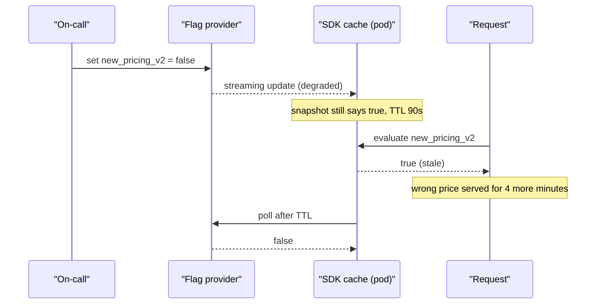
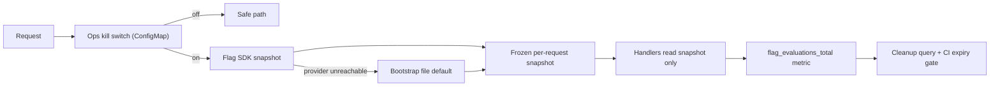

> **Scenario** — A bad pricing rule ships behind the flag `new_pricing_v2`. On-call flips the kill switch, but the flag provider's edge is the thing that is degraded, the SDK's cached values are 90 seconds stale, and half the fleet keeps serving wrong prices for four more minutes. Meanwhile the flag repository contains 312 flags, of which 41 have been permanently `true` for over a year.

## Why it matters

- A kill switch that depends on a healthy network path to a third party is not a kill switch. The moments you need it most are correlated with the moments it is unreachable.
- Flag debt is real coupling. With 312 flags the code has 2^312 nominal states; nobody tests more than a handful, and dead branches rot into security holes.
- Synchronous flag evaluation on the request path adds latency to every request, including the ones that do not care about the flag.
- Founders should care because flags are the cheapest insurance available: they turn a "roll back the deploy, wake the release manager" incident into a 30-second config change.
- Flags that are used for entitlement (paid plan gating) but implemented as release flags become a billing bug the first time someone cleans them up.

## Symptoms

| Signal | What you observe |
|---|---|
| Kill switch latency | Minutes between the toggle and the last stale pod, not seconds |
| Flag count | Grows monotonically; no flag has been deleted in six months |
| Request latency | p99 includes a network hop to the flag provider on cold cache |
| Incident timeline | "Flag flipped at 14:02, errors stopped at 14:07" with no explanation of the gap |
| Test suite | Only the default flag path is covered; the other branch is dead code in CI |
| Config drift | Staging and production have different flag values, so staging proves nothing |

## How it breaks

The mental model most teams have is "the flag is a boolean in a service". In production it is a distributed cache with three layers: the provider's edge, the SDK's in-memory snapshot in every process, and whatever local fallback exists when both fail. A toggle propagates at the speed of the slowest layer, and each layer fails differently — the edge can be up but stale, the SDK can be connected but holding a snapshot from before the change, and a pod that started during the incident may have fallen back to its compile-time default, which is often the *wrong* one.

The second failure is semantic. Release flags, experiment flags, operational kill switches, and permission entitlements have completely different lifecycles, but they are usually stored in one system with one interface. Someone cleans up "stale" flags, deletes an entitlement flag that has been `true` for a year, and every enterprise customer loses a feature they pay for.



## Root causes

1. No local fallback file, so the fail-safe path is "whatever the SDK cached" rather than a value you chose.
2. Default values in code are the *new* behaviour, so a flag-service outage enables the risky path.
3. One flag type for four different lifecycles: release, experiment, operational, entitlement.
4. No expiry metadata on flags, so nothing ever forces a cleanup conversation.
5. Kill switches never exercised, so their propagation time is unknown until an incident measures it.
6. Flag evaluation happens per call site rather than once per request, producing inconsistent decisions within a single request.

## How to solve it

### 1. Type your flags and give each a lifecycle

```ts
export type FlagKind =
  | 'release'      // temporary; delete after full rollout
  | 'experiment'   // temporary; delete when the test concludes
  | 'ops'          // long-lived kill switch, owned by on-call
  | 'entitlement'  // permanent; driven by plan, never "cleaned up"

export type FlagDefinition = {
  key: string
  kind: FlagKind
  owner: string
  /** Required for release and experiment. CI fails when this date passes. */
  expiresOn?: string
  /** The value used when the provider is unreachable. Must be the safe path. */
  fallback: boolean
}
```

The `expiresOn` field is what actually prevents flag debt: a CI job reads the registry and fails the build when a temporary flag is past its date, which forces either a deletion or an explicit extension with a name attached.

### 2. Evaluate once per request, with a safe fallback

```ts
import fs from 'node:fs'

const BOOTSTRAP: Record<string, boolean> = JSON.parse(
  // Written into the image at build time; read once at process start.
  fs.readFileSync('/etc/flags/bootstrap.json', 'utf8'),
)

export function resolveFlags(ctx: RequestContext): FlagSnapshot {
  const snapshot: Record<string, boolean> = {}
  for (const def of REGISTRY) {
    let value: boolean
    try {
      value = sdk.boolVariation(def.key, ctx, BOOTSTRAP[def.key] ?? def.fallback)
    } catch {
      value = BOOTSTRAP[def.key] ?? def.fallback
    }
    snapshot[def.key] = value
  }
  // Freeze for the request: no call site can observe a mid-request flip.
  return Object.freeze(snapshot)
}
```

Two properties matter here. The bootstrap file means a total provider outage degrades to a known state rather than an undefined one, and freezing the snapshot means a flag flip cannot leave one request half-migrated.

### 3. Make the kill switch independent of the flag provider

The operational kill switch should be readable from a path you control end to end — an environment variable, a ConfigMap, or a row in your own database — checked before the SDK.

```yaml
# ConfigMap watched by the pod; propagates in ~5s without a provider round trip.
apiVersion: v1
kind: ConfigMap
metadata:
  name: ops-kill-switches
data:
  new_pricing_v2: "off"
  bulk_export: "on"
```

```bash
# Measured propagation, not assumed.
kubectl patch configmap ops-kill-switches -p '{"data":{"new_pricing_v2":"off"}}'
date +%s
# Watch the metric that proves the behaviour stopped.
watch -n1 'curl -s localhost:9090/metrics | grep pricing_v2_evaluations_total'
```

### 4. Emit the flag decision as telemetry

```promql
# If a flag has zero "false" evaluations for 14 days, it is a candidate for deletion.
sum by (flag, value) (increase(flag_evaluations_total[14d]))
```

This turns cleanup from an argument into a query: a flag whose non-default branch has not been taken in two weeks is dead code with a config toggle attached.

### 5. Enforce cleanup in CI

```bash
#!/usr/bin/env bash
# scripts/check-flag-expiry.sh — fails the build on expired temporary flags.
set -euo pipefail
today=$(date +%F)
node -e '
  const { REGISTRY } = require("./dist/flags/registry.js")
  const today = process.argv[1]
  const expired = REGISTRY.filter(
    (f) => (f.kind === "release" || f.kind === "experiment") &&
           f.expiresOn && f.expiresOn < today,
  )
  if (expired.length) {
    console.error("Expired flags:", expired.map((f) => `${f.key} (${f.owner})`).join(", "))
    process.exit(1)
  }
' "$today"
```

### 6. Test both branches

Parameterise the critical test suite over the flag matrix for flags that are currently in flight — not all 312, just the temporary ones. Two runs of the checkout suite is cheap; discovering the off-branch has been broken for a month during a rollback is not.

## Target design



## Tradeoffs

| Option | Pros | Cons | Choose when |
|---|---|---|---|
| SaaS flag provider | Targeting, audit log, UI for non-engineers | External dependency on the incident path; per-seat cost | Product teams run experiments frequently |
| ConfigMap or env var | No external dependency; propagation you control | No targeting, no audit trail, redeploy-ish workflow | Operational kill switches only |
| Database-backed flags | Same failure domain as the app; joins with tenant data | You now own caching and invalidation | Entitlements tied to plan or tenant |
| Compile-time constants | Zero runtime cost, fully testable | Requires a deploy to change; useless during an incident | Behaviour that will never need a live toggle |

## Verification checklist

- [ ] A game day flips each `ops` flag and records propagation time to the last pod; the number is under your incident response target.
- [ ] Killing the flag provider in staging leaves the application on the documented fallback values.
- [ ] Every temporary flag has an owner and an `expiresOn`, enforced by a CI job that currently passes.
- [ ] `flag_evaluations_total` is labelled by flag and value, and a dashboard lists flags with a single-valued history.
- [ ] The critical-path test suite runs with the in-flight flags both on and off.
- [ ] Entitlement flags are stored separately from release flags and are excluded from cleanup automation.

## Anti-patterns

- Making the new behaviour the code default, so a flag outage rolls you *forward* into the risky path.
- Reading flags at every call site, letting one request take both branches of the same decision.
- Using a flag to gate a database migration — the schema does not roll back when you flip the switch.
- Treating "we can flag it off" as a substitute for a canary; a flag reduces mean time to recovery but does not reduce blast radius during rollout.
- Bulk-deleting long-lived `true` flags in a cleanup sprint without checking which ones encode paid entitlements.

## Related

- [Strangler fig migrations that finish](/systems/product-platform/strangler-fig-migration)
- [On-call and service ownership models](/systems/product-platform/on-call-and-ownership-models)
- [Architecture decision records that get read](/systems/product-platform/architecture-decision-records)
