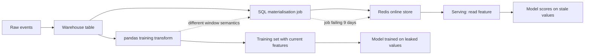
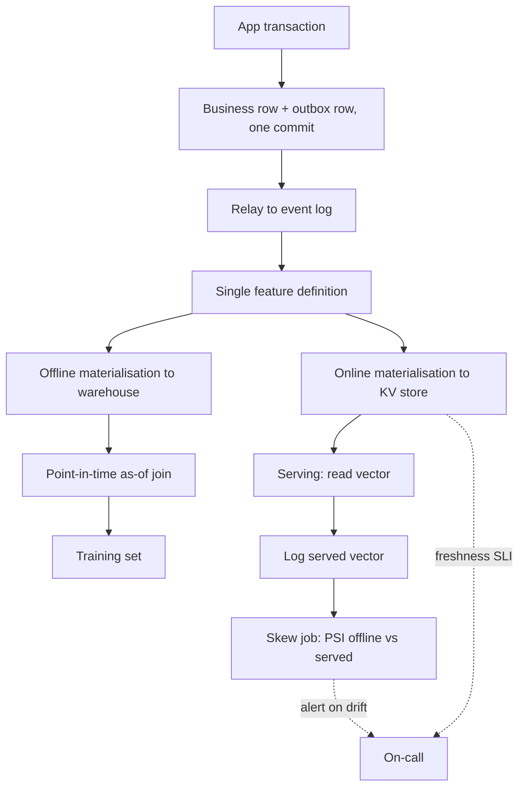

> **Scenario** - একটি fraud model offline-এ 0.91 AUC দেয়, production-এ 0.68। Offline training set-এ `txn_count_7d` পুরো সপ্তাহের data সহ warehouse table থেকে হিসাব হয়েছিল; online serving path এমন একটি Redis key পড়ে যা প্রতি ৩০ মিনিটে refresh করার job নয় দিন ধরে নীরবে fail করছে।

## Why it matters

- Offline/online divergence unit test ও CI-তে অদৃশ্য। Model, code, schema - সব "ঠিক"; শুধু value আলাদা।
- Stale বা ভুল হিসাব করা feature error দেয় না - আত্মবিশ্বাসী ভুল prediction দেয়। Fraud-এ সেটা টাকা; ranking-এ engagement; triage classifier-এ ভুল label করা ticket।
- Point-in-time leakage offline metric ফুলিয়ে দেয়, তাই team এমন model ship করে যা dashboard-এর দাবি অনুযায়ী কখনও ভালো ছিল না। এরপরের প্রতিটি experiment একটি কল্পিত baseline-এর বিরুদ্ধে মাপা হয়।
- একই feature-এর দুটি implementation মানে দুই on-call owner আর definition বদলালে দুই জায়গায় fix। কয়েক সপ্তাহেই definition drift করে।
- খারাপ prediction debug করতে request-time-এর exact feature vector পুনর্গঠন লাগে। Logged feature value না থাকলে সেটা অনুমান।

## Symptoms

| Signal | What you observe |
| --- | --- |
| Offline/online metric gap | validation AUC 0.91, production 0.68, raw input-এ কোনো data drift নেই |
| সন্দেহজনক ভালো offline score | একটি feature-এর importance খুব বেশি এবং offline value label-এর সঙ্গে প্রায় নিখুঁত correlated |
| Stale online feature | `feat:user:123:txn_count_7d`-এর `ttl -1`, value কয়েক দিন আগের |
| Default-value cliff | ২০% online request imputed default পায় কারণ online store-এ সেই key নেই |
| Type mismatch | offline feature `float64`, online store string দেয়, cast নীরবে `0.0` বানায় |
| Divergent definition | `pandas` code বলে `>= 7 days`, online-materialisation SQL বলে `> 7 days` |

## How it breaks

মূল সমস্যা: একই feature দুই code path-এ হিসাব হচ্ছে। Training warehouse পড়ে data scientist-এর লেখা `pandas` job দিয়ে। Serving পড়ে platform engineer-এর লেখা আলাদা SQL job-এর ভরা key-value store থেকে। দুটোকে একমত হতে বাধ্য করার কিছু নেই।

Point-in-time correctness আরও সূক্ষ্ম ব্যর্থতা। Training query শুধু `user_id`-তে feature table join করে *current* feature value নেয় - যা label event-এর পরে হিসাব হয়েছে। Model তখন এমন তথ্য থেকে শেখে যা prediction time-এ ছিলই না।



## Root causes

1. Feature logic দুবার, দুই ভাষায়, কোনো shared definition ছাড়া।
2. Training join event time উপেক্ষা করে, তাই label-এর পরে হিসাব করা feature training set-এ leak করে।
3. Online materialisation job-এর freshness SLO নেই, নিজের lag-এ alert নেই।
4. Online store-এ missing key এমন default-এ পড়ে যা training-এ কখনও দেখা যায়নি।
5. Inference time-এ feature value log হয় না, তাই পরে offline/online তুলনা অসম্ভব।
6. Dual write: application transactional row ও feature update দুটোই লেখে, একটি fail করে।

## How to solve it

### 1. এক definition, দুই materialisation

Transform একবার define করে দুই path generate করুন। পূর্ণ feature-store product ছাড়াও, দুই job-এর রেফার করা একটিমাত্র SQL expression দুটি হাতে-লেখা implementation-এর চেয়ে ভালো।

```sql
-- features/txn_count_7d.sql - the ONLY definition
SELECT
  t.user_id,
  t.as_of_ts,
  COUNT(*) FILTER (
    WHERE h.occurred_at >  t.as_of_ts - INTERVAL '7 days'
      AND h.occurred_at <= t.as_of_ts
  ) AS txn_count_7d
FROM {{ spine }} t
LEFT JOIN analytics.transactions h
       ON h.user_id = t.user_id
      AND h.occurred_at <= t.as_of_ts
GROUP BY 1, 2;
```

`spine` হলো `(user_id, as_of_ts)`। Training-এ spine হলো label event; online materialisation-এ spine হলো `(user_id, NOW())`। একই semantics, ভিন্ন spine।

### 2. Training join point-in-time correct করুন

```python
import pandas as pd

labels = pd.read_parquet("labels.parquet")      # user_id, event_ts, is_fraud
features = pd.read_parquet("features.parquet")  # user_id, as_of_ts, txn_count_7d

labels = labels.sort_values("event_ts")
features = features.sort_values("as_of_ts")

# As-of join: take the newest feature row at or before the label timestamp.
training = pd.merge_asof(
    labels,
    features,
    left_on="event_ts",
    right_on="as_of_ts",
    by="user_id",
    direction="backward",
    tolerance=pd.Timedelta("2h"),
)

# Rows with no feature within tolerance must be visible, not silently zero-filled.
training["feature_missing"] = training["txn_count_7d"].isna()
assert training["feature_missing"].mean() < 0.05, "too many unmatched label rows"
```

`direction="backward"` সহ `merge_asof`-এর পুরো উদ্দেশ্যই এটা: join-কে সময়ে সামনে হাত বাড়াতে দেয় না। `tolerance` bound "feature এক বছর stale"-কে বিশ্বাসযোগ্য সংখ্যার বদলে দৃশ্যমান miss বানায়।

### 3. Served feature vector log করুন

```python
import json
import logging

logger = logging.getLogger("feature_log")


def score(request, model, online_store):
    vector = online_store.get_vector(request.user_id, FEATURE_NAMES)
    prediction = model.predict_proba(vector.to_frame().T)[0, 1]
    logger.info(
        json.dumps(
            {
                "request_id": request.id,
                "model_version": model.version,
                "feature_set_version": FEATURE_SET_VERSION,
                "features": vector.to_dict(),
                "served_at": request.received_at.isoformat(),
                "score": float(prediction),
            }
        )
    )
    return prediction
```

এই log পরের training set-এর spine *এবং* skew detection-এর ground truth। এগুলো না থাকলে আপনি model-এর সঙ্গে model সম্পর্কে একটি গল্প তুলনা করছেন।

### 4. Job success নয়, materialisation freshness-এ alert দিন

```sql
-- Freshness SLI: max staleness across the online key space sample
SELECT
  MAX(EXTRACT(EPOCH FROM (NOW() - materialised_at))) AS max_staleness_s,
  PERCENTILE_CONT(0.95) WITHIN GROUP (ORDER BY EXTRACT(EPOCH FROM (NOW() - materialised_at)))
    AS p95_staleness_s
FROM feature_store.online_metadata
WHERE feature_name = 'txn_count_7d';
```

Model যতটুকু staleness সহ্য করতে train হয়েছে, `p95_staleness_s` তা ছাড়ালে page করুন। ৯ দিন stale key সহ সবুজ DAG লাল DAG-এর চেয়ে খারাপ।

### 5. প্রতিদিন distribution তুলনা করুন

```python
import numpy as np
import pandas as pd


def population_stability_index(expected: pd.Series, actual: pd.Series, bins: int = 10) -> float:
    edges = np.unique(np.quantile(expected.dropna(), np.linspace(0, 1, bins + 1)))
    e = np.histogram(expected.dropna(), bins=edges)[0] / max(len(expected.dropna()), 1)
    a = np.histogram(actual.dropna(), bins=edges)[0] / max(len(actual.dropna()), 1)
    e, a = np.clip(e, 1e-6, None), np.clip(a, 1e-6, None)
    return float(np.sum((a - e) * np.log(a / e)))


offline = pd.read_parquet("training_features.parquet")["txn_count_7d"]
online = pd.read_json("served_features.jsonl", lines=True)["txn_count_7d"]
psi = population_stability_index(offline, online)
if psi > 0.2:
    raise SystemExit(f"feature skew: PSI={psi:.3f}")
```

PSI ০.১-এর উপরে দেখার মতো; ০.২৫-এর উপরে feature production-এ কার্যত ভিন্ন variable।

### 6. Outbox pattern দিয়ে dual write বন্ধ করুন

Application-কে feature-সংক্রান্ত event publish করতে হলে business row-এর সঙ্গে একই transaction-এ outbox table-এ event লিখুন, relay সেটা publish করবে। নাহলে যেকোনো partial failure-এ transactional row ও feature update আলাদা হয়ে যায়।

## Target design



## Tradeoffs

| Option | Pros | Cons | Choose when |
| --- | --- | --- | --- |
| Managed feature store | point-in-time join ও dual materialisation built-in | নতুন infrastructure, cost, lock-in | ~৩টির বেশি model ~২০টির বেশি feature share করে |
| এক SQL definition, দুই job | সস্তা; নতুন platform নেই; পড়া সহজ | discipline-নির্ভর; copy-paste-এ drift সম্ভব | ছোট team, কম model, শক্ত review culture |
| Request time-এ feature হিসাব | শূন্য staleness; online store নেই | latency budget ও source-DB load; backfill কঠিন | feature সস্তা ও current request-নির্ভর |
| Log-and-replay (offline store নেই) | training set আক্ষরিক অর্থে যা served হয়েছে | cold start-এ shadow period লাগে; historical backfill নেই | skew sample volume-এর চেয়ে বেশি জরুরি |

## Verification checklist

- [ ] ২০০টি production request নিন; offline-এ feature পুনর্গণনা করে প্রতিটি field tolerance-এর মধ্যে সমান কি না assert করুন।
- [ ] Label timestamp −১ দিন shuffle করুন, offline AUC পড়ে কি না দেখুন; না পড়লে leakage আছে।
- [ ] Staging-এ online materialisation job এক ঘণ্টা বন্ধ রাখুন; freshness SLO শেষ হওয়ার আগেই alert আসে কি না দেখুন।
- [ ] একটি online key মুছুন; serving নীরবে impute না করে `feature_missing` metric দেয় তা নিশ্চিত করুন।
- [ ] গতকালের served log-এ PSI job চালান; প্রতিটি feature সম্মত threshold-এর নিচে।
- [ ] প্রতিটি feature name `git grep` করুন; ঠিক একটি definition file-এ আছে।
- [ ] dtype মেলে কি না দেখুন: online store training frame-এর মতো একই numeric type দেয়।

## Anti-patterns

- Model-কে সংখ্যা দিতে হবে বলে missing online feature `0` দিয়ে পূরণ করা। বদলে explicit missing indicator নিয়ে train করুন।
- কোনো time predicate ছাড়া `SELECT ... JOIN features USING (user_id)` দিয়ে training set বানানো।
- "DAG সবুজ"-কে freshness guarantee ভাবা।
- Training job যে aggregate table পড়ে *সেটাই* ভিন্ন cadence-এ online store refresh-এ ব্যবহার করে তাকে consistent বলা।
- Label pipeline-এর function এমন feature (যেমন `chargeback_count`) prediction time-এ availability যাচাই না করেই যোগ করা।
- Model version করা কিন্তু feature set নয়, ফলে rollback পুরনো weight-কে নতুন feature-এর বিরুদ্ধে বসায়।

## Related

- [Training–serving skew in ML pipelines](/systems/data-pipelines-ml/training-serving-skew)
- [Data quality contracts between producers and consumers](/systems/data-pipelines-ml/data-quality-contracts)
- [Model versioning and rollback under fire](/systems/data-pipelines-ml/model-versioning-and-rollback)
- [Late-arriving and out-of-order data](/systems/data-pipelines-ml/late-arriving-out-of-order-data)
