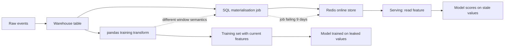
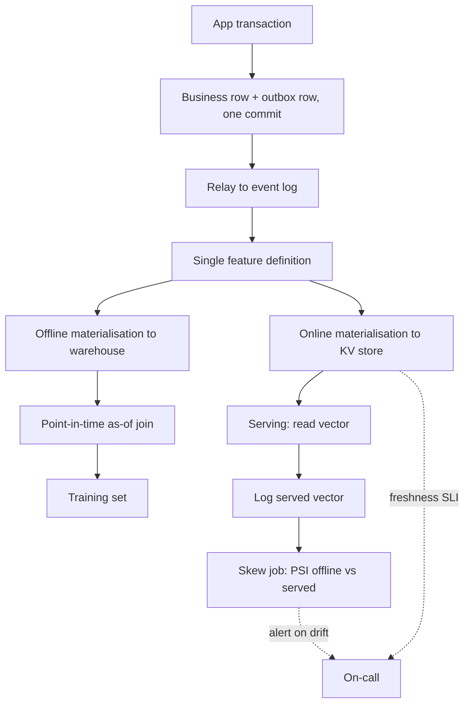

> **Scenario** - A fraud model scores 0.91 AUC offline and 0.68 in production. The offline training set computed `txn_count_7d` from a warehouse table with the full week of data; the online serving path reads a Redis key refreshed every 30 minutes by a job that has been silently failing for nine days.

## Why it matters

- Offline/online divergence is invisible to unit tests and CI. The model, the code, and the schema are all "correct"; only the values differ.
- A stale or wrongly-computed feature does not error - it produces a confident wrong prediction. For fraud, that is money; for ranking, that is engagement; for a triage classifier, that is a mislabelled ticket.
- Point-in-time leakage inflates offline metrics, so the team ships a model that was never as good as the dashboard claimed. Every subsequent experiment is measured against a fantasy baseline.
- Two implementations of the same feature means two on-call owners and two places to fix a definition change. Definitions drift within weeks.
- Debugging a bad prediction requires reconstructing the exact feature vector at request time. Without logged feature values, that reconstruction is guesswork.

## Symptoms

| Signal | What you observe |
| --- | --- |
| Offline/online metric gap | Validation AUC 0.91, production AUC 0.68, with no data drift in the raw inputs |
| Suspiciously good offline scores | A feature's importance is high and its offline value correlates almost perfectly with the label |
| Stale online features | Redis key `feat:user:123:txn_count_7d` has `ttl -1` and a value written days ago |
| Default-value cliff | 20% of online requests get the imputed default because the online store has no row for that key |
| Type mismatches | Offline feature is `float64`, online store returns a string, casting silently yields `0.0` |
| Divergent definitions | `pandas` code says `>= 7 days`, the SQL online-materialisation says `> 7 days` |

## How it breaks

The core problem is two code paths computing the same feature. Training reads the warehouse with a `pandas` job written by a data scientist. Serving reads a key-value store populated by a separate SQL job written by a platform engineer. Nothing forces them to agree.

Point-in-time correctness is the subtler failure. The training query joins the feature table on `user_id` alone and picks the *current* feature value, which was computed after the label event. The model then learns from information that did not exist at prediction time.



## Root causes

1. Feature logic implemented twice, in two languages, with no shared definition.
2. Training joins ignore event time, so features computed after the label leak into the training set.
3. The online materialisation job has no freshness SLO and no alert on its own lag.
4. Missing keys in the online store fall back to a default that never appears in training.
5. Feature values are not logged at inference time, so offline/online comparison is impossible after the fact.
6. Dual writes: the application writes both the transactional row and the feature update, and one of them fails.

## How to solve it

### 1. One definition, two materialisations

Define the transform once and generate both paths from it. Even without a full feature-store product, a single SQL expression referenced by both jobs beats two hand-written implementations.

```sql
-- features/txn_count_7d.sql - the ONLY definition
SELECT
  t.user_id,
  t.as_of_ts,
  COUNT(*) FILTER (
    WHERE h.occurred_at >  t.as_of_ts - INTERVAL '7 days'
      AND h.occurred_at <= t.as_of_ts
  ) AS txn_count_7d
FROM {{ spine }} t
LEFT JOIN analytics.transactions h
       ON h.user_id = t.user_id
      AND h.occurred_at <= t.as_of_ts
GROUP BY 1, 2;
```

The `spine` is `(user_id, as_of_ts)`. For training, the spine is the label events. For online materialisation, the spine is `(user_id, NOW())`. Identical semantics, different spine.

### 2. Make the training join point-in-time correct

```python
import pandas as pd

labels = pd.read_parquet("labels.parquet")      # user_id, event_ts, is_fraud
features = pd.read_parquet("features.parquet")  # user_id, as_of_ts, txn_count_7d

labels = labels.sort_values("event_ts")
features = features.sort_values("as_of_ts")

# As-of join: take the newest feature row at or before the label timestamp.
training = pd.merge_asof(
    labels,
    features,
    left_on="event_ts",
    right_on="as_of_ts",
    by="user_id",
    direction="backward",
    tolerance=pd.Timedelta("2h"),
)

# Rows with no feature within tolerance must be visible, not silently zero-filled.
training["feature_missing"] = training["txn_count_7d"].isna()
assert training["feature_missing"].mean() < 0.05, "too many unmatched label rows"
```

`merge_asof` with `direction="backward"` is the whole point: it forbids the join from reaching forward in time. The `tolerance` bound turns "feature is a year stale" into a visible miss rather than a plausible number.

### 3. Log the served feature vector

```python
import json
import logging

logger = logging.getLogger("feature_log")


def score(request, model, online_store):
    vector = online_store.get_vector(request.user_id, FEATURE_NAMES)
    prediction = model.predict_proba(vector.to_frame().T)[0, 1]
    logger.info(
        json.dumps(
            {
                "request_id": request.id,
                "model_version": model.version,
                "feature_set_version": FEATURE_SET_VERSION,
                "features": vector.to_dict(),
                "served_at": request.received_at.isoformat(),
                "score": float(prediction),
            }
        )
    )
    return prediction
```

These logs become the next training set's spine *and* the ground truth for skew detection. Without them you are comparing a model to a story about a model.

### 4. Alert on materialisation freshness, not job success

```sql
-- Freshness SLI: max staleness across the online key space sample
SELECT
  MAX(EXTRACT(EPOCH FROM (NOW() - materialised_at))) AS max_staleness_s,
  PERCENTILE_CONT(0.95) WITHIN GROUP (ORDER BY EXTRACT(EPOCH FROM (NOW() - materialised_at)))
    AS p95_staleness_s
FROM feature_store.online_metadata
WHERE feature_name = 'txn_count_7d';
```

Page when `p95_staleness_s` exceeds the number the model was trained to tolerate. A green DAG with a 9-day-stale key is worse than a red DAG.

### 5. Compare distributions daily

```python
import numpy as np
import pandas as pd


def population_stability_index(expected: pd.Series, actual: pd.Series, bins: int = 10) -> float:
    edges = np.unique(np.quantile(expected.dropna(), np.linspace(0, 1, bins + 1)))
    e = np.histogram(expected.dropna(), bins=edges)[0] / max(len(expected.dropna()), 1)
    a = np.histogram(actual.dropna(), bins=edges)[0] / max(len(actual.dropna()), 1)
    e, a = np.clip(e, 1e-6, None), np.clip(a, 1e-6, None)
    return float(np.sum((a - e) * np.log(a / e)))


offline = pd.read_parquet("training_features.parquet")["txn_count_7d"]
online = pd.read_json("served_features.jsonl", lines=True)["txn_count_7d"]
psi = population_stability_index(offline, online)
if psi > 0.2:
    raise SystemExit(f"feature skew: PSI={psi:.3f}")
```

PSI above 0.1 warrants a look; above 0.25 the feature is effectively a different variable in production.

### 6. Kill dual writes with the outbox pattern

If the application must publish feature-relevant events, write the event to an outbox table in the same transaction as the business row and let a relay publish it. Otherwise the transactional row and the feature update diverge on any partial failure.

## Target design



## Tradeoffs

| Option | Pros | Cons | Choose when |
| --- | --- | --- | --- |
| Managed feature store | Point-in-time joins and dual materialisation built in | New infrastructure, cost, and lock-in | More than ~3 models share more than ~20 features |
| Single SQL definition, two jobs | Cheap; no new platform; readable | Discipline-dependent; drift possible via copy-paste | Small team, few models, strong review culture |
| Compute features at request time | Zero staleness; no online store | Latency budget and source-DB load; harder to backfill | Features are cheap and depend on the current request |
| Log-and-replay (no offline store) | Training set is literally what was served | Cold start needs a shadow period; no historical backfill | Skew matters more than sample volume |

## Verification checklist

- [ ] Pick 200 production requests; recompute their features offline and assert equality within tolerance for each field.
- [ ] Shuffle the label timestamps by −1 day and confirm offline AUC drops; if it does not, you have leakage.
- [ ] Stop the online materialisation job for an hour in staging; confirm an alert fires before the freshness SLO expires.
- [ ] Delete an online key; confirm serving emits a `feature_missing` metric rather than silently imputing.
- [ ] Run the PSI job against yesterday's served logs; every feature is under the agreed threshold.
- [ ] `git grep` each feature name; it appears in exactly one definition file.
- [ ] Confirm dtypes match: the online store returns the same numeric type the training frame used.

## Anti-patterns

- Filling missing online features with `0` because the model needs a number. Train with an explicit missing indicator instead.
- Building the training set with `SELECT ... JOIN features USING (user_id)` and no time predicate.
- Treating "the DAG is green" as a freshness guarantee.
- Refreshing the online store from the *same* aggregate table the training job reads, but on a different cadence, then calling it consistent.
- Adding a feature that is a function of the label pipeline (for example, `chargeback_count`) without checking its availability at prediction time.
- Versioning the model but not the feature set, so a rollback restores old weights against new features.

## Related

- [Training–serving skew in ML pipelines](/systems/data-pipelines-ml/training-serving-skew)
- [Data quality contracts between producers and consumers](/systems/data-pipelines-ml/data-quality-contracts)
- [Model versioning and rollback under fire](/systems/data-pipelines-ml/model-versioning-and-rollback)
- [Late-arriving and out-of-order data](/systems/data-pipelines-ml/late-arriving-out-of-order-data)
