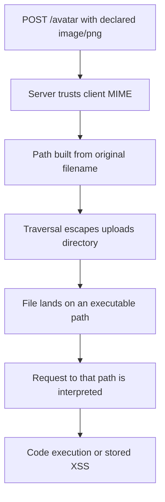
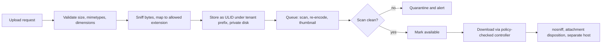

> **Scenario** - একটা avatar upload browser যা `image/png` বলে তা-ই মেনে নেয় এবং মূল filename দিয়ে `public/uploads/`-এ রাখে। `../avatars/../../index.php` নামের একটা file নির্ধারিত directory-র বাইরে পড়ে, আর web server `.php`-তে শেষ হওয়া যেকোনো কিছু আনন্দে execute করে।

## Why it matters

- Upload endpoint attacker-নিয়ন্ত্রিত byte আপনার infrastructure-এ আনে। ওই byte execute বা HTML হিসেবে serve হতে পারলে সেটা remote code execution বা stored XSS।
- Upload shared surface: একই file thumbnailer, antivirus hook, export job ও CDN পড়ে। ক্ষতিকর file কয়েকটা সুযোগ পায়।
- Unbounded upload availability সমস্যাও - disk exhaustion ও image-bomb decompression সুস্থ node নামিয়ে দেয়।
- File থেকে যায়। আজ ঢোকা vulnerability endpoint নতুন করে লেখার বছর পরেও bucket-এ reachable।

## Symptoms

| Signal | What you observe |
| --- | --- |
| Client-declared type trusted | code `$request->file()->getClientMimeType()`-এ branch করে |
| মূল filename রাখা | storage path-এ user-দেওয়া নাম, space ও `..` |
| Executable path | upload document root-এর নিচে, PHP handling চালু |
| Size ceiling নেই | `client_max_body_size` সেট নেই; একটা request disk ভরে দেয় |
| Decompression spike | ছোট file-এ image processing worker OOM |
| Inline serve | uploads path থেকে `Content-Type: text/html` response |

## How it breaks

দুটো অনুমান একসাথে fail করে। Declared content type কেবল client-এর বাছা একটা header, আর filename কেবল client-এর বাছা একটা string। Server যদি নাম থেকে storage path আর extension থেকে handler ঠিক করে, তবে byte কোথায় যাবে ও কীভাবে ব্যাখ্যা হবে - দুটোই client বেছে দিয়েছে। এরপর nginx, image library, browser - সবাই ঠিক যেভাবে configure করা তেমনই কাজ করে।



## Root causes

1. Content type byte পরীক্ষা না করে request থেকে নেওয়া।
2. Filename হুবহু ব্যবহার, ফলে traversal, null byte ও double extension সম্ভব।
3. Upload document root-এর ভেতরে রাখা, যেখানে server extension-কে interpreter-এ map করে।
4. Size বা dimension limit নেই, তাই decompression ও disk exhaustion সহজ।
5. File ঢিলে `Content-Type` ও `Content-Disposition` ছাড়া serve করা।
6. Signed URL নেই, তাই object storage object public বা অনুমানযোগ্য।
7. Processing web request-এর ভেতরেই synchronous, তাই ক্ষতিকর file worker আটকে রাখে।

## How to solve it

### 1. নাম ও path নিজে বানান

```php
$file = $request->file('avatar');
$extension = self::EXTENSION_BY_MIME[$file->getMimeType()] ?? null;

abort_if($extension === null, 422, 'unsupported_file_type');

$path = sprintf('tenants/%d/avatars/%s.%s', $tenantId, (string) Str::ulid(), $extension);

Storage::disk('private')->put($path, $file->get(), ['visibility' => 'private']);
```

`getMimeType()` client header নয়, file content (finfo দিয়ে) পরীক্ষা করে। Stored নামে কোনো user input নেই, তাই traversal-এর কাজ করার কিছু নেই।

### 2. Type, size ও dimension declaratively validate করুন

```php
$request->validate([
    'avatar' => [
        'required',
        'file',
        'mimetypes:image/png,image/jpeg,image/webp',
        'max:2048',                      // kilobytes
        Rule::dimensions()->maxWidth(4000)->maxHeight(4000),
    ],
]);
```

`mimetypes` detected type দেখে; `dimensions` সেই image bomb আটকায় যা disk-এ ছোট কিন্তু memory-তে বিশাল।

### 3. Document root-এর বাইরে রাখুন, app দিয়ে serve করুন

```php
// config/filesystems.php
'private' => [
    'driver' => 'local',
    'root' => storage_path('app/private'),
    'throw' => true,
],
```

```php
public function show(Attachment $attachment)
{
    $this->authorize('view', $attachment);

    return Storage::disk('private')->download(
        $attachment->path,
        $attachment->original_name,
        [
            'Content-Type' => $attachment->safe_mime,
            'Content-Disposition' => 'attachment; filename="' . addslashes($attachment->original_name) . '"',
            'X-Content-Type-Options' => 'nosniff',
        ],
    );
}
```

Controller দিয়ে serve করা মানে প্রতিটি download policy layer পেরিয়ে যায়, যা cross-tenant access-ও ঠিক করে।

### 4. Storage location নিষ্ক্রিয় করুন

```nginx
client_max_body_size 8m;

location ^~ /storage/uploads/ {
    # Never hand user content to an interpreter.
    location ~ \.(php|phtml|phar|cgi|pl)$ { deny all; }

    add_header X-Content-Type-Options nosniff always;
    add_header Content-Disposition "attachment" always;
    add_header Content-Security-Policy "default-src 'none'; sandbox" always;
}
```

আরও ভালো: user content আলাদা domain-এ (বা আলাদা bucket-এ) রাখুন, যাতে serve হওয়া HTML-ও আপনার session cookie-তে পৌঁছাতে না পারে।

### 5. আরও কঠোর validation নয়, re-encode করুন

Image decode করে আবার encode করুন। Output আপনার library-র বানানো file, তাই embedded script, EXIF payload ও polyglot চাল বাদ পড়ে:

```php
$image = \Intervention\Image\Laravel\Facades\Image::read($file->getRealPath());

Storage::disk('private')->put(
    $path,
    (string) $image->scaleDown(1024, 1024)->toWebp(quality: 82),
);
```

### 6. সীমিত resource সহ asynchronous processing

Virus scan, thumbnail ও PDF text extraction memory limit ও timeout সহ queue-তে দিন, যাতে বিরূপ file request pool নয়, একটা worker শেষ করে।

```php
ScanUpload::dispatch($attachment->id)->onQueue('uploads');
```

Scan pass না হওয়া পর্যন্ত record `pending` রাখুন; তারপরই অন্য user-দের কাছে দেখান।

## Target design



## Tradeoffs

| Option | Pros | Cons | Choose when |
| --- | --- | --- | --- |
| App-নিয়ন্ত্রিত local disk | সরল; সস্তা | node-local; backup ও quota কাজ লাগে | single-node app, কম volume |
| Signed URL সহ object storage | scale করে; bandwidth offload | expiry tuning; access audit কঠিন | অধিকাংশ production system |
| App দিয়ে serve | প্রতি request-এ policy; পূর্ণ audit | app bandwidth ও worker খায় | সংবেদনশীল document |
| Direct-to-bucket upload | app bandwidth লাগে না; বড় file দ্রুত | validation upload-এর পরে করতে হয় | video ও বড় media |
| সবকিছু re-encode | embedded payload সরায় | CPU cost; কিছু format-এ lossy | user-visible image |

## Verification checklist

- [ ] `.php` file-কে `.png` নামে upload করে content sniffing-এ reject হওয়া দেখুন।
- [ ] `../` যুক্ত filename upload করে stored path একটা generated ULID কিনা দেখুন।
- [ ] `.php` suffix সহ uploaded path request করে দেখুন সেটা denied, executed নয়।
- [ ] Uploads path-এর response-এ `nosniff` ও attachment disposition আছে।
- [ ] `client_max_body_size` ছাড়িয়ে দেখুন app-এ পৌঁছার আগেই 413 আসে।
- [ ] অন্য tenant-এর attachment id চেয়ে 404 নিশ্চিত করুন।
- [ ] Object storage bucket publicly listable নয় তা নিশ্চিত করুন।

## Anti-patterns

- অনুমোদিত কয়েকটা allowlist না করে extension (`.php`, `.exe`) blocklist করা।
- শুধু `$_FILES['type']` দেখা, যা client সেট করে।
- CDN configuration সহজ বলে file `public/`-এ রাখা।
- Application session-এর একই origin থেকে user content serve করা।
- Request path-এ antivirus চালিয়ে load-এ timeout খাওয়া।

## Related

- [SSRF and internal metadata exposure](/systems/auth-security/ssrf-and-internal-metadata)
- [Injection through ORM escape hatches](/systems/auth-security/injection-and-orm-escapes)
- [Multi-tenant authorization leaks](/systems/auth-security/multi-tenant-authorization-leaks)
