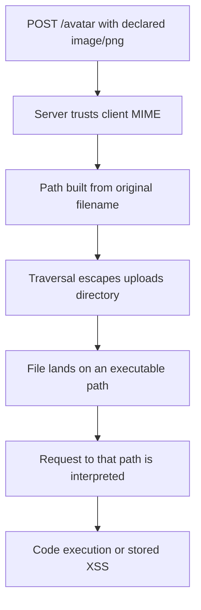
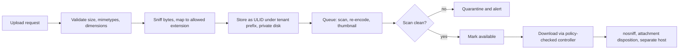

> **Scenario** - An avatar upload accepts anything the browser labels `image/png` and stores it under `public/uploads/` using the original filename. A file named `../avatars/../../index.php` lands outside the intended directory, and the web server is happy to execute anything ending in `.php`.

## Why it matters

- An upload endpoint moves attacker-controlled bytes onto your infrastructure. If those bytes can be executed or served as HTML, it is remote code execution or stored XSS.
- Uploads are shared surfaces: the same file is read by a thumbnailer, an antivirus hook, an export job, and a CDN. A malicious file gets several chances.
- Unbounded uploads are also an availability problem - disk exhaustion and image-bomb decompression take down healthy nodes.
- Files persist. A vulnerability introduced today is still reachable in the bucket years later, long after the endpoint is rewritten.

## Symptoms

| Signal | What you observe |
| --- | --- |
| Client-declared type trusted | Code branches on `$request->file()->getClientMimeType()` |
| Original filenames kept | Storage paths contain user-supplied names, spaces, and `..` |
| Executable path | Uploads live under the document root with PHP handling enabled |
| No size ceiling | `client_max_body_size` unset; a single request fills the disk |
| Decompression spikes | Image processing worker OOMs on a small file |
| Served inline | `Content-Type: text/html` responses from the uploads path |

## How it breaks

Two assumptions fail together. The declared content type is just a header the client chose, and the filename is just a string the client chose. If the server derives the storage path from the name and the handler from the extension, the client has effectively chosen where the bytes go and how they will be interpreted. Everything downstream - nginx, the image library, the browser - then does exactly what it is configured to do.



## Root causes

1. Content type taken from the request instead of inspected from the bytes.
2. Filenames used verbatim, allowing traversal, null bytes, and double extensions.
3. Uploads stored inside the document root, where the server maps extensions to interpreters.
4. No size or dimension limits, so decompression and disk exhaustion are trivial.
5. Files served with a permissive `Content-Type` and no `Content-Disposition`.
6. Signed URLs missing, so object storage objects are public or guessable.
7. Processing happens synchronously in the web request, so a malicious file blocks a worker.

## How to solve it

### 1. Generate the name and path yourself

```php
$file = $request->file('avatar');
$extension = self::EXTENSION_BY_MIME[$file->getMimeType()] ?? null;

abort_if($extension === null, 422, 'unsupported_file_type');

$path = sprintf('tenants/%d/avatars/%s.%s', $tenantId, (string) Str::ulid(), $extension);

Storage::disk('private')->put($path, $file->get(), ['visibility' => 'private']);
```

`getMimeType()` inspects the file contents (via finfo) rather than trusting the client header. The stored name contains no user input at all, so traversal has nothing to work with.

### 2. Validate type, size, and dimensions declaratively

```php
$request->validate([
    'avatar' => [
        'required',
        'file',
        'mimetypes:image/png,image/jpeg,image/webp',
        'max:2048',                      // kilobytes
        Rule::dimensions()->maxWidth(4000)->maxHeight(4000),
    ],
]);
```

`mimetypes` checks the detected type; `dimensions` blocks image bombs that are small on disk but enormous in memory.

### 3. Store outside the document root and serve through the app

```php
// config/filesystems.php
'private' => [
    'driver' => 'local',
    'root' => storage_path('app/private'),
    'throw' => true,
],
```

```php
public function show(Attachment $attachment)
{
    $this->authorize('view', $attachment);

    return Storage::disk('private')->download(
        $attachment->path,
        $attachment->original_name,
        [
            'Content-Type' => $attachment->safe_mime,
            'Content-Disposition' => 'attachment; filename="' . addslashes($attachment->original_name) . '"',
            'X-Content-Type-Options' => 'nosniff',
        ],
    );
}
```

Serving through a controller means every download passes the policy layer, which also fixes cross-tenant access.

### 4. Make the storage location inert

```nginx
client_max_body_size 8m;

location ^~ /storage/uploads/ {
    # Never hand user content to an interpreter.
    location ~ \.(php|phtml|phar|cgi|pl)$ { deny all; }

    add_header X-Content-Type-Options nosniff always;
    add_header Content-Disposition "attachment" always;
    add_header Content-Security-Policy "default-src 'none'; sandbox" always;
}
```

Better still: keep user content on a separate domain (or a dedicated bucket) so even served HTML cannot reach your session cookies.

### 5. Re-encode instead of validating harder

For images, decode and re-encode. The output is a file your library produced, which drops embedded scripts, EXIF payloads, and polyglot tricks:

```php
$image = \Intervention\Image\Laravel\Facades\Image::read($file->getRealPath());

Storage::disk('private')->put(
    $path,
    (string) $image->scaleDown(1024, 1024)->toWebp(quality: 82),
);
```

### 6. Process asynchronously with bounded resources

Push virus scanning, thumbnailing, and PDF text extraction into a queue with a memory limit and timeout, so a hostile file exhausts one worker and not the request pool.

```php
ScanUpload::dispatch($attachment->id)->onQueue('uploads');
```

Keep the record in a `pending` state until the scan passes; only then expose it to other users.

## Target design



## Tradeoffs

| Option | Pros | Cons | Choose when |
| --- | --- | --- | --- |
| Local disk under app control | Simple; cheap | Node-local; needs backup and quota work | Single-node apps, small volumes |
| Object storage with signed URLs | Scales; offloads bandwidth | Expiry tuning; harder audit of access | Most production systems |
| Serve through the app | Policy on every request; full audit | Uses app bandwidth and workers | Sensitive documents |
| Direct-to-bucket upload | No app bandwidth; fast for large files | Validation must happen post-upload | Video and large media |
| Re-encode everything | Removes embedded payloads | CPU cost; lossy for some formats | User-visible images |

## Verification checklist

- [ ] Upload a `.php` file renamed to `.png` and confirm rejection by content sniffing.
- [ ] Upload a filename containing `../` and confirm the stored path is a generated ULID.
- [ ] Request an uploaded path with a `.php` suffix and confirm it is denied, not executed.
- [ ] Confirm responses from the uploads path carry `nosniff` and attachment disposition.
- [ ] Exceed `client_max_body_size` and confirm a 413 before the app is reached.
- [ ] Fetch another tenant's attachment id and confirm 404.
- [ ] Confirm the object storage bucket is not publicly listable.

## Anti-patterns

- Blocklisting extensions (`.php`, `.exe`) instead of allowlisting the few you accept.
- Checking only `$_FILES['type']`, which the client sets.
- Storing files in `public/` because the CDN configuration is easier that way.
- Serving user content from the same origin as the application session.
- Running antivirus in the request path and timing out under load.

## Related

- [SSRF and internal metadata exposure](/systems/auth-security/ssrf-and-internal-metadata)
- [Injection through ORM escape hatches](/systems/auth-security/injection-and-orm-escapes)
- [Multi-tenant authorization leaks](/systems/auth-security/multi-tenant-authorization-leaks)
