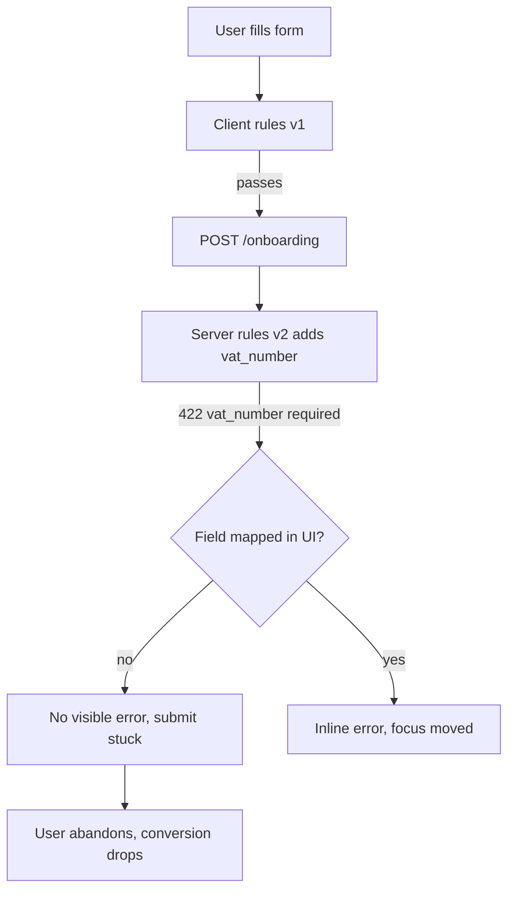
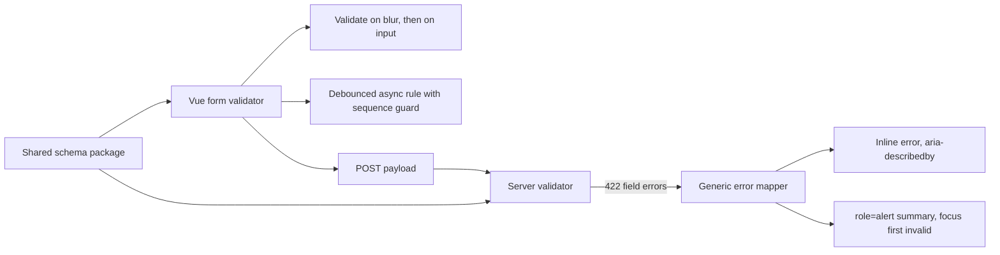

> **Scenario** - ৪০ field-এর একটা onboarding form client-এ হাতে লেখা `if` দিয়ে আর server-এ Laravel rule দিয়ে validate করে। এক release শুধু server-side-এ `vat_number` বাধ্যতামূলক করে। Client submit করতে দেয়, API এমন একটা field নিয়ে 422 ফেরায় যা form render-ই করে না, আর submit button চিরকাল ঘুরতে থাকে। কেউ দুই ঘটনা মেলানোর আগেই ওই step-এ conversion ১৮% পড়ে যায়।

## Why it matters

- Duplicate validation logic drift করে। দুইবার লেখা প্রতিটি rule একদিন অমিল হবেই, আর সেই অমিল সবসময় user-এর জন্য dead-end হয়ে দেখা দেয়।
- Unmapped server error অদৃশ্য। 422 body যদি এমন field-এর নাম বলে যা form দেখাতে পারে না, user কিছুই করার মতো পায় না এবং ছেড়ে দেয়।
- `aria-describedby` দিয়ে input-এর সাথে যুক্ত না করা validation message screen reader user-এর নাগালের বাইরে - এটা WCAG 3.3.1 ব্যর্থতা, আর সরকারি সেবায় আইনি ঝুঁকিও।
- Async rule (uniqueness check) race করে। দ্রুত টাইপ করলে শেষে আসা stale response একটা বৈধ email-কে "taken" চিহ্নিত করে রাখতে পারে।

## Symptoms

| Signal | What you observe |
| --- | --- |
| 422 কিন্তু UI অপরিবর্তিত | request fail, form একই রকম, button disabled থাকে |
| Client/server অমিল | client যা মানে API তা রিজেক্ট করে, বা উল্টোটা |
| Stale async error | ঠিকানা ঠিক করার পরও "Email taken" থেকে যায় |
| Submit-এ focus হারানো | failed submit-এর পর focus button-এ, error পর্দার বাইরে |
| Screen reader নীরব | field invalid হলে VoiceOver কিছুই বলে না |
| Validation jank | বড় form-এ টাইপ করলে frame drop; INP ২০০ ms-এর উপরে |

## How it breaks

দুইটা স্বাধীন rule set মানে দুইটা সত্যের উৎস। Server চূড়ান্ত কিন্তু কেবল submit-এর সময় কথা বলে; client দ্রুত কিন্তু ভুল হতে পারে। Shared schema ছাড়া client-এর কাজ নীরবে "invalid submit ঠেকানো" থেকে "server কী চায় অনুমান করা"-তে নেমে আসে। Failure mode crash নয় - এমন একটা form যা পূরণই করা যায় না।



## Root causes

1. দুই ভাষায় দুইবার লেখা rule, মাঝখানে কোনো generated contract নেই।
2. 422 response body-কে form field-এ map করার generic handler নেই।
3. Error input-এর পাশে আলগা text হিসেবে render হয়, `aria-describedby` দিয়ে যুক্ত নয়।
4. Async validator প্রতি keystroke-এ চলে - debounce, cancellation বা sequencing ছাড়া।
5. প্রতিটি input-এ পুরো form validate হয়, তাই বড় form-এ প্রতি অক্ষরে ৪০টা field re-validate।
6. প্রথম invalid field-এ focus সরানো হয় না, তাই নিচের error চোখেই পড়ে না।

## How to solve it

### 1. Schema একবার লিখে ভাগ করুন

```ts
// packages/contracts/onboarding.ts
import { z } from 'zod'

export const onboardingSchema = z.object({
  companyName: z.string().min(2).max(120),
  country: z.enum(['BD', 'SG', 'AE']),
  vatNumber: z.string().regex(/^[A-Z]{2}\d{9}$/).optional(),
  email: z.string().email(),
}).refine((v) => v.country !== 'SG' || Boolean(v.vatNumber), {
  path: ['vatNumber'],
  message: 'VAT number is required for Singapore.',
})

export type OnboardingInput = z.infer<typeof onboardingSchema>
```

Backend PHP বা Python হলে একই JSON Schema export থেকে তার rule generate করুন, আবার টাইপ করবেন না। এই contract package-ই drift-কে support ticket নয়, build error বানায়।

### 2. সঠিক মুহূর্তে validate করুন

Field `blur`-এ validate করুন, আর প্রথম failed submit-এর পর প্রতিটি `input`-এ। শুরু থেকেই প্রতি keystroke-এ validate করলে user মাঝপথে শাস্তি পায় আর main thread সময় পোড়ে।

```ts
const { errors, validateField, validateAll } = useSchemaForm(onboardingSchema, model)

function onBlur(field: keyof OnboardingInput) {
  validateField(field)
}
```

### 3. Async rule sequence করুন

```ts
let seq = 0
const checkEmail = useDebounceFn(async (email: string) => {
  const mine = ++seq
  const taken = await api.get('/emails/available', { params: { email } })
  if (mine !== seq) return          // a newer request has started; drop this result
  errors.email = taken ? undefined : 'That email is already registered.'
}, 300)
```

এই sequence guard-ই stale response-কে ঠিক করা field আবার flag করা থেকে ঠেকায়।

### 4. Server error generic ভাবে field-এ map করুন

```ts
try {
  await api.post('/onboarding', model)
} catch (e) {
  if (e.status === 422) {
    for (const [field, messages] of Object.entries(e.body.errors)) {
      errors[camelCase(field)] = messages[0]
    }
    // anything the form cannot render must still reach the user
    const unknown = Object.keys(e.body.errors).filter((f) => !(camelCase(f) in model))
    if (unknown.length) formError.value = e.body.message
    focusFirstInvalid()
  }
}
```

### 5. Assistive tech-এর জন্য error input-এর সাথে যুক্ত করুন

```vue
<label :for="id">Company name</label>
<input
  :id="id"
  v-model="model.companyName"
  :aria-invalid="Boolean(errors.companyName) || undefined"
  :aria-describedby="errors.companyName ? `${id}-err` : undefined"
  @blur="onBlur('companyName')"
/>
<p v-if="errors.companyName" :id="`${id}-err`" class="field-error">
  {{ errors.companyName }}
</p>
```

### 6. Summary announce করুন ও focus সরান

```ts
function focusFirstInvalid() {
  const first = Object.keys(errors).find((k) => errors[k])
  if (!first) return
  document.getElementById(fieldIds[first])?.focus()
}
```

`role="alert"` summary region-এ fail করা field-গুলো link হিসেবে দেখান। Screen reader user সংখ্যা ও jump target পায়; লম্বা form-এ দৃষ্টিসম্পন্ন user-ও একই সুবিধা পায়।

### 7. Server-কেই চূড়ান্ত রাখুন

Client validation UX accelerator, কখনও security control নয়। Client যা-ই দাবি করুক, server প্রতিটি request-এ একই schema আবার validate করে।

## Target design



## Tradeoffs

| Option | Pros | Cons | Choose when |
| --- | --- | --- | --- |
| শুধু client rule | তাৎক্ষণিক feedback | অনিরাপদ, server থেকে drift | আসল submission-এ কখনও নয় |
| শুধু server rule | এক সত্যের উৎস | প্রতি চেষ্টায় round trip, দুর্বল UX | খুব সরল বা কম traffic-এর form |
| Shared schema | দ্রুত ও consistent | contract package ও codegen লাগে | multi-step বা high-value flow |
| Schema-driven rendering | form ও rule আলাদা হতে পারে না | নিজস্ব layout প্রকাশ কঠিন | admin CRUD ও settings screen |

## Verification checklist

- [ ] Schema-তে required field যোগ করুন; UI পরিবর্তন ছাড়াই client submission আটকায়।
- [ ] Form render করে না এমন field-এ 422 চাপান; user তবু একটা message দেখে।
- [ ] তিনটা async check চালু হওয়ার মতো দ্রুত email টাইপ করুন; কেবল শেষ result দেখায়।
- [ ] লম্বা invalid form submit করুন; focus প্রথম invalid input-এ যায়।
- [ ] Field invalid হলে screen reader error text পড়ে।
- [ ] Form-এ `axe` কোনো `aria-describedby` বা label violation দেখায় না।
- [ ] ৪০ field-এর form-এ টাইপ করার সময় INP ২০০ ms-এর নিচে থাকে।

## Anti-patterns

- Form valid না হওয়া পর্যন্ত submit button disable রেখে কেন চাপা যাচ্ছে না তা লুকানো।
- Text বা icon ছাড়া শুধু রঙ দিয়ে error বোঝানো।
- প্রথম render থেকেই প্রতি keystroke-এ, এমনকি না ছোঁয়া field-ও validate করা।
- "Internal" endpoint বলে client validation-এ ভরসা করে server check বাদ দেওয়া।
- Structured 422 response-এর জন্য generic "Something went wrong" দেখানো।

## Related

- [Accessibility in shared component systems](/systems/frontend-architecture/accessibility-in-component-systems)
- [Frontend state management at scale](/systems/frontend-architecture/frontend-state-management-at-scale)
- [Optimistic UI and safe rollback](/systems/frontend-architecture/optimistic-ui-and-rollback)
