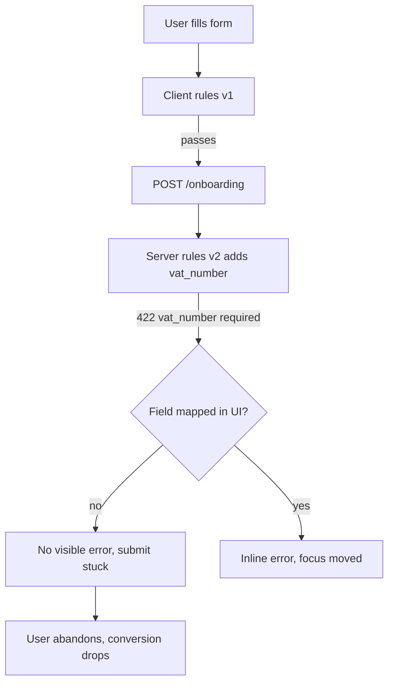
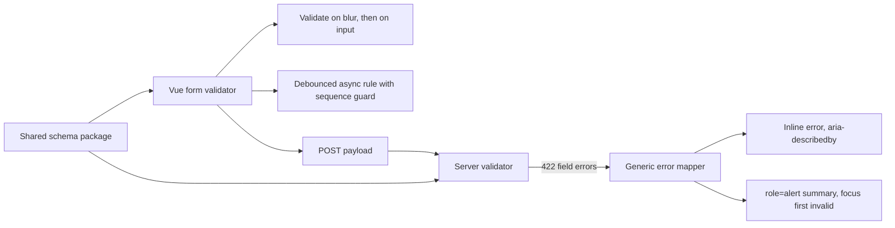

> **Scenario** — A 40-field onboarding form validates on the client with hand-written `if` statements and on the server with Laravel rules. A release adds a `vat_number` requirement server-side only. The client lets users submit, the API returns 422 with a field the form does not render, and the submit button spins forever. Conversion on that step drops 18% before anyone connects the two events.

## Why it matters

- Duplicated validation logic drifts. Every rule written twice is a rule that will disagree, and the disagreement always surfaces as a dead-end for the user.
- Unmapped server errors are invisible. If the 422 body names a field the form cannot show, the user sees nothing actionable and abandons.
- Validation messages that are not wired to inputs with `aria-describedby` are unreachable for screen reader users, which is a WCAG 3.3.1 failure and, for public services, a legal one.
- Async rules (uniqueness checks) race. Typing quickly can leave the last-arriving stale response marking a valid email as taken.

## Symptoms

| Signal | What you observe |
| --- | --- |
| 422 with no UI change | Request fails, form looks unchanged, button stays disabled |
| Client/server mismatch | Client accepts a value the API rejects, or the reverse |
| Stale async error | "Email taken" persists after the user corrects the address |
| Focus lost on submit | After a failed submit, focus stays on the button; errors are off-screen |
| Screen reader silence | VoiceOver announces nothing when a field becomes invalid |
| Validation jank | Typing in a large form drops frames; INP above 200 ms |

## How it breaks

Two independent rule sets are two sources of truth. The server is authoritative but only speaks at submit time; the client is fast but can be wrong. Without a shared schema, the client's job silently degrades from "prevent invalid submits" to "guess what the server wants". The failure mode is not a crash — it is a form that cannot be completed.



## Root causes

1. Rules authored twice in different languages with no generated contract between them.
2. No generic handler mapping a 422 response body onto form fields.
3. Errors rendered as loose text near the input rather than linked via `aria-describedby`.
4. Async validators fire per keystroke with no debounce, cancellation, or request sequencing.
5. Validation runs on the whole form on every input, so a large form re-validates 40 fields per character.
6. Focus is never moved to the first invalid field, so errors below the fold go unseen.

## How to solve it

### 1. Define the schema once and share it

```ts
// packages/contracts/onboarding.ts
import { z } from 'zod'

export const onboardingSchema = z.object({
  companyName: z.string().min(2).max(120),
  country: z.enum(['BD', 'SG', 'AE']),
  vatNumber: z.string().regex(/^[A-Z]{2}\d{9}$/).optional(),
  email: z.string().email(),
}).refine((v) => v.country !== 'SG' || Boolean(v.vatNumber), {
  path: ['vatNumber'],
  message: 'VAT number is required for Singapore.',
})

export type OnboardingInput = z.infer<typeof onboardingSchema>
```

If the backend is PHP or Python, generate its rules from the same JSON Schema export rather than retyping them. The contract package is what makes drift a build error instead of a support ticket.

### 2. Validate at the right moments

Validate a field on `blur` and after the first failed submit on every `input`. Validating on every keystroke from the start punishes users mid-typing and burns main-thread time.

```ts
const { errors, validateField, validateAll } = useSchemaForm(onboardingSchema, model)

function onBlur(field: keyof OnboardingInput) {
  validateField(field)
}
```

### 3. Sequence async rules

```ts
let seq = 0
const checkEmail = useDebounceFn(async (email: string) => {
  const mine = ++seq
  const taken = await api.get('/emails/available', { params: { email } })
  if (mine !== seq) return          // a newer request has started; drop this result
  errors.email = taken ? undefined : 'That email is already registered.'
}, 300)
```

The sequence guard is what stops a stale response from re-flagging a corrected field.

### 4. Map server errors back onto fields generically

```ts
try {
  await api.post('/onboarding', model)
} catch (e) {
  if (e.status === 422) {
    for (const [field, messages] of Object.entries(e.body.errors)) {
      errors[camelCase(field)] = messages[0]
    }
    // anything the form cannot render must still reach the user
    const unknown = Object.keys(e.body.errors).filter((f) => !(camelCase(f) in model))
    if (unknown.length) formError.value = e.body.message
    focusFirstInvalid()
  }
}
```

### 5. Wire errors to the input for assistive tech

```vue
<label :for="id">Company name</label>
<input
  :id="id"
  v-model="model.companyName"
  :aria-invalid="Boolean(errors.companyName) || undefined"
  :aria-describedby="errors.companyName ? `${id}-err` : undefined"
  @blur="onBlur('companyName')"
/>
<p v-if="errors.companyName" :id="`${id}-err`" class="field-error">
  {{ errors.companyName }}
</p>
```

### 6. Announce the summary and move focus

```ts
function focusFirstInvalid() {
  const first = Object.keys(errors).find((k) => errors[k])
  if (!first) return
  document.getElementById(fieldIds[first])?.focus()
}
```

Render a summary region with `role="alert"` listing the failed fields as links. Screen reader users get the count and the jump targets; sighted users on long forms get the same.

### 7. Keep the server authoritative

Client validation is a UX accelerator, never a security control. The server re-validates the same schema on every request regardless of what the client claims.

## Target design



## Tradeoffs

| Option | Pros | Cons | Choose when |
| --- | --- | --- | --- |
| Client-only rules | Instant feedback | Unsafe, drifts from server | Never for real submissions |
| Server-only rules | One source of truth | Round trip per attempt, poor UX | Very simple or low-traffic forms |
| Shared schema | Fast and consistent | Needs a contract package and codegen | Multi-step or high-value flows |
| Schema-driven rendering | Form and rules cannot diverge | Hard to express bespoke layouts | Admin CRUD and settings screens |

## Verification checklist

- [ ] Add a required field to the schema; the client blocks submission without a UI change.
- [ ] Force a 422 for a field the form does not render; the user still sees a message.
- [ ] Type an email fast enough to fire three async checks; only the last result is shown.
- [ ] Submit an invalid long form; focus lands on the first invalid input.
- [ ] Screen reader announces the error text when a field becomes invalid.
- [ ] `axe` reports no `aria-describedby` or label violations on the form.
- [ ] INP stays under 200 ms while typing in the 40-field form.

## Anti-patterns

- Disabling the submit button until the form is valid, hiding why it cannot be pressed.
- Colour-only error indication with no text or icon.
- Validating on every keystroke from first render, including fields never touched.
- Trusting client validation and skipping the server check for "internal" endpoints.
- Rendering a generic "Something went wrong" for a structured 422 response.

## Related

- [Accessibility in shared component systems](/systems/frontend-architecture/accessibility-in-component-systems)
- [Frontend state management at scale](/systems/frontend-architecture/frontend-state-management-at-scale)
- [Optimistic UI and safe rollback](/systems/frontend-architecture/optimistic-ui-and-rollback)
