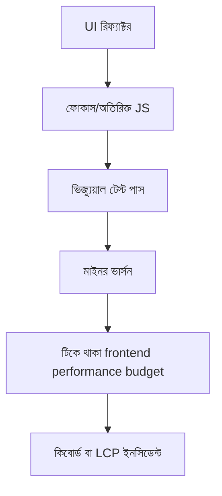

> **পাঠ 38 · মাঝারি ধাপ** - CI-তে enforce করা byte ও Core Web Vitals budget, আর lab test যা miss করে তা ধরতে field RUM।

## কেন এটা জরুরি

- Vue 3 আর Quasar-এ স্ক্রিন সুন্দর দেখালেও ফোকাস হারাতে পারে, রুট ৯০০ কেবি পাঠাতে পারে, বা ডিপ্লয়ের পর Pinia-তে গতকালকের ডেটা দেখাতে পারে।
- শেয়ার করা কম্পোনেন্ট একবার ভাঙলে যত প্রোডাক্ট সেই প্যাকেজ খায়, সবখানেই ভাঙে।
- শুধু চোখে দেখা টেস্ট কিবোর্ড ফাঁদ, হাইড্রেশন মিসম্যাচ, বা লেজি চাঙ্কের জলপ্রপাত ধরে না।
- এই পাঠটা ঠিক **টিকে থাকা frontend performance budget** নিয়ে। ট্যাগ: performance, core-web-vitals, budgets, ci, rum।

## কী দেখে বুঝবেন সমস্যা আছে

| সংকেত | যা দেখা যায় |
| --- | --- |
| ফোকাস / a11y | ট্যাব ডায়ালগ ছেড়ে পেছনের পেজে চলে যায়, স্ক্রিন রিডার শুধু “বাটন” বলে |
| বান্ডেল | লেজি রুট তবু পুরো ড্যাশবোর্ড নামিয়ে আনে |
| পুরনো UI | Laravel লিখে ফেললেও Pinia পুরনো সারি দেখায় |
| হাইড্রেশন | সার্ভার HTML আর ক্লায়েন্ট Vue গাছ প্রথম পেইন্টে মেলে না |

## কীভাবে ভাঙে



ভাঙে প্রযুক্তির নামে নয়, চুক্তির অভাবে। Vue/Quasar স্ক্রিন আর Laravel রাইট যদি উল্টো উত্তর ধরে, প্রোডাকশন সেই রেসটা খুঁজে বের করে। এই টপিকের চুক্তিটা হলো: CI-তে enforce করা byte ও Core Web Vitals budget, আর lab test যা miss করে তা ধরতে field RUM।

## মূল কারণ

1. অ্যাক্সেসিবিলিটি আর ফোকাস ফেরানো মার্কআপে ছিল, টেস্ট করা কম্পোজেবলে নয়।
2. রুট-লেভেল স্প্লিটিং একটা ব্যারেল ইমপোর্ট করেছে, তাই Chart.js সব পেজে ঢুকেছে।
3. Pinia API পেলোডকেই সত্য ধরেছে, সার্ভার-ক্যাশ আর লোকাল UI স্টেট আলাদা করেনি।
4. CI-তে axe বা কিবোর্ড-only চেক নেই, তাই রিফ্যাক্টরে ARIA উধাও হয়েও বিল্ড সবুজ।

## কীভাবে সমাধান করবেন

### ১. ইনভেরিয়েন্ট এক বাক্যে লিখুন

CI-তে enforce করা byte ও Core Web Vitals budget, আর lab test যা miss করে তা ধরতে field RUM। এই বাক্য পিআর, Pinia অ্যাকশন, আর Laravel ক্লাসে রাখুন।

### ২. কোডে কিনারা আটকে দিন

```ts
// composables/useFocusTrap.ts
export function useFocusTrap(panel: Ref<HTMLElement | null>, onClose: () => void) {
  const SELECTOR = 'a[href],button:not([disabled]),input,select,textarea,[tabindex]:not([tabindex="-1"])'
  function onKey(e: KeyboardEvent) {
    if (e.key === 'Escape') return onClose()
    if (e.key !== 'Tab' || !panel.value) return
    const nodes = [...panel.value.querySelectorAll<HTMLElement>(SELECTOR)]
    const first = nodes[0]
    const last = nodes.at(-1)
    if (!first || !last) return
    if (e.shiftKey && document.activeElement === first) { e.preventDefault(); last.focus() }
    else if (!e.shiftKey && document.activeElement === last) { e.preventDefault(); first.focus() }
  }
  onMounted(() => document.addEventListener('keydown', onKey))
  onUnmounted(() => document.removeEventListener('keydown', onKey))
}
```

```php
// routes/web.php — keep the JSON contract tiny so the Vue chunk stays lazy
Route::get('/api/tickets/{ticket}', function (Ticket $ticket) {
    return $ticket->only(['id', 'title', 'status', 'updated_at']);
});
```

### ৩. যে চার্ট সত্যি দেখবেন, সেটাই রাখুন

প্রতি রুটে LCP, ডাউনলোড হওয়া JS, আর ডিপ্লয়প্রতি axe লঙ্ঘন। **টিকে থাকা frontend performance budget**-এর রিগ্রেশন এই চার্টে না ধরা পড়লে পাঠ শেষ হয়নি।

## কাজের উদাহরণ

Quasar ডায়ালগ রিফ্যাক্টরে ভিতরের মার্কআপ একটা টেলিপোর্ট করা div হয়ে যায়। মাউসে কিছুই বদলায় না। কিবোর্ডে ট্যাব পেছনের পেজে চলে যায়। ১২ লাইনের ফোকাস-ট্র্যাপ কম্পোজেবল আর CI-তে axe চেক সেই ফাঁক সব স্ক্রিনে বন্ধ করে।

এই টপিকে নিজের শেষ ইনসিডেন্টের লক্ষণ টেবিলে মিলিয়ে নিন, তারপর ডায়াগ্রাম ধরে এগোন যতক্ষণ না উপরের গার্ড আগুন ধরত।

## শিপ করার আগে

- [ ] **টিকে থাকা frontend performance budget**-এর ইনভেরিয়েন্ট এক বাক্যে লেখা।
- [ ] খালি, ডুপ্লিকেট, টাইমআউট বা পারমিশন পাথের টেস্ট বা রিহার্সাল আছে।
- [ ] এক ডিপ্লয়ের মধ্যে রিগ্রেশন ধরার লগ বা চার্ট আছে।
- [ ] আত্মীয় পাঠ এখনও মিলছে: code-splitting-and-lazy-routes, rendering-strategy-selection।

## যা করবেন না

- অনন্ত রিট্রাই বা এররকে সাকসেস হিসেবে ক্যাশ করা ব্লগ স্নিপেট কপি করবেন না।
- Laravel সারির সত্য Pinia-কে বলে দেবেন না।
- ঘন মনে হলে আগের নম্বরের পাঠ আগে শেষ করুন। পথটা ইচ্ছা করেই শুরু → মাঝারি → উন্নত।
