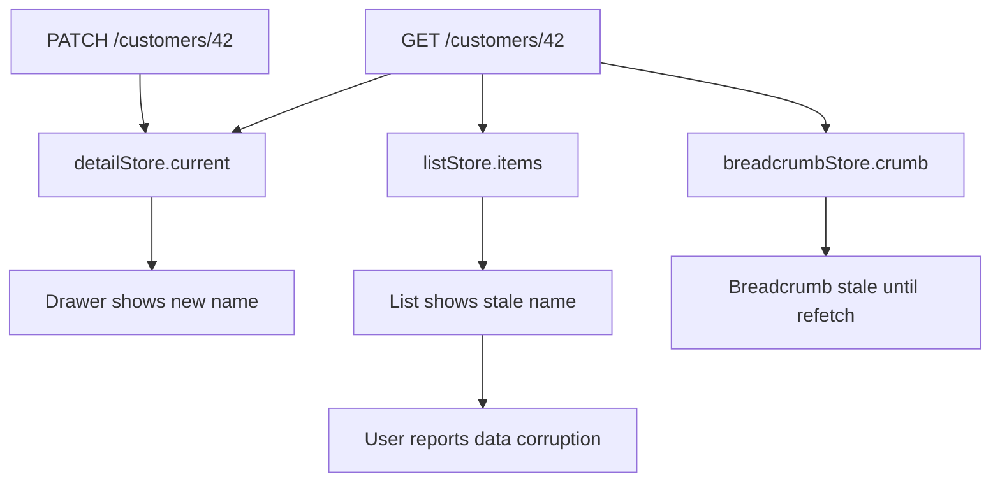
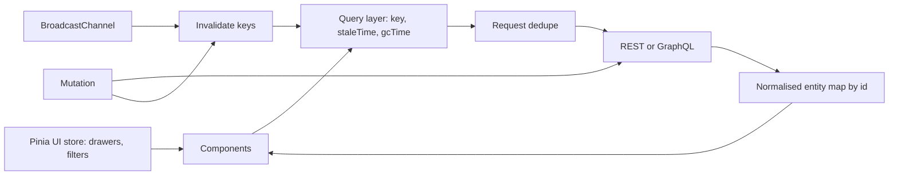

> **Scenario** - এক support agent detail drawer-এ customer-এর নাম বদলান। পিছনের list এখনও পুরোনো নাম দেখায়, header breadcrumb নতুন নাম দেখায়, আর hard refresh করলে ঠিক হয়ে যায়। তিনটা Pinia store একই customer object-এর তিনটা copy রাখে, আপডেট হয়েছে শুধু একটা।

## Why it matters

- Duplicate entity এমন "অসম্ভব" বাগ তৈরি করে যা কেবল নির্দিষ্ট navigation order-এ reproduce হয়, তাই QA পেরিয়ে রাত ২টায় on-call engineer-এর কাছে পৌঁছায়।
- Server entity cache করা প্রতিটি store আসলে unmanaged cache। TTL বা invalidation rule ছাড়া অন্য tab, অন্য user বা webhook row বদলানোর মুহূর্তেই drift করে।
- Store sprawl bundle ও mental model দুটোই ফোলায়। ৪০টা store-এর app-এ প্রতিটা mount-এ fetch করলে প্রতি navigation-এ সহজেই ১৫+ duplicate request যায়।
- সরল সমাধান - প্রতি route change-এ সব refetch - correctness bug-কে INP regression বানায়, কারণ JSON parse ও re-render main thread-কে ২০০ ms target ছাড়িয়ে block করে।

## Symptoms

| Signal | What you observe |
| --- | --- |
| Divergent copy | একই entity list, drawer ও breadcrumb-এ ভিন্ন মান দেখায় |
| Refresh-এ ঠিক | reload-এর পর বাগ উধাও, clean state থেকে reproduce হয় না |
| Request fan-out | Network panel প্রতি navigation-এ একই `GET /customers/42` তিনবার দেখায় |
| Long task | store hydration-এর পর Performance panel-এ ৩০০–৬০০ ms task |
| Memory growth | navigation-এ heap বাড়ে; entity map কখনও evict হয় না |
| Cross-tab drift | একই app-এর দুই tab একমত হয় না যতক্ষণ একটা reload না হয় |

## How it breaks

মূল কারণ server data-কে client state হিসেবে দেখা। একটা component mount হয়ে `store.fetchCustomer(id)` ডাকে, store response নিজের `ref`-এ রাখে। পাশের feature একই কাজ অন্য store-এ করে। এখন এক সত্যের দুই owner, আর write path জানে শুধু একজনকে। কোনো কিছু divergence ধরে না, কারণ দুই store-ই ভিতরে consistent।



## Root causes

1. Server cache ও client state একই store-এ মেশানো, lifetime বা ownership-এ কোনো পার্থক্য নেই।
2. Entity id দিয়ে normalise না করে nested array-তে রাখা, তাই এক row অনেক জায়গায় থাকে।
3. Invalidation contract নেই - mutation local state আপডেট করে, তার উপর নির্ভরশীল query invalidate করে না।
4. Store `onMounted`-এ dedupe ছাড়া fetch করে, তাই concurrent component duplicate request পাঠায়।
5. Derived data `computed` না হয়ে state-এ copy হয়, ফলে আলাদাভাবে stale হয়।
6. Cache entry কখনও evict হয় না, আর tab-এর মধ্যে কিছু reconcile করে না।

## How to solve it

### 1. দুই ধরনের state আলাদা করুন

Client state হলো যা কেবল browser জানে: modal open, selected tab, draft text, filter chip। Server cache হলো API-র মালিকানাধীন কিছুর local replica। Client state Pinia-তে; server cache key, TTL ও invalidation rule-সহ query layer-এর পিছনে।

```ts
// stores/ui.ts - client state only
export const useUiStore = defineStore('ui', () => {
  const drawerOpen = ref(false)
  const activeFilters = ref<string[]>([])
  return { drawerOpen, activeFilters }
})
```

### 2. Entity normalise করে এক owner দিন

```ts
// stores/entities.ts
type Customer = { id: string; name: string; tier: 'free' | 'pro'; updatedAt: string }

export const useEntityStore = defineStore('entities', () => {
  const customers = reactive(new Map<string, Customer>())

  function upsert(list: Customer[]) {
    for (const next of list) {
      const prev = customers.get(next.id)
      // last-writer-wins by server timestamp, not arrival order
      if (!prev || next.updatedAt >= prev.updatedAt) customers.set(next.id, next)
    }
  }

  const byId = (id: string) => computed(() => customers.get(id))
  return { customers, upsert, byId }
})
```

List তখন object copy নয়, শুধু id-র `string[]` রাখে। নাম বদলালে ঠিক একটা map entry বদলায় এবং সব view re-render হয়।

### 3. In-flight request dedupe করুন

```ts
const inflight = new Map<string, Promise<unknown>>()

export function dedupe<T>(key: string, run: () => Promise<T>): Promise<T> {
  const existing = inflight.get(key) as Promise<T> | undefined
  if (existing) return existing
  const p = run().finally(() => inflight.delete(key))
  inflight.set(key, p)
  return p
}
```

একই tick-এ mount হওয়া তিনটা component এখন একটাই `GET` ভাগ করে।

### 4. হাতে patch না করে invalidate করুন

```ts
async function renameCustomer(id: string, name: string) {
  await api.patch(`/customers/${id}`, { name })
  invalidate(['customer', id])
  invalidate(['customers', 'list'])
}
```

প্রতিটি প্রভাবিত view হাতে patch করাই drift-এর উৎস; invalidation এক write path রাখে।

### 5. Cache bound করুন

প্রতিটি key-তে `staleTime` (সাথে সাথে serve, background-এ refetch) ও `gcTime` (evict) দিন। Admin UI-তে ব্যবহারিক শুরু: `staleTime: 30_000`, `gcTime: 5 * 60_000`। Entity map cap করুন - ~২০০০ row-এর উপরে least-recently-used entry evict করুন, যাতে দীর্ঘ session heap অসীম না বাড়ায়।

### 6. Tab-এর মধ্যে reconcile করুন

```ts
const channel = new BroadcastChannel('cache')
channel.onmessage = (e) => invalidate(e.data.key, { local: true })
```

### 7. Hydration critical path-এর বাইরে রাখুন

বড় payload ধাপে ধাপে parse করে chunk-এ update করুন, যাতে কোনো task ৫০ ms ছাড়ায় না; এটাই INP বাঁচায়।

## Target design



## Tradeoffs

| Option | Pros | Cons | Choose when |
| --- | --- | --- | --- |
| শুধু Pinia store | বাড়তি dependency নেই, পড়তে সহজ | manual caching ও invalidation | ছোট app, কম shared entity |
| Query library + Pinia | dedupe, TTL, invalidation বিনামূল্যে | আরেকটা mental model শেখাতে হয় | data-heavy CRUD product |
| পূর্ণ normalised cache | প্রতি entity-তে একক সত্য | schema ও denormalisation খাটুনি | গভীর relational domain |
| প্রতি route-এ refetch | সহজেই correct | request storm, INP regression | খুব কম traffic-এর internal tool |

## Verification checklist

- [ ] এক view-তে entity rename করলে অন্য সব দৃশ্যমান view reload ছাড়াই আপডেট হয়।
- [ ] Network panel প্রতি navigation-এ প্রতি entity-তে ঠিক একটা request দেখায়।
- [ ] Entity type `grep` করলে একটাই store owner দেখায়, তিনটা নয়।
- [ ] ৫০টা navigation-এর পর heap snapshot-এ entity map bounded, linear growth নয়।
- [ ] Tab A-তে mutate করলে Tab B এক refetch interval-এর মধ্যে আপডেট হয়।
- [ ] সবচেয়ে বড় list hydration-এ Performance panel-এ ২০০ ms-এর বেশি task নেই।

## Anti-patterns

- "শুধু এই screen-এর জন্য" বলে server object component-local `ref`-এ copy করা।
- Derived value (total, label) `computed`-এর বদলে state-এ রাখা।
- Drift ঢাকতে route leave-এ `store.$reset()` চালানো।
- এক বিশাল `appStore` যা সবাই import করে, ফলে dependency অদৃশ্য।
- পুরো store `localStorage`-এ persist করে আজকের user-কে গতকালের data দেখানো।

## Related

- [Optimistic UI and safe rollback](/systems/frontend-architecture/optimistic-ui-and-rollback)
- [Offline-first sync and conflict resolution](/systems/frontend-architecture/offline-first-sync-conflicts)
- [WebSocket state sync at scale](/systems/frontend-architecture/websocket-state-at-scale)
