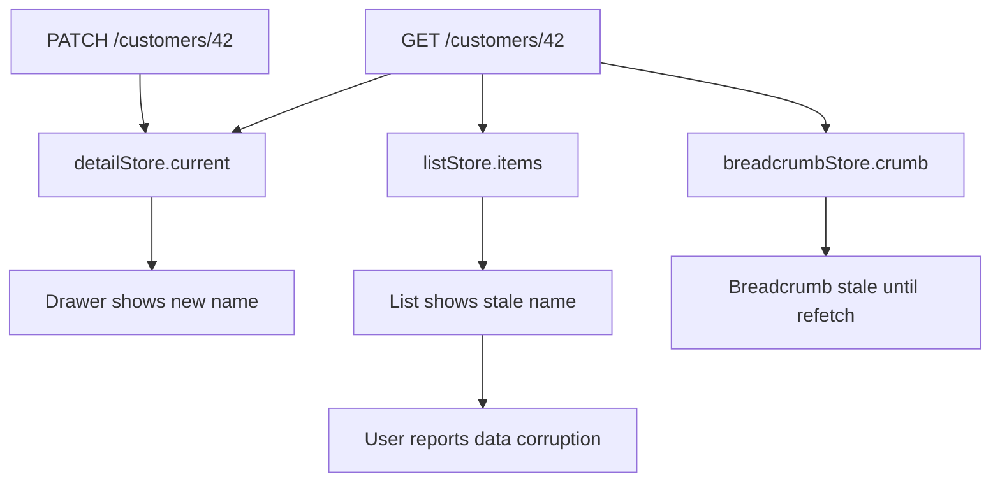
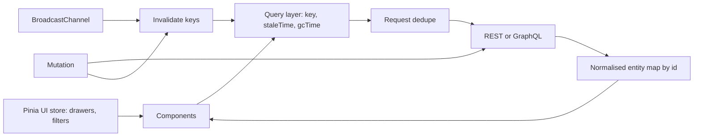

> **Scenario** — A support agent renames a customer in the detail drawer. The list behind it still shows the old name, the header breadcrumb shows the new one, and a hard refresh fixes it. Three Pinia stores hold three copies of the same customer object and only one of them was updated.

## Why it matters

- Duplicated entities produce "impossible" bugs that only reproduce after a specific navigation order, so they survive QA and land on the on-call engineer at 2am.
- Every store that caches a server entity is an unmanaged cache. Without a TTL or invalidation rule it drifts the moment another tab, another user, or a webhook changes the row.
- Store sprawl inflates the bundle and the mental model. A 40-store app where each store fetches on mount easily fires 15+ duplicate requests per navigation.
- Naive fixes — refetching everything on every route change — turn a correctness bug into an INP regression, because JSON parsing and re-rendering block the main thread past the 200 ms target.

## Symptoms

| Signal | What you observe |
| --- | --- |
| Divergent copies | Same entity shows different values in list, drawer, and breadcrumb |
| Refresh fixes it | Bug disappears after reload and cannot be reproduced from a clean state |
| Request fan-out | Network panel shows the same `GET /customers/42` three times per navigation |
| Long tasks | Performance panel shows 300–600 ms tasks after a store hydration |
| Memory growth | Heap climbs across navigations; entity maps never evict |
| Cross-tab drift | Two tabs of the same app disagree until one is reloaded |

## How it breaks

The root cause is treating server data as client state. A component mounts, calls `store.fetchCustomer(id)`, and the store pushes the response into its own `ref`. A sibling feature does the same into a different store. Now two owners exist for one truth, and the write path only knows about one of them. Nothing detects the divergence because both stores are internally consistent.



## Root causes

1. Server cache and client state are mixed in the same store with no distinction in lifetime or ownership.
2. Entities are stored as nested arrays instead of normalised by id, so one row exists in many places.
3. No invalidation contract — mutations update local state instead of invalidating the queries that derive from it.
4. Stores fetch in `onMounted` without deduplication, so concurrent components trigger duplicate requests.
5. Derived data is copied into state rather than computed, so it goes stale independently.
6. Cache entries are never evicted, and nothing reconciles across browser tabs.

## How to solve it

### 1. Separate the two kinds of state

Client state is what only the browser knows: modal open, selected tab, draft text, filter chips. Server cache is a local replica of something the API owns. Client state belongs in Pinia; server cache belongs behind a query layer with a key, a TTL, and an invalidation rule.

```ts
// stores/ui.ts — client state only
export const useUiStore = defineStore('ui', () => {
  const drawerOpen = ref(false)
  const activeFilters = ref<string[]>([])
  return { drawerOpen, activeFilters }
})
```

### 2. Normalise entities into one owner

```ts
// stores/entities.ts
type Customer = { id: string; name: string; tier: 'free' | 'pro'; updatedAt: string }

export const useEntityStore = defineStore('entities', () => {
  const customers = reactive(new Map<string, Customer>())

  function upsert(list: Customer[]) {
    for (const next of list) {
      const prev = customers.get(next.id)
      // last-writer-wins by server timestamp, not arrival order
      if (!prev || next.updatedAt >= prev.updatedAt) customers.set(next.id, next)
    }
  }

  const byId = (id: string) => computed(() => customers.get(id))
  return { customers, upsert, byId }
})
```

Lists then hold `string[]` of ids, never object copies. Renaming a customer updates exactly one map entry and every view re-renders.

### 3. Deduplicate in-flight requests

```ts
const inflight = new Map<string, Promise<unknown>>()

export function dedupe<T>(key: string, run: () => Promise<T>): Promise<T> {
  const existing = inflight.get(key) as Promise<T> | undefined
  if (existing) return existing
  const p = run().finally(() => inflight.delete(key))
  inflight.set(key, p)
  return p
}
```

Three components mounting in the same tick now share one `GET`.

### 4. Invalidate instead of hand-patching

```ts
async function renameCustomer(id: string, name: string) {
  await api.patch(`/customers/${id}`, { name })
  invalidate(['customer', id])
  invalidate(['customers', 'list'])
}
```

Hand-patching every affected view is where drift comes from; invalidation keeps one write path.

### 5. Bound the cache

Give each key a `staleTime` (serve immediately, refetch in background) and a `gcTime` (evict). A practical starting point for admin UIs is `staleTime: 30_000` and `gcTime: 5 * 60_000`. Cap the entity map — evict least-recently-used entries above ~2000 rows so a long session doesn't grow the heap unbounded.

### 6. Reconcile across tabs

```ts
const channel = new BroadcastChannel('cache')
channel.onmessage = (e) => invalidate(e.data.key, { local: true })
```

### 7. Keep hydration off the critical path

Parse large payloads incrementally and update in chunks so no task exceeds 50 ms; that is what protects INP.

## Target design



## Tradeoffs

| Option | Pros | Cons | Choose when |
| --- | --- | --- | --- |
| Plain Pinia stores | Zero extra deps, easy to read | Manual caching and invalidation | Small app, few shared entities |
| Query library plus Pinia | Dedupe, TTL, invalidation for free | Another mental model to teach | Data-heavy CRUD products |
| Full normalised cache | Single source of truth per entity | Schema and denormalisation work | Deeply relational domains |
| Refetch on every route | Trivially correct | Request storms, INP regressions | Very low traffic internal tools |

## Verification checklist

- [ ] Rename an entity in one view; every other visible view updates without a reload.
- [ ] Network panel shows exactly one request per entity per navigation.
- [ ] `grep` for the entity type shows one store owning it, not three.
- [ ] Heap snapshot after 50 navigations shows the entity map bounded, not linear growth.
- [ ] Mutating in tab A updates tab B within one refetch interval.
- [ ] Performance panel shows no task over 200 ms during hydration of the largest list.

## Anti-patterns

- Copying server objects into component-local `ref`s "just for this screen".
- Storing computed/derived values (totals, labels) in state instead of `computed`.
- Using `store.$reset()` on route leave to paper over drift.
- One giant `appStore` that every component imports, making dependencies invisible.
- Persisting the entire store to `localStorage` and shipping yesterday's data to today's user.

## Related

- [Optimistic UI and safe rollback](/systems/frontend-architecture/optimistic-ui-and-rollback)
- [Offline-first sync and conflict resolution](/systems/frontend-architecture/offline-first-sync-conflicts)
- [WebSocket state sync at scale](/systems/frontend-architecture/websocket-state-at-scale)
