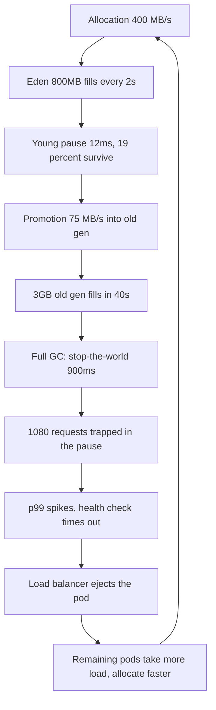
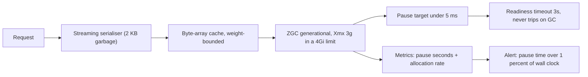

> **Scenario** — একটি JVM search service p50 18 ms-এ ধরে রাখছে, কিন্তু প্রতি 40 সেকেন্ডে p99 লাফিয়ে 1.4 s — নিখুঁত sawtooth। Heap graph দেখতে "ঠিক" — usage ওঠে আর নামে। নামাটাই সমস্যা: প্রতিটি নামা মানে 900 ms stop-the-world pause, আর ওই মুহূর্তে in-flight প্রতিটি request সেটা খায়।

## Why it matters

- GC pause average-এ অদৃশ্য কিন্তু tail-এ প্রভাবশালী। প্রতি 40 s-এ 900 ms pause p99 নষ্ট করে, p50 প্রায় ছোঁয়ই না।
- Stop-the-world pause চলাকালে process কিছুই উত্তর দেয় না: health check fail করে, load balancer node বাদ দেয়, আর capacity সমস্যা rollout সমস্যা হয়ে যায়।
- Memory pressure `OutOfMemoryError` হিসেবে দেখা দেওয়ার বহু আগে latency হিসেবে দেখা দেয়, তাই দল দিনভর ভুল subsystem debug করে।
- Allocation rate একটা design property। আপনি কীভাবে serialise, buffer ও copy করেন তা ঠিক করে — কোন collector বেছেছেন তা নয়।
- একই physics Node.js (V8 major GC), Go (assist ও mark phase) এবং PHP (request-scoped arena, তাই বেশিরভাগ ক্ষেত্রে মুক্ত)-এও খাটে।

## Symptoms

| Signal | What you observe |
|---|---|
| p99 latency | স্থির period-এর নিয়মিত sawtooth |
| GC log | `Pause Full` বা `Pause Young (Promotion Failed)` entry |
| Full GC-র পরের heap | run-এর পর run baseline উপরে উঠছে |
| Allocation rate | মাঝারি কাজের service-এ শত শত MB/s |
| Health check | error log ছাড়াই মাঝে মাঝে timeout |
| Container metrics | RSS memory limit-এর কাছে, `container_memory_working_set` flat-top |
| `%sys` CPU | pause-এ page fault ও thread parking থেকে spike |

## How it breaks

হিসাব করুন। 4 GB heap, 1 GB young generation ধরুন, আর GC log থেকে allocation rate মাপুন:

Eden ভরলেই young collection হয়। Eden 800 MB আর allocation rate 400 MB/s হলে প্রতি 800 / 400 = **2 সেকেন্ডে** একটি young GC হয়। প্রতিটি young pause ছোট — ধরুন 12 ms। খরচ 12 / 2000 = **0.6%** wall time। সহনীয়।

সমস্যা হল **promotion**। allocation-এর 5% young collection পার হলে promotion rate = 400 × 0.05 = **20 MB/s** old generation-এ। Old generation 3 GB। তা ভরে 3,000 / 20 = **150 সেকেন্ডে**, তারপর full collection চলে।

কিন্তু পর্যবেক্ষিত period 40 সেকেন্ড, 150 নয়। মানে promotion মোটামুটি 3,000 / 40 = **75 MB/s**, তাই টিকে থাকা ভগ্নাংশ 75 / 400 ≈ **19%**, 5% নয়। কিছু object-কে তার young lifetime পার করে ধরে রাখছে। এই service-এ সেটা ছিল deserialised document-এর 30 সেকেন্ডের `Caffeine` cache: entry কয়েকটি young collection পার হয়, promote হয়, তারপর evict হলে মরে — সম্ভাব্য সবচেয়ে বাজে আকার, কারণ এতে একটা promotion *এবং* একটা full-collection scan দুটোই খরচ হয়।

এখন pause-এর খরচ। 4-core container-এ 3 GB old generation-এর full collection, collector মোটামুটি 3.5 GB/s marking করলে, লাগে প্রায় 3.0 / 3.5 = **0.86 s** — পর্যবেক্ষিত 900 ms। ওই window-এ আসা request queue করে। 1,200 req/s-এ 900 ms pause আটকে রাখে 1,200 × 0.9 = **1,080 request**, যার প্রত্যেকটি নিজের latency-র সাথে 900 ms পর্যন্ত যোগ করে রিপোর্ট করে। এটা ঠিক 1,080 / (1,200 × 40) = **2.25%** request প্রতি cycle — p99 (যা সবচেয়ে খারাপ 1% থেকে শুরু) দখল করার মতো যথেষ্ট, আর অন্য কিছু নয়।



## Root causes

1. একটি mid-lifetime cache যা young generation পার হয় কিন্তু old-gen হিসেবে অল্প বয়সে মরে।
2. Allocation-ভারী serialisation: stream না করে পুরো response string memory-তে বানানো।
3. Heap এমনভাবে sized যে old generation বড়, ফলে প্রতিটি full collection দীর্ঘ।
4. Container memory limit heap max-এর কাছাকাছি, তাই collection-এর সময় OS swap করে বা kernel OOM-kill করে।
5. Pause time SLO হলেও throughput-কেন্দ্রিক collector বাছা।
6. Health check timeout সবচেয়ে খারাপ pause-এর চেয়ে ছোট।
7. Off-heap বৃদ্ধি (direct buffer, native library) heap graph-এ অদৃশ্য কিন্তু container গোনে।

## How to solve it

### 1. কিছু বদলানোর আগে GC log পড়ুন

```bash
# Java 17+: unified logging, দরকারি সব এক file-এ
java -Xlog:gc*,gc+heap=debug,safepoint:file=/var/log/gc.log:time,uptime,level,tags:filecount=5,filesize=32M \
     -XX:+UseG1GC \
     -jar search.jar

# তারপর পরিমাণ বের করুন। মোট pause time ও সবচেয়ে খারাপ pause:
grep -oP 'Pause \w+.*?\K[0-9.]+(?=ms)' /var/log/gc.log \
  | awk '{ s += $1; if ($1 > m) m = $1; n++ }
         END { printf "pauses=%d  total=%.0fms  mean=%.1fms  max=%.0fms\n", n, s, s/n, m }'

# Allocation rate: প্রতিটি young GC-র আগের heap used, সময়ের সাথে difference
grep 'Pause Young' /var/log/gc.log | tail -50
```

`max` আপনার p99 budget-এর উপরে হলে collector-ই আপনার latency। এখনই আর কিছু তদন্তের দরকার নেই।

### 2. উৎসেই allocation rate কমান

সবচেয়ে বেশি leverage-এর পরিবর্তন প্রায় কখনোই GC flag নয়।

```java
// BEFORE: request-প্রতি ~90 KB garbage (string concat + boxed list + full copy)
public String render(List<Document> docs) {
    String out = "";
    for (Document d : docs) {
        out += "{\"id\":\"" + d.getId() + "\",\"score\":" + d.getScore() + "},";
    }
    return "[" + out.substring(0, out.length() - 1) + "]";
}

// AFTER: সরাসরি socket-এ stream, request-প্রতি ~2 KB garbage
public void render(List<Document> docs, JsonGenerator json) throws IOException {
    json.writeStartArray();
    for (int i = 0; i < docs.size(); i++) {   // indexed loop, iterator allocation নেই
        Document d = docs.get(i);
        json.writeStartObject();
        json.writeStringField("id", d.getId());
        json.writeNumberField("score", d.getScore());   // primitive, boxing নেই
        json.writeEndObject();
    }
    json.writeEndArray();
}
```

1,200 req/s-এ request-প্রতি 90 KB থেকে 2 KB-তে নামানো ওই path-এই allocation 108 MB/s থেকে 2.4 MB/s করে।

### 3. শুধু volume নয়, promotion-এর আকার ঠিক করুন

30 সেকেন্ড object ধরে রাখা cache promotion নিশ্চিত করে। হয় *serialised byte* cache করুন (ছোট, সমরূপ, promote করা সস্তা), নয় TTL-কে young-collection interval-এর নিচে নামান।

```java
// Object graph নয়, compact byte array cache করুন: collector-এর trace করার
// reference কম, আর entry-প্রতি footprint predictable।
Cache<String, byte[]> cache = Caffeine.newBuilder()
    .maximumWeight(256L * 1024 * 1024)              // entry নয়, byte দিয়ে bound
    .weigher((String k, byte[] v) -> v.length)
    .expireAfterWrite(Duration.ofSeconds(30))
    .recordStats()
    .build();
```

### 4. Pause-target collector বাছুন এবং তার জন্য heap size করুন

```yaml
# deployment.yaml — pause-sensitive service-এ ZGC
env:
  - name: JAVA_TOOL_OPTIONS
    value: >-
      -XX:+UseZGC
      -XX:+ZGenerational
      -Xmx3g
      -XX:SoftMaxHeapSize=2600m
      -XX:MaxDirectMemorySize=256m
      -Xlog:gc*:file=/var/log/gc.log:time,uptime:filecount=5,filesize=32M
resources:
  requests: { cpu: "2", memory: 4Gi }
  limits:   { cpu: "4", memory: 4Gi }   # heap 3g + direct 256m + metaspace + stack
readinessProbe:
  httpGet: { path: /healthz, port: 8080 }
  timeoutSeconds: 3       # সবচেয়ে খারাপ প্রত্যাশিত pause-এর চেয়ে বড়
  failureThreshold: 3
```

Container limit-এর অন্তত 25% heap-এর বাইরে রাখুন। Metaspace, thread stack, direct byte buffer ও JIT code cache সবই ওখানে থাকে, আর kernel-এর কাছে "heap নয়" বলে কোনো ছাড় নেই।

### 5. Pause-কে শুধু GC log নয়, SLO-তে দৃশ্যমান করুন

```promql
# Stop-the-world pause-এ কাটানো wall time-এর ভগ্নাংশ
sum(rate(jvm_gc_pause_seconds_sum[5m])) by (pod)

# pause time wall clock-এর 1% ছাড়ালে alert
sum(rate(jvm_gc_pause_seconds_sum[5m])) by (pod) > 0.01

# Allocation rate, leading indicator
rate(jvm_memory_allocated_bytes_total[5m])
```

## Target design



## Tradeoffs

| Option | Pros | Cons | Choose when |
|---|---|---|---|
| Allocation কমানো | কারণ সারায়, সব collector-এ কাজে দেয় | আসল code change | core-প্রতি allocation ~50 MB/s-এর বেশি |
| ZGC / Shenandoah | বড় heap-এ 10 ms-এর কম pause | 10-20% throughput খরচ, বেশি CPU | pause time SLO-তে আছে |
| pause goal সহ G1 | ভালো default, সুপরিচিত | full GC এখনও সম্ভব | মিশ্র workload, মাঝারি heap |
| Parallel GC | সেরা raw throughput | দীর্ঘ stop-the-world pause | batch job, latency SLO নেই |
| ছোট heap, বেশি pod | pod-প্রতি ছোট pause | বেশি instance, বেশি fixed খরচ | pause SLO-সহ heap ~8 GB-র বেশি |
| Off-heap বা native storage | object GC থেকে সরিয়ে দেয় | manual lifetime ব্যবস্থাপনা | বড়, দীর্ঘজীবী, সমরূপ dataset |

## Verification checklist

- [ ] Production-এ GC logging চালু ও rotate হচ্ছে, শুধু staging-এ নয়।
- [ ] 24 ঘণ্টার max pause p99 latency budget-এর নিচে।
- [ ] pod-প্রতি মোট pause time wall clock-এর 1%-এর নিচে।
- [ ] Allocation rate graph করা ও alert threshold আছে।
- [ ] Full GC-র পরের heap এক সপ্তাহ জুড়ে সমান (leak নেই)।
- [ ] Container memory limit `Xmx`-কে অন্তত 25% ছাড়ায়।
- [ ] Readiness probe-এর `timeoutSeconds` সবচেয়ে খারাপ পর্যবেক্ষিত pause-এর চেয়ে বড়।
- [ ] পরিবর্তনের পর p99 latency-তে কোনো periodic sawtooth নেই।

## Anti-patterns

- "আরও জায়গা দিতে" `Xmx` বাড়ানো, যা প্রতিটি full collection লম্বা করে।
- নিজের GC log না পড়ে blog post থেকে GC flag copy করা।
- Container memory limit `Xmx`-এর সমান রাখা।
- Young-collection interval-এর চেয়ে বড় TTL-এ deserialised object graph cache করা।
- Application code থেকে `System.gc()` ডাকা।
- "JVM তো memory সামলায়" বলে বাড়তে থাকা heap baseline-কে স্বাভাবিক ধরা।
- যে latency sawtooth-এর period old-generation ভরার সময়ের সমান, তার জন্য database-কে দায়ী করা।

## Related

- [Profiling: telling CPU-bound from IO-bound](/systems/performance-capacity/profiling-cpu-vs-io-bound)
- [Payload size and the hidden cost of serialisation](/systems/performance-capacity/payload-size-and-serialization-cost)
- [Thread and connection pool sizing formulas](/systems/performance-capacity/thread-and-connection-pool-sizing)
