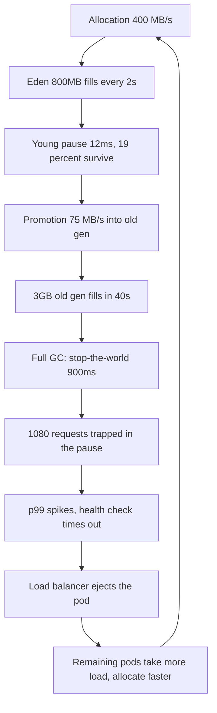
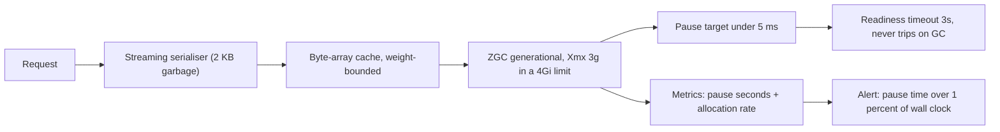

> **Scenario** - A JVM search service holds p50 at 18 ms but p99 spikes to 1.4 s every 40 seconds, in a perfect sawtooth. Heap graphs look "fine" - usage climbs and drops. The dropping is the problem: each drop is a 900 ms stop-the-world pause, and every request in flight at that moment eats it.

## Why it matters

- Garbage collection pauses are invisible in averages and dominate the tail. A 900 ms pause every 40 s ruins p99 while barely touching p50.
- During a stop-the-world pause the process answers nothing: health checks fail, load balancers eject the node, and a capacity problem becomes a rollout problem.
- Memory pressure shows up as latency long before it shows up as `OutOfMemoryError`, so teams debug the wrong subsystem for days.
- Allocation rate is a design property. It is set by how you serialise, buffer, and copy - not by the collector you picked.
- The same physics applies to Node.js (V8 major GC), Go (assist and mark phases), and PHP (request-scoped arenas, so mostly exempt).

## Symptoms

| Signal | What you observe |
|---|---|
| p99 latency | Regular sawtooth with a fixed period |
| GC log | `Pause Full` or `Pause Young (Promotion Failed)` entries |
| Heap after GC | Baseline creeping up run over run |
| Allocation rate | Hundreds of MB/s for a service doing modest work |
| Health checks | Intermittent timeouts with no error logs |
| Container metrics | RSS near the memory limit, `container_memory_working_set` flat-topped |
| `%sys` CPU | Spikes during pauses from page faults and thread parking |

## How it breaks

Do the arithmetic. Take a heap of 4 GB with a 1 GB young generation, and measure allocation rate from the GC log:

Young collections happen every time eden fills. If eden is 800 MB and allocation rate is 400 MB/s, a young GC fires every 800 / 400 = **2 seconds**. Each young pause is short - say 12 ms. That costs 12 / 2000 = **0.6%** of wall time. Tolerable.

The problem is **promotion**. If 5% of allocations survive the young collection, promotion rate is 400 × 0.05 = **20 MB/s** into the old generation. The old generation has 3 GB. It fills in 3,000 / 20 = **150 seconds**, and then a full collection runs.

Except the observed period is 40 seconds, not 150. That means promotion is roughly 3,000 / 40 = **75 MB/s**, so the surviving fraction is 75 / 400 ≈ **19%**, not 5%. Something is holding objects past their young lifetime. In this service it was a 30-second `Caffeine` cache of deserialised documents: entries survive several young collections, get promoted, then die when evicted - the worst possible shape, because they cost a promotion *and* a full-collection scan.

Now the pause cost. A full collection of a 3 GB old generation on a 4-core container, with a collector doing roughly 3.5 GB/s of marking, needs about 3.0 / 3.5 = **0.86 s** - the 900 ms observed. Requests arriving during that window queue. At 1,200 req/s, a 900 ms pause traps 1,200 × 0.9 = **1,080 requests**, each of which now reports its own latency plus up to 900 ms. That is exactly 1,080 / (1,200 × 40) = **2.25%** of requests per cycle - enough to own p99 (which starts at the worst 1%) and nothing else.



## Root causes

1. A mid-lifetime cache that outlives the young generation but dies young in old-gen terms.
2. Allocation-heavy serialisation: building whole response strings in memory instead of streaming.
3. Heap sized so the old generation is large, making each full collection long.
4. Container memory limit close to heap max, so the OS starts swapping or the kernel OOM-kills during collection.
5. Throughput-oriented collector chosen where pause time is the SLO.
6. Health check timeout shorter than the worst-case pause.
7. Off-heap growth (direct buffers, native libraries) invisible to heap graphs but counted by the container.

## How to solve it

### 1. Read the GC log before changing anything

```bash
# Java 17+: unified logging, everything you need in one file
java -Xlog:gc*,gc+heap=debug,safepoint:file=/var/log/gc.log:time,uptime,level,tags:filecount=5,filesize=32M \
     -XX:+UseG1GC \
     -jar search.jar

# Then quantify. Total pause time and worst pause:
grep -oP 'Pause \w+.*?\K[0-9.]+(?=ms)' /var/log/gc.log \
  | awk '{ s += $1; if ($1 > m) m = $1; n++ }
         END { printf "pauses=%d  total=%.0fms  mean=%.1fms  max=%.0fms\n", n, s, s/n, m }'

# Allocation rate: heap used before each young GC, differenced over time
grep 'Pause Young' /var/log/gc.log | tail -50
```

If `max` is above your p99 budget, the collector is your latency. Nothing else needs investigating yet.

### 2. Cut the allocation rate at the source

The highest-leverage change is almost never a GC flag.

```java
// BEFORE: ~90 KB of garbage per request (string concat + boxed list + full copy)
public String render(List<Document> docs) {
    String out = "";
    for (Document d : docs) {
        out += "{\"id\":\"" + d.getId() + "\",\"score\":" + d.getScore() + "},";
    }
    return "[" + out.substring(0, out.length() - 1) + "]";
}

// AFTER: streams straight to the socket, ~2 KB of garbage per request
public void render(List<Document> docs, JsonGenerator json) throws IOException {
    json.writeStartArray();
    for (int i = 0; i < docs.size(); i++) {   // indexed loop, no iterator allocation
        Document d = docs.get(i);
        json.writeStartObject();
        json.writeStringField("id", d.getId());
        json.writeNumberField("score", d.getScore());   // primitive, no boxing
        json.writeEndObject();
    }
    json.writeEndArray();
}
```

Dropping 90 KB to 2 KB per request at 1,200 req/s takes allocation from 108 MB/s to 2.4 MB/s on that path alone.

### 3. Fix the promotion shape, not just the volume

A cache that holds objects for 30 seconds guarantees promotion. Either cache the *serialised bytes* (small, uniform, cheap to promote) or shorten the TTL below the young-collection interval.

```java
// Cache compact byte arrays, not object graphs: fewer references for the
// collector to trace, and a predictable per-entry footprint.
Cache<String, byte[]> cache = Caffeine.newBuilder()
    .maximumWeight(256L * 1024 * 1024)              // bound by bytes, not entries
    .weigher((String k, byte[] v) -> v.length)
    .expireAfterWrite(Duration.ofSeconds(30))
    .recordStats()
    .build();
```

### 4. Choose a pause-target collector and size the heap for it

```yaml
# deployment.yaml - ZGC for pause-sensitive services
env:
  - name: JAVA_TOOL_OPTIONS
    value: >-
      -XX:+UseZGC
      -XX:+ZGenerational
      -Xmx3g
      -XX:SoftMaxHeapSize=2600m
      -XX:MaxDirectMemorySize=256m
      -Xlog:gc*:file=/var/log/gc.log:time,uptime:filecount=5,filesize=32M
resources:
  requests: { cpu: "2", memory: 4Gi }
  limits:   { cpu: "4", memory: 4Gi }   # heap 3g + direct 256m + metaspace + stacks
readinessProbe:
  httpGet: { path: /healthz, port: 8080 }
  timeoutSeconds: 3       # longer than the worst expected pause
  failureThreshold: 3
```

Leave at least 25% of the container limit outside the heap. Metaspace, thread stacks, direct byte buffers, and JIT code cache all live there, and the kernel does not care that they are not "heap".

### 5. Make pauses visible to the SLO, not just to the GC log

```promql
# Fraction of wall time spent in stop-the-world pauses
sum(rate(jvm_gc_pause_seconds_sum[5m])) by (pod)

# Alert when pause time exceeds 1% of wall clock
sum(rate(jvm_gc_pause_seconds_sum[5m])) by (pod) > 0.01

# Allocation rate, the leading indicator
rate(jvm_memory_allocated_bytes_total[5m])
```

## Target design



## Tradeoffs

| Option | Pros | Cons | Choose when |
|---|---|---|---|
| Reduce allocation | Fixes cause, helps every collector | Real code changes | Allocation above ~50 MB/s per core |
| ZGC / Shenandoah | Sub-10 ms pauses at large heaps | 10-20% throughput cost, more CPU | Pause time is in the SLO |
| G1 with a pause goal | Good default, well understood | Full GCs still possible | Mixed workload, moderate heap |
| Parallel GC | Best raw throughput | Long stop-the-world pauses | Batch jobs, no latency SLO |
| Smaller heap, more pods | Shorter pauses per pod | More instances, higher fixed cost | Heap over ~8 GB with pause SLOs |
| Off-heap or native storage | Removes objects from GC entirely | Manual lifetime management | Large, long-lived, uniform datasets |

## Verification checklist

- [ ] GC logging is on in production with rotation, not just in staging.
- [ ] Max pause over 24 h is below the p99 latency budget.
- [ ] Total pause time is under 1% of wall clock per pod.
- [ ] Allocation rate is graphed and has an alert threshold.
- [ ] Heap after full GC is flat across a week (no leak).
- [ ] Container memory limit exceeds `Xmx` by at least 25%.
- [ ] Readiness probe `timeoutSeconds` exceeds the worst observed pause.
- [ ] p99 latency has no periodic sawtooth after the change.

## Anti-patterns

- Raising `Xmx` to "give it more room", which lengthens every full collection.
- Copying GC flags from a blog post without reading your own GC log first.
- Setting the container memory limit equal to `Xmx`.
- Caching deserialised object graphs with a TTL longer than the young-collection interval.
- Calling `System.gc()` from application code.
- Treating a rising heap baseline as normal because "the JVM manages memory".
- Blaming the database for a latency sawtooth whose period matches the old-generation fill time.

## Related

- [Profiling: telling CPU-bound from IO-bound](/systems/performance-capacity/profiling-cpu-vs-io-bound)
- [Payload size and the hidden cost of serialisation](/systems/performance-capacity/payload-size-and-serialization-cost)
- [Thread and connection pool sizing formulas](/systems/performance-capacity/thread-and-connection-pool-sizing)
