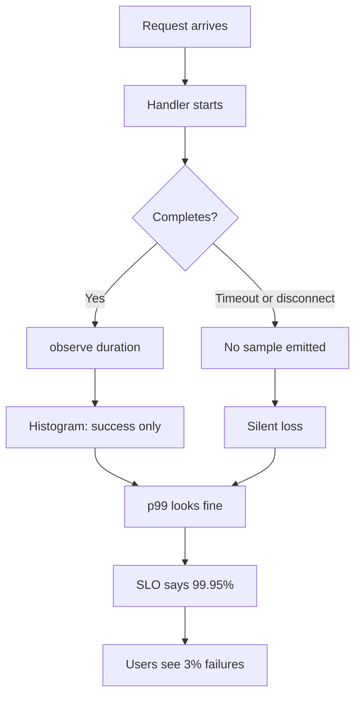
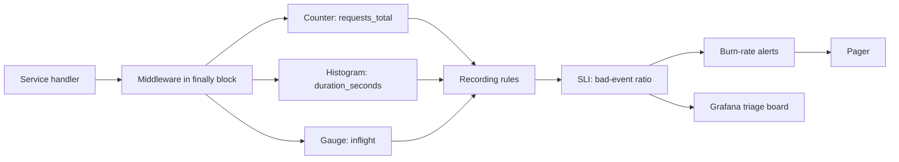

> **Scenario** - Checkout latency dashboard সারা সন্ধ্যা flat 180 ms average দেখাচ্ছে। Support ticket বলছে payment page hang করছে। Average মিথ্যা নয়, কিন্তু অকেজো - p99 আছে 9.4 s-এ, আর যে 3% request timeout হয় তারা কোনো duration sample-ই emit করে না।

## Why it matters

- Average latency সেই tail লুকায় যেখানে revenue থাকে: checkout-এ 2% timeout মানে পুরো এক শতাংশ conversion।
- Error শুধু handler-এর 500-এ গোনা হলে client disconnect (`499`), upstream timeout ও panic error SLI-তে কখনো আসে না।
- CPU দিয়ে saturation মাপলে আসল constraint বাদ পড়ে - connection pool, worker slot ও queue depth CPU-র বহু আগে saturate হয়।
- Traffic signal না থাকলে fix আর traffic collapse আলাদা করা যায় না: কেউ পৌঁছাতে না পারলেও error *rate* কমে।
- নিচের সব artifact - SLO, burn-rate alert, capacity model - instrumentation-এর বাগ উত্তরাধিকার পায়। আগে signal ঠিক করুন।

## Symptoms

| Signal | What you observe |
| --- | --- |
| Latency | Average flat ও healthy; user বলছে multi-second hang; `histogram_quantile` `NaN` দেয় বা top bucket-এ clamp করে |
| Traffic | Request rate raw counter হিসেবে graph, শুধু বাড়ে - drop অদৃশ্য |
| Errors | Incident-এর মাঝেও error ratio প্রায় 0%, কারণ timeout metric increment-এর আগেই abort করে |
| Saturation | CPU 35%, অথচ প্রতিটি request queue-তে; `nginx` `active` connection `worker_connections`-এ আটকে |
| Buckets | 90% sample একটি bucket-এ, তাই quantile আসলে interpolated অনুমান |

## How it breaks

তিনটি স্বতন্ত্র ভুল একসাথে জমা হয়। প্রথম, latency gauge বা mean-এর summary হিসেবে record হয়, তাই write time-এই distribution নষ্ট - আর ফেরানো যায় না। দ্বিতীয়, metric increment হয় handler return করার *পরে*, ফলে timeout, OOM বা client disconnect-এ মারা যাওয়া request চুপচাপ বাদ পড়ে - যে population মাপছেন সেটাই ঠিক সফল population। তৃতীয়, histogram bucket library-র default (`0.005 … 10`) থেকে আসে, যা service-এর আসল SLO boundary-র সাথে মেলে না; ফলে যে একটিমাত্র quantile দরকার সেটি দুই order of magnitude চওড়া bucket-এ interpolate হয়।



## Root causes

1. Latency histogram-এর বদলে average বা summary হিসেবে export করা।
2. Instrumentation success path-এর ভেতরে, `defer`/`finally`-তে নয়।
3. Default bucket boundary যা SLO threshold-কে straddle করে না।
4. Error মানে "আমার handler-এর HTTP 5xx", "যে request value দেয়নি" নয়।
5. Saturation-কে CPU/memory দিয়ে proxy করা, যে queue আসলে ভরে সেটা নয়।
6. Traffic denominator নেই, তাই ratio হিসাব হয় না এবং traffic drop recovery-র ছদ্মবেশে আসে।

## How to solve it

### 1. SLO-aligned bucket নিয়ে histogram emit করুন

যে threshold প্রতিশ্রুতি দিচ্ছেন তার আশপাশে bucket বসান। 300 ms SLO-র জন্য library default না নিয়ে 300 ms-এর কাছে boundary জমান।

```ts
import { Histogram, Counter } from 'prom-client'

export const httpDuration = new Histogram({
  name: 'http_server_request_duration_seconds',
  help: 'Request duration by route and outcome',
  labelNames: ['route', 'method', 'outcome'] as const,
  // Straddle the 300 ms SLO so the quantile is not interpolated.
  buckets: [0.01, 0.05, 0.1, 0.2, 0.25, 0.3, 0.4, 0.6, 1, 2.5, 5, 10],
})

export const httpRequests = new Counter({
  name: 'http_server_requests_total',
  help: 'Request count by outcome',
  labelNames: ['route', 'method', 'outcome'] as const,
})
```

### 2. `finally`-তে record করুন যাতে abort-ও গোনা হয়

```ts
app.use(async (ctx, next) => {
  const started = process.hrtime.bigint()
  let outcome = 'ok'
  try {
    await next()
    if (ctx.status >= 500) outcome = 'server_error'
    else if (ctx.status >= 400) outcome = 'client_error'
  } catch (err) {
    outcome = 'exception'
    throw err
  } finally {
    // Client disconnect: status is 499 and next() never resolved normally.
    if (ctx.req.aborted) outcome = 'aborted'
    const seconds = Number(process.hrtime.bigint() - started) / 1e9
    const labels = { route: ctx.routePattern ?? 'unmatched', method: ctx.method, outcome }
    httpDuration.observe(labels, seconds)
    httpRequests.inc(labels)
  }
})
```

### 3. চারটি signal raw counter নয়, ratio হিসেবে query করুন

```promql
# Traffic (requests/sec, 5m window)
sum by (route) (rate(http_server_requests_total[5m]))

# Errors (bad-event ratio, the SLI you attach an SLO to)
sum(rate(http_server_requests_total{outcome=~"server_error|exception|aborted"}[5m]))
  /
sum(rate(http_server_requests_total[5m]))

# Latency (p99 over the aggregated histogram)
histogram_quantile(
  0.99,
  sum by (le, route) (rate(http_server_request_duration_seconds_bucket[5m]))
)

# Saturation (in-flight work vs configured capacity)
sum by (pod) (http_server_inflight_requests)
  / on (pod) group_left
sum by (pod) (http_server_worker_slots)
```

### 4. SLI-কে recording rule হিসেবে precompute করুন

Recording rule dashboard ও alert-কে একই definition-এ রাখে এবং burn-rate alert সস্তা করে।

```yaml
groups:
  - name: checkout-sli
    interval: 30s
    rules:
      - record: sli:checkout_requests:rate5m
        expr: sum(rate(http_server_requests_total{route="/checkout"}[5m]))

      - record: sli:checkout_bad:rate5m
        expr: |
          sum(rate(http_server_requests_total{
            route="/checkout", outcome=~"server_error|exception|aborted"
          }[5m]))
          +
          sum(rate(http_server_request_duration_seconds_count{route="/checkout"}[5m]))
          -
          sum(rate(http_server_request_duration_seconds_bucket{route="/checkout", le="0.3"}[5m]))

      - record: sli:checkout_error_ratio:rate5m
        expr: sli:checkout_bad:rate5m / sli:checkout_requests:rate5m
```

মাঝের rule-টাই গুরুত্বপূর্ণ: "bad" মানে *error + 300 ms-এর চেয়ে ধীর request*, তাই 0% error নিয়েও 4 s-এ উত্তর দেওয়া service budget burn করে।

### 5. আসল constraint-এ saturation মাপুন

```yaml
# Export the thing that actually fills, not CPU.
- record: sat:db_pool_utilisation
  expr: sum by (service) (db_pool_in_use) / sum by (service) (db_pool_size)
- record: sat:worker_queue_wait_seconds
  expr: histogram_quantile(0.95, sum by (le, service) (rate(worker_queue_wait_seconds_bucket[5m])))
```

## Target design



## Tradeoffs

| Option | Pros | Cons | Choose when |
| --- | --- | --- | --- |
| Histogram (fixed bucket) | pod জুড়ে aggregatable; সস্তা quantile | bucket পছন্দ প্রায় স্থায়ী; series = bucket × label | request latency-র default |
| Summary (client quantile) | per-instance exact quantile | pod জুড়ে aggregate করা যায় না | শুধু single-instance batch job |
| Native histogram | উচ্চ resolution, bucket অনুমান লাগে না | নতুন Prometheus ও exporter দরকার | greenfield, modern stack |
| Trace-derived latency | per-span breakdown, root-cause ready | sampled, তাই tail অনিশ্চিত | metric alert-এর পরে deep dive |

## Verification checklist

- [ ] `curl -s localhost:9090/metrics | grep duration_seconds_bucket` অন্তত চারটি bucket-এ sample দেখায়, একটিতে নয়।
- [ ] Request মাঝপথে মারুন (`curl --max-time 0.1`), দেখুন `requests_total{outcome="aborted"}` বাড়ে।
- [ ] `histogram_quantile(0.99, ...)` সংখ্যা দেয়, `NaN` বা ঠিক `+Inf` boundary নয়।
- [ ] `sum(rate(..._count[5m]))` আর `sum(rate(requests_total[5m]))` 1%-এর মধ্যে মেলে; নাহলে কোনো path-এ instrumentation নেই।
- [ ] প্রতিটি dashboard panel ও alert inline expression নয়, `sli:` recording rule ব্যবহার করে।
- [ ] Saturation পর্যন্ত load test করে দেখুন saturation signal latency-র *আগে* নড়ে।

## Anti-patterns

- Error-budget burn-এর বদলে সরাসরি p99 latency-তে alert - প্রতিটি traffic spike page হয়ে যায়।
- "Debug সহজ হবে" ভেবে histogram-এ `user_id`/`request_id` label যোগ করা; বদলে exemplar ব্যবহার করুন।
- pod জুড়ে p99-কে `avg(p99)` হিসেবে হিসাব করা, যা কোনো কিছুরই quantile নয়।
- Error body নিয়ে আসা 200-কে success ধরা, কারণ status code ঠিক ছিল।
- শুধু framework-এর HTTP layer instrument করে background worker ও cron job অন্ধকারে রাখা।

## Related

- [RED for services, USE for resources](/systems/observability-sli/red-and-use-methods)
- [Dashboards that answer questions](/systems/observability-sli/dashboards-that-answer-questions)
- [Metric cardinality explosion](/systems/observability-sli/metric-cardinality-explosion)
- [SLO error budget burn rates](/systems/observability-sli/slo-error-budget-burn)
