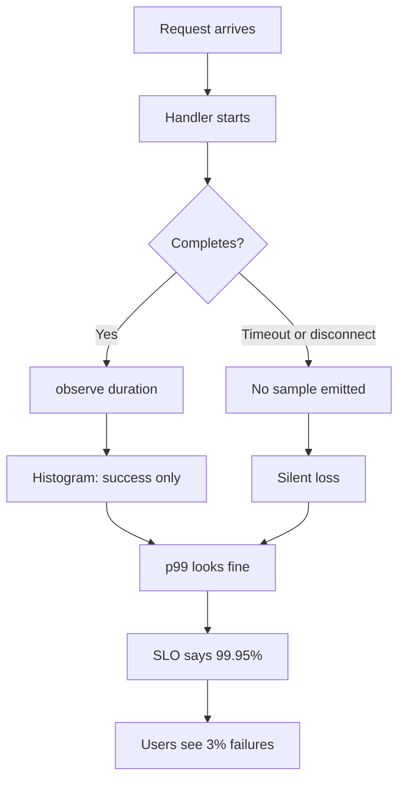
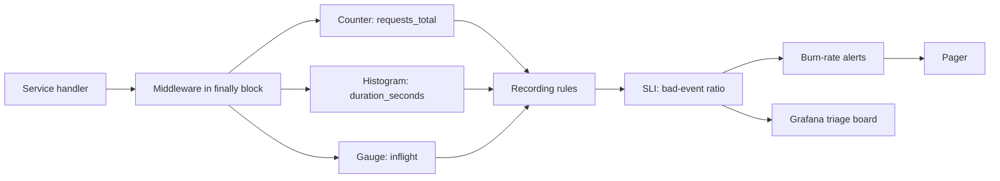

> **Scenario** — Checkout latency dashboards show a flat 180 ms average all evening. Support tickets say the payment page hangs. The average is real; it is also useless, because the p99 sits at 9.4 s and the 3% of requests that time out never emit a duration sample at all.

## Why it matters

- Averaged latency hides the tail where the revenue is: a 2% timeout rate on checkout is a full percentage point of conversion.
- If errors are counted only when the handler returns 500, client disconnects (`499`), upstream timeouts, and panics never appear in the error SLI.
- Saturation measured as CPU misses the real constraint — connection pools, worker slots, and queue depth saturate long before CPU does.
- Without a traffic signal you cannot tell a fix from a traffic collapse: error *rate* drops when nobody can reach you.
- Every downstream artifact — SLOs, burn-rate alerts, capacity models — inherits the instrumentation's bugs. Fix the signals first.

## Symptoms

| Signal | What you observe |
| --- | --- |
| Latency | Average flat and healthy; user reports of multi-second hangs; `histogram_quantile` returns `NaN` or clamps to the top bucket |
| Traffic | Request rate graphed as a raw counter that only goes up, so drops are invisible |
| Errors | Error ratio near 0% during an incident because timeouts abort before the metric increments |
| Saturation | CPU at 35% while every request queues; `nginx` `active` connections pinned at `worker_connections` |
| Buckets | 90% of samples land in one bucket, so quantiles are interpolated guesses |

## How it breaks

Three independent mistakes compound. First, latency is recorded as a gauge or a summary of the mean, so the distribution is destroyed at write time and cannot be recovered. Second, the metric is incremented *after* the handler returns, meaning any request killed by a timeout, an OOM, or a client disconnect is silently excluded — the population you measure is exactly the population that succeeded. Third, histogram buckets are inherited from a library default (`0.005 … 10`) that does not match the service's actual SLO boundary, so the one quantile you care about is interpolated across a bucket two orders of magnitude wide.



## Root causes

1. Latency exported as an average or a summary instead of a histogram with server-side aggregatable buckets.
2. Instrumentation placed inside the success path rather than in a `defer`/`finally` that always runs.
3. Default bucket boundaries that do not straddle the SLO threshold.
4. Errors defined as "HTTP 5xx from my handler" instead of "requests that did not deliver value".
5. Saturation proxied by CPU or memory rather than the queue that actually fills.
6. No traffic denominator, so ratios cannot be computed and a traffic drop masquerades as recovery.

## How to solve it

### 1. Emit a histogram with SLO-aligned buckets

Pick buckets around the threshold you promise. For a 300 ms SLO, cluster boundaries near 300 ms rather than accepting library defaults.

```ts
import { Histogram, Counter } from 'prom-client'

export const httpDuration = new Histogram({
  name: 'http_server_request_duration_seconds',
  help: 'Request duration by route and outcome',
  labelNames: ['route', 'method', 'outcome'] as const,
  // Straddle the 300 ms SLO so the quantile is not interpolated.
  buckets: [0.01, 0.05, 0.1, 0.2, 0.25, 0.3, 0.4, 0.6, 1, 2.5, 5, 10],
})

export const httpRequests = new Counter({
  name: 'http_server_requests_total',
  help: 'Request count by outcome',
  labelNames: ['route', 'method', 'outcome'] as const,
})
```

### 2. Record in a `finally` so aborts still count

```ts
app.use(async (ctx, next) => {
  const started = process.hrtime.bigint()
  let outcome = 'ok'
  try {
    await next()
    if (ctx.status >= 500) outcome = 'server_error'
    else if (ctx.status >= 400) outcome = 'client_error'
  } catch (err) {
    outcome = 'exception'
    throw err
  } finally {
    // Client disconnect: status is 499 and next() never resolved normally.
    if (ctx.req.aborted) outcome = 'aborted'
    const seconds = Number(process.hrtime.bigint() - started) / 1e9
    const labels = { route: ctx.routePattern ?? 'unmatched', method: ctx.method, outcome }
    httpDuration.observe(labels, seconds)
    httpRequests.inc(labels)
  }
})
```

### 3. Query the four signals as ratios, not raw counters

```promql
# Traffic (requests/sec, 5m window)
sum by (route) (rate(http_server_requests_total[5m]))

# Errors (bad-event ratio, the SLI you attach an SLO to)
sum(rate(http_server_requests_total{outcome=~"server_error|exception|aborted"}[5m]))
  /
sum(rate(http_server_requests_total[5m]))

# Latency (p99 over the aggregated histogram)
histogram_quantile(
  0.99,
  sum by (le, route) (rate(http_server_request_duration_seconds_bucket[5m]))
)

# Saturation (in-flight work vs configured capacity)
sum by (pod) (http_server_inflight_requests)
  / on (pod) group_left
sum by (pod) (http_server_worker_slots)
```

### 4. Precompute the SLI as a recording rule

Recording rules keep dashboards and alerts on one definition, and make burn-rate alerts cheap.

```yaml
groups:
  - name: checkout-sli
    interval: 30s
    rules:
      - record: sli:checkout_requests:rate5m
        expr: sum(rate(http_server_requests_total{route="/checkout"}[5m]))

      - record: sli:checkout_bad:rate5m
        expr: |
          sum(rate(http_server_requests_total{
            route="/checkout", outcome=~"server_error|exception|aborted"
          }[5m]))
          +
          sum(rate(http_server_request_duration_seconds_count{route="/checkout"}[5m]))
          -
          sum(rate(http_server_request_duration_seconds_bucket{route="/checkout", le="0.3"}[5m]))

      - record: sli:checkout_error_ratio:rate5m
        expr: sli:checkout_bad:rate5m / sli:checkout_requests:rate5m
```

The middle rule is the important one: "bad" is *errors plus requests slower than 300 ms*, so a service that answers every request in 4 s burns budget even at 0% errors.

### 5. Measure saturation at the real constraint

```yaml
# Export the thing that actually fills, not CPU.
- record: sat:db_pool_utilisation
  expr: sum by (service) (db_pool_in_use) / sum by (service) (db_pool_size)
- record: sat:worker_queue_wait_seconds
  expr: histogram_quantile(0.95, sum by (le, service) (rate(worker_queue_wait_seconds_bucket[5m])))
```

## Target design



## Tradeoffs

| Option | Pros | Cons | Choose when |
| --- | --- | --- | --- |
| Histogram (fixed buckets) | Aggregatable across pods; cheap quantiles | Bucket choice is permanent-ish; series count = buckets × labels | Default for request latency |
| Summary (client quantiles) | Exact per-instance quantiles | Cannot be aggregated across pods | Single-instance batch jobs only |
| Native histograms | High resolution, no bucket guessing | Needs recent Prometheus and exporters | Greenfield, modern stack |
| Trace-derived latency | Per-span breakdown, root-cause ready | Sampled, so tails are uncertain | Deep-dive after the metric alerts |

## Verification checklist

- [ ] `curl -s localhost:9090/metrics | grep duration_seconds_bucket` shows samples in at least four buckets, not one.
- [ ] Kill a request mid-flight (`curl --max-time 0.1`) and confirm `requests_total{outcome="aborted"}` increments.
- [ ] `histogram_quantile(0.99, ...)` returns a number, not `NaN` or exactly the `+Inf` boundary.
- [ ] `sum(rate(..._count[5m]))` equals `sum(rate(requests_total[5m]))` within 1% — otherwise one path is missing instrumentation.
- [ ] Every dashboard panel and alert references a `sli:` recording rule, not an inline expression.
- [ ] Load test to saturation and confirm the saturation signal moves *before* latency does.

## Anti-patterns

- Alerting on p99 latency directly instead of on error-budget burn — every traffic spike becomes a page.
- Adding `user_id` or `request_id` as a histogram label to "make debugging easier"; use exemplars instead.
- Computing p99 as `avg(p99)` across pods, which is not a quantile of anything.
- Treating a 200 response with an error body as success because the status code was fine.
- Instrumenting only the framework's HTTP layer and leaving background workers and cron jobs dark.

## Related

- [RED for services, USE for resources](/systems/observability-sli/red-and-use-methods)
- [Dashboards that answer questions](/systems/observability-sli/dashboards-that-answer-questions)
- [Metric cardinality explosion](/systems/observability-sli/metric-cardinality-explosion)
- [SLO error budget burn rates](/systems/observability-sli/slo-error-budget-burn)
