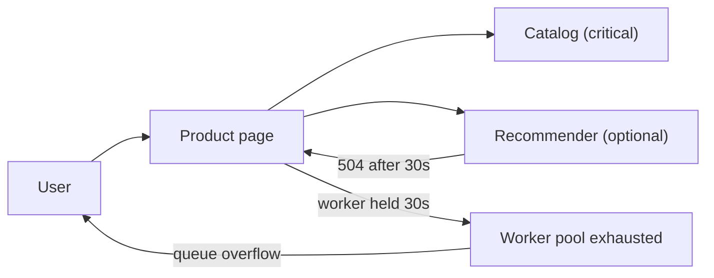
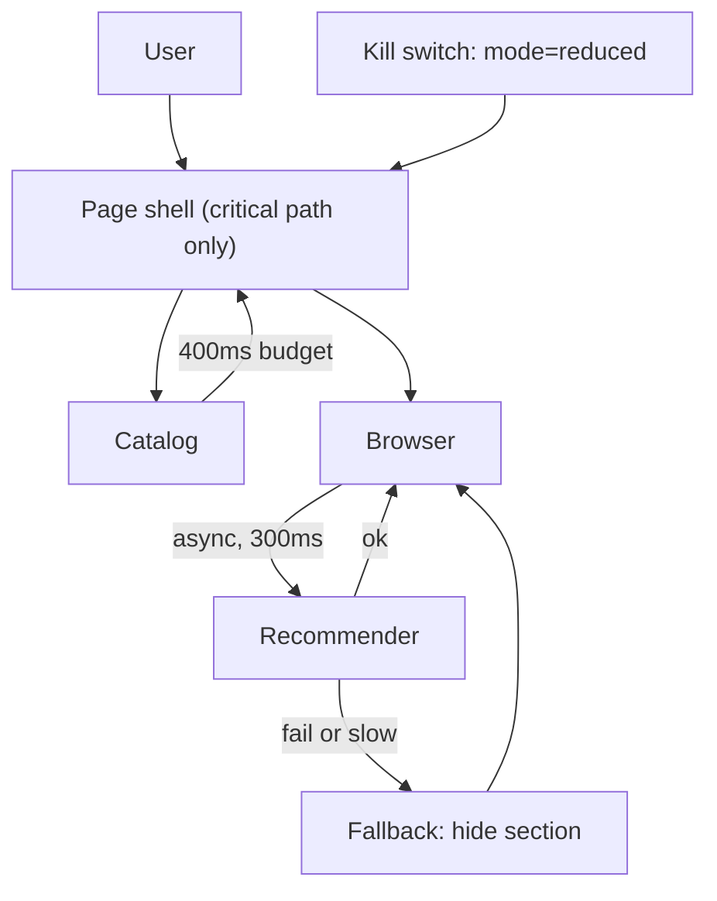

> **Scenario** - ১৮:৪০-এ recommendation service 504 দিতে শুরু করে। Product page "You may also like" strip render করতে সেটাকে synchronously ডাকে, ফলে প্রতিটি product page ৩০ সেকেন্ড নিয়ে throw করে। যে strip থেকে কেউ কেনে না, তার কারণেই checkout conversion ৭১% পড়ে যায়।

## Why it matters

- একটা non-critical dependency critical path নামিয়ে দিল। এই revenue loss পুরোপুরি নিজেদের তৈরি।
- Availability multiplicative: ৯টা service-এর উপর hard-depend করা page, প্রতিটি ৯৯.৯% হলে, মোট ৯৯.১% - বছরে ৭৯ ঘণ্টা downtime।
- On-call page পায় product page-এর জন্য, recommender-এর জন্য নয়; তাই প্রথম ২০ মিনিট ভুল team-এ যায়।
- Incident চলাকালীন নেওয়া degradation সিদ্ধান্ত খারাপ হয়। কেউ ১৯:১৫-তে call comment out করে untested কোড ship করবে।
- User missing strip সহ্য করে। কখনো শেষ না হওয়া spinner সহ্য করে না।

## Symptoms

| Signal | What you observe |
|---|---|
| p99 latency | Product page p99 ২৪০ms থেকে ৩০s - ঠিক client timeout-এর সমান |
| Error attribution | `product-page`-এ 5xx spike, `recommender` "মাত্র" ৪০% error দেখায় |
| Thread pools | Web worker pool saturated; `active_threads` max-এ আটকে, queue depth বাড়ছে |
| Traces | Span time-এর ৯২% একটা optional widget-এর child span-এ |
| Business metrics | Alert-এর আগেই add-to-cart পড়ে, কারণ SLO page-এ, funnel-এ নয় |

## How it breaks

আসল failure recommender down থাকা নয় - সেটা প্রত্যাশিত। আসল failure হলো: ৩০ সেকেন্ড timeout, fallback নেই, circuit breaker নেই - এমন synchronous call একটা optional feature-কে hard dependency বানিয়ে ফেলে। আরও খারাপ, slow call web worker ধরে রাখে। ২০০ worker আর ৩০s hang হলে page সর্বোচ্চ ~৬.৬ request/second serve করতে পারে, বাকি সব যত healthy-ই হোক। Optional dependency-ই পুরো site-এর capacity limit হয়ে গেছে।



## Root causes

1. Dependency-গুলোকে critical vs optional হিসেবে classify করা হয়নি; সব call required ধরা হয়।
2. Client timeout page-এর latency budget থেকে নয়, default (৩০s) থেকে এসেছে।
3. কোনো fallback value নেই, তাই exception-ই একমাত্র সম্ভাব্য ফলাফল।
4. Optional content server-side critical path-এ synchronously render হচ্ছে।
5. Circuit breaker নেই, তাই ৫০০তম টানা failure-এর পরেও প্রতিটি request পুরো timeout খরচ করে।
6. SLO HTTP status-এ measure করা, user journey-তে নয়; তাই ক্ষতির পরে alert আসে।

## How to solve it

### 1. Dependency classify করুন এবং fallback লিখে ফেলুন

Criticality কোডে, call-এর পাশেই explicit করুন। Optional dependency-র fallback অবশ্যই value হবে, exception নয়।

```ts
type Criticality = 'critical' | 'optional'

type DepSpec<T> = {
  name: string
  criticality: Criticality
  timeoutMs: number
  fallback: () => T
}

async function callDep<T>(spec: DepSpec<T>, fn: () => Promise<T>): Promise<T> {
  const ac = new AbortController()
  const timer = setTimeout(() => ac.abort(), spec.timeoutMs)
  try {
    return await fn()
  } catch (err) {
    if (spec.criticality === 'critical') throw err
    metrics.increment('dep.degraded', { dep: spec.name })
    return spec.fallback()
  } finally {
    clearTimeout(timer)
  }
}

const recommendations = await callDep(
  { name: 'recommender', criticality: 'optional', timeoutMs: 150, fallback: () => [] },
  () => recommender.fetch(productId, { signal: ac.signal }),
)
```

Optional strip-এর জন্য ১৫০ms timeout কম নয় - এটাই মূল কথা। Page-এর budget-এর ভেতর recommender উত্তর দিতে না পারলে সে উত্তরের কোনো দাম নেই।

### 2. Timeout per-call default থেকে নয়, per-request budget থেকে নিন

Request-কে একটা deadline দিন, প্রতিটি call বাকি সময় থেকে নেবে।

```ts
class Deadline {
  constructor(private readonly endsAt: number) {}
  static in(ms: number) { return new Deadline(Date.now() + ms) }
  remaining() { return Math.max(0, this.endsAt - Date.now()) }
  budget(maxMs: number) { return Math.min(maxMs, this.remaining()) }
}

const deadline = Deadline.in(800)
const catalogTimeout = deadline.budget(400)
const recoTimeout = deadline.budget(150)
```

### 3. Breaker যোগ করুন যাতে failure-এর দাম microsecond হয়, সেকেন্ড নয়

একটা window-তে N বার fail করলে dependency-কে ডাকা বন্ধ করে সাথে সাথে fallback দিন। নির্দিষ্ট হারে half-open probe (যেমন প্রতি ৫ সেকেন্ডে ১ request) recovery ধরবে, আবার flood না করেই।

### 4. Optional content critical path-এর বাইরে render করুন

Optional widget client-side fetch বা edge-side include-এ সরান। তাহলে server render আর তাদের হাতে জিম্মি থাকে না।

```ts
// Server শুধু shell দেয়; strip পরে আসে, বা আসেই না।
onMounted(async () => {
  try {
    strip.value = await fetchWithTimeout(`/api/recos/${productId}`, 300)
  } catch {
    strip.value = null // section render-ই হয় না
  }
})
```

### 5. Ad-hoc fallback নয়, degradation *mode* ঠিক করুন

স্পষ্ট product behaviour-সহ ৩-৪টা named mode লিখুন, প্রতিটিতে kill switch যোগ করুন যাতে operator force করতে পারে:

| Mode | Behaviour |
|---|---|
| `full` | সব চালু |
| `reduced` | Recommendation, review, personalization বন্ধ; catalog + cart চালু |
| `read-only` | Browse চলে, write স্পষ্ট message-সহ reject |
| `static` | শুধু cached homepage ও status banner |

### 6. Journey-তে alert দিন

HTTP-level SLI-এর পাশে "১ সেকেন্ডের ভেতর add to cart সফল" SLI যোগ করুন। এই সংখ্যাটাই ১৫ মিনিট আগে page করত।

## Target design



## Tradeoffs

| Option | Pros | Cons | Choose when |
|---|---|---|---|
| Hard dependency, লম্বা timeout | সহজ কোড; সবসময় পূর্ণ data | এক slow service পুরো site-এর capacity আটকায় | User-facing critical path-এ কখনোই নয় |
| Static fallback value | সহজ, predictable, testable | User stale বা empty content দেখে | Feature সত্যিই optional হলে |
| Cached last-good value | Content বিশ্বাসযোগ্য থাকে | Stale data ভুল হতে পারে (price, stock) | Read-mostly, non-financial data |
| Client-side async render | Server path দ্রুত থাকে | বাড়তি request; layout shift ঝুঁকি | Optional widget, personalization |
| Operator kill switch | তাৎক্ষণিক, deploy ছাড়াই | বানানো ও drill করার discipline লাগে | যে dependency-তে দুইবার page হয়েছে |

## Verification checklist

- [ ] Request path-এর প্রতিটি outbound call-এ explicit timeout আছে, কোনোটিই request budget ছাড়ায় না।
- [ ] Default-timeout client `grep` করে দেখুন কতটা user path-এ আছে।
- [ ] Recommender blackhole করে (`iptables -A OUTPUT -d <ip> -j DROP`) load test-এ product-page p99 ৫০০ms-এর নিচে থাকে।
- [ ] Staging-এ প্রতিটি optional dependency মেরে দিলে 500 নয়, render হওয়া page আসে - screenshot diff দিয়ে যাচাই।
- [ ] Breaker metric (`dep.degraded`, `breaker.state`) dashboard-এ আছে এবং runbook-এ উল্লেখ আছে।
- [ ] গত quarter-এ অন্তত একবার production-এ `mode=reduced` চালানো হয়েছে।
- [ ] Game day-তে journey SLI alert HTTP SLI alert-এর আগে fire করে।

## Anti-patterns

- `try/catch` দিয়ে wrap করে log করে আবার rethrow - এটা বাড়তি ধাপসহ hard dependency।
- Critical path-এ timeout retry করা, এক ৩০s অপেক্ষাকে তিনটা বানানো।
- Fallback হিসেবে এমন synchronous database query, যা নিজেই load-এ আছে।
- Incident-এ call comment out করে ছয় সপ্তাহ ফেরত না আনা।
- Monitoring-এ "degraded"-কে error state ধরা, ফলে সঠিক behaviour-এর সময় dashboard লাল।
- সবকিছুর জন্য একটাই global feature flag, ফলে recommendation shed করলে checkout-ও বন্ধ।

## Related

- [Load shedding and admission control](/systems/reliability-edge-cases/load-shedding-and-admission-control)
- [Partial failure in fan-out requests](/systems/reliability-edge-cases/partial-failure-handling)
- [Dependency startup ordering](/systems/reliability-edge-cases/dependency-startup-ordering)
- [Circuit breaker cascades across services](/systems/api-integration/circuit-breaker-cascades)
