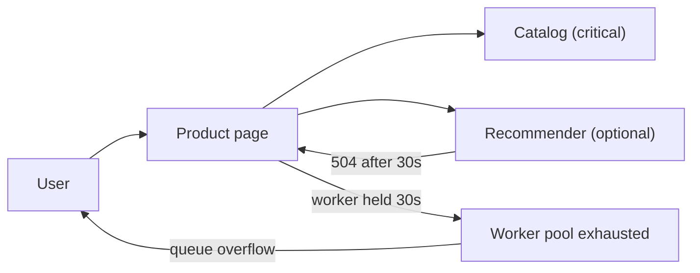
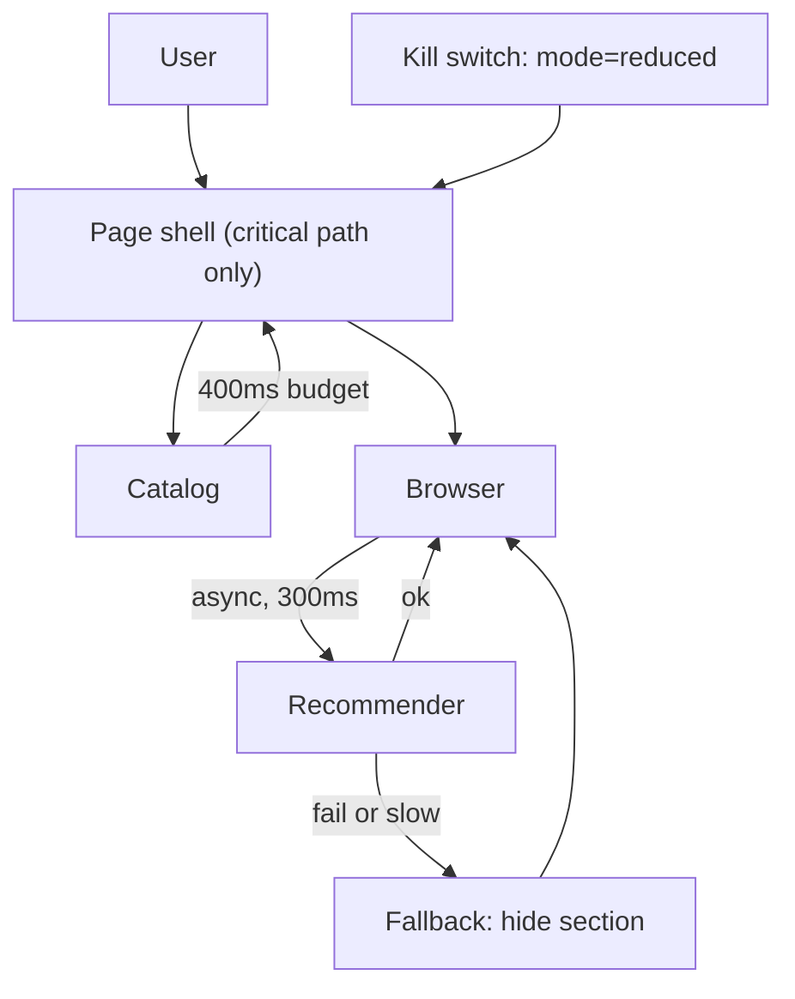

> **Scenario** - The recommendation service starts returning 504s at 18:40. The product page calls it synchronously to render a "You may also like" strip, so every product page now takes 30 seconds and then throws. Checkout conversion drops 71% because of a strip nobody buys from.

## Why it matters

- A non-critical dependency took down a critical path. The revenue loss is entirely self-inflicted.
- Availability is multiplicative: a page that hard-depends on 9 services at 99.9% each is 99.1% available, or 79 hours of downtime a year.
- On-call gets paged for the product page, not the recommender, so the first 20 minutes go to the wrong team.
- Degradation decided during an incident is decided badly. Someone will comment out the call and ship untested code at 19:15.
- Users tolerate a missing strip. They do not tolerate a spinner that never resolves.

## Symptoms

| Signal | What you observe |
|---|---|
| p99 latency | Product page p99 jumps from 240ms to 30s, exactly the client timeout |
| Error attribution | 5xx rate spikes on `product-page`, while `recommender` reports "only" 40% errors |
| Thread pools | Web worker pool saturated; `active_threads` pinned at max, queue depth climbing |
| Traces | 92% of span time in one child span for an optional widget |
| Business metrics | Add-to-cart falls before any alert fires, because the SLO is on the page, not the funnel |

## How it breaks

The failure is not the recommender being down - that is expected. The failure is that a synchronous call with a 30-second timeout, no fallback, and no circuit breaker converts an optional feature into a hard dependency. Worse, the slow calls hold web workers. With 200 workers and a 30s hang, the page can serve at most ~6.6 requests/second regardless of how healthy everything else is. The optional dependency has become the capacity limit for the whole site.



## Root causes

1. No classification of dependencies as critical versus optional; every call is treated as required.
2. Client timeouts inherited from a default (30s) instead of derived from the page's latency budget.
3. No fallback value defined, so an exception is the only possible outcome.
4. Synchronous rendering of optional content on the server-side critical path.
5. No circuit breaker, so every request pays the full timeout even after the 500th consecutive failure.
6. SLOs measured on HTTP status, not on the user journey, so the alert arrives after the damage.

## How to solve it

### 1. Classify dependencies and write the fallback down

Make criticality explicit in code, next to the call. If a dependency is optional, its fallback must be a value, not an exception.

```ts
type Criticality = 'critical' | 'optional'

type DepSpec<T> = {
  name: string
  criticality: Criticality
  timeoutMs: number
  fallback: () => T
}

async function callDep<T>(spec: DepSpec<T>, fn: () => Promise<T>): Promise<T> {
  const ac = new AbortController()
  const timer = setTimeout(() => ac.abort(), spec.timeoutMs)
  try {
    return await fn()
  } catch (err) {
    if (spec.criticality === 'critical') throw err
    metrics.increment('dep.degraded', { dep: spec.name })
    return spec.fallback()
  } finally {
    clearTimeout(timer)
  }
}

const recommendations = await callDep(
  { name: 'recommender', criticality: 'optional', timeoutMs: 150, fallback: () => [] },
  () => recommender.fetch(productId, { signal: ac.signal }),
)
```

A 150ms timeout for an optional strip is not stingy - it is the whole point. If the recommender cannot answer inside the page's budget, its answer is worthless.

### 2. Derive timeouts from a per-request budget, not per-call defaults

Give the request a deadline and let each call take what remains.

```ts
class Deadline {
  constructor(private readonly endsAt: number) {}
  static in(ms: number) { return new Deadline(Date.now() + ms) }
  remaining() { return Math.max(0, this.endsAt - Date.now()) }
  budget(maxMs: number) { return Math.min(maxMs, this.remaining()) }
}

const deadline = Deadline.in(800)
const catalogTimeout = deadline.budget(400)
const recoTimeout = deadline.budget(150)
```

### 3. Add a breaker so failures cost microseconds, not seconds

Once a dependency has failed N times in a window, stop calling it and return the fallback immediately. Half-open probes at a fixed rate (for example 1 request every 5 seconds) detect recovery without re-flooding.

### 4. Render optional content out of band

Move optional widgets to a client-side fetch or an edge-side include. The page's server render then cannot be held hostage by them.

```ts
// Server renders the shell immediately; the strip arrives later or never.
onMounted(async () => {
  try {
    strip.value = await fetchWithTimeout(`/api/recos/${productId}`, 300)
  } catch {
    strip.value = null // section simply does not render
  }
})
```

### 5. Define degradation *modes*, not ad-hoc fallbacks

Write down 3-4 named modes with explicit product behaviour, and wire each to a kill switch so an operator can force one:

| Mode | Behaviour |
|---|---|
| `full` | Everything on |
| `reduced` | Recommendations, reviews, and personalization off; catalog + cart live |
| `read-only` | Browsing works, writes rejected with a clear message |
| `static` | Cached homepage and a status banner only |

### 6. Alert on the journey

Add an SLI for "add to cart succeeded within 1s" alongside HTTP-level SLIs. That is the number that would have paged 15 minutes earlier.

## Target design



## Tradeoffs

| Option | Pros | Cons | Choose when |
|---|---|---|---|
| Hard dependency, long timeout | Simplest code; always complete data | One slow service caps site capacity | Never on a user-facing critical path |
| Static fallback value | Trivial, predictable, testable | Users see stale or empty content | The feature is genuinely optional |
| Cached last-good value | Content stays plausible | Serving stale data can be wrong (prices, stock) | Read-mostly, non-financial data |
| Client-side async render | Server path stays fast | Extra request; layout shift risk | Optional widgets, personalization |
| Operator kill switch | Instant, no deploy | Needs discipline to build and drill | Any dependency you have paged on twice |

## Verification checklist

- [ ] Every outbound call in the request path has an explicit timeout, and no timeout exceeds the request budget.
- [ ] `grep` the codebase for default-timeout clients; count how many are on a user path.
- [ ] A load test with the recommender blackholed (`iptables -A OUTPUT -d <ip> -j DROP`) keeps product-page p99 under 500ms.
- [ ] Killing each optional dependency in staging produces a rendered page, verified by a screenshot diff, not a 500.
- [ ] Breaker metrics (`dep.degraded`, `breaker.state`) exist on a dashboard and appear in the runbook.
- [ ] `mode=reduced` has been exercised in production at least once in the last quarter.
- [ ] Journey SLI alerts fire in a game day before HTTP SLI alerts.

## Anti-patterns

- Wrapping the call in `try/catch` that logs and rethrows - that is a hard dependency with extra steps.
- Retrying a timeout on the critical path, turning one 30s wait into three.
- Setting the fallback to a synchronous database query that is itself under load.
- Commenting out the call during the incident and forgetting to restore it for six weeks.
- Treating "degraded" as an error state in monitoring, so the dashboard is red during correct behaviour.
- One global feature flag for everything, so shedding recommendations also disables checkout.

## Related

- [Load shedding and admission control](/systems/reliability-edge-cases/load-shedding-and-admission-control)
- [Partial failure in fan-out requests](/systems/reliability-edge-cases/partial-failure-handling)
- [Dependency startup ordering](/systems/reliability-edge-cases/dependency-startup-ordering)
- [Circuit breaker cascades across services](/systems/api-integration/circuit-breaker-cascades)
