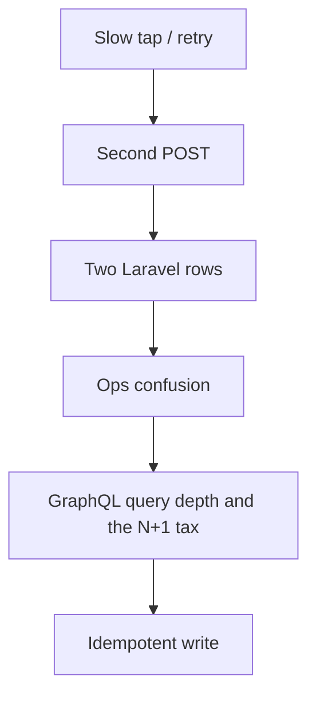

> **Lesson 121 · advanced** - A 12-line query can issue 4,000 SQL statements - depth limits, cost analysis, and batched loaders.

## Why it matters

- Vue retries and Laravel retries on the same write create double tickets, double charges, or ghost webhooks.
- Timeouts that are “just Axios defaults” blow the whole budget when three services sit on the path.
- A versioned URL is cheaper than a breaking field rename that twelve clients already cached.
- This lesson is specifically about **GraphQL query depth and the N+1 tax**. Tags: graphql, n-plus-one, dataloader, query-cost.

## Symptoms

| Signal | What you observe |
| --- | --- |
| Duplicate writes | Two rows for one tap on a slow 4G Quasar form |
| Timeouts | Gateway 504 while the job actually finished |
| Webhook storms | Partner retries every 10s with no signature check |
| Version clash | Mobile app 2.1 still posts the old JSON shape |

## How it breaks



The named technology is rarely the villain. Two code paths (often a Vue/Quasar screen and a Laravel write) assume opposite contracts. Production finds the race. For this topic that contract is: A 12-line query can issue 4,000 SQL statements - depth limits, cost analysis, and batched loaders.

## Root causes

1. The client retried POST without an Idempotency-Key the server honored.
2. Each hop used a 30s timeout, so the user waited 90s and tapped again.
3. Webhook handlers were not idempotent on delivery id.
4. Breaking JSON changes shipped without a /v2 or a sunset header.

## How to solve it

### 1. Write the invariant in one sentence

A 12-line query can issue 4,000 SQL statements - depth limits, cost analysis, and batched loaders. Put that sentence in the PR, the Pinia action, and the Laravel class.

### 2. Guard the edge in code

```ts
// Pinia: one key per human intent, not per HTTP attempt
export async function createTicket(payload: TicketDraft, key: string) {
  const hit = sessionStorage.getItem(key)
  if (hit) return JSON.parse(hit) as Ticket
  const ticket = await api.post('/api/tickets', payload, { headers: { 'Idempotency-Key': key } })
  sessionStorage.setItem(key, JSON.stringify(ticket))
  return ticket
}
```

```php
Route::post('/api/tickets', function (Request $request) {
    $key = $request->header('Idempotency-Key');
    abort_unless($key, 400, 'Idempotency-Key required');

    return Cache::lock("ticket:{$key}", 10)->block(5, function () use ($key, $request) {
        $existing = Ticket::query()->where('idempotency_key', $key)->first();
        if ($existing) return $existing;
        return Ticket::query()->create([...$request->validated(), 'idempotency_key' => $key]);
    });
});
```

### 3. Keep a chart you will actually look at

Duplicate create rate, 4xx on missing idempotency key, and p99 of the write path. If the chart cannot catch a regression in **GraphQL query depth and the N+1 tax**, the lesson is not done.

## Worked example

Support agents double-tapped “Create ticket” on 4G. Without a key, Laravel inserted two rows. With the snippets above, the second tap returns the first ticket and the queue stays clean.

On this topic, start from the symptom in the table that matches your last incident, then walk the diagram until the guard above would have fired.

## Check before you ship

- [ ] The invariant for **GraphQL query depth and the N+1 tax** is written in one sentence.
- [ ] Empty, duplicate, timeout, or permission paths have a test or a staged rehearsal.
- [ ] A dashboard or log query would catch a regression within one deploy.
- [ ] Related reading still makes sense: pagination-at-scale, rate-limiting-algorithms.

## What not to do

- Copy a blog snippet that retries forever or caches the error as success.
- Treat Pinia as the source of truth for a Laravel row.
- Skip the previous numbered lesson if this one feels dense — the path is beginner → intermediate → advanced on purpose.
