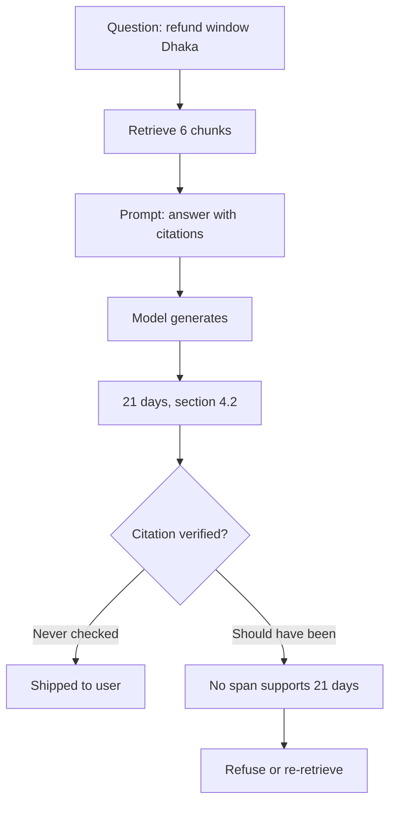
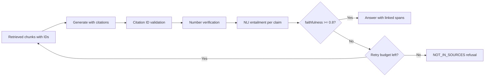

> **Scenario** — "ঢাকার ডেলিভারির refund window কত?" প্রশ্নে একটি policy assistant উত্তর দেয় "২১ দিন, section 4.2 অনুযায়ী" এবং একটি আসল document-এর link দেয়। Document-এ লেখা ১৪ দিন, আর section 4.2 বলে কিছু নেই। Citation যথেষ্ট বিশ্বাসযোগ্য দেখাচ্ছিল বলে support agent-রা তিন সপ্তাহ ধরে ভুল সংখ্যাটাই বলে গেছে।

## Why it matters

- যে citation কেউ যাচাই করে না, তা citation না থাকার চেয়েও খারাপ: এটি পাঠকের কাছে মিথ্যা আত্মবিশ্বাস হস্তান্তর করে।
- Grounding failure বিরল edge case নয়। Retrieval ঠিক থাকলেও generation দুটি chunk মিশিয়ে ফেলতে পারে, ভুল row থেকে সংখ্যা তুলতে পারে, বা নিয়ম extrapolate করতে পারে।
- ভুল policy উত্তরের খরচ বাইরের — ভুলভাবে দেওয়া refund, compliance ঝুঁকি, support escalation।
- Refusal একটি feature। যে সিস্টেম বলে "policy document-এ এটি পাইনি", সে সবসময় উত্তর দেওয়া সিস্টেমের চেয়ে বেশি মূল্যবান।
- English source-এর উপর ভিত্তি করা Bengali উত্তরে অন্তর্নিহিত translation ধাপে সংখ্যা ও entity সরে যাওয়ার ঝুঁকি বিশেষভাবে বেশি।

## Symptoms

| Signal | What you observe |
|---|---|
| Phantom section | উৎসে নেই এমন section নম্বরে citation |
| Number drift | retrieved chunk-এ কোথাও নেই এমন সংখ্যা উত্তরে |
| Blended fact | এক বাক্যে ভিন্ন product-এর দুটি chunk সঠিকভাবে cite করা |
| Zero refusal | সহায়ক document না থাকা প্রশ্নেও refusal rate প্রায় ০% |
| Cross-lingual drift | English উৎস থেকে বদলে যাওয়া entity নাম বা তারিখ সহ Bengali উত্তর |

## How it breaks

Generation extraction নয়। Model prompt দেখে সবচেয়ে সম্ভাব্য continuation তৈরি করে, আর বিশ্বাসযোগ্য দেখতে section reference অত্যন্ত সম্ভাব্য text — evidence-এ সেটি থাকুক বা না থাকুক। Pipeline যদি citation চায় অথচ কখনো যাচাই না করে, তবে citation একটি formatting রীতি মাত্র, verification ধাপ নয়।



## Root causes

1. Prompt-এ citation চাওয়া হয় কিন্তু retrieved text-এর বিপরীতে কখনো validate করা হয় না।
2. Chunk-গুলোতে স্থিতিশীল identifier নেই যেদিকে উত্তর আঙুল দেখাতে পারে।
3. Eval suite-এ faithfulness metric নেই, তাই grounding regression কখনো release আটকায় না।
4. Prompt refuse করার স্পষ্ট অনুমতি দেয় না, তাই refusal কম-সম্ভাবনার output হয়ে থাকে।
5. Retrieved evidence আর generated claim কখনো বাক্য-স্তরে ভেঙে তুলনা করা হয় না।

## How to solve it

### 1. প্রতিটি chunk-কে স্থিতিশীল, model-দৃশ্যমান ID দিন

```python
def render_evidence(chunks) -> str:
    return "\n\n".join(
        f"[{c.id}] source={c.doc_title} page={c.page}\n{c.text}" for c in chunks
    )
```

তারপর উত্তরকে কেবল সেই set থেকেই cite করতে বাধ্য করুন এবং instruction-এ বৈধ ID তালিকাভুক্ত করুন। Set-এর বাইরের ID-তে citation একটি hard error, যা set membership check দিয়েই ধরা যায়।

### 2. Citation যান্ত্রিকভাবে validate করুন

```python
CITE = re.compile(r"\[(c[0-9a-f]{8})\]")

def validate(answer: str, chunks) -> list[str]:
    allowed = {c.id for c in chunks}
    cited = set(CITE.findall(answer))
    problems = []
    if unknown := cited - allowed:
        problems.append(f"Citations to unknown chunks: {sorted(unknown)}")
    for sentence in split_sentences(answer):
        if is_factual(sentence) and not CITE.search(sentence):
            problems.append(f"Uncited factual claim: {sentence[:80]}")
    return problems
```

### 3. Claim ও cited span-এর মধ্যে entailment score করুন

উত্তরকে atomic claim-এ ভাঙুন, আর প্রতিটি claim-এর জন্য দেখুন cited chunk সেটিকে entail করে কিনা। ছোট একটি NLI model যথেষ্ট এবং কয়েক দশ মিলিসেকেন্ডে চলে।

```python
claims = decompose(answer)                        # one factual statement each
scores = []
for claim in claims:
    evidence = chunk_text[claim.cited_id]
    p = nli.predict(premise=evidence, hypothesis=claim.text)   # entailment prob
    scores.append(p)

faithfulness = sum(1 for p in scores if p >= 0.7) / max(len(scores), 1)
```

Faithfulness হলো cited evidence দ্বারা সমর্থিত claim-এর ভগ্নাংশ। Production-এ ০.৯ threshold আর ০.৮-এর নিচে hard block যুক্তিসঙ্গত শুরু; তার নিচে refuse করুন বা আবার retrieve করুন।

### 4. সংখ্যা আলাদাভাবে যাচাই করুন

সংখ্যাই সবচেয়ে ক্ষতিকর hallucination আর যাচাই করাও সবচেয়ে সহজ: উত্তরের প্রতিটি numeric token cited chunk-এ থাকা উচিত, formatting পার্থক্য বাদ দিয়ে।

```python
def numbers(text: str) -> set[str]:
    return {n.replace(",", "") for n in re.findall(r"\d[\d,]*(?:\.\d+)?", text)}

unsupported = numbers(answer) - set().union(*(numbers(chunk_text[c]) for c in cited))
if unsupported:
    return refuse(f"Could not verify: {sorted(unsupported)}")
```

Bengali output-এর জন্য তুলনার আগে বাংলা অঙ্ক (`০১২৩৪৫৬৭৮৯`) ASCII-তে normalise করুন, নাহলে প্রতিটি সংখ্যাকেই unsupported মনে হবে।

### 5. Refusal-কে স্পষ্ট ও পুরস্কৃত পথ বানান

System prompt-এ লিখুন আর eval set-এ refusal কেস রাখুন: "evidence-এ উত্তর না থাকলে ঠিক এইটুকু লিখুন: `NOT_IN_SOURCES`, তারপর কী দরকার ছিল তা বলুন।" তারপর refusal precision মাপুন — যে প্রশ্নগুলোতে refusal সঠিক ছিল, তার কতগুলোতে সিস্টেম refuse করেছে?

### 6. Citation ক্লিকযোগ্য, যাচাইযোগ্য span হিসেবে দেখান

UI-তে উৎস document-এ cited বাক্যটি highlight করে দেখানো উচিত। এতে verification গবেষণার কাজ থেকে এক নজরের কাজ হয়ে যায়, আর hallucination সেই user-দের চোখে পড়ে যারা রিপোর্ট করবেন।

## Target design



## Tradeoffs

| Option | Pros | Cons | Choose when |
|---|---|---|---|
| শুধু prompt-এ citation | বিনামূল্যে, এক লাইন instruction | citation সাজসজ্জা, অযাচাইকৃত | internal prototype |
| ID validation | বানানো source ধরে, খরচ প্রায় শূন্য | আসল chunk cite করা ভুল claim ধরে না | সবসময় — সবচেয়ে সস্তা লাভ |
| Number verification | সবচেয়ে ক্ষতিকর ভুল ধরে | Bengali-তে digit normalisation লাগে | সংখ্যা আছে এমন যেকোনো উত্তর |
| NLI entailment | semantic drift ধরে | +৩০–৮০ms ও একটি model host করতে হয় | নিয়ন্ত্রিত বা high-stakes ক্ষেত্র |
| LLM-as-judge | সূক্ষ্ম, paraphrase সামলায় | প্রতি উত্তরে খরচ, judge-এরও পক্ষপাত আছে | hot path নয়, offline eval |

## Verification checklist

- [ ] Sample করা উত্তরের প্রতিটি factual বাক্যে অন্তত একটি বৈধ chunk citation আছে।
- [ ] সহায়ক document নেই এমন test প্রশ্ন উত্তর নয়, refusal দেয়।
- [ ] বাংলা অঙ্ক normalise করে উত্তরের সংখ্যা cited chunk-এর সাথে মেলানো হয়েছে।
- [ ] Golden set-এ faithfulness score হিসাব করে release-এ release-এ ট্র্যাক করা।
- [ ] Citation link উৎসের সঠিক page বা anchor-এ খোলে।
- [ ] শুধু refusal rate নয়, refusal precision ও recall মাপা হয়েছে।

## Anti-patterns

- Prompt-এ citation চেয়ে সেটি মেনে চলাকেই grounding-এর প্রমাণ ধরা।
- Request path-এ একই model দিয়ে generate করা এবং নিজের faithfulness বিচার করানো।
- শুধু internal reviewer-দের "উত্তরটা ভালো লাগছে" rating মাপা।
- Coverage metric খারাপ দেখায় বলে refusal দমিয়ে রাখা।
- Span নয়, পুরো document cite করা, যা বাস্তবে verification অসম্ভব করে।

## Related

- [Eval harness design for LLM features in CI](/systems/ai-rag-agents/eval-harness-design)
- [Hybrid search and reranking that actually lifts recall](/systems/ai-rag-agents/hybrid-search-and-reranking)
- [Context window budgeting under real token limits](/systems/ai-rag-agents/context-window-budgeting)
